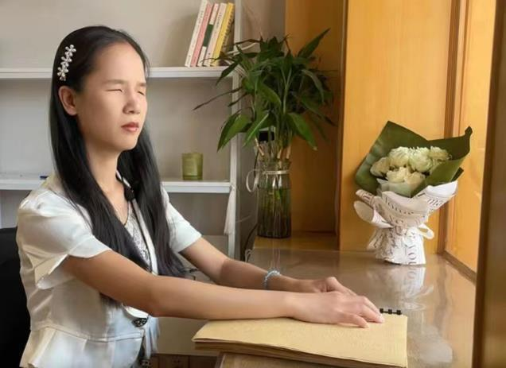

# 全国首位视障播音硕士中传毕业：用键盘盲打完成6万字学位论文

“未来愿我们无论在何方，都心怀梦想，坚持热爱，永远脚踏实地，淡定从容……”6月28日，中国传媒大学举办2023届毕业典礼，全国首位视障播音硕士董丽娜作为毕业生代表发言，相关视频经媒体发布后，感动了不少网友。

近日，董丽娜接受了北京青年报记者的专访，相比其他健全同学，双目失明的董丽娜为这个学位付出了更多的艰辛：“我依靠电脑听读软件和键盘盲打，啃下了1000多万字的文献，完成了6万字的毕业论文。”

北青报记者了解到，董丽娜在1岁时逐渐失去视力，曾在按摩院担任过3年推拿师，2006年离家到北京闯荡，成为了一名盲人播音培训讲师。2019年35岁时她决心考研，成为了一名硕士研究生。她表示，自己暂时还没找到工作，但相信经过这些年的学习，她会更有底气靠自己的努力逐渐改变命运，迎接新的挑战。

**出生便患有眼疾 9年间读遍图书馆几百本盲文书籍**

1984年，董丽娜出生于辽宁大连。不到一岁，她便被诊断为先天性弱视，经过全力治疗，也只能分辨出一些物体的大致轮廓。随着时间推移，董丽娜只能感受到微弱的光亮；慢慢地，她失去了全部的视力。

对于不幸的遭遇，董丽娜却很坦然：“我不觉得我比视力健全的人差。身边的小伙伴们都去上学，我觉得我也可以。”

8岁时，董丽娜来到大连盲聋学校，在这里学习盲文、阅读书籍。“那个时候很多人都认为一个视障人士长大后只能做推拿，学习似乎没什么用。但我觉得是一件很有意思的事情，从来不觉得辛苦。”

在大连盲聋学校就读时，董丽娜每周都会去“那间小小的图书馆”借书。她先是读一些短篇故事，而后又在老师的推荐下阅读了《家》《春》《秋》、《简·爱》……与平面印刷的文字不同，盲文书籍的每一个字都由数个凸点组成，刻印在更厚、更大的纸张上。砖头厚的大书，被董丽娜带去教室、带回宿舍，一字一句地读。9年间，董丽娜读遍了图书馆的几百本书籍。

遗憾的是，当时的董丽娜没能和其他健全同龄人一起进入高中，参与高考。为了能自食其力，董丽娜进入当地一所盲人技术学校学习推拿，之后又进入了按摩院工作，减轻家庭的经济负担。

每天早上8时，按摩院准时营业，董丽娜和其他推拿师坐在一起，等待患者上门。“从早上8点到晚上12点，十几个小时的时间里，有人上门就去治疗，没有人来就等待。”

她表示，当推拿师时，最担心未来会一直这样重复下去，一眼能看到头。就这样，当推拿师的3年里，她把所有的业余时间都用在了函授英语学习上。

**带着积蓄来到北京成为盲人播音员和播音培训讲师 35岁时决心考研**

2006年，董丽娜偶然了解到北京一家机构——北京红丹丹教育文化交流中心组织了盲人广播培训项目，几番沟通后，董丽娜便辞去工作，带着3年来工作的积蓄，踏上了开往北京的列车。

在该助盲机构的帮助下，董丽娜来到北京电台培训中心开始了播音的学习，尤其是训练自己的普通话。她说，在播音练习中，视力健全者可以对着镜子校口型，她却只能通过耳听和触摸进行学习；视力健全者可以“一目十行”地阅读播音文稿，董丽娜需要提前请人或者用电脑读出文字，再制成盲文版本的稿件，才能进行播音。

经过半年多的培训，董丽娜通过了普通话水平测试，以97.8分的高分获得了普通话一级甲等证书。

此后，董丽娜不但成为了一名盲人播音员，更开始给其他盲人指导播音，与热爱语言艺术的盲人朋友们共处，“我感到自己的工作是有意义的。相比于利益，这份同理心和社会价值让我更加幸福。”

2010年，董丽娜报名参加了“夏青杯”全国朗诵大赛，获得二等奖，结识了更多播音主持领域的老师。在“夏青杯”组委会老师们的帮助下，她走进了中国传媒大学继续教育学院的课堂，并通过自学考试取得了播音主持专业的本科学历。

2019年，董丽娜做出了又一个人生决定：报考中传播音主持专业的全日制硕士研究生。

这一年，董丽娜已经35岁了。

董丽娜说，她下定决心考研的时候，也没有告诉家人。“同住的同事们只知道我在学习，并不知道我在做什么。”

当时董丽娜的职业是一名播音培训讲师，每天大量的时间要用来给学生讲授课程、批阅作业，留给她备考的时间只有周末和晚上。直到录取消息传来，董丽娜才将消息告诉了父母：“他们非常惊讶，几乎没反应过来。我心里其实没什么波澜，就是把手头的工作交接好，然后安安心心地去这个梦寐以求的地方好好读书。”

**室友成为“最强队友” 盲打键盘完成6万字学位论文**

进入中国传媒大学成为播音主持艺术学的学术型硕士研究生，相比身边的同学，“80后”的董丽娜年长不少。北青报记者见到董丽娜时，她并未带着盲杖，而是挽着一位女孩的手缓步走来。一路上，女孩轻声向董丽娜讲述着周遭的一切：“这里有台阶，要当心”、“这里有一面大大的落地窗，午后的阳光正好可以洒进来”。

这个女生是董丽娜的舍友袁同学。介绍起袁同学时，董丽娜笑着说：“读研这三年，我遇到的老师、同学都是好人。袁同学就是我的‘最强队友’。”

董丽娜说，来到中传的时候，她已经做好了“独自生活”的准备。报到第一天，袁同学主动提出和她一起熟悉校园：“从宿舍楼到教学楼，还有食堂、图书馆、校门，我们一遍一遍地走，我用盲杖去碰触、然后记住这些路标。”

董丽娜表示，之后的每天早上，两人都会一起吃早餐，有课的时候，袁同学会陪伴董丽娜去教学楼。“我们两个人生活习惯也很相似，每天都会互相督促学习、监督早些休息，非常默契。”袁同学说。

在袁同学看来，董丽娜这位舍友和其他健全同学没有什么不同。这也恰恰是董丽娜的期望：“可能作为视障人士，我需要一些合理的便利；但从另一方面来说，我并不希望自己被当作一个特殊人来对待，不希望残障人士和健全人被区隔开来，每个人都可以以自己的方式为他人、为社会做出贡献。”

三年，董丽娜和同学们一起完成了硕士学业，在学位论文写作中，她依靠电脑听读软件和键盘盲打，完成了6万字的毕业论文。“我是一个完美主义者，既然要做论文，也要达到和视健者一样的标准。”

在论文的撰写期间，董丽娜“听”完了1000多万字的文献，再将相关内容盲打出来，“每天都要坐在电脑前10多个小时。”

据悉，董丽娜的论文标题是“口述影像理论视域下无障碍电影讲述策略研究”，这也是她时常接触的内容。“我经常听无障碍电影，但它的质量的确良莠不齐。”

为了让论文内容更准确，董丽娜通过电话访谈了多位视障者，又听了上百部无障碍电影，“每一步都做得很扎实，问心无愧。”

董丽娜通过答辩，在今年取得了硕士学位。她坦言，自己暂时还没找到工作，相比其他视力健全的同学，她认为自己的选择范围没有那么广泛，社会对于视障人士的认知和接纳程度也十分有限：“社会本应是多元的，每个人都应该有属于自己的位置，否则它本身也不完整，但要达到这个目标，还需要更多人的共同努力。”即使如此，董丽娜依然选择坦然面对：“我热爱语言艺术事业，相信经过这些年的学习，我也有了更多的底气，靠自己的努力逐渐改变命运，迎接新的挑战。”

她表示，自己已经感受到了毕业季的氛围，但她不会像其他同学一样为即将步入社会而焦虑，“我本来就是从那里走过来的”。

文/北京青年报记者 屈畅 实习生 侯翔宇

