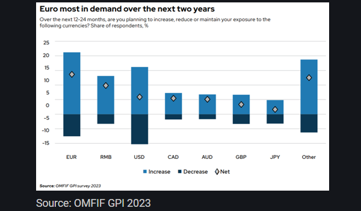

# 全球“去美元化”大潮谁是赢家？调查：欧元和人民币将站潮头

**财联社6月28日讯（编辑 卞纯）**
眼下，全球“去美元化”大潮正在进行中，随着美元主导地位日渐削弱，未来几年，各国央行可能更多的将欧元作为储备资产，而从更长远来看，各国央行对人民币的需求也将大幅提升。

这是国际货币金融机构官方论坛（OMFIF）的一项调查得出的结论。该项调查涵盖了75家央行储备管理机构，总管理资产规模近5万亿美元。

该调查发现，从短期来看， **增减相抵后，净14%的央行计划在未来两年内增加欧元持有量，创下所有货币中的最高需求水平** 。

与2021年和2022年的调查相比，这标志着一个巨大的变化，2021年他们对欧元的潜在需求还没有净增长。OMFIF报告指出，利率上升似乎使欧洲固定收益资产更具吸引力。

与此同时，净10%的机构计划在未来两年内增加人民币持有量，净6%的机构计划增加美元储备。

**超30%央行未来10年计划增加人民币储备**

从长期来看，前景似乎有所不同。

以拉美和欧洲的央行为首，有净6%的央行计划在未来10年减少美元持有量。

OMFIF预测， **未来十年，美元在全球外汇储备中的占比将从58%降至54%，尽管美元仍将是主要的储备货币** 。

OMFIF指出，在未来10年，净9%的央行表示计划增加欧元储备资产，这表明欧元可能在未来的货币多元化中发挥关键作用。

**超过30%的央行未来10年计划增加人民币储备，OMFIF估计，到2033年，人民币在全球外汇储备中所占的份额将从3%扩大到6%。**

报告指出，近40%的央行计划在未来10年内增加人民币储备，这比对任何其他货币的需求都要高。

受访者表示， **货币多元化以及中国在全球经济中日益重要的角色是投资人民币的主要动机** 。人民币在外汇储备中份额提高可能的，但将是渐进的。

（财联社 卞纯）

