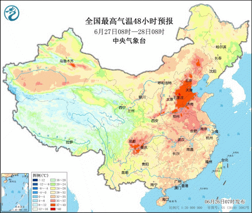

# 北方高温卷土重来，气温还将高于南方“四大火炉”城市

最近一段时间，北方很多地方高温发展迅猛，北京、河北、山东、天津等地出现40℃以上的高温天气，气温高于一些南方城市。本轮持续高温，北方为何会热过南方？

以向来被网友称为“四大火炉”的重庆、武汉、南昌、长沙为例，据中央气象台预报，未来7天的温度均在26-35℃之间。而京津冀、山东等地部分地区将继续受到高温炙烤，甚至40℃高温将卷土重来。

_中国气象局官方微信公众号图_

6月27日，北京市气象台原高级工程师张明英告诉人民日报健康客户端记者，近日北方地区高温强度大，持续时间长，原因主要在于北方地区受到较强暖气团控制且影响时间长，同时在高压脊控制下，天空晴朗少云，没有云层遮挡，促进了升温。此外，夏至时节白昼较长，太阳光照时间长等也有利于高温持续。

连日来，北方地区高温不断刷新历史纪录。据国家气候中心数据，6月22～23日，北京、天津、河北、山东的19个国家气象观测站气温突破历史极值。其中，北京自1951年南郊观象台建站以来，首次出现连续两天超过40℃的高温天气。

然而在南方地区，与北方却是完全不同的景象。张明英称，6月，南方地区正处于雨季，云层较厚，升温相对慢一些，也导致其气温偏低。北方地区此时往往容易受到大陆暖高压脊的控制，太阳辐射较强，干燥少雨，更容易出现极端高温天气。不过，在张明英看来，这种情况仍属于正常波动范围之内，无需过于担心。

张明英预测，未来一段时间，降水降雨带将会逐渐北移，北方地区将会转入雨季，干热天气也会逐渐结束，转而进入较为闷热的天气。张明英介绍，体感温度不仅和气温有关，还受到湿度影响，往往在湿热型高温下，体感温度更高。

