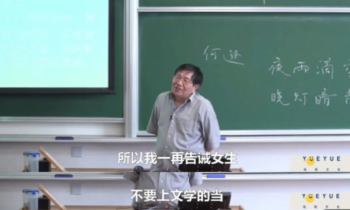
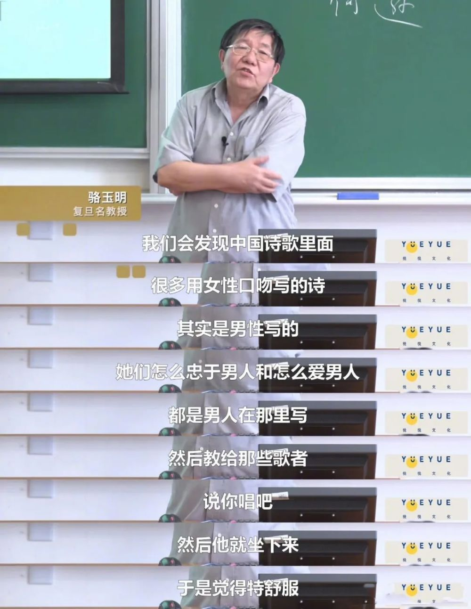
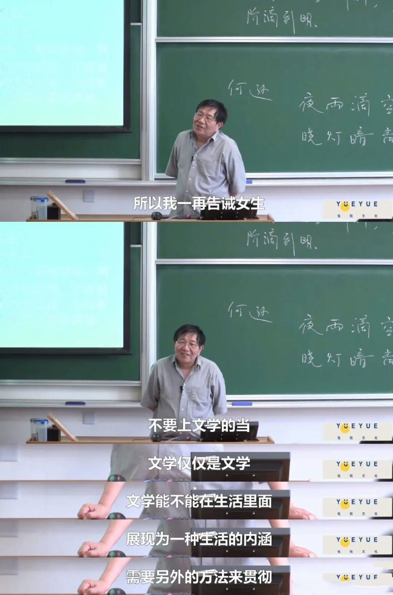
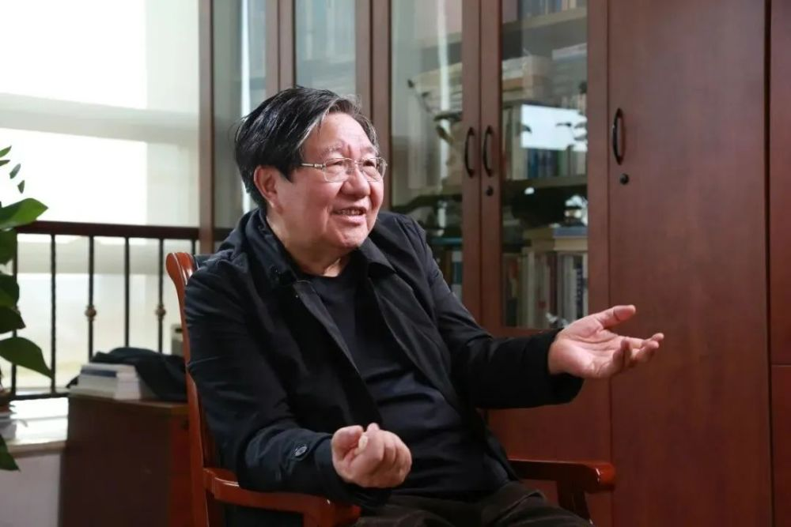
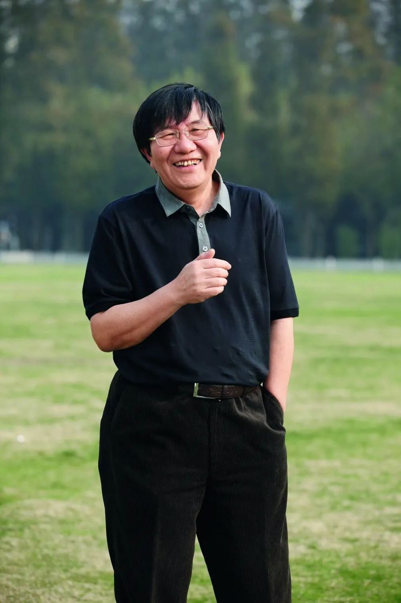
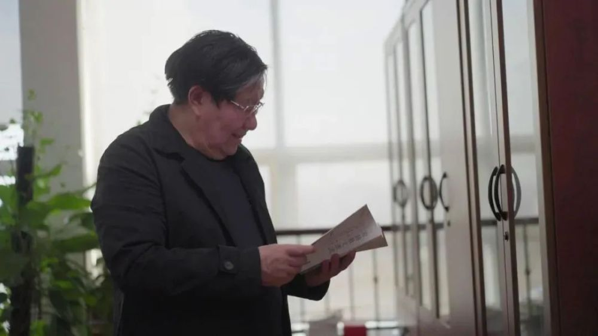
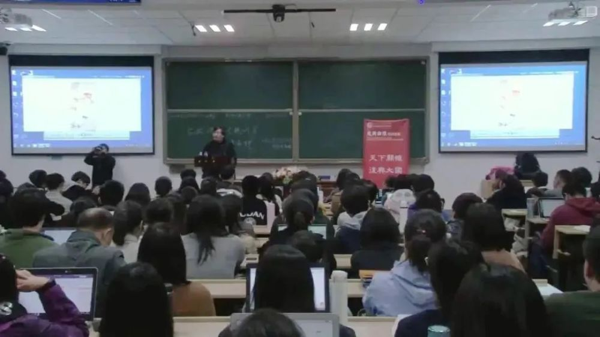

# 告诫女生“不要上文学的当”，72岁复旦教授又火了

**这位“老顽童”说自己只是个俗人，与其他人的不同之处在于，“我知道自己是一个俗人”。**

作者：王晶晶 许晔

编辑：许晔

72岁的复旦中文系教授骆玉明，今年频频登上热搜。

前几天，他和15岁小诗人姜二嫚对谈，吸引了600多万网友观看。

他说，阅读古诗的过程，也是丰富我们生命的过程，“理解古人的情感、古人的趣味，使我们更好地理解什么叫做中国人，怎么去做一个更纯粹的中国人”。

再往前看，今年4月，骆玉明的一段讲课视频更是在互联网上疯传。

视频中，他说：“女生常常被文学所欺骗，文学里面的东西表现得太漂亮了，很迷人的，很有欺骗性。所以我一再告诫女生，不要上文学的当。”

他说，有时候把诗写得很美的人，也有可能是危险的。

2019年，《环球人物》记者曾采访骆玉明。这位 “老顽童”像一个散漫、随兴的旅人，闲庭信步，悠然游荡于文学深处。

**做开心的人**

**骆玉明是土生土长的上海人，很多相熟的朋友却打趣他是“魏晋人”——他颇有名士之风，行为洒脱、谈吐脱俗。**

**年轻时，魏晋气质就深深影响骆玉明。他去火车站买票，等排到自己的时候才发现队伍排错了，于是就跟售票员说，“请随意给我一张这个窗口卖的车票”，就这样，放弃原本的目的地，去了铜陵。**

**他喜欢茶酒和围棋，曾为自己的古代文学史课选课代表，要求：男生，最好会下围棋，课余以解棋瘾。至于要男生的理由，他如此说道：“我总不能半夜两点钟打电话给一个女同学说，喂？你到我这里来一下吧？”**

_·骆玉明。图片来源：复旦大学微信公众号。_

**教书多年，常有学生请他题字留念，骆玉明写得最多的是“人情开涤，日月清朗”，这8个字出自《世说新语》，东晋王胡之到吴兴郡的印渚去，看了那里的风景，禁不住如此赞叹。**

**“人变得开朗后，就会看到世界的美好；人如果是闭塞的，看到的世界也是晦暗的。特别跟学生在一起时，我希望他们做开心的人，思想通达，能够包容，有爱别人的能力，能看到别人的好、这个世界的好。”**

**骆玉明的话总能打动无数人。**

**他谈《春江花月夜》，说：“每个人都用自己的方法赋予世界意义，每一个人的生命都是无比珍贵的，当我们看到江上的月亮的时候，我们就可以这样去想：我正是那个月亮所等待的人。”**

**他谈《诗经》，说：“《诗经》是中国人的一部元典。生活在变化，但人类根本性的关怀始终如一。”《诗经》中最美好的篇章都是关于爱情的。3000年前的年轻人，和今天的年轻人一样，“只要有欲望，就会有爱情”。**

**他谈如何对抗焦虑，说：“日常的冲突、日常的利益得失、日常的荣耀等都是社会环境给予我们的一种压迫。每天都计算得失，那么你的生命就会被切割，被那种具体的利益、具体的得失切割得粉碎。把我们的生命放在更大的一个空间当中去体会生活的时候，那些东西觉得很小。历史是一个宏大的进程，我们的生命所面对的世界是一个壮丽的世界。”**

**读书人要为国家守住一些东西**

**骆玉明对魏晋气质的喜好其实很快就跳过了放荡不羁、悲苦无端的阶段，进入到追求精神的明澈与通透。**

**上世纪90年代，他已经不再愤世嫉俗，而是一副对整个世界都和蔼可亲的样子，惹得学生当面吐槽：“要是您10年前就这个样子，谁还会把您当才子？”**

**骆玉明对自己之前那些行为，都评价为“矫情”。他曾说自己只是个俗人，与其他人的不同之处在于，“我知道自己是一个俗人”。**

**那次采访时，提及早年写过的一部现实感很强的著作，他还对《环球人物》记者强调：“我其实并不是一个与社会很有冲突的人。”他说，对于中国，需要深刻地理解历史和她的长期变化。**

**在骆玉明看来，他们这代学者只是桥梁。“文化经历了那么多年的破坏，重新恢复，我们都还处在这个过程中，这代人可能留下来的东西不多吧，但坚持着，只要能传下去，也许未来就会有人在历史中留下些什么。”**

_·骆玉明。_

**骆玉明的整个求学、教学生涯也的确是经历特殊。“从小学四年级开始，除了看小说，我就其他任何事都不做了，不管语文课、数学课，还是别的什么课，只在课堂上悄悄看书。”**

**中学时，他去崇明岛插队，在农场种地，种得很努力，“个子很小，但是挑很重的担子”。那时推荐上大学，领导觉得像他这样的人能吃苦，所以就推荐了他。**

**第一次因为体检不合格被刷下来，第二次，骆玉明考上了复旦招收的工农兵研究生。入学是1975年，毕业是1977年。**

**念完研究生，原本有工作的人回原单位，没有单位的就留在复旦。“初中没毕业，读了研究生，留校任教，就是这么奇特的年代和经历。”**

**刚进复旦，骆玉明觉得自己没有受过系统的教育，很担心。后来发现还好，因为读过的小说比其他同学都多。**

**他从小就痴迷读书，曾为了不被母亲叫去干活，躲在墙的夹缝里读，谁也找不到他。**

**当年插队时，知青们体力劳动之余都很无聊，骆玉明同样被一种空虚所压迫着。但如果能找到书读，能够从书里想一些事情，不管能不能想明白，生活就不至于那么乏味。**

_·骆玉明。图片来源：复旦大学微信公众号。_

**在当年的复旦校园，老一辈学者还是很多的，朱东润、郭绍虞、陈子展、蒋天枢、赵景深……老先生们各有个性。**

**骆玉明的导师是王运熙先生，毕业留校后，又作为青年教师派去跟朱东润先生读书。每次骆玉明去图书馆看书，场面都很壮观——他得将数种书在桌上摊开，铺满一桌，彼此对照着看。别人看书都坐着，他看书不但要站着，还得来回走动。**

**他还跟过章培恒先生。三位老师，朱先生威严而亲切，章先生思想锐利而明快，王先生最温和。但骆玉明也最怕见王先生，“他特别细腻，每个问题都问得很仔细” 。**

**“我对我的那一辈老师们非常有感情。我知道他们总是守着什么，他们总是在想能为国家做什么。我们这些人也是有这样的念头，做一个读书人就要为国家守住一些东西，使她有更好的发展机会，这是我从我的老师们身上得到的最大的启示。”**

**关注社会，关注生活**

**在复旦乃至整个学界，骆玉明都算是“怪胎”型学者。**

**“我跟很多大学里的老师不同，他们通常把学术研究放在前面，我则只是一个字面意义上的读书人。学术是要在一个领域不断深挖的，像挖一口井一样，我则觉得长期在一个专门领域内搞研究会破坏我读书的乐趣。”**

**这样的骆玉明很受学生喜欢。**

**从上世纪八九十年代，他就给本科生开了两门课程，一个是古代文学史，一个是《世说新语精读》。他的课，教室里总是满满当当，地上都坐满了人。**

**在学生们的记忆中，骆玉明总是匆匆忙忙地奔来上课，讲课时风采毕现。**

**“把切己的生命体验融入丰富的知识学问之中，使得已经死去了的历史、人物复活过来，歌哭谈笑，淋漓尽致，仿佛那一切就发生在我们中间。”**

**学者张新颖现在和骆玉明是复旦中文系的同事，但他至今仍记得，当年做学生听骆老师讲课时的那种酣畅淋漓。**

_·骆玉明的课堂总是坐得满满当当。图片来源：复旦大学微信公众号。_

**在中国文学的长河里，骆玉明最喜欢的是司马迁和鲁迅。前者叩问生死大义，生命空间无比开阔。后者则带给他很多共鸣与感动。**

**鲁迅也非常爱好魏晋。刘半农曾赠鲁迅一副对联：托尼学说，魏晋文章。说他爱好托尔斯泰、尼采的学说，而文章颇得魏晋风神熏染。**

**“我最初一直想不明白为什么闰土让人那么感动，后来忽然之间领会到那是两个场景的对照，一个是少年活泼的美，黄澄澄的月亮下，带着银闪闪的项圈的少年，拿着一柄叉在刺猹；后来再见，却是那样一副景象。生命还没有展开，就萎缩了。”**

**骆玉明曾说：“现代科技驱散了人们心中的幻梦，而商业文明则培养了精明实在的计较。古典的飘逸散淡作为生活态度大概是再也不可能了。我无意夸张文学在现实生活中的价值，也素不以守卫传统文化为己任，只是从个人经验说，觉得在焦虑烦躁的时分，偶尔能回到文学、回到诗意的心情，还是好的。”**

**不久前，他在接受《视觉志》采访时说，自己很喜欢鲁迅晚年说的那句话：无穷的远方，无数的人们，都和我有关。**

**“这句话真的让我非常的感慨，因为它很朴素，但是讲出了很深刻的东西：这世上所有人的困境和苦难和我是相关的，所以我们仍然需要关注这个社会，关注生活，关注那些处于困境中的人们。”**

