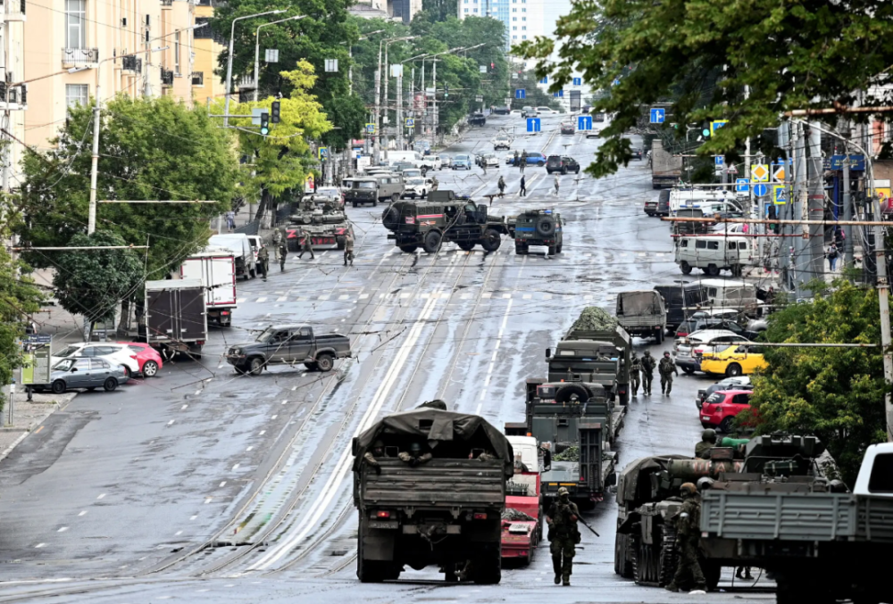
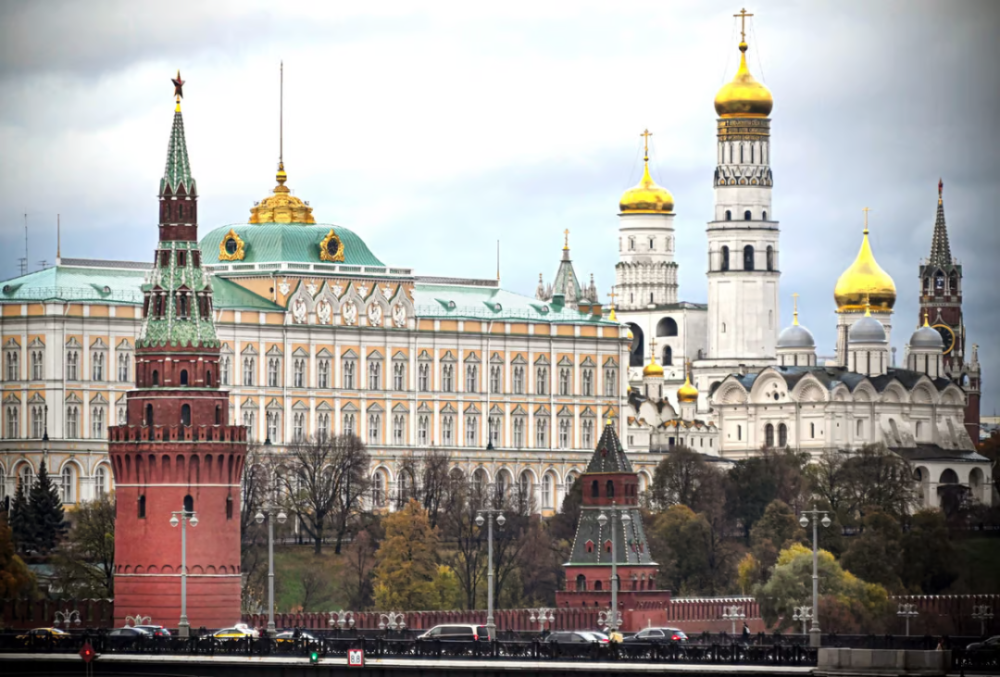

# 媒体：“瓦格纳兵变”不是偶然，仍可能重演

_当地时间6月24日，瓦格纳雇佣军组织的武装分子部署在俄罗斯顿河畔罗斯托夫南部军区总部附近的一条街道上。_

**直新闻：瓦格纳兵变虽然落幕，但也有人认为，问题尚未完全解决，您怎么看？**

**特约评论员 庚欣：**
是的，现在俄罗斯以及国际社会都有一种“虚惊一场”的感觉，大家似乎都松了一口气，觉得兵变并没有什么了不起，而且瓦格纳集团也已经开始在向俄罗斯政府移交重武器，事情似乎已经画上了句号。确实，瓦格纳集团正在走向“寿终正寝”，以后也很难再有翻身的可能。从俄罗斯处理这类事变的一般惯例和目前的得失权衡来看，这次兵变应该会得到一个相对均衡的后续安排。但是，问题并没有完全解决，我一直认为，这不是虚惊一场。兵变乃至瓦格纳集团落幕了，但是造成这种极端事态的各种矛盾依然存在，这些矛盾综合发酵、爆发的可能性依然存在，绝对不可掉以轻心。

这些矛盾主要有四个方面：

第一，就是从苏联解体以来，俄罗斯自己的事情一直办得不好。首先是“转型不成”，俄罗斯社会自解体来，30多年一直想做的就是“脱东入西”，也就是要通过社会转型等努力，融入西方社会，当年加入“八国集团”就是一种“努力”。但是，从实践来看，俄罗斯走得很不成功，今天它反而成了和西方集团最为对抗的一股力量，呈现出“不东不西”的矛盾窘境，这在俄乌冲突后愈加明显。

其次就是“发展不力”，俄罗斯的经贸发展始终没有达到昔日苏联在国际上的水平。而且贫富不均、社会腐败等问题严重，当然会造成社会各种矛盾的激化。这次兵变炒作“穷人上战场，富人后方享乐”就是一例。

再次是“定位不准”。俄罗斯最近越发表现出“自我定位不准”的问题。俄罗斯到底是一个发展中经济体，还是一个发达国家？这在俄罗斯政治精英头脑中并没有准确的定位，过去残留的强权政治的旧习性时有复发，但自己的实力已经今非昔比。这次对乌克兰动武就有这样的痕迹。

最后就是“悲情过重”。因为俄罗斯30多年来一直受到西方的挤压，北约东扩逼迫俄罗斯这次不得已采取对乌动武的极端方式，被人说成是过度防卫。很多人留恋苏联当年的荣光，但又显然没有可能再回到从前。这些都使得整个俄罗斯社会弥漫着很重的历史和现实悲情。这些矛盾在俄罗斯社会特别是精英层中，一直存在且不断综合发酵，很容易造成各种社会突发问题。

第二个矛盾是这次对乌克兰动武，从一开头俄罗斯就过低估计了对手，过高估计了自己，错误估计了时代和朋友，结果导致战局不利。西方的制裁等又雪上加霜。这些因素当然会激化上述矛盾和悲情。俄罗斯在乌克兰战事一年多来，没有得到想要的东西，反而失去更多。在军队高层中也存在着各种失落和混乱的情绪，一旦有事，就会表现出脆弱、难以应对的特点。

第三个矛盾就是俄罗斯的政治体制特别是军事体制的转型改造与建设明显不足。昔日苏军时代的政治委员等制度早已不复存在，但新的军事体制建设又很不完善。像瓦格纳集团这样的独立军事力量以及和正规军之间的不正常关系和矛盾，平时可能还不明显，在战时就显得尤为突出，这也为这次兵变埋下了伏笔。而且这类意外今后还可能会发生。

第四个矛盾就是“乱世出枭雄”，在俄罗斯上述复杂的社会矛盾中，极容易出现像普里戈任这样的人物，这种带有较强冒险的个人野心性格的精英人物，在俄罗斯并不少见。动荡的社会环境，再加上战争等各种不确定因素的影响和推动，就使得这样的人物会想方设法出头，自然会加剧兵变之类的风险。

总之，国际上的大变局，国内转型等各种矛盾的积蓄，再加上军队内部各种关系的不协调和政治、军事精英个人性格的异变等各种矛盾，在俄罗斯依然存在。这次兵变不是一次偶发的事件，是上述各种矛盾综合发酵的集中爆发。虽然这次暂时落幕，但这种矛盾的变局依然存在。尤其在战争不顺利时，就更加会推动这种矛盾的激化与外化。俄罗斯历史上因战争不顺利而引发国内危机的案例比比皆是，今天也依然如此。所以，绝不可掉以轻心。

**直新闻：瓦格纳兵变很快就平息了，请问，除了俄罗斯内部因素之外，是否也和国际环境有关？这是否有利于俄乌战事的劝和促谈呢？**

**特约评论员 庚欣：**
这次兵变的平息，本质上是反映了如此剧烈、极端的社会动荡，不符合俄罗斯国内人民的利益，同时，也不符合国际社会的期待。尽管它反映了社会的一些现实矛盾，但是这样极端的手段，是不得人心的。这两天，普京总统和俄罗斯各界的各种反应都证明了这一点。而更需要引起我们注意的是国际社会的态度，比如美国、欧洲等主要四大国，在兵变之际，虽依然坚持一种“零和游戏”的立场，但是同时又表现出了一种“自律性的沉默”。而且这些大国还告诫乌克兰稍安毋躁，不要在这时趁机起事，搞什么大动作，这是一个非常引人关注的现象。尽管美国等政府也表达了“继续支持乌克兰”的既定立场，但是没有做更多“趁火打劫”的动作。

在兵变事态最敏感之时，各国几乎都没有表态。事后美国向国际社会阐明的态度也非常清晰，第一，这件事情是俄罗斯的内部事务，和美国无关。意思是美国没有参与兵变这个事件。第二就是希望俄罗斯方面妥善管控核武器库的安全。而中国政府表达的立场是：这是俄罗斯的内政，中国支持俄罗斯维持国内稳定，继续实现发展和繁荣，这里当然也包括了维护核武器库安全的部分。这与兵变前，中美在涉及俄乌危机问题时几乎对立的立场，明显不同。在俄罗斯兵变中，中美却表现出很少有的、比较有公约数的立场表达。这说明了什么？这说明中美都不希望介入俄罗斯的内部事务，而且都希望俄罗斯维系一个基本稳定的局面，特别在涉及核风险问题时，各大国的态度都是“求稳怕乱”的。在兵变刚开始最敏感的十来个小时中，各方似乎都表明，三国之间有一种战略性的默契，注意这不是“明契”，因为没有明确的协议。但是作为默契很明显是存在的，这就是大家都认同：第一毕竟时代在发展，和平发展的时代更多的还是需要合作。中国强调“中美合作是唯一正确选择”，其实中美俄各方都应以合作作为唯一选择。至少在维护核武器库安全的问题上，我们必须合作。

第二就是人类毕竟在进步，特别是大国关系，毕竟在逐渐走向成熟。大国之间的利益争夺是客观存在，但是在重大安全，比如核安全问题上，主要大国比如中美俄之间，实际上具有一个客观的“大国安全共同体”的现实结构。这个现实结构是基于力量的相对均衡、利益的紧密依存，尤其是风险的高度共有所形成的。这是一个超稳定结构。中美俄在这次兵变之际展现出的这种重大的战略默契，就为今天国际社会保持稳定的基本盘，奠定了基础。也可以理解为是俄乌战局等类似的地区纠纷，要走向政治解决或劝和促谈的重要起点与依据。俗话说，坏事可以变成好事，这次兵变无论对俄罗斯还是对各国，都不是一个正面的事件。但是我们从中窥见到，各大国特别是中美俄三个战略大国之间重大默契的客观存在，就使我们无论以什么方式或时点，推动俄乌战局的劝和促谈，增添了信心。当然，也对于我们今天的时代，依然是和平发展、合作共赢的时代，对这个时代的主流更加坚定了信心，任何逆流都是不能得逞的。

作者丨庚欣，深圳卫视《直播港澳台》特约评论员

编辑丨刘立平，深圳卫视直新闻主编

