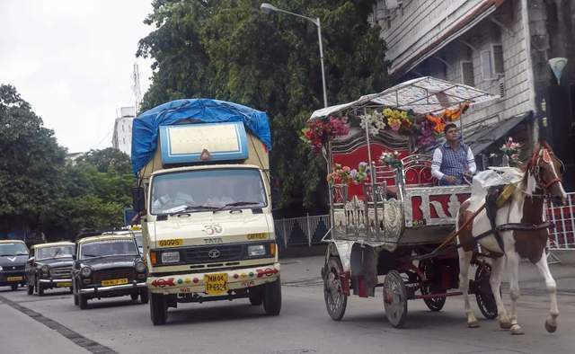

# 小米之后，上汽集团在印度遭遇了什么？

6月26日晚，上汽集团官方微信公号发布声明表示，近期有自媒体发布报道称，“上汽MG印度公司被当地强行低价收购股份，丧失控制权”，相关内容严重背离事实。

此前半个月，多家印度媒体相继披露，上汽集团控股的MG印度公司有意出售股权，至少四家印度本土企业的投资者曾参与洽谈。当地媒体表示，“据说该收购计划得到了印度政府的批准，印度将拥有至少51%的股权”。

截至6月中旬，MG印度公司未回应相关媒体询问。JSW集团发言人曾表示，对市场猜测不予置评。相关信息被部分国内媒体解读为“上汽集团将失去对MG印度公司的控制权”。

对此，上汽集团在声明中强调，“上汽集团控股MG印度公司”。

至于“严重背离事实”的具体内容，据《财经汽车》援引内部人事回应，系“强行”、“低价”、“丧失控制权”的表述失实，但并未否认正和当地初步接触，推进股权融资一事。具体是股权转让还是增资扩股暂不确定。

_印度路况差、超载多、公路体系不发达，使小型车更受市场欢迎。图片来源：中国新闻图片网_

**是正常交易吗？**

有关“上汽MG印度公司出售股份”的消息，很早之前就被海外媒体披露过。《印度斯坦时报》6月14日的一篇报道透露，印度本土企业金达尔西南集团（下文简称JSW）的董事长Sajjan
Jindal正与MG印度公司洽谈股份收购事宜。

印度媒体报道称，59岁的Sajjan
Jindal将通过私人公司收购MG印度公司45%-48%股份，JSW上市实体（JSW钢铁和JSW能源）将不参与或接触该合资企业。另有5%-8%股份将由来自印度的经销商和员工持有。该收购计划如若达成，上汽将成为少数股东，持股不超过50%。

据MG印度公司消息，该公司今年4月销量为4551辆，同比去年增长了126%，是印度乘用车销量前十品牌中增长最快的。发展势头正猛的上汽MG印度公司为何突然开始售卖股份？

据印度《经济时报》报道，MG印度公司“考虑将公司多数股权稀释给印度实体，是为其未来五年在印度的扩张计划提供资金”。MG印度公司CEO拉吉夫·查巴
(Rajeev Chaba)接受采访时表示，通过向印度金融机构、合作伙伴和高净值个人稀释多数股权，计划在未来2-4年实现“印度化运营”。

2019年，MG印度公司通过首款产品Hector快速获得当地市场认可。上市三个月，当地工厂就收到了3.1万张订单。但随后因地缘政治紧张等因素，来自中国的投资等待了近两年，一直没能获得印度政府批准，该公司不得不探索其他方式来实现品牌扩张。

查巴在当地媒体上表示，未来将推出4-5款新车型，以电动汽车为主，并希望销量从2022年的4.8万辆扩大到10万辆，其中1/3的贡献来自电动汽车产品组合。而为了保持价格竞争优势，该公司计划“深化零部件在印度的本土制造”，并将在古吉特拉邦建立电池组装厂。

印度《商业标准报》今年5月援引《印度时报》消息，多家印度本土公司的投资者参与了MG印度公司股权出售谈判，包括Reliance、Hero
Group、Premji Invest 和上文提及的JSW 集团。该报道还补充说，MG印度公司的目标是在2023年底完成交易，股权稀释将分阶段进行。

有关股权出售价格，据印度《经济时报》披露，MG印度公司的估值被降低到12-15亿美元，远低于最初评估的80-100亿美元。多家当地媒体表示，“据说该收购计划得到了印度政府的批准，印度将拥有至少51%的股权”。

上汽集团在声明中表示，在国家政策指引下，上汽集团从2007年开始批量出口自主品牌汽车，集团以MG品牌为代表的自主品牌产品已进入全球90多个国家和地区，中国技术、产品和服务赢得了当地消费者青睐。2023年，上汽海外市场总销量预计将超过120万辆，并实现规模性盈利。

声明中明确指出，“涉及MG印度公司的股权交易需获得中国政府批准，会适时公布官方信息。”

为避免国有资产流失，国家出资企业投资等事项，应当报经人民政府或者人民政府有关部门、机构批准、核准或者备案。据《境外投资项目核准和备案管理办法》，中方投资额10亿美元及以上的境外投资项目，由国家发展改革委核准。涉及敏感国家和地区、敏感行业的境外投资项目不分限额，由国家发展改革委核准。其中，中方投资额20亿美元及以上，并涉及敏感国家和地区、敏感行业的境外投资项目，由国家发展改革委提出审核意见报国务院核准。

“具体由哪一部门批准，还要看项目涉及的金额规模。”对并购与投融资、公司合规等领域有着长期关注的北京市安理律师事务所合伙人孙靖宇告诉《中国新闻周刊》，理论上，汽车不是敏感行业，MG印度公司所在地也不是敏感国家或地区。

他认为，上汽集团的声明重点在“没有丧失控制权”，“可以理解为，目前上汽集团对MG印度公司仍具有控制权，但交易还未完成，或即使上汽在和印度当地企业在沟通后达成交易，依旧具有控制权。”

**通用、福特、哈雷都停止了当地生产**

2017年初，上汽集团在印度设立MG印度公司，投资总额达32.75亿人民币，包括收购位于古吉拉特邦巴罗达市的印度通用汽车有限公司哈洛尔（Halol）工厂。工厂经过彻底改造，被建立了现代标准的汽车生产制造基地及配套的产业园区。

2019年4月，哈洛尔基地建成并正式投产，整车年产能为8万辆，上汽集团也成为第一家在印度设厂的中国车企。两个月后，MG印度首款互联网汽车Hector面世，至今仍是该公司在印度最热销的产品之一。

截至目前，MG印度公司已在当地推出六款车型，其中两款为纯电动车汽车。从生产方面来看，MG印度公司2022年产量为5.1万辆，同比增长25.58%，2023年1-5月产量为2.7万辆，同比增长49.57%。

在销售方面，仅2022年，MG在印度销量达到4.8万辆，同比增长19.06%，2023年1-5月销量达到辆2.7万辆，同比增长47.61%。从产、销两方面来看，MG印度公司都保持着强劲的上升势头。

根据上汽集团发布的产销快报及公开回复，2022年，上汽海外市场累计销量达到1017459辆，其中，MG品牌海外年销量首次突破50万辆，占比超过49%。可以说，MG名爵在上汽海外市场独占鳌头。

除了供给当地市场，MG印度公司还承担着出口任务。据悉，上汽集团海外市场销量的三分之一由海外基地生产。目前，上汽在泰国、印尼和印度各有一个海外整车制造基地。

上汽集团的2022年年报显示，MG印度公司2022年全年产能利用率达到了91%。同期，建立在泰国的上汽正大有限公司产能利用率只有58%。对上汽集团来说，印度市场几乎跑赢了其全球海外市场。

反观印度通用车品牌市场排名，跻身前十名的MG，在印度的市占率并不算高。2023年5月，MG印度的销量为5006辆，市占率2%。排名第一的铃木以43%的占有率稳居第一，紧随其后的是现代汽车，市占率为14.5%。

“印度汽车市场和美国有一定相似度，消费者对价格比较敏感，无论是整车售价、油耗还是日常维护成本。”孙靖宇分析说。印度市场的乘用车企业以日韩企业为主，印度本土厂商仅有M&M和塔塔形成较大规模，并无数量巨大的印度低成本自主品牌。

而印度车况差、超载多、公路体系不发达等特点，也使小型车更受市场欢迎。据东兴证券此前发布的报告，印度乘用车市场以A0级车为主，在销量前十中占了七席。

今年4月，MG印度公司还推出了在当地市场价格最低的电动车Comet
EV，起价为79.8万卢比，折合9763美元，低于印度本土品牌的电动汽车价格。MG印度公司CEO拉吉夫·查巴在发布会上表示，Comet
EV的定位为印度拥堵城市和道路的理想车型，该车在各种条件下都易于驾驶和停车。

伴随新能源时代的到来，不甘落后的印度也在“鼓励”和“限制”外资车企发展新能源汽车的政策上反复横跳。

2013年，印度公布了《国家电动车行动计划》，宣布到2020年要实现电动车上路600万至700万辆，助力印度到2020年成为世界新能源汽车市场的领导者。到2017年，印度政府再次提出到2030年实现100%电动化，但仅一年之后，该目标又调低到30%。

被潜在大市场吸引而来的国际车企，面临的第一道关口就是高昂的进口车关税。落地成本超过4万美元的汽车在印度面临100%的进口关税，另外还需缴纳10%的社会福利税。印度政府今年4月还将落地成本低于4万美元的汽车关税从60%升至70%，所有半散件组装汽车的进口税将从30%提高到35%，包括电动汽车。

丰田印度子公司Toyota Kirloskar Motor的副董事长Shekar
Viswanathan曾表示，当地政府对汽车和摩托车的税收一直居高不下，企业发现很难建立规模。

此外，复杂的行政审批流程和审查制度，也让很多外资企业水土不服。2021年，福特汽车停止在印度生产汽车，并关闭在印度的所有汽车工厂；2009年进入印度市场的美国摩托车制造商哈雷-
戴维森也在2020年停止在印度当地的生产；2017年，通用汽车同样宣布撤离印度市场。

MG印度公司的发展也不是一帆风顺。去年10月，印度企业事务部（MCA）对MG印度公司发起调查，认为该企业存在可疑的关联交易，涉嫌逃税、少报或多报支出以及其他违规行为，要求其解释公司运营第一年（2019-2020年）运营亏损的原因。中国手机厂商小米此前也遭遇过类似审查。

“任何一家汽车公司都不可能第一年设厂就盈利。”MG印度公司表示，印度等竞争激烈的市场，需要资本的巨额投入和长期培育，许多跨国公司在印度几十年来勉强经营，蒙受损失。该公司还声明，在所有问题上都将与印度政府部门充分合作，并准备在规定时间内向公司注册地提供所需信息。

不过，这起审查并未阻挡MG印度公司的扩张计划。今年5月，MG印度公司发布了未来五年业务规划，将投资超过 500 亿卢比（约6.114
亿美元）在印度建设第二家工厂，并提出了一系列其他建议，包括探索电池制造，目标是从2026年起，电动汽车占其销售额的至少65%。

“印度法律在制定和执行层面，都具有一定的多变性，外资企业在当地不但要了解现行法律法规，还要具备一定前瞻性，提前布局。”孙靖宇观察说，印度营商环境确实存在各种问题，但部分外资企业撤出也不意味着该市场无法生存，作为外部投资者，需要与对当地政府积极沟通，与当地合作伙伴合作共赢。“总之，各家企业面临问题不同，现存案例的可借鉴意义不大，还需灵活应对。”

记者：李明子

