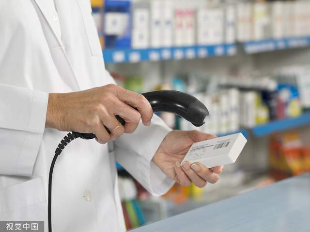

# 拉不住的药价：有药品换包装就涨价14倍，医生直言“抢救不起病人了”

一些处方药、常用药正在暗中涨价。

一名心肌梗死或心脏骤停患者，被送往急诊科，医生急需用去甲肾上腺素注射液或盐酸肾上腺素注射液救命，却发现这两款药不仅涨价数倍，还经常短缺，已被列入国家临床必需易短缺药品重点监测清单，患者岌岌可危；

最近几个月，治疗罕见病皮质醇增多症的一款药醋酸氢化可的松，涨价了10几倍。“一些病友每天要吃2~4片，近10元钱一片的负担不小，因为这类患者不止吃这一种药。”这些患者联合在网上发声，有关部门已介入；

痛风患者常用的一款药别嘌醇片，也遇到了“一夜涨价”的情形。2019年，20多元/瓶的别嘌醇片狂涨到130多元/瓶。当年媒体报道后价格下降，而今价格又悄无声息地回升破百。但这次没人再关注它……

这些只是冰山一角。

在临床上被广泛使用的不少处方药，短短几年，有一些暗中慢涨，有一些则在不被注视的阴影里一跃而涨。

在近20万种药品中，每年都会有一些药如此涨价。这些药混在广阔的药品种类中，藏在个人的总医疗支出中，极易被忽视，往往只有用这类药品的患者注意得到。

当开始追溯涨价的原因，大多药企把其归结于原料药价格上涨。

原料药是生产各类药物的基础。它掌握在少数公司手中，产业集中化程度高，极易被垄断，垄断后价格会“不受控制”地上涨。传导到患者，就是一粒粒药片上涨十倍、百倍。

2017年的一组数据显示，我国有50种原料药，只有一家企业取得审批资格可以生产，44种原料药只有两家企业可以生产。

5月底，国家市监总局发布了5起医药行业垄断案，再次解开了“因原料药垄断，而药价狂涨”的产业的冰山一角。例如，东北制药集团股份有限公司（以下简称“东北制药”），将左卡尼汀原料药价格由2500元/公斤提高至最高8000～10000元/公斤，涨了4倍。下游药物涨价可想而知。

“有些企业把原料药作为手段去掣肘下游的制剂厂的经营和销售，涨价行为传导下去，最终受害的是患者。”一名内部人士告诉八点健闻。

短短不到10年，中国原料药企业从小透明成为了巨无霸，原料药行业地位陡升，下游制剂企业要听命于它；惩罚力度不足更使得其面对反垄断监管时，不停止违法行为，而是把垄断的把戏玩出花样来。

更可怕的是，它隐藏在制剂企业背后，距离患者很遥远，要抓到他们的漏洞去遏制药价异常艰难。

狂涨的药价

“仅仅是换了一个包装，就涨价了14.5倍，我们患者肯定没法接受。”

陈馨是罕见病皮质醇增多症联盟的负责人。这种病又叫库欣综合征，大部分患者日常需要服用醋酸氢化可的松等药物维持。就在今年上半年，86元一瓶（100片）的醋酸氢化可的松，已经涨到了1000元一瓶。“近10块钱一片的药，我们一些病友每天要吃2到4片药，这个负担不小，因为他们不止吃这一种药。”

醋酸氢化可的松是一款天津信谊津津药业有限公司独家生产的药，属于上海医药集团旗下药品。陈馨曾为上海医药集团算过一笔账，“建厂房、获批、原料、运营成本全部都算进去，不会超过3000万元。我们患者每年大约需要1000万片醋酸氢化可的松，假如让它一年收回成本，它的定价每片不需超过3元。”

为了让更多企业生产这款药物，陈馨曾经私下找过其他药企，却因“介入意义不大”而被婉拒。

“我们很好说话的，药企可以卖贵一点，但是涨价要有依据。”陈馨无奈地说。

皮质醇增多症患者是不幸的。但好消息是，今年5月底，社会关注和有关部门介入后，醋酸氢化可的松价格下降，7片装价格降至13.3元，30片装价格降至54.1元。从这个角度来讲，与使用别嘌醇、地塞米松等药物的患者相比，他们又是幸运的，至少降下来了。

不少医生反映，另一款用于急救的激素药，醋酸地塞米松注射液也涨价上百倍，“药是抢救时候要用的，都快抢救不起病人了”。

更戏剧性的是一款治疗痛风的药物“别嘌醇”。

10年前，别嘌醇片市场销售均价约为5.8元/瓶，2015年，别嘌醇厂家达成协议将价格提高至23.8元/瓶，随后因垄断被国家发改委处罚。但处罚并未改变涨价的事实。到了2019年，别嘌醇价格3年时间再翻6倍，最高时甚至130多元/瓶。

被媒体注意到后，别嘌醇价格有所下降。然而如今又过去了4年，别嘌醇片又涨到了一百二三十元/瓶，“涨幅吓人”。

“这些都是基本药物，价格上涨过高会增加医保、患者的负担。”某三甲医院药剂科主任评价称，如果涨价仅仅是生产成本上升，药企为了不亏本，涨价可以理解。但如果不是，价格虚高，水份过多，就可能带来寻租空间，导致药物滥用。

另一名三甲医院药剂科主任最近也听说了“一些集采外药品涨价的情况”。

自2015年我国放开药价后，药品涨价几乎每年都会出现几次。原料药涨价是其中最常见的一个理由。

另一个有趣的规律是，一些药品涨价后两年左右，其所关联的原料药生产企业可能会因垄断被执法部门处罚。

葡萄糖酸钙就是一个典型案例。2018年时，葡萄糖酸钙注射液从3.8元一支涨到19.8元一支。2020年，国家市监总局开出罚单，3家企业滥用在葡萄糖酸钙原料药市场上的支配地位，实施垄断行为，罚没款共计3.255亿元。

原料药的企业少，就为垄断奠定了基础。当操控原料药的药企合谋、垄断，抬高价格时，整个产业链势必会水涨船高。而前文陈馨所感受到的涨价，不过是药企垄断后“蝴蝶效应”的最后一环。

上个月，国家市监总局发布的5起医药领域垄断案件，其中两起是原料药领域的垄断。

多位行业人士告诉八点健闻，被曝光的垄断案不过是冰山一角。

原料药垄断压力之下，下游制剂企业主动布局上游，自己开设原料药工厂，将原料药供应掌握在自己手中，防止集采断供的现象出现。但隔行如隔山，踏足上游的制剂企业做得并不那么理想。

曾经，利润率低、强调规模化生产、走薄利多销之路的原料药行业更像是化工行业，它可以提供稳定的现金流，却赚不了大钱。可以说，它就是隐身在制剂行业背后的小透明。

可自从垄断出现之后，一切都不一样了。原料药企业利用上下游关系，掣肘下游企业生产，操控药品价格，最终传导到患者端。而原料药企业也从小透明成长为庞然大物，在产业链上的地位陡升。

澡堂泡个澡，就能达成垄断协议

国家市监总局发布的这5起医药领域垄断案件里，有的企业涉及了不止一起案件。

比如，远大医药（中国）有限公司操控了两款原料药的价格（去甲肾上腺素和肾上腺素），上海旭东海普药业操控着另一款药物价格（氟尿嘧啶注射液）。而远大医药是上海旭东海普药业的大股东。

无独有偶，天津天药医药科技有限公司操控一款药物价格（氟尿嘧啶注射液），天津金耀药业有限公司另一款药物价格（卡莫司汀注射液），前者是后者的独家控股公司，而二者一同向上追溯至上海上实集团。

原料药企业垄断，往往有横纵两种形式。“横向垄断”是这些企业的套路——生产商通过并购、合谋，形成联盟，一同把原料药涨价，最终操控药价。

这种操作也是原料药行业各类垄断行为中，最早被披露的模式。

早在2009年，治疗皮肤病的药尿素软膏涨价了一倍多，媒体调查后发现，尿素原料药从35元/公斤猛涨到350元/公斤。当时仅有两家企业可以生产药用尿素原料药，新入局者亿帆医药整合了两家企业，成了独家供应企业。

直到2012年，调查结果才迟迟浮出水面。有关部门督促企业将价格从380元/公斤降至198元/公斤。35元/公斤彻底成为历史，企业不仅没被罚款，涨价还成为了既定事实，上述三家企业的整合既没有被原商务部反垄断局事后公开调查，也没有被叫停。

不过，从此以后，原料药厂家便很少再通过并购控制市场。

但不能并购，还可以私下达成协议，尤其是买断包销协议。

“几家企业生产同一种原料药，大家坐一起谈谈，约定好每年大家生产多少，价格是多少。”在原料药行业从业多年的朱天时（化名）告诉八点健闻，还有的企业市场份额高，直接和产量小的企业说，“你们对市场价格有扰动，干脆你们都不要生产了。现在你一年卖1000万，我给你1200万或1500万，补偿你。”

这种企业之间“口头协议式”的横向垄断，最难监管。为了逃避惩罚，企业会想尽一切办法不留下把柄，越隐蔽越好。

这类垄断往往是“君子协议”，大家都是圈内人，口头上说说，不会留下纸质文件。

清华大学国家战略研究院特约研究员刘旭说，正如二十世纪末美国司法部调查维生素跨国卡特尔时披露的那样，价格串谋可能发生在包括温泉度假胜地在内的任何场所。“无论是上下游企业，还是竞争对手，为了不留痕迹地达成垄断协议，可以采取各种隐蔽措施。”

“大家一起澡堂子泡个澡，赤裸相见，这事就谈下来了。”
刘旭补充，有些垄断协议不好取证，但《反垄断法》允许率先自首的经营者申请免罚，以便让垄断协议更容易从内部破裂。

与之相比，有企业也采取“纵向垄断”的办法，也就是中间商操控原料药销售，直接向下游制剂企业提价。

这种方式简单粗暴，却容易被制剂企业联合举报。此路不通后，中间商们开动“大脑”，把包销玩出了花样——

有的搭配其他产品一起销售，原料药还按原价卖，但制剂厂商要买原料必须搭配高价购买辅料；有的直接索要制剂企业股权；还有的药企，操控下游制剂价格，制剂企业的定价受控于中间商，盈利部分两家分成；有的中间商本身就是流通商，它既是制剂企业的上游，又是其下游，将制剂企业包围，要求制剂企业向其低价出售制剂。

更有甚者，中间商们会仔细研究某种药品进集采的可能，操控原料药价格为之后的集采做铺垫。

和企业垄断行为同步加码的是国家的监管动作。2018年前，发改委、商务部和原工商总局各自承担一部分反垄断工作，令出多门显然不利于执法工作。2018年，新组建的国家市监总局整合了原来三部门的职能，负责反垄断统一执法。2021年11月18日，国家反垄断局正式挂牌成立，为新局“护航”的两大动作也在同一天公布。

这两大动作均剑指原料药领域。

一是《国务院反垄断委员会关于原料药领域的反垄断指南》发布，它被视为原料药领域强监管时代到来的标志。二是，国家反垄断局第一次“亮剑”，便砍向了原料药行业：南京宁卫医药因高价销售氯解磷定原料药等垄断行为被行政处罚，罚没款合计658万余元。

在一轮轮反垄断调查与规避反垄断调查的较量中，原料药行业的各类垄断行为愈发隐蔽、复杂，单一的横向、纵向垄断已不能满足需求，合纵连横、横纵结合成为更多厂家操控原料药价格的选择。

2014年，重庆青阳、江苏世贸天阶、上海信谊等五家生产销售别嘌醇片的企业达成协议，将药价提高3倍。值得注意的是，重庆青阳不仅是别嘌醇片三大制剂商之一，更是唯一的原料药生产商。横向上，它们共同操控价格；纵向上，重庆青阳以断供为威胁要求划分销售市场。

由于垄断具有隐蔽性，现在曝光出来的往往是五年前的玩法，重庆青阳案甚至已是9年前。新玩法进化到什么样子？原料药的业外人事无人可知。

但唯一能确定的是，垄断只会更加隐蔽，不会消失，“猫鼠游戏”也会继续下去。

“惯犯”不断

原料药垄断案件中，“惯犯”不断。

此次公布的5个案例中，远大系独占两席，津药药业两年内3次因垄断被罚没1.02亿、潍坊隆舜和第二次被查时甚至暴力阻碍调查。

对于“惯犯”来说，即使被处罚，它们也不惜进行垄断。

“对药企来说，或许这是理性之下的选择。”中伦律师事务所合伙人侯彰慧表示，因为垄断的收益可能远远高于违法成本。

朱天时也算了一笔账，处罚包括没收违法所得，并罚款上一年度整个公司销售额的百分比，多在3%左右。

原料药企业涨价往往是慢慢上涨，等执法部门介入调查时已涨价数年，“一般不会追溯太久，普遍是两年左右。”把这两年的违法所得没收，再罚款，这两年企业至少没有亏损，而之前几年涨价部分就变成了合法收益。“说白了，处罚没让它觉得肉疼。”

刘旭进一步指出，国家市监总局此次公布的5起医药领域垄断案件中，只有一起没收了违法所得，“也就是说在另外4起案件中，违法者都没有上缴违法所得，仍可能从积年累月的违法行为中获益匪浅”。

北京中医药大学法律系副教授邓勇指出，由于违法所得难以计算，这一种处罚方式很难落实，最后只好实施“上一年度销售额10%”的顶格处罚。

而且，垄断行为持续多年，若仅以1年的销售额为基础计算罚款，明显畸轻。在计算罚款时，应当将垄断行为持续的时间纳入考量。

曾有网友在相关文章下评论，处罚是“百牛一毛”。

更值得注意的是，执法部门没有定价权，只能要求违反《反垄断法》的经营者停止违法行为。这就是说，有涨价的药品，即使查出是垄断行为所致，价格也往往不会回到垄断行为实施前的水平，只会象征性的降价。涨价终成既定事实。

而且，决定企业是否实施垄断行为的是高管，但受罚的是企业本身，随之蒙受损失的是股东和散户股民，曾经因垄断行为带来高额利润而受到奖励或者及时逃顶套现的高管却往往不会有任何损失。处罚对象不精准也导致高管们有恃无恐。

这一现象在国企中更为普遍，国企的领导通过垄断把公司经营好，并借此高升，过几年被查出垄断，他早已不在。

如此低的违法成本之下，企业又岂会主动停下操控价格之手？

更助长垄断企业气焰的是，我国反垄断执法人员较少，以全国来算，也不过数百人。而垄断行为具有隐蔽性，执法人员又不可能做“有罪推定”，需要查到确凿的证据，如销售记录、销售票据、垄断协议、或者与之相关的微信聊天记录等才能认定违法。

这种执法难度下，我们有理由相信，当下被披露出来的案件只是冰山一角。

“不排除仍有一些实施垄断行为的医药企业还没被发现，或者一家企业在多个品类上涉嫌实施了垄断行为，但执法人员抓大放小，只挑选其中一种进行处罚。”

10年前，潍坊顺通就不止操纵盐酸异丙嗪的原料药价格，它还涉嫌操纵盐酸倍他司汀、维生素K1、地巴唑的价格，但却只按照操控盐酸异丙嗪价格进行了处罚。“这些企业往往是地方的纳税大户，执法也面临压力，常常调查数年，才开出罚单。”

而更深层的原因在于，原料药市场规模小、品类多、单个品种往往只有为数不多的几家企业生产。

行业经常引用的一组数据是，2017年，时任国家发改委价监局副局长李青介绍，国内1500种化学原料药中，50种原料药只有一家企业取得审批资格可以生产，44种原料药只有两家企业可以生产，40种原料药只有三家企业可以生产。行政管控导致市场竞争不充分，这些年来，行业内一直有呼声，号召放开原料药生产资质，按照化工产品而不是药品来管理。

在侯彰慧看来，“我国现在和90
年代的欧盟非常相似”，近些年来欧盟通过长期高压，企业已经普遍建立起反垄断合规意识。未来，只有不断加码反垄断执法，狂涨的药价才有可能被拉住。

“未来几年，原料药反垄断将一直处于高发期。”朱天时判断。

宋昕泽丨撰稿

李 琳丨责编

**本文首发于微信公众号「八点健闻」，未经授权不得转载**

