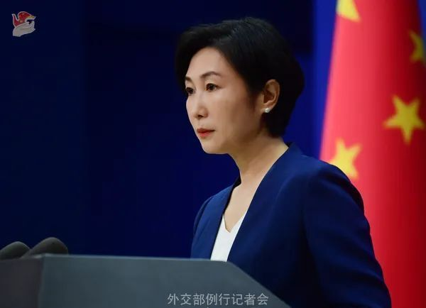

# 新修订的《反间谍法》将限制外国记者在华采访？外交部回应

6月28日，外交部发言人毛宁主持例行记者会。

韩联社记者提问，据报道，新修订的《反间谍法》7月1日开始实施，有评论认为《反间谍法》实施后，在华外国人查找和储存中方的统计资料会产生困难，也有人担心这会限制外国记者的采访活动。中方对此有何评论？

_毛宁
资料图 图源：外交部网站_

毛宁表示，任何国家都有权通过国内立法维护国家安全，事实上这也是各国的通行做法。中国全面推进依法治国，将一如既往地坚持法治原则，依法规范执法，依法保护个人和组织的合法权益。‍

“你将《反间谍法》同外国记者的采访活动相关联是没有必要的。中方一贯欢迎各国媒体和记者依法依规在华从事采访报道工作，并为他们提供便利和协助，只要是依法依规、合法合规，就没有什么可担心的。”毛宁说。

**更多要点：**

外媒就中国驻欧盟使团团长傅聪涉乌克兰问题表态提问，外交部回应

危地马拉总统候选人称如当选要与中国大陆和台湾发展友好关系，外交部回应

外交部：望国际原子能机构评估报告经得起检验 勿为日方排海方案背书

