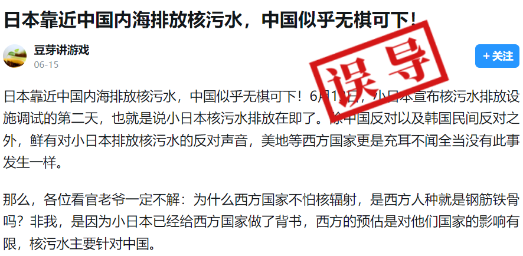
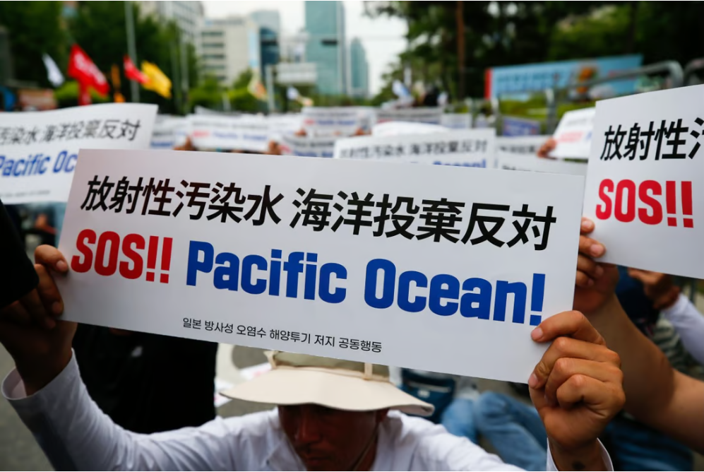
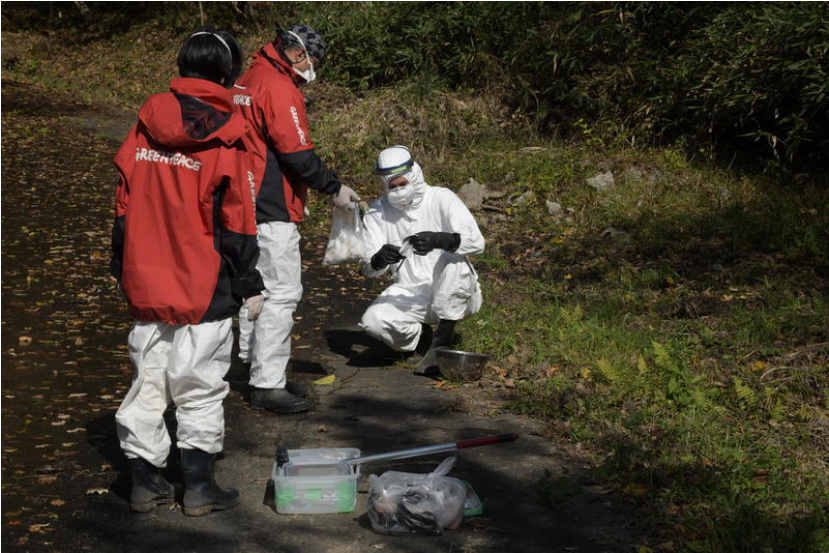

# 日本用船只运送核废水至中国临海周边排放？说法存在误导性

**划重点**

  * _1_ 网传“日本用船只运送核废水至中国临海周边排放”这一说法具有误导性。核电站运营商东京电力公司表示，核废水将通过海底隧道输送至距福岛第一核电站海岸约1公里处的出口排放。
  * _2_ 包括中国在内的日本邻国、日本国内渔业从业者以及相关环保组织都严厉谴责了“日本决定将福岛核污染水排入海洋”这一行为。
  * _3_ 日本政府表示将等待国际原子能机构调查组6月底公布相关评估报告后，开始正式排放核废水。

**事件背景**

据日本广播协会（NHK）报道，日本政府2023年1月13日正式决定将东京电力公司福岛第一核电站储存超过130万吨的核废水于今年夏季排入大海。此举引发全球关注和激辩。

近日，有读者就此事向“澎湃明查”提问，日本排放核污染水是以船只运送的方式，还是管道直排的方式排放，且是否会将核污染水运至中国临海周边排放？

_网传说法截图_

**明查**

**网传说法源自何处？**

2011年3月11日，日本东北部太平洋海域发生里氏9.0级地震，引发了福岛第一核电站（Fukushima
Daiichi）泄漏事故。据路透社（Reuters）2011年4月12日报道，日本原子力安全保安院将此次福岛核事故的严重程度定为最高等级7级，与1986年切尔诺贝利核事故同级。

相关报道显示，地震发生后，福岛核电站发生核泄漏，超过130万立方米的海水被灌入反应堆以冷却熔融的核燃料，数量庞大的海水也因此遭到了64种放射性核素污染。

事后，东京电力公司（TEPCO）设置了事故放射性废水净化处理装置，其中包括锶铯吸附装置、反渗透膜除盐装置以及多核素去除装置（ALPS）等，用以去除事故放射性废水中的大部分放射性核素。

目前，经过处理的污染水被储存在1000多个储存罐中。但截至2022年秋季，储水设施容量已接近极限，而用于放置储水设施的土地也所剩无几。

_受到污染的废水填满了福岛第一核电站1000多个水箱。图片来源：美联社_

2021年4月13日，日本政府宣布将福岛核电站处理后的125万吨核废水排入太平洋，并声称这是处理水中氚和微量其他放射性核素的最佳方法。

氚是氢的放射性同位素，不能穿透皮肤，但摄入后可能会对人体有害。

计划宣布不久后，日本当局请求联合国核监督机构国际原子能机构（IAEA）提供相关技术援助，以检测和审查与此次核废水排放有关的计划和活动。

**核废水如何排放？**

据核电站运营商东京电力公司介绍，经处理的核废水在被大量海水稀释后，将通过海底隧道输送至距福岛第一核电站海岸约1公里处的出口排放。

_东京电力公司提供的放射性废水净化处理装置及处理过程流程图_

日本福岛当地媒体最新报道称，东京电力公司已于当地时间6月26日早上7点05分开始了对福岛第一核电站核污染水排海隧道中重型设备拆除的潜水作业。当地时间上午9点半，潜水作业完成。之后，东京电力公司会安装排放口的盖子。待该工程结束后，意味着核污染水排海准备工程基本完毕。

**各方怎么说？**

尽管联合国核监督机构负责评估该计划的安全性，但在该计划宣布后，舆论一片哗然。日本国内渔业从业者和邻国，以及环保组织对该计划的批评声不绝于耳。

日本广播协会相关报道显示，岩手、宫城和福岛县的生活协同组合联合会和宫城县渔协代已于去年9月向东京电力公司和日本经济产业省递交了约4.2万人的联合署名，反对福岛第一核电站核污染水排海方案，要求采取其他方法处理核污染水。

日本福岛县磐城市市长内田广之在今年1月13日发表声明说，希望政府和东京电力公司切实履行当初的承诺，即“不获得相关者的理解，便不（对核废水）展开任何处置”。

同日，日本宫城县渔业协会会长寺泽春彦接受当地电视台采访时表示，他们会继续将反对的态度贯彻到底。

_当地时间2021年4月13日，抗议者在日本东京的首相官邸外反对福岛核污水排入大海。图片来源：新华社_

今年6月15日，根据韩国国际广播电台（KBS）报道，韩国民调机构Research
View上月对1000人进行的一项调查显示，超过85%的韩国民众反对日本排放废水的计划。70%的受访者表示，如果废水排放继续下去，他们将减少海鲜消费。

韩国渔业部门也誓言要加大力度监测天然盐场的放射性物质含量，并继续禁止从福岛附近海域进口海产品。

_当地时间6月12日，韩国首尔，人们举行集会抗议福岛核废水排放。抗议者敦促韩国政府对日本提起诉讼，要求停止排放。图片来源：新华社_

同时，香港星岛日报称，澳门市政署6月13日声明，如果日本方面开始排放核废水，届时将会暂停包括东京都、千叶县等九个日本县市的水产、蔬菜和水果等的进口申请，不排除进一步要求从日本其他地方进口的鲜活食品都要附上辐射检测证明，并通过相关检验检疫措施。

除此之外，新华社5月29日报道显示，中方代表27日在瑞士日内瓦举行的第76届世界卫生大会上也表示，坚决反对日本单方面决定将福岛核污染水排入海洋。

中方代表指出：“福岛沿岸洋流强劲，核污染水排海10年后，有关放射性核素将蔓延至全球海域。此举是将风险转嫁给全人类，不是日方的私事，而是关乎全球公众健康的重大问题。”中方代表还强调，“在同各方协商达成一致前，日方不得擅自启动核污染水排海。”

国际环保组织绿色和平（Greenpeace）在其发布的一项报告中指出，日本福岛核电站受到核污染的废水含有放射性物质，一旦被排放入海将会对海洋生态系统和人类健康构成重大威胁，并指责日本政府有关污水已经“处理过”的说法会给外界造成错误印象，以为污水中“只含有氚”。

_绿色和平组织Greenpeace辐射调查小组每年在福岛县进行放射性水平的实地调查，监测核电站事故后的公共卫生防护工作。图片来源：Greenpeace网站_

**是否有其它替代方案？**

《科学》（Science）杂志今年1月的一篇文章曾引述夏威夷大学马诺阿分校的海洋生物学家罗伯特·里奇蒙（Robert
Richmond）的话表示，尽管日方一再声称“稀释之后的核污染水比饮用水还安全”听起来令人很放心，但此种安全水平仍然比海水中的自然水平高出数千倍。而且这些水将集中在一个点排放数十年，因此氚和其他放射性同位素仍然可能在海洋生物中累积，并通过食物链传递给人类。

罗伯特·里奇蒙提出过有更可行的办法，比如把核废水通入充满牡蛎、蚝类的水箱，它们会吞噬浮游生物，将放射性元素固化到其外壳上；或者把这些水储存40到60年，因为氚的半衰期只有大约12年。但由于成本问题，日本政府没有采纳相关建议。

_《科学》杂志相关报道截图_

根据日本朝日新闻（The Asahi
Shimbun）的报道，国际原子能机构调查组于今年5月底视察了福岛第一核电站现场，并进行了为期5天的调查，一份对日本核废水排海计划评估的综合性报告将在本月月底完成。日本政府表示，将等这份报告公布后开始排放核废水，工程一旦开启将持续30年左右。

综上所述，网传“日本用船只运送核废水至中国临海周边排放”这一说法具有误导性。核电站运营商东京电力公司表示，核废水将通过海底隧道输送至距福岛第一核电站海岸约1公里处排放。包括中国在内的日本邻国、日本国内渔业从业者以及相关环保组织都严厉谴责了“日本决定将福岛核污染水排入海洋”这一行为。日本政府表示，将等待国际原子能机构调查组6月底公布相关评估报告后，开始正式排放核废水。

