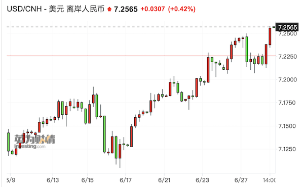

# 离岸人民币跌破7.25，中间价此前罕见释放稳定信号

6月28日（周三）16时左右，离岸人民币对美元跌破7.25关口。上午公布的人民币对美元中间价与市场模型的预测基本保持一致，但第一财经记者也观察到，27日中间价的偏离程度较大。多位交易员和策略师对记者表示，27日中间价释放稳定信号，比模型预测的偏强超100点，这是今年以来罕见的偏离程度。

“27日中间价比模型预测要强出近110点，似乎释放了央行的稳定信号，但28日基本没出现偏离，说明似乎7.2附近仍是较为合意的水平。”某外资行外汇策略师告诉记者。截至北京时间28日17:00，美元/人民币报7.2458，美元/离岸人民币报7.2565。今年以来，人民币贬值都由市场驱动，罕有干预迹象，未来的汇率走势仍将取决于经济基本面和美联储货币政策走向。

**中间价罕见释放稳定信号**

中国央行周二将在岸人民币对美元中间价设在7.2098，这一中间价意味着汇率处于7个月来的最弱水平。但这一中间价仍强于许多市场参与者的预期，不能完全用美元的整体走势来解释。

汇丰外汇策略师陈敬阳表示，人们由此猜测，中国央行可能在中间价报价模型中重新引入了“逆周期因子”。当日，人民币对美元基本保持稳定，并未大幅偏离7.2，早盘一度升值。

不过，中间价偏离的情况并未在周三持续，离岸人民币对美元继续下跌。信达证券首席宏观分析师解运亮对第一财经记者表示，4月17日-6月21日，人民币汇率累计贬值超过3400点，其中，市场力量累计对贬值方向贡献超过3600点，中间价累计对升值方向贡献近200点。中间价对冲市场贬值幅度非常有限，这或许表明，政策部门对人民币贬值的容忍度较高。

亦有观点认为，从年度波动来看，今年上半年人民币波动幅度仅为3.85%，2014年、2020年和2022年的波动远超于此。

“逆周期因子”是一种调节工具，旨在缓和羊群效应，但早前该因子退出后并未被官宣回归，因此交易员仅通过观察中间价的偏离度来判断信号。此前在汇率贬值压力较大时，中国央行会酌情在每日人民币对美元汇率中间价报价模型中引入“逆周期因子”。中国央行上一次动用这一工具是在去年11月，当时在岸人民币跌至7.3左右，中间价的累计偏离度一度达到几千点。

中国央行行长易纲今年3月表示，作为推动人民币国际化努力的一部分，央行打算逐渐减少对人民币汇率的干预。

业内人士也多次对记者表示，通过收紧离岸流动性、推高人民币HIBOR利率的方式弊大于利，尽管可以暂时震慑空头，但会影响离岸人民币融资以及人民币国际化的发展。

**美联储加息进程尚未结束**

就目前来看，人民币面临的海外压力尚未缓和，美国经济衰退概率下降，美联储继续加息的概率提升。

隔夜数据显示，美国5月耐用品订单量意外上升，环比增长1.7%，预期为下降0.9%。同时，4月数据由增长1.1%上修为1.2%，耐用品订单量已连续3个月增长。这暗示美国经济依旧具有韧性。

摩根士丹利最新预计，美联储7月加息25BP，2023年末联邦基金利率将达到5.375%。该机构在6月FOMC会议后曾预计，加息进程已经结束。

目前，主流观点预计，美联储年内还将加息2次，分别为25BP，且降息起码要到明年二季度。

近期，国际清算银行（BIS）暗示加息进程不应该过早逆转。BIS总经理阿古斯丁·卡斯滕斯（Agustín
Carstens）称：“不及时采取行动的风险在长期来看将更加严重。央行应致力于坚持原有路线，恢复价格稳定，保护民众的购买力。”

该机构在6月25日最新发布的旗舰年度经济报告中指出，劳动力市场仍然紧张，服务业价格增长难以控制。风险在于，通胀预期会占据主导地位，工资和价格的增长开始相互强化，利率可能需要在较高水平维持更长时间。同时，该机构也呼吁财政和审慎政策发挥作用，帮助维护经济和金融体系的稳定。

除了海外的压力，目前外贸商结汇意愿较弱的情况并未改变。对此，大型袜业出口企业、上海中昊针织董事长高宝霖对记者表示，面对外部形势的压力，出口创汇获得的美元存款目前利息相对更高，“藏汇于民”也是缓解外贸人压力的一种方式。

渣打还提及，二、三季度离岸中国企业分红将导致人民币存在季节性贬值压力，而中美息差较大（倒挂幅度为2~3个百分点）仍是人民币汇率较弱的主因。

根据各大机构的预测，目前为汇率季节性贬值压力最大的时期，而四季度可能压力将会有所缓和。巴克莱外汇、宏观策略师张蒙对记者表示，对美元/人民币的最新预测分别是7.2、7、6.9、6.8（从今年三季度开始的预测）。未来，中国政策放松措施的时机和力度或决定汇率的表现。

