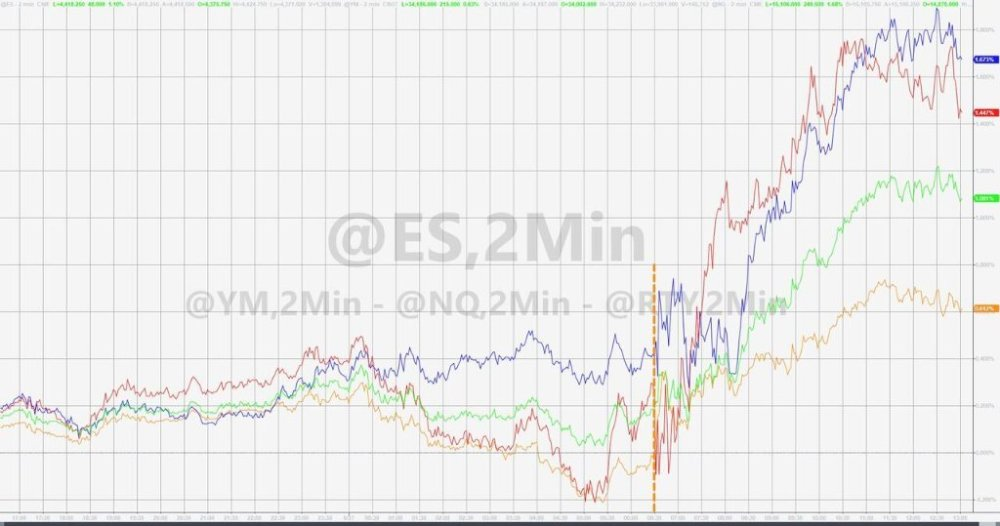
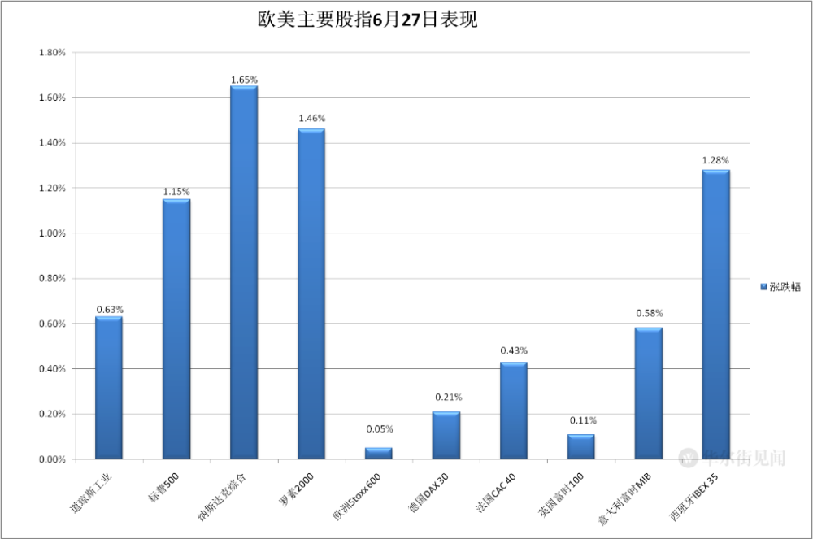
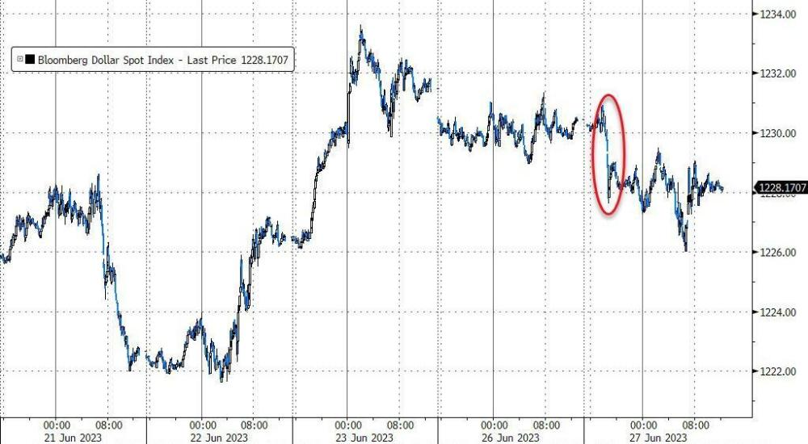
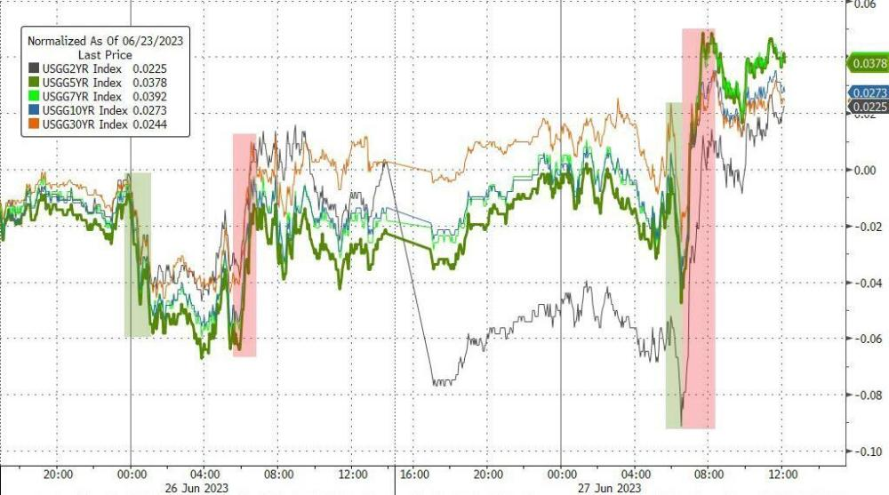
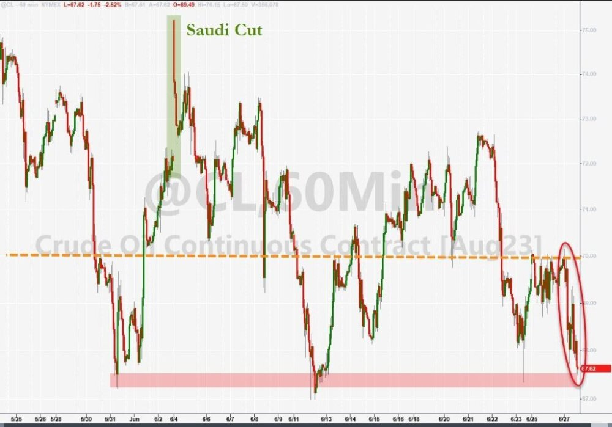
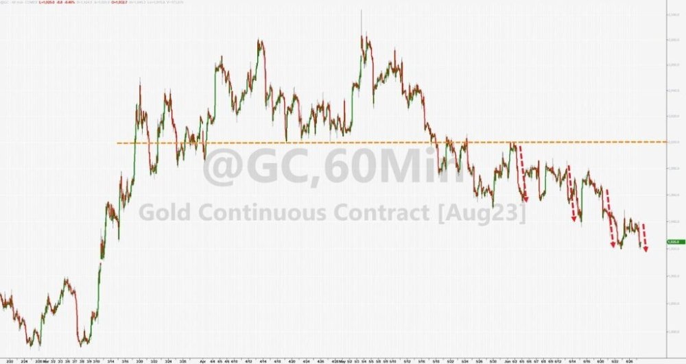

# 美股收盘：科技股领跑纳指涨1.65%，中概走强蔚来涨超11％

周二公布的美国数据传来经济好消息：5月耐用品订单意外环比不降反增1.7%，反映企业新增资本投资的核心资本品订单增长0.7%，未如预期增长停滞，但4月增速下修，暗示企业投资还谨慎；6月谘商会消费者信心指数超预期攀升，创近一年半新高；5月新屋销售未环比下降，反而激增12.2%，创一年多来最大增幅，和房价指数环比上涨均体现楼市尚能抵御美联储加息冲击。

数据显示美国经济仍有韧性，市场担忧缓和。风险偏好回暖，避险情绪退烧，美国国债价格回落，收益率回升，基准十年期美债收益率一度较周一刷新的一周多来低位回升10个基点。连日下挫的美股反弹，周一施压大盘的特斯拉等蓝筹科技股带头回涨，重新成为美股上行的推手，纳指创一个月来最佳单日表现。中概股涨幅更胜大盘一筹。

欧洲央行行长拉加德放鹰，称7月将继续加息，紧缩政策还会持续很长时间。欧洲国债收益率集体攀升，英债收益率带头上行；欧元加速上涨，助推美元指连续两日回落。但非美货币未能集体受益。

继神田真人后又一日本政府官员警告日元贬值。财务大臣铃木俊一警告，目前日元的波动是单向且迅速的，必要时将采取行动。日元周一的反弹仍昙花一现，日元兑美元重启上周的创七个月新低之势，盘中失守144.00，逼近去年日本政府出手干预汇市时约145的关键汇价门槛。

媒体称富达投资集团（Fidelity）准备申请比特币现货ETF，富达将成为贝莱德之后又一寻求发行此类ETF的又一华尔街巨头。比特币一度重上3.10万美元，较日内低位回涨超过1000美元。

大宗商品中，周一刚扭转连日跌势的国际原油回落。评论认为，拉加德强化利率更高的预期，可能打击经济活动及石油需求，且布油两个月期升水表明，交易者担忧市场供应过剩，在考虑供应略有过剩的情况。

在上周鲍威尔国会听证会暗示加息周期尚未结束、展示倾向继续加息后，摩根士丹利新近报告预计7月美联储将加息25个基点，认为7月加息的门槛比其最初预计的低得多，并将预计的今年联储政策利率峰值上调至5.375%。目前市场预计美联储7月加息25个基点的概率超过70%。

纳指创一个月最大涨幅 特斯拉领衔蓝筹科技股反弹 芯片股跑赢大盘 中概指数涨超3%

三大美国股指总体高开高走，午盘刷新日高时，纳斯达克综合指数涨逾1.8%，标普500指数涨近1.3%，道琼斯工业平均指数涨超260点、涨近0.8%。

最终，三大指数集体收涨。纳指收涨1.65%，报13555.67点。标普收涨1.15%，创6月15日以来最大涨幅，收涨4378.41点，和纳指均脱离周一连跌两日所创的6月9日以来收盘低位。连跌六日的道指收涨212.03点，涨幅0.63%，报33926.74点，告别连续两日刷新的6月7日以来低位。

科技股为重的纳斯达克100指数收涨1.75%，在连跌两日至6月9日以来低位后反弹，和纳指均创5月26日以来最大涨幅。价值股为主的小盘股指罗素2000收涨1.46%，在连跌五日后连涨两日，继续走出
6月5日以来低位。

主要美股指周二普遍反弹

龙头科技股多数反弹。周一跌超6%创两个多月来最大跌幅的特斯拉表现最好，收涨3.8%，脱离连跌两日所创的6月8日以来收盘低位。

FAANMG六大科技股中，被花旗上调目标价且重申买入评级后，Facebook母公司Meta收涨近3.1%，抹平周一回落至6月14日以来低位的多数跌幅；
连跌两日至6月9日以来低位的微软收涨1.8%；连跌两日的苹果收涨1.5%，刷新上周四所创的收盘历史高位；刷新去年9月以来高位后连跌两日的亚马逊收涨近1.5%；周一回落至6月8日以来低位的奈飞收涨近0.3%；而继瑞银之后最近又被Bernstein下调评级、认为竞争加剧影响、生成式AI的压力限制近期搜索增长后，周一跌超3%的谷歌母公司Alphabet早盘跌超1%，午盘曾转涨，最终微幅收跌0.01美元，大致收平。

芯片股总体跑赢大盘。费城半导体指数收涨3.6%， 半导体行业ETF SOXX
收涨约3.5%，连涨两日至一周高位。周一跌近4%的英伟达早盘曾转跌，收涨近3.1%，在连跌四日至6月12日以来低位后反弹。博通、安森美收涨超3%，AMD、英特尔、高通、美光科技均收涨逾2%。台积电美股涨近2%。

其他科技股中，宣布与英伟达达成AI相关合作、让客户能用自身数据打造AI模型后，云数据分析公司Snowflake（SNOW）午盘刷新日高时涨约5.5%，收涨4.2%；被美国银行重申买入评级、认为是元宇宙领域领军人物的游戏平台Roblox（RBLX）收涨6.6%；大多连日下挫的AI概念股普遍反弹，周一跌超4%的C3.ai（AI）收涨4.4%，周一跌超2%的BigBear.ai（BBAI）收涨4.4%，周一跌0.6%的Palantir（PLTR）收涨4.8%，周一逆市涨超10%的SoundHound.ai（SOUN）涨3.7%、周一跌超1%Adobe（ADBE）收涨约2%。

周一多数小幅反弹的热门中概股加速上涨，跑赢大盘。纳斯达克金龙中国指数（HXC）收涨近3.1%。个股中，到收盘时，金山云涨超12%、蔚来汽车涨超11%，小鹏汽车、陆控涨超8%，网易涨超4%，百度、B站涨超3%，拼多多涨3%，腾讯粉单、京东、理想汽车、爱奇艺涨超2%，阿里巴巴涨近2%。

周一逆市反弹的银行业指数继续上行。整体银行业指标KBW银行指数（BKX） 收涨近1.1%，继续脱离6月1日以来低位；地区银行指数KBW Nasdaq
Regional Banking Index（KRX）和地区银行股ETF
SPDR标普地区银行ETF（KRE）分别收涨1.6%和1.7%，分别继续走出6月1日和5月31日以来低位。

大银行中，摩根士丹利收涨1%领跑。地区银行中，周一收涨4%的西太平洋合众银行（PACW）收涨近5.5%；周一涨近4.8%的WSFS
Financial（WSFS）收涨近2.6%。

波动较大的个股中，申请破产保护且起诉富士康违反投资协议的电动汽车生产商Lordstown
Motors（RIDE）早盘曾跌超30%，收跌17.2%；第三财季EPS盈利低于预期、下调全年EPS指引的连锁药店零售商Walgreens Boots
Alliance（WBA）收跌9.3%；媒体称加拿大投资机构Brookfield 接近达成43亿美元收购协议后，American Equity
Investment
Life（AEL）收涨17.2%；在CEO透露发现得州地区的需求将大增后，发电机制造商Generac（GRNC）收涨8.8%；将新的全年EPS盈利预期设在此前预计区间高端的达美航空（DAL）收涨6.8%；周一公布二季度亏损低于预期仍收跌7.6%的嘉年华邮轮（CCL）收涨8.8%，
其同行挪威邮轮（NCLH）和皇家加勒比邮轮（RCL）分别收涨5.7%和4.3%。

欧股方面，市场更加期待中国未来的政策刺激，金融和奢侈品类股助推欧股反弹，但拉加德鹰派讲话抑制涨势。泛欧股指终结六日连跌。欧洲斯托克600指数收涨不足0.1%，暂别连续三日刷新的5月31日以来收盘低位。主要欧洲国家股指齐涨，连跌六日的德股和法股反弹，英意西股连涨两日。

各板块中，银行涨逾0.9%，旅游涨逾0.8%，公用事业和保险涨近0.8%，而医疗跌近1.2%，连续两日跌超1%且跌幅居首，原油回落影响的油气跌近1.1%。

个股中，中国业务有直接影响的奢侈品巨头瑞士历峰收涨近1.2%、法国LVMH涨近0.6%、英国险企保诚（Prudential
Plc）涨1.5%、英国最大银行汇丰涨约1%。在高盛维持买入评级、认为市场在上周五披露风力涡轮部件问题后大抛售属于反应过度后，上周五重挫37.3%、周一跌超2%的西门子能源收涨2.3%。

拉加德放鹰后欧元涨幅扩大 日元重启创七个月新低之势 离岸人民币一度回涨超400点

追踪美元兑欧元等六种主要货币一篮子汇价的ICE美元指数（DXY）在亚市早盘曾升破102.80上方刷新日高，后很快转跌，欧股开盘后跌幅持续扩大，拉加德讲话后美股早盘曾靠近102.30，日内跌近0.4%，较上周五涨破103.10所创的6月15日以来盘中高位回落逾0.8%，开始靠近上周四跌穿102.00所创的5月11日以来盘中低位。

到周二美股收盘时，美元指数处于102.50下方，日内跌约0.2%；追踪美元兑其他十种货币汇率的彭博美元现货指数跌0.2%，和美元指数均在两日连涨后连跌两日。

彭博美元现货指数上周三以来走势

非美货币涨跌不一。在拉加德鹰派讲话后，欧元兑美元盘中涨幅迅速扩大，美股盘初曾接近1.0980，刷新最近三个交易日高位，日内涨近0.7%，继续远离上周五跌破1.0850所创的6月15日以来盘中低位。英镑兑美元在美股盘初曾逼近1.2760，日内涨近0.4%，远离上周五盘中跌破1.2690刷新的6月15日以来低位。

日本财务大臣讲话后，日元周二亚市盘中小幅上涨，但此后回落，最近八个交易日内第七日刷新七个月来低位。美元兑日元在欧股早盘转涨，美股开盘后加速上行，早盘涨破144.00，一度上测144.20，刷新截至上周五连续六日所创的去年11月以来高位，日内涨近0.5%，逼近去年日本政府干预汇市的门槛145.00，美股收盘时仍处144.00上方。

离岸人民币（CNH）兑美元在亚市早盘曾跌至7.2495逼近7.25，在连续四日创去年11月29日以来新低后，刷新去年11月28日以来盘中低位，后很快转涨并保持涨势，美股盘初刷新日高至7.2064，较日低回涨431点。北京时间6月28日4点59分，离岸人民币兑美元报7.2243元，较周一纽约尾盘涨186点，扭转三日连跌势头。

连日回落的加密货币反弹。比特币（BTC）在欧美交易时段加速上涨，美股早盘曾涨破3.10万美元刷新日高，较亚市早盘的日内低位回涨超过1000美元、涨超3%，靠近上周五涨破3.14万美元所创的去年6月以来高位，后有所回落，美股收盘时处于3.06万美元上方，最近24小时涨超1%。

两年期英债收益率升超10个基点 创2008年来新高 十年期美债收益率远离逾一周低位

拉加德放鹰后，欧洲国债价格回落，英债收益率带头回升。英国10年期基准国债收益率收报4.37%，日内升8个基点，和上周二逼近4.50%刷新的去年10月以来高位仍有距离；2年期英债收益率收报5.24%，日内升12个基点，美股盘中曾升破5.27%，
继上周五之后又创2008年来新高；基准10年期德国国债收益率收报2.35%，日内升5个基点，美股盘初曾下破2.90%至2.286%，连续两日刷新6月2日以来低位，后迅速回升；2年期德债收益率收报3.13%，日内升6个基点，和上周四逼近3.29%刷新的3月9日以来高位仍有距离。

美国10年期基准国债收益率在美股盘初曾接近3.69%刷新日低，后迅速拉升，早盘尾声时曾接近3.78%，较周一下破3.68%刷新的6月13日以来低位回升约10个基点，到债市尾盘时约为3.76%，日内升约4个基点。

对利率前景更敏感的2年期美债收益率在美股盘初下破3.65%刷新日低，美股午盘曾升至
4.77%，开始接近上周四升破4.80%后刷新的三个月来高位，到债市尾盘时约为4.76%，日内升近2个基点。

各期限美债收益率本周一到周二走势

原油跌超2% 回落至两周低位

国际原油期货在欧股早盘转跌后保持跌势，在欧股盘中曾跌超2%，此后跌幅收窄，美股早盘曾接近抹平所有盘中跌幅，午盘跌幅再度扩大到2%以上并刷新日低，美国WTI原油跌至67.5美元，日内跌约2.7%，布伦特原油跌至72.33美元，日内跌2.5%。

到收盘时，WTI
8月原油期货收跌2.41%，报67.70美元/桶；布伦特8月原油期货收跌2.59%，报72.26美元/桶，和美油均刷新6月12日以来收盘低位。

美国WTI原油期货一个月来走势

连跌四日的欧洲天然气反弹。英国天然气期货收涨6.81%，报85.16便士/千卡；欧洲大陆TTF基准荷兰天然气期货收涨7.92%，报34.506欧元/兆瓦时，和英国天然气均脱离截至周一连续三日刷新的6月12日以来收盘低位。

伦铝止住六连跌告别九个月低位 黄金回落 逼近三个月低位

伦敦基本金属期货周二多数上涨，除了涨超1%的伦铅外都涨超2%。其中，领涨的伦锡涨逾2.5%，和伦铅都在连跌三日后反弹，走出各自周一所创的近三周和逾两周来低位。周一跌超5%领跌的伦镍脱离去年7月以来低谷。连跌六日的伦铝也反弹，告别去年9月末以来低位。而周一独涨的伦铜回吐周一反弹的涨幅，跌至两周来低位。

纽约黄金期货在美股早盘转跌后持续下行，盘中跌至1919.8美元刷新日低，日内跌超0.7%。最终，COMEX
8月黄金期货收跌0.52%，报1923.80美元/盎司，逼近上周四跌至1924美元下方刷新的3月16日以来收盘低位。

纽约黄金期货四个月来走势

