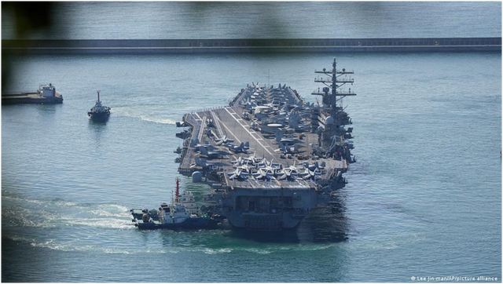
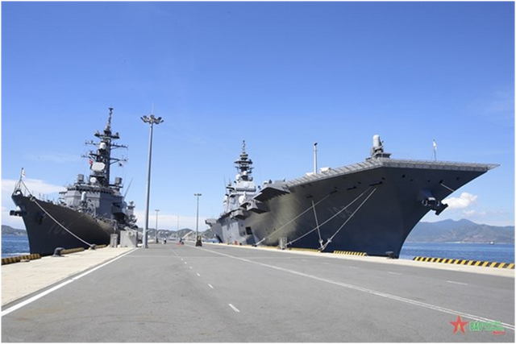
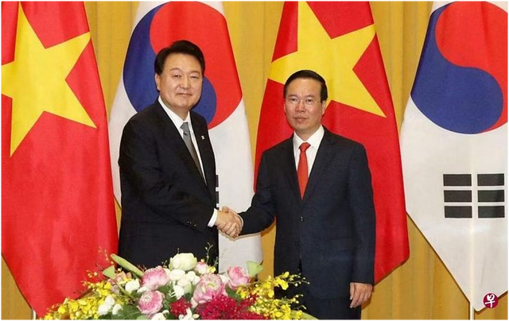
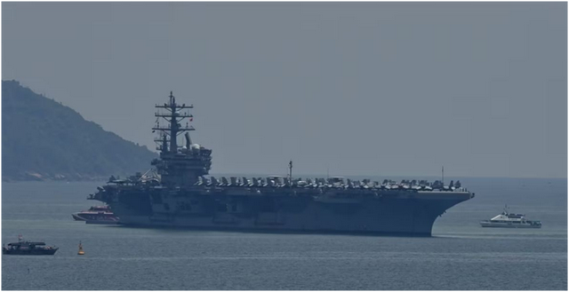

# 美里根号航母高调访越南岘港，越南防长却来到中国，这些信息耐人寻味

**执笔/断水刀 &胡一刀**

美军“里根”号核动力航母在越南访问。

此访被不少西方媒体冠以“罕见”“象征性”“历史性”等高帽，似乎只有如此才能彰显华盛顿此番对河内的重视。

实际上，今年以来，美国升温对越关系的动作接连不断。

布林肯4月访越前，一个极为豪华的“美企天团”刚结束对越南的访问。从经济到政治，再到如今的军事领域，华盛顿希望在美越全面伙伴关系建立十周年之际，将美越关系升级为全面战略伙伴关系。

当然，美国为什么如此煞费苦心，大家都懂的。美国的盟友如日本也纷纷加强与越南的防务合作。

而这两天，越南总理范明政正率领高级代表团，在中国访问，致力于推动中越经贸合作。6月27日，中越国防部长在北京举行会晤，表达中越军队合作的共同意愿。

这些都是耐人寻味的重要信息。

1

据美海军发布的官方通报，当地时间6月25日，美军“里根”号核动力航母正式抵达越南岘港，展开为期5天的访问，随行的还有“安提坦”号和“斯莫尔斯”号两艘巡洋舰。

这是自1975年越南战争结束、美国从越南撤军以来，美国航母对越南的第三次访问。

前两次分别是2018年“卡尔·文森”号航母停靠越南，和2020年3月“罗斯福”号航母停靠岘港，当时正值越南战争结束暨美越建交25周年之际。

这次“里根”号航母对岘港的访问，是越美全面伙伴关系建立10周年庆祝活动的一部分。美联社23日报道称，华盛顿将河内视为其地区战略的关键组成部分，并一直寻求利用越南来扩大美国在该地区的影响力。

“里根”号是目前美军在印太地区唯一处于部署状态的航母，这次停靠越南岘港，让不少外媒也借此大力炒作了一把美越“转敌为友”所代表的“对中国的共同担忧”，并纷纷用“罕见”“象征性”“历史性”来形容此事，烘托华盛顿对越南的高度重视。

日本共同社分析称，“里根”号航母航母正停靠在面朝南海的越南中部岘港，此举可谓向与中国存在南海主权之争的越南，明确了持续参与地区事务的姿态，可能意在彰显海洋安保领域的军事实力，以拉入己方阵营。

这其中对于美国拉拢越南的炒作渲染，以及对于中越关系的挑拨意味，已经不言而喻了。

最近一段时间，“里根”号航母的航行轨迹给人的第一印象就是挑事儿，因为该航母一直在中国周边的海域晃悠。6月14日“里根”号进入南海海域，还到达了万安滩附近海域。

现在“里根”号停靠在岘港，难免被外界质疑秀肌肉，毕竟美国这样做也不是一次两次了。而越南方面表示，这是美越两国正常友好的交往。

继今年4月布林肯访越南并表示要将美越关系升级为全面“战略”伙伴关系之后，美国就开始忙不迭地铺垫“美越共同对抗中国”的叙事与战略。显然，拉拢越南已经成为美印太战略中的重要组成部分，但同样显而易见的是，这也没那么容易会随着“里根”号的访问而实现。

6月27日，国务委员兼国防部长李尚福在北京会见了越南国防部长潘文江，双方在中越军队合作等领域都表达了共同意愿。

有专家分析认为，中越防长的会晤可谓是对“美国核动力航母访越对中越关系造成负面影响”论调的直接回应。很明显，美国在越南打的如意算盘落空了，事实表明，一艘航母无法在中越之间搅起多少浪花。

2

不过如今，越南被美国的“青眼有加”，自然也落入美国盟友的眼里。

在“里根”号停靠岘港的一周前，日本也派出了护卫舰前往越南港口“打卡”。

海上自卫队最大军舰“出云”号，是日本今年“印太部署”行动中的一员。据报道，这艘“准航母”6月20日与随行驱逐舰“五月雨”号一起，到访并停靠越南的军事要冲金兰湾国际港，开启了为期三天的访问。

抵达港口后，日本海上自卫队的第一护卫队群司令还在舰内召开记者会，强调有意加强日越两国的安全合作关系。

此情此景下，日媒纷纷渲染称“舰船相继靠港旨在彰显日美团结”，“意在联合越南牵制中国”。

除了美国和日本之外，印度也在最近对越南表示了极大的兴趣。

上周，不少印媒报道称，印度给越南送了一份军舰“大礼”：

印度国防部长辛格宣布，将向越南赠送排水量为1350吨的库克里级导弹护卫舰“吉尔班”号，并将此美言为“加强越南人民海军能力的里程碑”。

“吉尔班”号是印度自己生产的导弹护卫舰，除此之外，印度还打算在潜艇和战斗机操作、网络安全和电子战等领域加强对越南人员的培训。

越南的港口，印度也来打了个卡。

上个月19日，印度海军派出3艘军舰抵达越南岘港市仙沙港，开启为期5天的访问。印媒称，由于中国海洋能力的不断提升，印度正通过定期联合演习、军事交流和培训计划不断提升与越南、印度尼西亚、新加坡和菲律宾等东盟国家的防务关系。

另一边，韩国总统尹锡悦也刚刚结束访越行程不久。

越南是尹锡悦就任韩国总统后首个出访的东南亚国家，不少韩媒舆论也注意到尹锡悦此次给越南的高度定位——访越期间，尹锡悦不止一次声称，越南是韩国“印太战略”的“核心合作伙伴国”。

这一说法也再次彰显出韩国对拉拢越南的重视程度。一时间，越南仿佛成了“热门景点”和“香饽饽”。

3

在国际舆论中掀起的这股越南“外交热”，成了一些媒体、网站、社交媒体的流量密码之一，因为越南外交有个风吹草动，都会被拿来跟中国挂钩。

美国、印度和韩国等与越南发展关系，加强防务合作，被不少西方舆论认为它们是想拉着越南一起对付中国。

6月25日，越南对美对华外交出现“一来一往”：美国“里根”号核动力航母在岘港罕见停靠，越南总理范明政则抵达北京并开启就任总理后首次访华之行。

这“一来一往”在中美博弈加剧和中越南海争端的叙事框架下成为舆论场“热点”。

不过，广西民族大学中国-
东盟海上安全研究中心主任葛红亮告诉“补壹刀”，国际舆论中的“听风就是雨”不是国际政治的全部，要读懂越南“外交热”的弦外之音，就必须全面认识越南外交的基础。

第一，越南外交首要的基础，在于其如何看待自己。

革新开放是越南自实现统一后的又一个里程碑，同时也促成越南如今经济快速发展，并活跃于地区和世界舞台上。

2022年越南国内生产总值增长率达到8.02%，创1997年以来最大增幅。经济的高速增长使越南的社会呈现出快速发展的一面，越南国内民众，尤其是在经济、社会快速发展中出生、成长的年轻一代，对越南外交产生更多更高的要求。

特别是在处理当前与他国利益矛盾和与大国关系等问题上，越南年轻人有着越来越自信的想法

不过，与此同时，越南也被国际货币基金组织（IMF）视为“玻璃经济体”一员，2023年前五个月越南进出口贸易大幅下滑和国家经济增长疲软，及“电荒”的出现，都折射出越南国家经济发展存在着脆弱性。

葛红亮认为，更为重要的是，作为越共执政的社会主义国家是越南外交的底色。去年2月9日，越共总书记阮富仲所著《社会主义理论和实践若干问题以及越南走向社会主义的道路》出版，阐明了其对社会主义和越南走向社会主义道路等重大问题的辩证分析和解读。

这不仅说明越南基于自身国情对社会主义道路的坚守，也决定了越南外交最浓厚的底色。

第二，越南外交的基础还在于其如何看待地区和国际环境。

当今世界，百年未有之大变局正加速演进。对此，越南学者深有认同，“世界和地区也开始进入一个变乱交织的时代”。

对于当前新的地区和国际环境，越共十三大也明确认为，亚太地区将继续起着主要的战略作用，而在东南亚地区，安全环境、海洋问题也存在着巨大的复杂性和不确定性。

因而，地区和国际环境带给越南至少三重难题：一是大国角逐和“军事化”风险带来的安全压力，二是大国竞争带来的“选边站”压力，三是地区海洋问题中的复杂矛盾及其带来的摩擦、冲突风险。

第三，越南外交的基础更在于其如何确立越南外交目标。

外交是内政的延伸，随着革新开放的发展步入新的时期，越南的外交自然会承受着越来越大的新压力。

越南外交已在融入国际、巩固和平环境和利用有利条件等方面取得了不俗的成就，而在新的时期，越共十三大明确越南将一贯奉行独立自主的外交政策，致力于和平、友谊、合作和发展多边化和多样化的国际关系。

葛红亮称，越南外交的目标是，“继续发挥对外工作在营造和维护和平稳定环境，调动和利用外部资源发展国家、提升国家地位和国家威望方面的先锋作用”，及在《联合国宪章》和国际法基本原则的基础上维护国家民族的最高利益。

对于越南如今的外交路线，阮富仲早在2016年8月的越南外交工作会议上将之概括为“独特的、如竹子一样的”外交风格。

在2021年12月的全国对外工作会议上，阮富仲再次明确指出，越南“决心构建和发展兼具现代和民族特色的‘竹式外交’”。

由此可见，越南外交不只有作为国际舆论流量密码的“左右逢源”。一方面，从中可以看到越南对美积极发展军事交流，美国核动力航母的停靠到访就是典型例子。

另一方面，在近期越南多乐省发生两所警察局遭到打砸事件之后，越南官方痛斥美国恐怖组织在越南制造袭击。

在越共设定的外交蓝图中，更有“构建和发展兼具现代和民族特色”和为人类共同发展提供“遮荫”的宏大叙事。而对于这些内容的客观理解，将有助于外界读懂国际舆论中越南“外交热”的弦外之音。

**图片来自网络**

