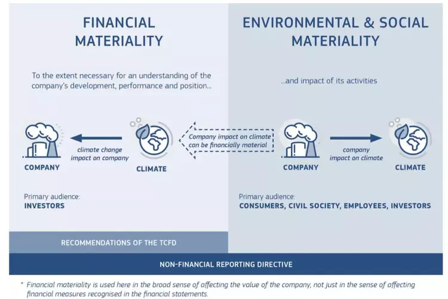

# 里程碑事件！首套全球ESG披露准则发布，ESG终于有了“统一标准”

本周一，国际可持续准则理事会（ISSB）公布有史以来首套全球ESG报告标准，为各地区的公司披露统一的气候和可持续性信息铺平了道路，此举堪称ESG投资领域的里程碑事件。

ISSB公布的信息披露标准有两项，分别为IFRS S1和IFRS S2——《可持续发展相关财务信息披露的一般要求》（General Requirements
for Disclosure of Sustainability-related Financial
Information）和《气候相关信息披露》（Climate-related Disclosures）。
**两项信披标准将于2024年1月1日之后的年度报告期生效，这意味着第一批采用该标准的报告将在2025年发布。**

根据新的披露框架，企业需要披露有关其可持续发展相关风险和机遇的信息，且这些信息可以帮助报告使用者进行决策。同时，企业还需披露所有关于可持续发展相关风险和机遇的信息。

概念基础方面，新披露框架主要涉及公允反映、重要性、报告主体、关联信息。核心内容则包括治理、战略、风险管理、指标和目标四个方面。

具体来看：

**IFRS S1规定了披露一个实体的可持续性相关风险和机会的信息的要求。** 特别是，一个实体需要提供以下方面的披露：

实体用于监测、管理和监督可持续性相关风险和机会的治理过程、控制和程序；

实体管理与可持续性相关的风险和机遇的战略；

该实体用于识别、评估、优先处理和监测与可持续性有关的风险和机遇的程序；

该实体在与可持续性相关的风险和机遇方面的表现，包括在实现该实体已设定的或法律或法规要求的任何目标方面的进展。

**IFRS S2适用于：**

实体所面临的与气候有关的风险，这些风险包括

与气候相关的物理风险；

与气候相关的过渡风险；

该实体可利用的与气候有关的机会。

**IFRS S2规定了披露实体的气候相关风险和机会的信息的要求。** 特别是，IFRS S2要求一个实体披露的信息能够使一般目的财务报告的用户了解：

该实体用于监测、管理和监督与气候有关的风险和机遇的治理过程、控制和程序；

该实体管理气候相关风险和机遇的战略；

该实体用于识别、评估、优先处理和监测与气候有关的风险和机遇的程序，包括这些程序是否以及如何被纳入该实体的整体风险管理程序并为其提供信息；

该实体在气候相关风险和机遇方面的表现，包括实现其设定的任何气候相关目标的进展，以及法律或法规要求其实现的任何目标。

ISSB的新规是妥协的产物

ISSB的信息标准为自愿性框架，该机构无权强制企业遵从这套标准，是否要强制令新规落地，要由公司所在地的监管机构决定。

周一的披露框架历经18个多月的磋商而完成。一些非营利机构认为，ISSB框架缺乏可持续发展报告的一个关键支柱，即双重实质性。

所谓双重实质性是指，一方面，气候变化对企业产生影响，因此影响到财务绩效，所以具有财务的实质性；另一方面，企业活动也会影响气候，所以具有环境和社会的实质性。两者加起来，就是双重实质性。
**IFRS S1及S2均不要求企业披露其对周围世界的环境或社会影响。**

此外，针对部分企业ESG转型的困难，ISSB的新规也作出了较多妥协。根据此次公布的信披标准，企业可以在新规生效首年仅披露气候相关信息即IFRS
S2，到第二年再遵循IFRS
S1的要求，且在第一年也不需要披露其供应商和客户的温室气体排放量。如果企业目前没有能力或资源提供定量信息，也可以提供气候风险或机遇的定性财务影响。

尽管ESG投资在近年来走红，吸引全球投资者参与，但由于相关信披标准的缺失，企业的ESG报告往往质量参差不齐。

近年来，多国监管机构都在试图推动对ESG领域的监管。根据可持续发展数据和技术公司ESG
Book的统计，在过去十年中，全球ESG法规飙升了155%。但由于各国的政治、经济复杂状况，这些监管规则往往各不相同甚至彼此矛盾。分析人士指出，ISSB的信披框架为全球统一的ESG信披标准奠定了基础。

ISSB副主席Sue Lloyd对彭博新闻表示：

“（有了新的信披标准）投资者可以确信，当他们比较公司时，他们在做投资决定时是在一个类似的基础上进行的。”

香港将会深入研究

6月27日，香港证监会行政总裁梁凤仪女士在亚洲证券业与金融市场协会中国资本市场会议上发表主题演讲，她表示，香港在金融市场可持续发展及创新方面一直位居前沿，香港将会深入研究ISSB所发布的企业可持续发展汇报准则，以便在香港以相称的方式实践有关准则。

她在演讲中称，ISSB准则将会成为一种共同语言，有助实体经体企业和资本市场进行可持续性相关的交流，
**占港股市值80%的内地企业可以积极利用ISSB的准则作为沟通桥梁，以继续得到国际资本的垂青。**

她在演讲中表示：

“中国要实现2030年碳达峰和2060年碳中和的目标可谓任重道远，我们切勿低估。如香港实施ISSB的准则，便可帮助中国以至亚洲区内的企业吸引来自全球的资源以实现低碳转型。要达到这个愿景，根据亚洲证券业与金融市场协会最近的报告，未来30年亚洲的相关投资需求将达到66万亿美元之巨。对于在座的全球中介人来说，可持续金融带来的重大机遇实在不容错过。”

