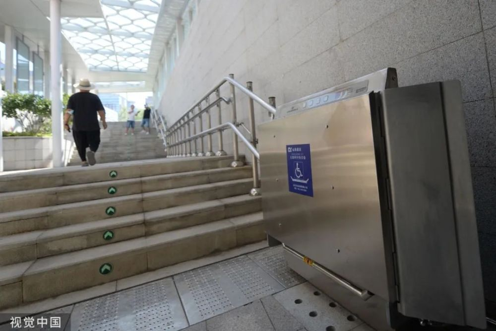

# 8500万残障人，集体过着“有障碍”的生活

生活是忽然变成“有障碍”的。

去年12月，李桧桐（化名）遭遇一场严重车祸，很长一段时间里必须依靠拐杖、轮椅来生活。

身体剧变之外，她骤然发觉，城市变得不那么“友好”——医院无障碍斜坡旁划归的车位阻挡了轮椅进出，“永不堵车”的地铁因无障碍电梯变得不再高效；甚至连无障碍卫生间也因使用不当，变成了吸烟室、杂物间和“密室”。

短暂的“非健全”生活让李桧桐切身体会到，那些不可逆转的残障人士，在大大小小的城市中，因为无障碍设施的匮乏，被极端限制的生活半径。

清华大学无障碍发展研究院教授邵磊长期关注该话题。在研究中他发现，中国约有 8500
万残障人群，占总人口6%左右。其中，60岁以上占残障人群53.24％，65岁及以上占45.26％，年龄越大占比越高。但他们的呼声因为小众不被重视。

无障碍设施的建设中，规划者与使用者之间存在着巨大的认知偏差——换句话说，绝大多数情况下，无障碍硬件设施正在向发达国家看齐，但如何使用、配套设施如何建设、思维观念如何扭转，依旧迟钝且笨拙。

3月1日起，《上海市无障碍环境建设条例》开始施行。6月28日，国家层面的《无障碍环境建设法》表决通过。一切似乎正在稳步前进。但多位受访者表示，无障碍设施的普及是一场“马拉松”，他们就像是“啄木鸟”：不断发现顽疾，不断查漏补缺。

**从健全到残疾，生活处处是障碍**

当正常生活被按下了暂停键，李桧桐发现，自己面对的第一道坎是公共交通。

高效畅通的地铁里，行人健步如飞。可作为行动不便的伤者，她无法再像以往一样走下四五十阶的台阶，只能借助站内的无障碍电梯。

此前她从未意识到，无障碍电梯的使用如此复杂：首先，大多数无障碍电梯并不在地铁入口附近，而是单独划分，找寻就是一件很耗费时间的事；每个地铁站只有一名管理人员持有钥匙，找到电梯后还要等待工作人员启动；出站后再重复这一流程。

以往习以为常的公共交通，在李桧桐短暂的“非健全”生活中，变得不再“便捷”。之后几个月，她只能尽可能多地选择少出行或不出行。

可逆转的残疾状态让这样的不便尚可容忍，但对于一生都需要辅助出行的残障人士来说，生活处处是障碍是他们一生都需要面临的困境。

朱常青是一位渐冻症患者。在她的印象中，刚开始使用电动轮椅时的几次飞行回忆并不美好。

电动轮椅是渐冻症患者的“双脚”，而在国内，电动轮椅的重要性似乎并没有被觉察。2008年，朱常青作为残奥会火炬手，与几名运动员一同飞往北京参加点火仪式。这趟充满荣誉感的旅程，却在返程途中留下了不愉快的尾声。机场告诉她，电动轮椅不能带上飞机。

理由很简单，电动轮椅占地面积大、重达300斤，会给飞机带来极大负重；其携带的锂电池也有风险，按照规定不能登记。

朱常青常参与国际间学者和社会活动家关于无障碍设施建设的交流活动，此前她从未在国际航班遇到限制或拒载电动轮椅的情况。在她的印象中，“甚至不用提前报备”。

电动轮椅托运，在舱内使用小型折叠轮椅，是21世纪初国际上就已通行的为残障人士提供的无障碍服务。但在当时的中国，朱常清发现，“工作人员甚至不知道舱内轮椅是什么。”

徐莫惜（化名）也有着同样的经历。她是一名需要依靠导盲犬的视障人士，作为功能性动物的导盲犬，也被剥夺了进入机舱的资格。

徐莫惜反复向机场表示，导盲犬是通过严格筛选和国家指定基地培训的，国际上也没有导盲犬伤人的先例，大家完全可以放心。

但站在机场的角度，宠物不能带入机舱或必须在乘机时全程佩戴口罩等规定，是从源头掐断可能的风险——没有人能保证导盲犬在高空环境不会带来安全隐患，也没有人能预测会不会有旅客怕狗，导致投诉。

从源头“掐断”风险，在他们看来，是最粗暴有力的解决办法。

朱常青一一列数了与出行一样限制着残障人士生活空间的场景：医院的柜台很少考虑残障人士的轮椅低位；卫生间扶手的高度要既适合高位截瘫人群，又适合轮椅人群，不能只限于一种标准；银行的存取款机、柜台……都是一道道现实挑战。

当挣脱了疾病耻感的残障人士尝试走出家门，一切以正常人为标准设计的场景都在将他们往外推。

**为无障碍清扫“障碍”**

朱常青将自己形容为一只“啄木鸟”。

在与机场反复交涉后，残障人士飞机出行第一次被推入机场管理人员的视野。在朱常青的助推下，机场增加了爱心柜台、购入舱内小轮椅、增设提前报备途径，残障人士的远距离交通才算有了解决途径。

这样的事情，朱常青做了20年。这20年里，渐冻症让她从一个“看上去无异于常人”的人，变成了“手不能动”的人。

出行离不开电动轮椅的她，长期观察着城市里的无障碍设施。遇见使用不便的地方，她会当机立断地投诉，或是打电话给12345、残联，又或是直接顺藤摸瓜找设计者，提出整改意见。

提起这些，朱常青总会苦笑，说自己电话打到后面，总是会发展成吵架，“就是挑人家的刺”。残联的工作人员，现在看到她的电话，都不敢接了。

走在校园里，她是受人尊敬、仔细严谨的学者；翻开报纸，她曾是意气风发、风光无限的残奥会火炬手；但在一些残联工作者和设施设计者眼里，如今的她却是那个“喜欢鸡蛋里挑骨头、吹毛求疵的轮椅女人”。

但这样的“挑刺”，对无障碍设施的建设来说是必要的。

即使把生活范围缩到最小，在残障人士的“15分钟生活圈”中，依然绕不开“衣食住行银行”这5个最基本的生活场景。而就在这五个场景里，他们无时无刻不在触碰着障碍。

许多像朱常青一样执着的人，正在努力扫清这些障碍。

残障人士社群“少数派说”主理人沈丞晴是圈子里的“中坚力量”。她经验足、人脉广，经常组织活动，为各方的需求和改进奔走。偶尔，她也会感到无力。这种无力来源于社会的忽视和被边缘化——脱离了残障人士的圈子，在庞大的社会集体中，她还是那个不起眼的少数。

沈丞晴在南昌投诉过地铁站的无障碍渡板，在天津投诉过电梯间的门槛高度，但都像是拳头打在棉花上一般，没有实质反馈：有的地方直接搁置她的诉求；有的地方只说“改了”，但不提具体改了什么；而有的地方，在接到投诉后，虽然悄悄调整了设施，但因为缺乏沟通导致调整“没在点上”。沈丞晴只能不断尝试，告诉设计者：改得还不够，还能这样改。

与许多市民一样，12345是沈丞晴经常使用的投诉渠道。接线员会在第一次受理时诚恳地告诉她，已经与地铁工作人员或者公交公司沟通，相关方已经受理了业务。但沈丞晴永远等不到下文。只有一次，她接到12345的回电，问她：“你投诉的设施已经调整了，方便过来看吗？”

沈丞晴记得最清楚的一次，是投诉天津某公交线路没有设置从地面上车的轮椅坡道。12345告诉她，这个设施由公交车公司负责，天津市“没办法管理”。沈丞晴便向对方询问公交车公司的联系方式，但对方又含糊其辞，“说他们会向公交车公司再反馈，但目前是‘改不了’的。”

沈丞晴显然是对这个结果不满意。当时正值残运会，沈丞晴问他们，来参加残运会的人该怎么乘坐交通工具？对方机械般地回答：“现阶段就是没办法，后续我们再说。”

生活在深圳的年轻盲人女孩徐莫惜，面对的是一个自上而下都缺乏无障碍理念的环境，也经常需要与“没有无障碍概念”的有关部门“对峙”。

专为视障人士设置的盲道被一排排看不到尽头的共享单车“占领”已经不足为奇，对于走路慢、需要导盲犬的徐莫惜来说，更大的问题在于人车共行的“人行道”。

走在人行道上，徐莫惜总会紧张，前后的车看她走得慢，会不耐烦地大按喇叭，有时甚至会将她的导盲犬“吓得一激灵”。

在深圳，许多路段的非机动车道和人行道是合并的。这导致行人、婴儿车、轮椅，都需要与非机动车“争抢”这条并不算宽敞的“人行道”。

徐莫惜和朋友投诉了几次，但交通管理部门的回复让他们体会到的是，城市管理部门对少数群体的漠视。

“为什么不让人行道和非机动车道分开？”徐莫惜问。

“如果让非机动车上机动车道，会增加死亡率，”对方回答，“我们得考虑这个，而不是你们残疾人出行方不方便的问题。”

“但电动车和摩托车与行人、残疾人走在一起，也很危险，”徐莫惜反驳。

对方却回答，目前没有发现在人行道上骑车会增加残疾人死亡率。随后，对方甚至指责：“你们盲人怎么可以一个人出来，你一个人出来就是有危险，你自己要负责。”

无障碍意识的缺乏，也反映到了《无障碍环境建设法》草案上。

沈丞晴和徐莫惜在二审草案出台后，参与了一次圆桌论坛，与社群里的朋友们一起为草案提建议，并反馈给相关负责人。

在一份PDF版草案的关键处，沈丞晴细致地用红、黄等不同颜色划分标注，并解释了不同颜色代表的意思：红色是有问题的，黄色是与第一版草案不同的地方……其中，许多“能力范围内”“具备条件的”“各自职责范围内”“替代性措施”等字眼被红色划出。沈丞晴觉得，这些字眼像是在为“各部门做得不到位的地方找退路”。

“尤其是涉及自然灾害、事故灾难、公共卫生、社会安全事件等，比如洪水、地震，这种情况下无障碍设施的获得，不应该谈条件，”沈丞晴说。而频繁出现的“各自职责范围内”这样的表述，给相关部门留足了解释空间，沈丞晴认为，是从法条层面就告诉你，没有条件可以不建设无障碍环境。

一位圆桌讨论参与者直截了当地表达了对这些限定词的质疑：“一说无障碍，一些政府部门就说‘我们小地方，没能力’。一句‘小地方’能解决我们的问题吗？只是解决了我们对它们的申诉。”

**残障人群被忽视的主体性**

硬件设施的缺失，通过不断“挑刺”或许能在较短时间内得到些许改善。但理念的缺失，背后反映的，是非残障人士与残障人士之间的认知鸿沟。这或许需要一场更加漫长而深刻的教育来弥补。

彭玉娇一直在做这样的事情。

作为受脑性麻痹影响者，公众号“残障姐妹BEST”、北京乐益融社会工作事务所发起人之一，彭玉娇一直希望通过宣传教育提高公众的无障碍意识。

她曾做过一个调研，发现北京的博物馆里，无障碍设施硬件相当完备，对比之下，软性服务却异常落后：“比如保安不让导盲犬进入博物馆，认为它是宠物狗；或不让电动轮椅进入，怕你撞到别人，要求必须有监护人陪同等。”

许多博物馆承担着“通识教育”的公共责任，在设置关于通识教育的导览服务时，博物馆都考虑到了老年人、儿童的需求，却唯独没有将残障人士纳入考量。彭玉娇认为，这些需求完全是共通的。

朱常青也常感受过这样软性的“障碍”。有一次去上海浦东奥特莱斯，不管哪个入口，她的电动轮椅都不被允许进入。保安指着门上的规则告诉她：“你看，这写着电动轮椅不得入内。”

朱常青找到客服中心，质问他们为什么不做无障碍设施。负责人带着朱常青进入奥特莱斯逛了一圈。她发现，奥特莱斯内部其实有完善的无障碍设施，包括电梯的无障碍按钮和专门的无障碍洗手间。唯一缺乏的是轮椅标识——提醒公众这是无障碍设施。未接受过培训的安保人员，自然认为场馆内没有无障碍设施，不允许残障人士入内。

那天，朱常青花了足足两个小时，向奥特莱斯负责人和安保公司工作人员“科普”什么是无障碍设施，为什么需要无障碍设施，为什么一辆最高时速不到6公里的电动轮椅，是可以和行人一起进入有无障碍设施的园区，而不会造成安全隐患。这又是一次“纠错”，商场修改了入园制度，挂上轮椅通道标识。

无障碍设施设计者与具体执行者之间的信息鸿沟，是设施提供者与残障人士之间沟通交流的匮乏。

在清华大学无障碍发展研究院执行院长邵磊看来，弥合这种偏差需要从两方面来解决。

一方面，无障碍设计师本身的素质和能力需要强化。“在这方面，《无障碍环境建设法》的提出，不仅给了大家一套有法可依的标准，更提升了整个行业在无障碍设施建设方面的重视程度。”

数据佐证了邵磊的看法。在知网搜索关键词“无障碍设施建设”，会发现这一关键词的关注度自2000年后总体上涨，并在2022年达到了顶峰。而2022年，就是《无障碍环境建设法》一审草案颁布的那一年。

而弥补鸿沟最根本的是，需要一套长效的参与机制，“要确保残障人士、老年人等群体能参与建设、发表意见、提供需求指引，”邵磊说。

残障者参与到设计、建设、测量、实施无障碍环境的各个环节，目前仍须努力。朱常青发现，自2010年以来，上海残障设施扩展就停滞了。3月1日上海施行的残疾人法仅仅是“倡议”，残障人士只能用“评奖评优”来建议各单位增加残障设施。现阶段上海市残联也并没有残疾人管理者，“这实际是不科学的。”

“奇途无障碍”创始人纪寻，常年从事无障碍旅行倡导和残障社群发展。她发现，即使在产品用户调研阶段招募残障人士做访谈，也不能得出普适的结论。设计者与使用者之间的信息鸿沟，只能通过不断对话交流才能弥合。

这样一种由非残障人士主导的无障碍设施规划、建设与服务，背后是一种隐形的“权力不平等”。

盲聋诗人约翰·李·克拉克（John Lee
Clark）曾在文章中提出，这是一种非残障人士对残障人士所抱有的，我为你好的家长心态和一厢情愿。在这套权力体系中，残障人士是需要保护的、无法承担风险的、易碎的孩子，而非残障人士则是替他们做决定的“监护人”。

即便成年多年，大多数残障人士的一生都绕不开“监护人”这个角色。徐莫惜被质问盲人出行为何不带家人，彭玉娇和朋友也在日本游乐园里被强制要求与“监护人”一起出行，否则不能乘坐游乐设施。

家长式的过度保护也经常出现在与旅游打交道的纪寻身边。社群里一些活跃的朋友，常因为父母阻挠缺席线下旅游体验活动，连是否要购买电动轮椅也没有自主决定的权力。

“有监护人是对的，但不能硬性要求监护人，好像我还是一个孩子，”彭玉娇觉得自己没有得到足够的尊重，“整个社会还是把残疾人当成福利依赖客体，不认同这个群体的主体性。”

如何破解这种家长式的过度保护，纪寻认为，除了继续推进无障碍设施的普及，让社会看到这一群体的主体性之外，更重要的是改变公众对轮椅等残障人士设备的看法。

“它们只是一种普通的出行工具，而非‘需要帮助’甚至‘废物’的象征。”

张雨箫、牛益彤丨撰稿

傅 辛｜责编

**本文首发于微信公众号「八点健闻」，未经授权不得转载**

