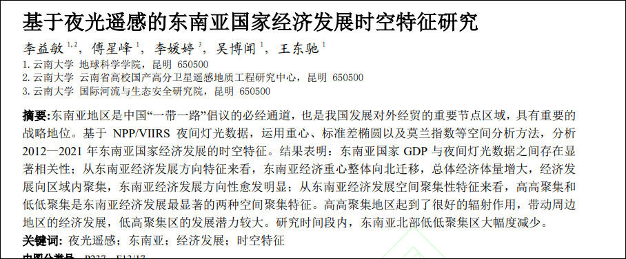
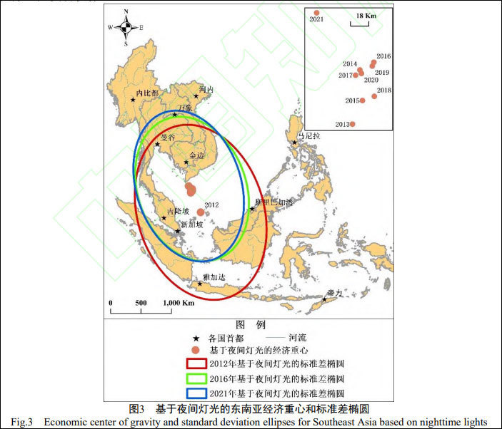

# 与中国有关？夜间灯光显示东南亚经济重心北移

（观察者网讯）“中国这个庞大经济体的引力在夜空下生动地展现出来。”6月29日，中国香港英文媒体《南华早报》刊文称，一项新研究表明，夜间灯光显示东南亚经济重心“转向中国”。

报道援引了云南大学研究团队日前发表的论文《基于夜光遥感的东南亚国家经济发展时空特征研究》，数据显示东南亚经济重心整体向西北方向偏移，2012与2021年的经济重心相距约476km。

研究人员分析称，东南亚经济重心迁移一方面是因为该区域南北经济发展差异，另一方面在“一带一路”背景下，中国与东南亚地区贸易往来频繁，促使该区域的经济增长向北扩张。

_《南华早报》报道截图_

《南华早报》6月29日注意到了这篇被《南京信息工程大学学报（自然科学版）》收录、6月25日才在网络首发的论文。论文第一作者是云南大学地球科学学院研究员李益敏。该项目由云南省科技厅-
云南大学联合基金重点项目、中国地质调查局地质调查项目、中老孟缅自然资源遥感国际实验室资助。

这项研究认为，夜间灯光总值与GDP数据间呈高度正相关，将夜间灯光总值作为GDP的代理变量具有科学性与合理性，且其广覆盖面和高分辨率使得研究结果比统计数据所得结果更为准确地表征了东南亚经济的时空演变特征。

研究团队利用2012-2021年东南亚地区NPP/VIIRS夜光遥感影像，通过计算夜光数据的重心、标准差椭圆和莫兰指数，分析东南亚11个国家（泰国、新加坡、印度尼西亚、缅甸、老挝、柬埔寨、马来西亚、菲律宾、越南、文莱、东帝汶）经济发展的方向特征、总体空间布局特征和空间聚集特征。

《南华早报》摘出了论文得出的部分数据，比如，根据夜间灯光数据计算的经济重心整体上向西北方向迁移，2012年与2021年的经济重心相距约476km，其中，2012-2013年以及2020-2021年的迁移最为显著。

报道将此数据具象化，称这相当于在不到10年的时间里，大部分光线聚集的中心平均每天移动145米。《南华早报》认为，向西北方向迁移意味着东南亚经济重心越来越靠近中国，并将此理解为“转向中国”，称“中国这个庞大经济体的引力在夜空下生动地展现出来，（东南亚）人造光点越来越亮，越来越接近中国”。

报道提取论文的数据分析称，经济重心的变化并不总是遵循相同稳健的步伐，两次明显的迁移都与当时的大事件有关，比如第一次明显变化发生在2012-2013年金融危机之后，第二次发生在2020-2021年新冠疫情爆发期间。

_图源：《基于夜光遥感的东南亚国家经济发展时空特征研究》_

报道还称，从富裕的新加坡到欠发达的柬埔寨，大多数国家的夜间灯光总值都在增长，2012-2021年东南亚各省级区域夜间灯光总值的最低值增长了“近50倍”（实为44倍），最高值增长了3倍。

研究人员认为，这些变化表明近10年东南亚经济发展迅速。经济重心迁移的特征说明，在近10年的发展中，东南亚北部的经济体量增速大于南部。

论文列举了多重因素，比如2012-2013年，在全球金融危机持续的情况下，东南亚最大经济体印度尼西亚的经济衰退，此后3年也呈下降趋势，这是因为对外贸易在印尼经济中占重要地位。而位于研究区域北部的泰国和越南等国家在危机期间积极采取行动，使当地经济保持平稳状态或缓慢增长。这些因素导致经济重心向北迁移。

论文还认为，东南亚经济重心北移也与“一带一路”倡议有关，“中国同东南亚各国的频繁经贸往来也可能促使区域经济向北扩张，双方的贸易与投资迅速发展”。去年，东盟再次成为中国第一大贸易伙伴。

《南华早报》重点讨论了“一带一路”对东南亚的影响，称该地区获得了最高份额的直接投资，根据一些人估计，近年来，“中国十大海外投资目的地中有七个位于东南亚”。

报道还列举了中老铁路、雅万高铁，称这些项目促进了互联互通，并以中国投资数十亿美元在缅甸和马来西亚建深水港和工厂为例，指“一带一路”倡议中大多数举措的重点是提高中国邻国的工业能力。

《南华早报》认为，由于中美两国正在争夺在东南亚的影响力，这项研究并未阐述全球两个最大经济体之间的地缘政治力量如何影响东南亚的人造光的分布。

报道最后援引澳大利亚洛伊研究所4月份发布的一项研究报告称，中国在东南亚的经济影响力是美国的两倍多，但美国在该地区的军事影响力是中国的两倍多。

**本文系观察者网独家稿件，未经授权，不得转载。**

