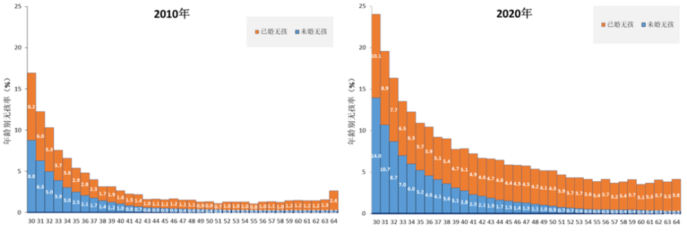

# 中国女性终身不育率10年升3倍，这个势头才刚刚开始？

_图源：Pixabay_

**撰文｜李珊珊**

这个国家从来没有像今天一样担心孩子越来越少的问题。

2022年，中国出现了60年来首次的人口负增长。近期，新闻报道称，发表在《BMJ
Open》的一项研究显示，2020年中国49岁女性的终身无孩率达到了5.16%，即每20名女性中有一人一生未育。

社交网络中，一条对该研究的简单粗暴的截面式总结——“女性受教育程度越高，终身无孩率越高”上了热搜。

然而，这种简单归因，却并非研究者本意。热搜的背后，中国的终身无孩率与其他低生育国家相比，究竟处于什么水平？这将带来怎样的个体风险和社会后果？我们究竟该如何看待这些数据并予以应对？

相关课题组在发表的《中国无孩率上升趋势：基于2010年和2020年人口普查数据的社会和区域差异分析》中写到，研究希望：“观察生育意愿与无活产子女结局的演变轨迹，以及有子女的生育意愿如何最终转变为无子女的现实结局”，从而“发现导致生育意愿最终难以实现的社会性和制度性障碍，提出针对性政策对策建议”。

**终身无孩率，中国不算高，趋势却令人担忧**

5月26日，《BMJ
Open》上，来自中国人口与发展研究中心庄亚儿、张翠玲、姜玉、张许颖几位研究员和西安交通大学姜全保教授等多位中国学者发表了他们基于2010年和2020年的第六、第七两次人口普查数据分析得到的中国女性终身无孩率的变化，这是利用普查数据对中国女性终身无孩水平变化趋势和相关驱动因素的最新呈现。

衡量一个社会的生育水平，通常使用的指标是总和生育率，即：平均每位育龄妇女一生中的生育子女总数。根据联合国的定义，2.1的总和生育率是维持代际更替、人口稳定的基本条件。国际社会公认的警戒线为1.5，低于此数值有跌入“低生育率陷阱”的可能。而在中国，2019年的总和生育率为1.52；到了2021年，中国的总和生育率只有1.15，全球倒数。

晚生、少生与不生都会影响总和生育率。上述文章的作者们聚焦的便是之前较少关注的一种现象：未生育的女性在逐渐增多。

终身无孩的标准，研究中定义为女性至49岁仍未有过活产经历。这也是国际通行的定义，因为通常情况下，49岁时女性生育期已经结束，49岁仍未生育便可以定义为终身无子女。

分析中，研究者发现：1960-1964、1965-1969、1970-1974这三个时间段出生的女性在达到49岁时，无子女的比例呈逐年上升趋势。2020年49岁女性的无子女比例达5.16%，是2010年同年龄女性无子女率（1.29%）的4倍。

比较2010年和2020年的数据会发现：2020年20-30岁的女性未生育的比例比2010年同年龄组增加了10个以上百分点；在35岁的女性人群中，未生育者占比增加了5个百分点左右；在40岁的女性中，未生育者从2.66%增加到了7.85%。

“ **较低年龄段上无活产子女的女性占比增加，反映了生育的推迟；而高年龄段无活产子女比例的升高，则是女性生育水平下降和终身不育现象增加的结果**
”，作者总结道。

课题组利用上述数据的进一步模拟预测显示，1985年出生的女性，当她们到了49岁时，其无子女比例可能会达12.41%（95%的置信区间）。

终身无孩，既包括由于生理原因、婚姻状态、家庭变故等因素导致的客观未育（involuntarily
childlessness），也包括个人或夫妻的主动选择（voluntary
childlessness或称childfree）。“终身无孩率的上升是推动发达国家低生育进程的原因之一，更是影响东亚极低生育水平形成的重要因素”，而中国终身无孩率上升的势头正在初显，作者在文中说。

随着现代化的进程，由于生活方式、生育观念发生转变，不结婚或不生育的群体规模逐渐扩大。在一些欧洲国家，育龄期结束时无子女的女性比例通常在20%左右。2010年，中国香港，1960年代末出生的女性中约有1/3没有孩子；在新加坡，这个数值是21%；在韩国，这个数值大约有19%。而在已几乎成为了全球队列生育率最低、终身无孩率最高的国家之一的日本，1978年出生的妇女中，27%的人尚无子女。

与欧美国家及日韩等亚洲国家相比，中国的终身无孩率并不高，终身无孩率上升的势头也刚刚显现，但婚姻推迟、晚生、少生甚至不生的发展趋势需要引起关注，这种上升趋势在城市女性和受过高等教育的女性中更加明显。

**哪些群体更可能没有子女？**

多项国外研究显示，终身无孩风险具有显著的群体异质性，例如：未婚人群、高教育水平群体、城市群体、家庭规模较小的群体、无宗教信仰的妇女，无孩率更高。与教育程度低的妇女相比，受过高等教育的妇女更可能没有子女。

而本次研究中，中国的数据同样显示了类似的特征。2020年，49岁的女性中，无子女比例在初中及以下文化程度的女性中为4.42%左右，在高中文化程度的女性中为7%左右，而在大专及以上文化程度的女性中，比例为8%左右。接受教育时间的延长客观上导致了婚姻和生育行为的推迟，而且也会对人们的婚育观念产生着重大影响。受过本科及以上教育的女性中，不生育倾向都有着比较明显的上升，对女性生育必要性的认同度也大幅下降。

_2020年分省45-49岁无子女比例
（图源：参考文献 [1]）_

除了教育差异，无子女比例也存在显著的城乡差异，35岁时，城市女性无子女比例为13.78%，乡镇女性为7.29%，乡村女性为9.09%。49岁这一比例分别为6.29%、5.50%和3.72%。作者解释：“城乡之间的无子女比例差异是多种因素综合作用的结果，其中包括中国城乡二元体制造成的社会经济和文化鸿沟导致的婚育观念差异。”

地域方面，在北京、上海，45-49岁女性无子女比例为11.92%和8.18%。然而，在另外一些地方，如东北三省，吉林、黑龙江和辽宁的无子女比例分别为8.59%、7.9%和7.11%，远高于全国水平。而这些省份的总和生育率已多年连续低于1.0。

**不同于欧美国家婚外生育普遍、多孩占比较高（20％以上）的多元化生育特征，我国婚外生育较少、多孩占比较低，终身无孩率一旦持续上升，对我国出生人口数量和生育水平的负向抑制将更加强烈，且难以通过其他机制得到补偿。**
如何平抑终身无孩率快速升高趋势，是当前我国适度生育水平实现面临的重要挑战。

在这样的背景下，中国人口与发展研究中心主办的杂志《人口与健康》上发了该中心主任贺丹撰写的《建立生育支持政策体系
注重加强一孩生育支持》一文，文章也强调了一孩生育支持政策的重要性，并分析到“一孩生育的萎靡和推迟是拉低生育水平的主要原因”。

**婚姻家庭观与终身不育**

_图说：越年轻的女性队列，未婚对无孩率的贡献在上升。（图片由受访者提供）_

随着受教育水平的提升，女性婚育年龄推迟，以及，主动不生育的女性人数增多，这几乎是个不争的事实，也是世界各国正在发生的情况。除了接受这个事实，各国也都在对其国民终身不育的原因进行详细地分析。

在《欧洲人口学》杂志上的一篇《Life-Course Trajectories of Childless Women: Country-Specific
or Universal?》中，作者用荟萃分析的方法综合了美国、德国、意大利和波兰这四国研究者，对他们国家无子女女性选择放弃生育的原因。

该研究发现，
**虽然单身、受过高等教育的人群占未生育女性比例较高，但就业困难和长期失业等生命历程中的重大变化也会增加女性放弃生育的几率，而这一点，在受教育程度较低的女性中尤为明显。**

在美国，一部分无子女的女性是“15岁时未完成学业就开始工作的女性”；而在德国，无子女女性的一个重要组成部分包括一些“受教育时间很长，但进入劳动市场时并不顺利”的女性。根据那份分析，与意大利和波兰相比，德国和美国的无子女女性中，有伴侣但没有孩子的比例更高，文章认为这与后两国的文化和对婚姻的态度有关。

理论上，终身无孩水平的变动由未婚未育和已婚未育两个部分变动决定，一项针对东亚和西方无子女女性的研究则显示，“在西方，随着同居和非婚生育的兴起，婚姻与生育的关系变得不那么紧密，而在（以日本为代表的）东亚，婚姻仍然与生育密切相关。”
**在法国超60%
的生育是婚外生育，而在日本，永久单身女性几乎与永久无子女女性几乎是同一条曲线。东亚社会较高的无孩率与较大比例的适龄群体推迟进入或不进入婚姻紧密相关，也部分由已婚女性无孩率持续上升导致。**

在本次的研究中，研究者们同样关注到了“未婚”对中国女性年龄别无孩率升高的影响：与2010年普查相比，2020年同一年龄别女性的无孩率升高中，未婚无孩和婚后无孩的升高都较为显著，而越年轻的女性，未婚无孩的比例升高幅度更为显著。

**如何令较高水平的无子女现象与适度生育水平并存？**

终身无孩，是影响整个国家生育率的重要因素之一，但同样的女性终身无孩率，造成的整个国家生育率却仍有差别。

一项针对意大利和英国无子女情况的研究中发现，尽管两国的无子女水平接近，最终造成的生育率却有所差异，意大利的生育率几乎是欧洲最低，英国的生育率虽然也低，却没那么糟糕。

研究发现：在意大利，
“无子女水平的上升主要是由于女性在公共领域尤其是劳动力市场的角色的结构性变化挑战了传统的性别角色和家庭范式”。现代女性一方面面临着更多的经济责任和压力，另一方面却仍需履行传统的家庭角色规范，她们不得不推迟婚姻和生育，同时育儿服务相关制度的缺失以及倾向无子女的文化也发挥了一定的作用。

而在英国，人们更坦然地接受了无子女的生活方式，同时，由于公域和私域的性别角色之间没有那么明显的脱节，使得多子女家庭的比例较高，因而较高水平的无子女现象与总体较高的生育率并存——换句话说，多子女家庭的广泛存在平衡了高无孩率拉低生育水平的负面影响。

论文作者之一，中国人口与发展研究中心研究员张翠玲向《知识分子》解释：“
**终身无孩率仅仅是观察低生育率的一个视角，要全面认识目前的低生育率，需要结合更多维度来看，多个中央文件均提到要增强生育政策包容性，尊重生育主体、尊重选择、尊重多元，包容多元生育行为，并提供综合全面支持**
”。

这群研究中国终身无子女问题的学者们希望：“通过考察终身未生育群体的特征，更好地分析导致最终无子女的客观因素和主观因素，发现导致生育意愿难以实现的社会性和制度性障碍，提出针对性政策对策建议，并借鉴国际经验，通过家庭政策建设，微观上促进那些有生育意愿的个人和家庭实现生育愿望，满足他们对家庭组建的向往，宏观上力争使我国终身不育率维持在一定水平，推动适度生育水平实现。”

**参考文献：**

1，Rising trend of childlessness in China: analysis of social and regional
disparities with 2010 and 2020 census data, Yaer Zhuang, Quanbao Jiang,
Cuiling Zhang, etc. BMJ, 2023

2, 中国女性终身不育水平估计——基于第七次全国人口普查数据的分析，庄亚儿，张翠玲, 姜玉等，《人口研究》，2023

3, Post-transitional Fertility: the role of childbearing postponement in
fuelling the shift to low and unstable fertility levels, Tomáš Sobotka,
Cambridge University Press

4, Life-Course Trajectories of Childless Women: Country-Specific or Universal?
Valentina Tocchioni, Eur J Popul. 2022

5, Declining marriage and ever-increasing childlessness – Japan’s future will
be lost if nothing is done, KATO Akihiko, Meiji University, 2018

6，World’s Highest Childlessness Levels in East Asia，Population and
Societies，Tomáš Sobotka, 2021

7,Choosing to Remain Childless? A Comparative Study of Fertility Intentions
Among Women and Men in Italy and Britain, Francesca Fiori. etc, 2017

