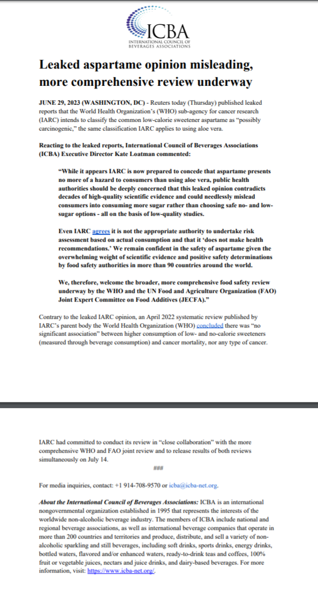

# 国际饮料协会：阿斯巴甜致癌结论有误导，更全面审查尚在进行

新京报讯（记者王子扬）6月29日，针对外媒报道的世界卫生组织的癌症研究分支机构（IARC）计划将甜味剂阿斯巴甜分类为
“可能致癌物”一事，国际饮料协会委员会（ICBA）在官网发文，其执行主任凯特·洛特曼表示，公共卫生主管当局应警惕这一观点，因为它与数十年来高质量的科学证据相矛盾，参考低质量的科学研究得出的结论可能误导广大消费者，期待对阿斯巴甜更广泛、更全面的食品安全审查。

_国际饮料协会委员会（ICBA）在其官网发布的文章。
官网截图_

据路透社援引消息人士的话说，世卫组织下属的国际癌症研究机构（IARC）将于7月首次把阿斯巴甜列为“可能对人类致癌的物质”。阿斯巴甜是世界上最常见的人工甜味剂之一，被广泛用于无糖汽水、玛氏Extra口香糖和一些Snapple饮料等产品中。

国际饮料协会对此发问称，甚至国际癌症研究机构自己也承认，该机构并不是根据阿斯巴甜的实际摄入量进行风险评估的合适权威机构，同时也“不提供健康建议”。鉴于压倒性的科学证据和全球90多个国家的食品安全部门早已得出的“阿斯巴甜是安全的”这一结论，“我们一如既往地确信，阿斯巴甜是安全的。”欢迎由世界卫生组织和联合国粮农组织（FAO）的联合食品添加剂专家委员会（JECFA）正在进行的对阿斯巴甜更广泛、更全面的食品安全审查。

2022年4月由国际癌症研究机构的上级机构世界卫生组织（WHO）发布的一项系统回顾得出的结论称，低热量和无热量甜味剂（通过饮料消费量计算）的高摄入与癌症死亡率或任何类型的癌症之间“没有显著关联”。

国际癌症研究机构已经承诺在评估中与世界卫生组织和联合国粮农组织联合专家组（JECFA）的更全面评估工作进行
“密切合作”，并于7月14日同时发布两项审查的结果。

国际饮料协会是成立于1995年的国际非政府组织，代表全球无酒精饮料行业。ICBA的成员包括国家和地区的饮料协会，以及在200多个国家和地区经营、生产、分销和销售各种无酒精碳酸和非碳酸饮料的国际饮料公司。

科信食品与健康信息交流中心主任钟凯也表示，关于阿斯巴甜是否安全（包括致癌性），40年来已经有上百项高质量研究可以证明。美国、欧盟都多次评估过，没有问题。“在正式发布结果前，还不清楚IARC是依据什么样的研究证据和论证逻辑下的结论，但可以预知的是，充其量是找到了某种‘相关性’而非因果关系。相关性方面，有没有假相关、有没有因果倒置、有没有排除混杂因素等。以我的判断，IARC捕风捉影刷存在感的可能性较大。”

编辑 祝凤岚

