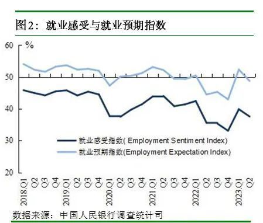

# 央行城镇储户问卷调查：收入感受指数为49.7%，比上季下降1.0个百分点

6月29日，央行发布2023年第二季度城镇储户问卷调查报告。2023年第二季度，中国人民银行在全国50个城市进行了2万户城镇储户问卷调查，结果显示：

**一、收入感受指数**

本季收入感受指数为49.7%，比上季下降1.0个百分点。其中，14.4%的居民认为收入“增加”，比上季减少1.4个百分点，70.5%的居民认为收入“基本不变”，比上季增加0.8个百分点，15.1%的居民认为收入“减少”，比上季增加0.6个百分点。收入信心指数为48.5%，比上季下降1.4个百分点。

**二、就业感受指数**

本季就业感受指数为37.6%，比上季下降2.3个百分点。其中，11.9%的居民认为“形势较好，就业容易”，44.5%的居民认为“一般”，43.7%的居民认为“形势严峻，就业难”或“看不准”。就业预期指数为48.7%，比上季下降3.6个百分点。

**三、物价和房价预期**

对下季度，物价预期指数为57.7%，比上季下降0.9个百分点。其中，23.1%的居民预期下季物价将“上升”，54.8%的居民预期“基本不变”，9.7%的居民预期“下降”，12.4%的居民“看不准”。

对下季房价，15.9%的居民预期“上涨”，54.2%的居民预期“基本不变”，16.5%的居民预期“下降”，13.4%的居民“看不准”。

四、消费、储蓄和投资意愿

倾向于“更多消费”的居民占24.5%，比上季增加1.2个百分点；倾向于“更多储蓄”的居民占58.0%，比上季增加0.1个百分点；倾向于“更多投资”的居民占17.5%，比上季减少1.3个百分点。居民偏爱的前三位投资方式依次为：“银行、证券、保险公司理财产品”“基金信托产品”和“股票”，选择这三种投资方式的居民占比分别为43.8%、20.4%和15.2%。

问及未来三个月准备增加支出的项目时，居民选择比例由高到低排序为：教育（27.1%）、医疗保健(26.6%)、旅游（26.0%）、社交文化和娱乐(19.8%)、大额商品(17.7%)、购房(16.2%)和保险(13.0%)。

