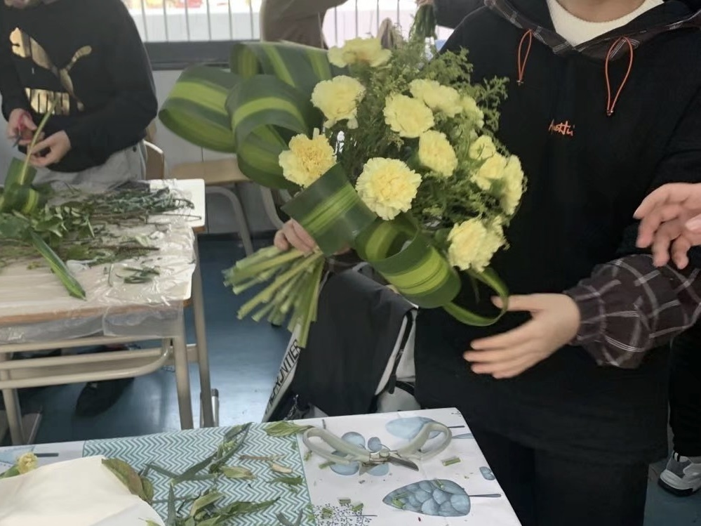
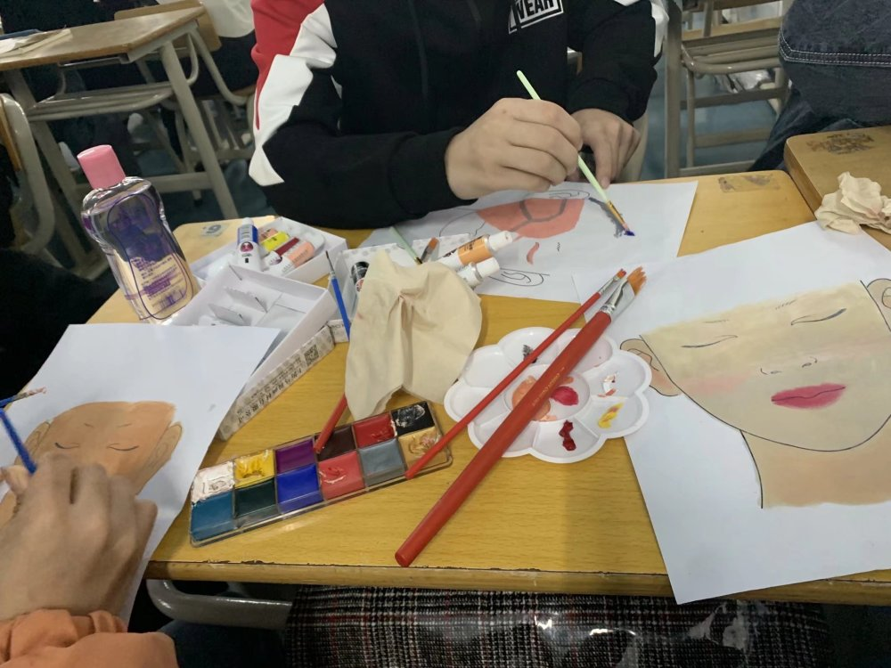
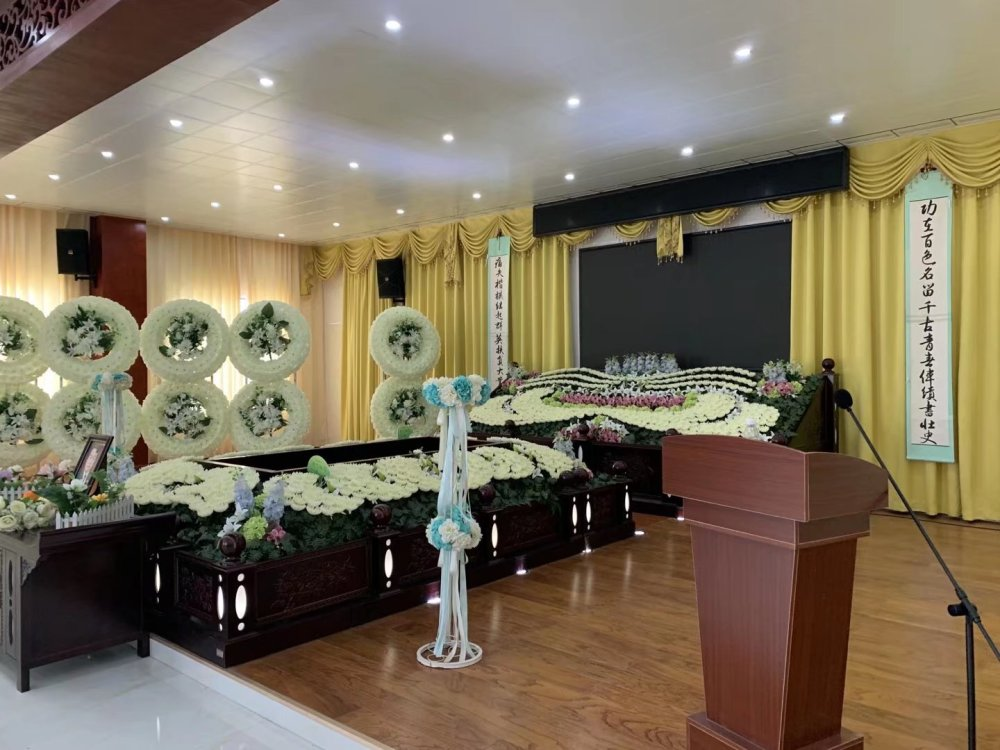
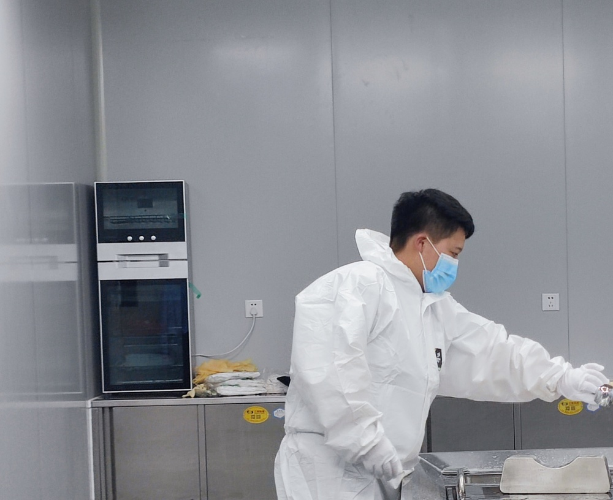
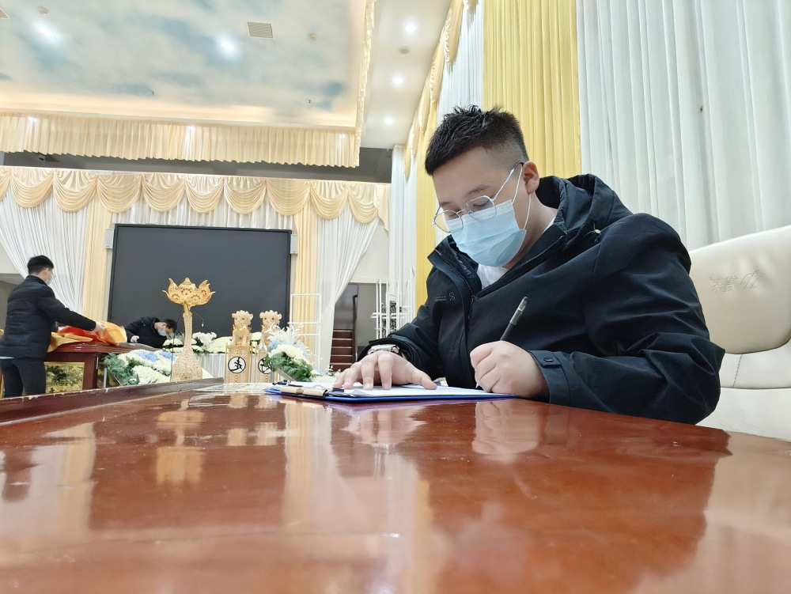

# 就业率基本百分百，殡葬专业摆脱冷门标签，已有本科层次的教育

今年6月毕业的曹安，4个月前就完成了实习转正，早早定下了工作去向：江西的一家殡仪馆。

曹安是长沙民政职业技术学院现代殡葬技术与管理专业的毕业生。该专业是三年学制，专业课程多集中在前两年，包括殡葬礼仪主持、插花技术、书法创作、挽联写作、火化机技术、现代遗体整容技术，等等。

6月25日，重庆城市管理职业学院的一位教师称“殡葬专业的就业率基本上能够达到100%”，让冷门的殡葬专业上了热搜，引起关注。曹安告诉新京报记者，在这个毕业季，除了专升本的几个同学，他们班里的40多位学生，基本上都找到了工作。

公开资料显示，目前全国只有8所高/中职院校开设殡葬类专业。教育部去年公布的2022年职业教育本科专业目录增补清单中，“现代殡葬管理”专业位列其中，这意味着我国现代殡葬教育有了本科层次的职业教育。

良好的就业前景，让有些学校殡葬专业的报名人数逐年递增，在有些省份甚至超过了本科录取分数线。“殡葬专业在一定程度上已经摆脱了冷门专业的标签”，北京社会管理职业学院生命文化学院院长何振锋告诉新京报记者，越来越多的人开始认识到殡葬行业对于社会的重要性，以及从业人员所承担的责任和使命，同时也开始思考生命、关注死亡教育。

_曹安和同学们在练习插花。受访者供图_

**选择**

魏寻至今记得2022年夏天在江苏一家殡仪馆实习时，带教老师为逝者做遗体缝合和遗容的情形。

这是一位车祸中的逝者，头骨破碎，脸部也变了形。

修复前，带教老师需要先取出破裂的头骨以免影响修复效果，随后用毛巾、棉花等填充物对头部进行填充，等面部逐渐饱满起来后再进行缝合。

逝者最大的伤口在眉骨处，遗体的皮肤已经失去弹性，缝合时还要考虑到缝合针法，在顾及好看的同时还要结实，避免移动时伤口崩开。

缝合完成后，调制符合逝者性别、年龄的粉底膏，一点点细致地遮盖伤口。伤口不再明显，面部的轮廓逐渐成形。

这不仅要了解人体的构造，还要懂解剖学、病理学，熟悉化学药剂，掌握缝合技巧。魏寻暗暗感叹带教老师高超的技术，希望自己有朝一日也像老师一样。

魏寻现在是长沙民政职业技术学院现代殡葬技术与管理专业的大二学生，她是怀抱着兴趣报考殡葬专业的。她曾经的梦想是成为一名法医，但由于偏科只能作罢。高中上网浏览信息时偶然刷到殡葬专业，整个高三，她再没考虑过其他专业。

2020年高考时，曹安的分数刚过本科线。如果读本科，也只能选择就业前景不明朗或者学费更高的专业。最终，她放弃了本科，选择了高职的殡葬专业。

回想当初的选择，曹安说，毕业后好就业也是当时考虑的一个重要因素。

今年大二的何岩选择殡葬专业，则是熟人推荐后深思熟虑的结果。何岩父母的朋友是北京社会管理学院的在职教师，何岩当年高考后，他们向何岩推荐了该校的殡葬专业。“报名人数少，岗位饱和度低”、“毕业后工作单位相对固定”，何岩充分考量过这个专业的就业前景，简言之，不愁找不到工作。何岩上学后发现，周围也有不少同学，因为家中长辈是同行而选择了殡葬专业。

不同于高考出分后选择专业，1998年出生的云南女孩茶泉灵权衡考虑了自己的成绩，早早做好了规划，决定参加高考前的高职单招，并选择了自己感兴趣的殡葬专业。

_曹安在上遗体化妆课程，用油彩调配符合性别和年龄的肤色。受访者供图_

**“冷门”与偏见**

相较于其他专业，殡葬专业的发展相对较晚。公开资料显示，我国殡葬教育发轫于20世纪90年代。而“殡葬专业”是一个统称，有些学校会把专业细分，具体可细分为殡仪服务、殡仪设备、防腐整容、陵园管理等。

茶泉灵、魏寻等人就读的长沙民政职业技术学院，创办于1995年，是我国第一个开设现代殡葬技术与管理专业的院校。随后，重庆、武汉、安徽等7省份的民政学校开设了殡葬专业。

“现代殡葬专业教育体制发展三十年来，目前全国只有8所高/中职院校开设殡葬类专业，毕业生每年总计不足千人，殡葬服务行业的人才缺口将越来越大。”中国殡葬协会副会长、上海市民政局原巡视员周静波曾在接受采访时提到。

在曹安、魏寻看来，作为一个和“死亡”挂钩的行业，偏见和歧视也是客观存在的。

曹安说，她经常看到，其他学院的学生路过他们学院门前时，都会跑快点。暑假在殡仪馆实习，下雨天需要打车，出租车司机会拒载，网约车司机也会打电话来要求取消订单，即便这样会被平台处罚。曹安坦言，这可能跟当地的风俗习惯有关，比如她曾在江西一家殡仪馆实习，当地的人们并不忌讳，打车时，司机都会接单，常常还会直接把她送进殡仪馆内。

魏寻也提到，有人一听“殡葬”就觉得正经人不可能选这种专业。而何岩当初选择殡葬专业时，家人也很反对，“大众对殡葬行业的职业偏见很大，他们觉得白事不吉利。”

茶泉灵当初选择这个专业，家人也提出了疑问。而当年茶泉灵家乡所在的市区，只有她一人报考了这个专业，“没人跟我抢。”

入行初期的年轻人，除了要对抗来自外界的歧视，还要跨越自己内心的障碍。不管在学校中如何学习理论知识，大多数殡葬专业的学生都是在实习中才真正接触到逝者。

2017年，刚学习了半年现代殡葬与管理专业的茶泉灵，到广西梧州开始第一次实习。

茶泉灵记得，第一次接运遗体时，在灯光昏暗的老旧地下车库里面，只有太平间亮着灯。由于在太平间停放了好几天，遗体从冰柜里拉出来的瞬间就结了一层霜。

茶泉灵的橡胶手套刚碰到遗体，就直接粘在了上面。尽管师傅告诉她，这是正常现象，但恐惧还是爬上了她的心头。

如今，茶泉灵已经有了5年的殡葬行业工作经验，先后在防腐整容、入殓师、司仪主持、礼宾接待等岗位上工作过，至今已经为将近四万人举办过告别仪式。

最开始接触殡葬专业时，何岩颇感兴奋。而到了大二下学期参加实习时，她却萌生了转行的念头。

实习期间，何岩的宿舍在殡仪馆的二楼，楼下就是接运遗体的地方，她常常能听见楼下传来家属的哭声。何岩承认，“工作难度并不大，但很考验心理素质。”

魏寻坦言，殡葬专业门槛不高，但除了成绩的门槛，还有自己内心的门槛，要真正确定自己是想做的，确定自己没有害怕恐惧这些情绪，面对逝者要尊敬、平和。魏寻班上有同学入学后转入其他专业，有人是发现自己不适合这个专业，有人是过不了心里那道关。

_长沙民政职业技术学院防腐研究所内的模拟灵堂，曹安等学生日常在此学习殡葬礼仪主持。受访者供图_

**40多名学生几乎“百分百就业”**

6月25日，重庆城市管理职业学院的一位教师称“殡葬专业的就业率基本上能够达到100%”，让殡葬专业引起关注。

长沙民政职业技术学院招生办主任谢海波此前接受采访表示，殡葬行业人才需求量大，仅殡仪馆这一块，每年的人才缺口在1万人左右，而全国现有的8所开办殡葬类专业的中、高职院校，殡葬专业毕业生每年总计不足千人。

茶泉灵说，她所在的殡仪馆有八十多名工作人员，只有她一人是殡葬专业科班毕业。

2020年，曹安曾为了寻找实习岗位参加2018届毕业生招聘会，她发现，竟然有200多家殡葬行业的企业来学校招聘，“不是单位挑人，而是学生们眼花缭乱地挑单位。”那一年，长沙民政职业技术学院殡葬专业的毕业生只有300多人。

2022年12月，已经读大三的曹安需要参加为期半年的顶岗实习。受疫情影响，当时只有十余家企业来到学校招聘，更多的企业选择线上招聘。曹安选择了江西的一家礼仪公司，今年2月，还未毕业的她就已经转正，被派到一家殡仪馆上班。

曹安所在学校的现代殡葬技术与管理专业下设三个方向班级，分别为服务班、设备班以及防腐班。在今年的毕业季，她所在的防腐班，40多位同学中，除了专升本的几个同学，其他同学几乎都找到了工作。“只要愿意干、肯干，就业肯定没问题。”

但曹安也感觉到，殡葬专业学生的需求今年也有所减少。今年6月，来学校招聘的企业只有100多家。

尽管如此，殡葬专业还是比其他专业更好就业。曹安所在的民政与社会工作学院，今年共有2000多名毕业名，其中现代殡葬技术与管理和陵园服务与管理专业7个班级一共300多人，她发现，对于学院其他专业的毕业生，今年只有20多个单位来招聘。“对于大专学历，殡葬专业已经很不错了。”曹安感叹。

何振锋提到，近年来生命文化学院就业去向率在90%以上，大部分殡葬专业毕业生成功就业于殡葬服务机构，如殡仪馆、公墓、殡葬服务公司等。

根据《2021年民政事业发展统计公报》，自2017年至今，我国的火化遗体数、火化率逐年上升。截至2021年底，全国共有殡葬服务机构4373个，其中殡仪馆1774个，殡葬管理机构815个，民政部门管理的公墓1673个。前瞻产业研究院发布的《中国殡葬服务行业市场调研与投资预测分析报告》显示，2020年，我国殡葬服务行业的市场规模为2638亿元，预计到2026年，我国殡葬行业市场规模将达到4114亿元。

_茶泉灵在为一位逝者入殓，入殓前需要为逝者清洗、更衣、化妆并做好保护处理。受访者供图_

**“就是一份普通工作”**

茶泉灵发现，很多人对殡葬行业有着太多的误解，比如工作清闲、高薪、不用和人打交道。

为了分享自己的工作，也为了改变对殡葬行业的偏见，茶泉灵在社交平台上开设了账号，记录自己的工作日常，也吸引了一些关注殡葬专业的年轻人。

常常会有人向茶泉灵咨询殡葬专业的相关情况。她首先会问对方为什么想学“殡葬”，如果对方对这个专业经过了了解，并且觉得这个专业很有意义，茶泉灵会告诉对方一些报考的注意事项。如果对方只是为了更好就业，茶泉灵就会劝对方再认真考虑一下。

茶泉灵说，事实上，殡葬行业非常辛苦，工作强度大、工作时间也很随机。尽管平时是上48小时休48小时，但有时家属要求凌晨出殡，就有可能需要连轴转。茶泉灵有时正在洗澡满身泡泡，接到电话也要立刻出发去接运遗体。

茶泉灵目前的月薪为6000元到8000元，在当地属于中等偏上的水平。她提到，“这就是一份普通工作，并没有大家想得那么高尚。只是别人需要我们的那个时刻，对于别人而言是特殊的，因此被认为是特殊的工作。”

对“殡葬是一个暴利行业”的说法，何岩认为这是对殡葬行业最大的误解。何岩的专业是陵园服务与管理，她了解过专业对口工作的薪资水平，“北京市的墓地销售工作底薪在4000元左右。如果是去殡仪馆或陵园从事殡葬服务工作，薪资多则七八千，少则四五千。”

曹安提到，今年招聘的工资水平也出现了一定程度的下降。在她看来，这是因为其他学校也相继开设了殡葬专业，殡葬专业毕业生人数不断增多；同时，大城市的殡仪馆和陵园员工也逐渐饱和。在曹安的同学中，只有大约10%的毕业生能够去到大城市殡仪馆，或者待遇高的服务公司、陵园工作，工资才能过万。大多数毕业生去往小县城殡仪馆和殡葬服务公司工作，包吃住，工资待遇方面根据城市大小和单位性质的不同，普遍在4000元到7000元不等。

至于“社恐福音”，茶泉灵和魏寻都表示这也是一种误解，一个真正的殡葬工作者，有许多需要和逝者家属“打交道”的过程，要能做到“让两个世界的人都满意”。

安徽城市职业管理学院院长刘瑾曾在接受采访时表示，“现在的孩子观念和以前不一样了，虽然不排除有人奔着所谓高收入盲目选择，但大多数学生对专业和职业认同感较高。”

“办葬礼，可能是这一家人这辈子最大的事儿了”，曹安觉得，整个仪式中出现一点错误都很严重。她在工作中一直小心谨慎，随时关注家属的情绪。比如在确认完逝者身份后，避免再使用逝者的称呼，改为“咱们父亲/母亲/亲人”等。

在实际的工作中，茶泉灵逐渐感受到，这份工作所赋予的独特意义感和价值感，并不断将其确立为自己终身的工作。“我的工作在温暖我，也在治愈着我，然后我也想去温暖更多的人，去治愈更多的人。”

今年清明节期间，茶泉灵为一位年轻的四川男孩举办了告别仪式。在跟男孩家人的交谈中得知，他们族人的传统是生于自然，归于自然，不留骨灰。尽管家人悲痛欲绝，但却无法将其骨灰带回老家。

茶泉灵主动跟男孩的姐姐说，她可以帮忙把骨灰埋在殡仪馆隔壁的公墓。对方听到后感激不尽，还给她发了红包，但茶泉灵并没有收。她觉得，这么做就是“图个心安”。

实习时，魏寻曾遇见一对父子坐在遗体冷冻室前面，冬日的夜晚格外寒冷，她上前一问才知道，是孩子的妈妈意外离世，他们想陪她一会儿。所有的安慰在此刻都很无力，魏寻只能给他们拿了坐垫，让他们别冻着。

再回忆起这件事，魏寻很庆幸自己选择了这个当初很喜欢的专业，而现在更想要把它当成一辈子来做的工作，因为他们送走的人，是别人的亲人，也是别人最牵挂的人。

在《殡葬服务学》中，长沙民政职业技术学院殡仪系教授王夫子将殡葬服务业定性为“一门特殊的服务行业”，其特殊性在于，“所有的服务行业都是直接为生者服务的，唯独殡葬服务业的直接服务对象是死者（往生者），它的间接服务对象才是生者。但由于殡葬服务归根结底是满足生者的心理需求，因而殡葬服务的更重要的对象仍然是生者。”

茶泉灵在与逝者家属沟通告别仪式等细节。受访者供图

**报考趋热**

良好的就业前景，也让殡葬专业逐渐“变热”。在何振锋看来，殡葬专业在一定程度上已经摆脱了冷门专业的标签。

何岩同届有四个班级，160多名学生。她听说往年想转到殡葬专业的学生只有零星的三四个，今年却有三四十个，其中有很多来自婚庆专业。

“真正能转进来的却是极少数”，何岩了解到，要转到殡葬专业，也需要满足一定的条件，不仅专业成绩要达到一定的标准，还需要面试，说明自己转专业的原因。

另外，何岩了解到，学校的殡葬专业有三分之二左右的学生是通过单招的方式录取的。学校举行的线下招生宣传会，单独为殡葬专业开设了一个招生场地，咨询殡葬专业的人数远远多于其他专业。

据新华网报道，早在2009年，长沙民政职业技术学院的殡葬专业，考生报录比就已达到5：1。长沙民政职业技术学院民政与社会工作学院副院长沈宏格曾在接受采访时提到，从录取分数上看，殡葬专业在湖南省内的录取分数线一般高于本科线十多分。

据何振锋介绍，2020-2022年，北京社会管理职业学院殡葬专业报名人数呈现逐年递增的状态，无论是从招生数量还是生源质量来看，都在逐年向好，每年的报名及录取人数基本维持在125人左右。招生办公室反馈，每年招生过程中，考生咨询最多的，也是殡葬相关专业。

何振锋认为，越来越多的人开始认识到殡葬行业对于社会的重要性，以及从业人员所承担的责任和使命，同时也开始思考生命、关注死亡教育。据不完全统计，目前包括北京大学、山东大学、广州大学等在内的多所中国高校开设了死亡教育相关课程，引导学生正视死亡、敬畏生命，也说明了公众对这一领域的兴趣和认可程度的提升。

而据中国青年报报道，2022年11月，教育部发布《关于做好2023年职业教育拟招生专业设置管理工作的通知》，公布了2022年职业教育本科专业目录增补清单，“现代殡葬管理”专业位列其中，隶属公共管理与服务大类、高职本科专业层次，学生毕业后将被授予管理学学士学位。

这意味着我国现代殡葬教育创办近30年来，终于有了本科层次的职业教育，实现了“中高本贯通”人才培养，一举改变殡葬专业本科层次职业教育缺失的历史。何振锋提到，这意味着教育部对殡葬行业的重视与认可，学生将接受系统的殡葬教育和培训，培养在殡葬服务、管理和创新方面的能力，以及推动殡葬行业向现代化、专业化的方向迈进。

除了“现代殡葬技术与管理”，当年在报考时，茶泉灵的另一个选项是“烟草栽培与加工技术专业”。今年，茶泉灵的妹妹也参加高考，她也为妹妹提供了一个“冷门”的选项——野生动物保护与利用专业。

在她看来，与其看重本科学历，不如选择一个注重技能的高职专业，“挑个冷门专业”。比如2017年，中国湖北省潜江市成立了一所“小龙虾学院”，专门培训小龙虾产业相关人才。同年，南京传媒学院率先将电子竞技专业引入全日制本科的学习中。2018年，青岛农业大学申请成立了我国第一个马业科学本科专业等。

而对于高考之后的专业选择，何振锋表示，这应该是一个综合考虑的结果，要考虑到个人兴趣、职业前景、个人能力和价值观等多个因素，权衡利弊，做出最适合自己的选择。

（魏寻、曹安、何岩为化名）

新京报记者 李聪 编辑 袁国礼 校对 吴兴发

