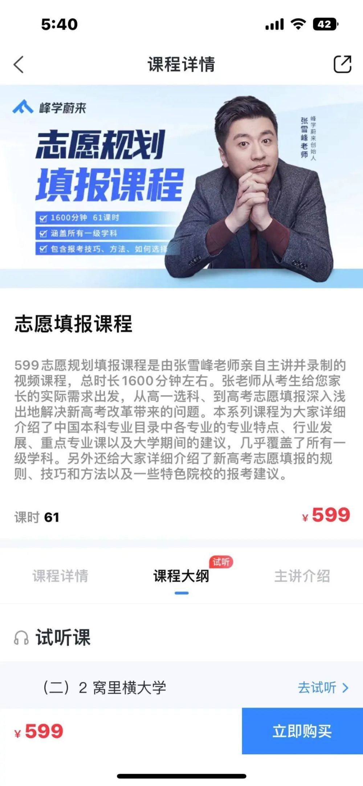
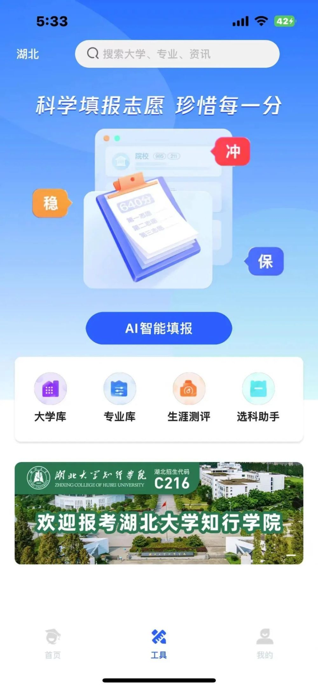

# 张雪峰带火志愿填报生意：最高收费15999元，是割韭菜吗？

文/YY

对于中国孩子来说，高考是一生中最重要的事之一。

除了考场上的发挥，考场下的志愿填报也成为了“金榜题名”一环中的决定性环节。

作为与未来职业路径强相关的本科教育，志愿填报不仅“寄托着未来”同时也有大量的信息差。近日名师张雪峰的“新闻学科”相关言论在网络引发强烈反响，而其背后的志愿填报生意也再一次走到大众面前。

志愿填报是一门好生意吗？

“张雪峰们”究竟是在打破信息差，还是割韭菜？

**张雪峰志愿填报服务8999，高了还是低了？**

名师张雪峰的商业版图中，志愿填报是关键业务。蓝鲸记者查询发现，张雪峰持股公司苏州峰学蔚来教育科技有限公司（以下简称为“峰学蔚来”）也已形成较为完整的团队服务，包含学业测评、专业定位测评、志愿填报等。

蓝鲸记者查询发现，目前峰学蔚来官网首页推荐产品为原价16888元，现价15999元的志愿填报课程。官网称，课程由张雪峰录制，内容包含高一选科指导及高考填报志愿，可根据家庭资源、家庭情况、学生个人兴趣和职业发展，为考生在城市，
学校，专业间找到平衡点。但该课程并未在峰学蔚来APP中显示。

据时代周报报道，峰学蔚来还曾上架过价格8999元的“峰学志愿梦想卡”。详情页面显示，该产品包含高考前的模拟志愿方案和结合高考分数最终形成的志愿方案。同时，该产品同时表明“为团队服务，并非张雪峰老师本人服务”。目前该产品显示为“已下架”状态。目前APP在售课程为599元的志愿填报课程。

蓝鲸记者查询多家同类志愿填报网站/APP发现，峰学蔚来不同服务价格差很大，但普遍高于同类服务。非1v1的其他同类服务价格普遍在300-1000元之间。

由此可见，争议声中的张雪峰已经将流量在该行业转化为了品牌溢价，也不失为一种成功的“流量的变现”。

**志愿填报的生意：AI填报成标配，售价300元起**

如果“志愿填报”也是一门专业，张雪峰老师是否会建议高考毕业生填报呢？

天眼查数据显示，在2013年前，国内志愿填报相关企业（全部状态）年度注册数量仅为个位数。近十年以来，我国相关企业的注册增速呈波动上涨态势。

事实上，在张雪峰之外志愿填报已经成长为一块不小的“蛋糕”。

艾媒咨询数据显示，2022年中国高考志愿填报市场付费规模为8.8亿元，预计2023年达9.5亿元。目前由于高考生缺乏获取高考填报信息的渠道，加上高考录取人数逐年递增，高考志愿报考行业付费需求增多，其市场规模将持续增长。

嗅觉敏锐的上市公司很早就开始了这一领域的布局。

美股上市公司好未来曾在2015年全资收购高考志愿填报服务平台“高考派”，并将旗下品牌“高考网”与“高考派”进行完全整合。2016年9月，A股上市公司立思辰公告以自有资金2.85亿元，收购百年英才(北京)教育科技有限公司100%股权。百年英才主要从事高考升学咨询业务，主要包括高考志愿填报服务、自主招生服务、综合素质评价等。

但无论是教育类上市公司还是专注志愿填报赛道的垂直公司，他们提供的服务大同小异。在AI风潮席卷全球的当下，志愿填报中AI元素的嵌入也成为了各家标配。

蓝鲸记者测评了超过10款当下热门志愿填报APP发现，各大APP均以“AI智能填报”为宣传重点：只要输入省份、学科和分数，APP就会秒速生成模拟志愿表，其中包含各种符合用户分数的院校、专业选项。这类服务通常售价在300-600元间。

一位高考生家长小徐告诉蓝鲸记者，“APP一定程度上可以省去自己在家翻书对比分数线和学科的时间，也不用再去各处查资料，很方便。但我其实觉得价格偏高，我买的这款600元，我的心理价位其实是300元左右。可这些APP和机构也算抓住了家长的心理吧，毕竟这是孩子一辈子的大事，300和600差别不大。”

除了价格外，用户对于“AI智能填报”最大的担忧在于准确度。小徐在使用AI填报时发现，APP给出的某建议与现实咨询存在一定出入，“APP上推荐的一个选项是西南大学，用APP的数据测算就是如果过艺术类的本二线就可以报他们学校，但是我打电话咨询的时候，学校招生办跟我说，他们学校必须要过艺术类的一本线才可以填报，我现在不确定是谁的错误，要么就是APP误人子弟，要么就是招生办误人子弟。”

同时不少购买过相关服务的网友也表示，APP推荐志愿往往过于保守，“它们为了稳，总是会推荐一些远低于分数水平的院校和专业，不太考虑实际情况。”

同为家长的小赵也有同款顾虑，在她看来AI再智能也不能为个体“量身打造”，“什么样的专业有前景，想去什么样的学校，其实AI都不能给出建议，它其实只是大数据分析下的一个大类筛选，还是要看自己的情况。但是就这个再细化的过程也是有很多门道的，我们普通家庭也不懂。”最终，小赵在购买APP服务之外还购买了当地机构的线下名师志愿填报辅导，价格为3000元。

**复杂的志愿填报与激烈的文凭竞争**

某种程度来看，志愿填报服务对于一些家庭而言是刚需。

近些年随着志愿填报规则的改革，不少省份的志愿填报数量越来越多，一位山东考生的家长告诉蓝鲸记者，按照山东高考政策，一张志愿表上需要填报96个志愿。该家长告诉蓝鲸记者：“报志愿太复杂了，我甚至觉得自己的本科学历都不够报这个志愿。”

复杂的志愿填报体系一面是为防止更多考生“滑档”留下遗憾，另一面也是后高考时代竞争日趋激烈的一种缩影。

正如《金榜题名之后——大学生出路分化之谜》中所写：当越来越多人持有大学文凭时，市场对教育水平的要求随即水涨船高，大学文凭作为一种用来交换职业地位的通货，其交换价值在市场上发生了萎缩。美国社会学家柯林斯(Randall
Collins)在《文凭社会》一书中将这一现象称为“文凭的通货膨胀”。英国社会学家布朗(Phillip
Brown)指出，随着同样的文凭持有人大量涌入就业市场，雇主再难以通过文凭来甄别求职者的就业能力，因而招聘要求开始被定得更高更精细。

这一结论照进现实就是大众对于热门城市高校与热门专业的追逐。

在如今激烈的就业竞争格局下，本科教育的就业导向日趋明显，兴趣不再是大众进行专业选择的主要影响因素，职业规划与专业选择的关系无比紧密。

从这个角度来看，志愿填报这门生意的内里其实是为未来十年甚至一生的方向“买单”。

