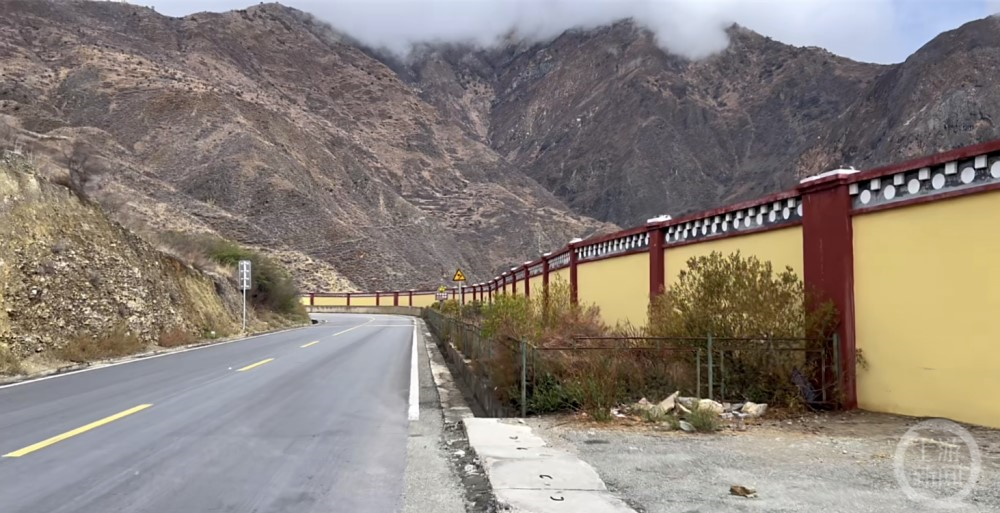
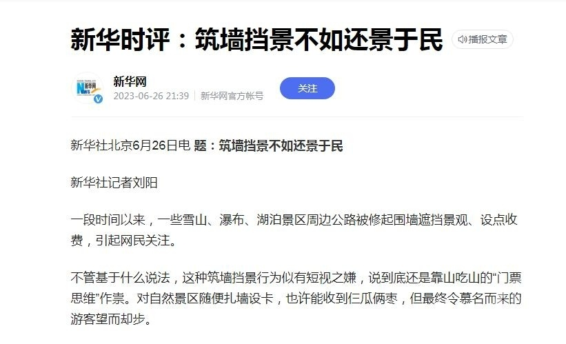

# 新华社发文狠批“筑墙挡景”，被曝光景区的“墙”还能挺多久

近日，新华社发表时评文章《筑墙挡景不如还景于民》称，近段时间以来，国内一些雪山、瀑布、湖泊景区周边公路被曝修起围墙遮挡景观、设点收费，引起网民关注。文章认为，这种“筑墙挡景”行为，说到底还是靠山吃山的门票思维作祟。发展旅游业，要算眼前账，更要算长远账，应“以人为本、还景于民”。

这条时评引发网友广泛关注，不少旅游者纷纷留言吐槽类似被坑经历，呼吁监管部门加大纠偏力度，早日解决“筑墙挡景”这类坑民的旅游乱象。

公开报道显示，从今年五一以来，包括陕西山西交界的黄河壶口瀑布、云南梅里雪山等景区，纷纷曝出“筑墙挡景”遭旅游者投诉的新闻。众多景区“筑墙挡景”背后的深层次原因是什么？面对舆论指责，相关景区是否已启动整改措施？对于既堵人心又堵客流的“挡景墙”，有无拆除的时间表？地方政府如何有效破除“筑墙挡景”这一旅游乱象？上游新闻根据公开报道进行了梳理。

**吐槽：多个景区“筑墙挡景”被曝光**

**梅里雪山国道旁建围墙，要看全貌请买票**

近日，一则关于云南省迪庆州德钦县梅里雪山国家公园附近214国道旁修建围墙的新闻，引起广泛争议。

_▲214国道旁的围墙。图片来源/网络视频截图_

公开报道显示，这些围墙挡住了游客原本在公路边就能欣赏到梅里雪山全貌的机会，游客只能付费买票才能进入景区修建的观景平台赏景。

“过去远远就可以看到梅里雪山，现在一眼望去只有一堵堵围墙，大煞风景。”刚从云南旅游回来的张泽说，围墙很长，正常情况下绝对看不到围墙内的风光。

更让张泽感叹的是，如果游客想要借助无人机一睹雪山真容，抬眼就会看到一块警示牌，上面写着“此区域禁止放飞无人机”。可以说，为了防止游客“偷窥”，景区建立起了一道全方位无死角的“立体封锁线”。

张泽说，在川藏各地随处可见的雪山风光，不明白为何到了这里就被围起来，不让看。

**黄河壶口瀑布壮观景色，被围墙遮得严严实实**

今年五一假期，黄河壶口瀑布沿途公路被有关方面砌墙围挡的新闻，曾引发过舆论关注与批评。

壶口瀑布景区，为山西、陕西两省共有景区。因景区面积庞大，无论身处陕西还是山西，只要沿着毗邻壶口主景区的路段通行，都能观赏到壶口瀑布的壮观景色。但据多名旅游者反映：不管是壶口瀑布山西侧，还是陕西侧的道路，如今都被围墙隔挡得严严实实。不少网友调侃：“黄河是我们的母亲河，进家门看望母亲，难道还需要先买张门票？”

_▲黄河壶口瀑布沿途公路有砌墙围挡，完全看不见黄河的壮丽景色。图片来源/网络_

陕西延安市宜川县文旅局工作人员称，修建围墙初衷是为保证游客安全。宜川县黄河壶口瀑布景区管理局回应，该段公路此前屡次发生落石砸中逗留车辆，2011年修建挡墙，2019年加长加高，之后再未发生安全问题。山西省临汾市文旅局回应，壶口瀑布景区正在内部扩建，出于安全考虑，在部分路段外围修建了围墙，并非为防止游客偷窥景色。

对于两地官方“出于安全考虑”的说法，网友们似乎并不买账，纷纷提出质疑：“弄个矮矮的防撞墩就可以解决的问题，为何偏偏弄一堵高墙？”还有报道特别提到，景区范围外的落石路段对侧，并未修建挡墙。

**青海湖环湖360公里，全用铁丝网围起来**

随着部分景区“筑墙挡景”被曝光，青海湖环湖360公里围上铁丝网的事情，也引起公众关注。有游客表示，此前任何一条路都能通到湖边，但现在只保留了二郎剑景区和仙女湖景区两条路。

_▲网友吐槽“青海湖加围栏”。图片来源/红星新闻_

“除了官方景区，没有一条路能够走到青海湖水边。”“围栏后路离湖太远，没有了曾经可以进去的小门，自驾停车远眺也没戏了。”这些视频被发到社交平台后，各种纳闷不解的声音，不一而足。

青海湖相关工作人员回应媒体称，青海湖周边围栏已经存在多年，之前部分牧民为招揽游客私自打开通道，游客车辆容易碾压草场造成生态破坏。这类旅游乱象曝光后，2022年当地政府开始了整治工作。

有观点认为，青海湖加围栏显然也不是一劳永逸的好办法。有网友质疑，超长超高的围栏一是维护成本过高，二来上面铁丝也有可能对野生动物造成伤害。

**回应：有的立即整改有的含糊其辞**

据新华社6月27日消息，近期，有网民反映云南梅里雪山飞来寺景点、金沙江大湾景点在国道旁修建围墙，游客无法在公路上欣赏景观的情况，梅里雪山景区运营企业6月26日表示，诚恳抓好整改工作，对两个景点实行免费开放。6月27日，梅里雪山国家公园景区人员告诉潇湘晨报记者，不清楚相关景点具体免费到什么时候。至于围墙何时拆除，目前没有接到相关的工作通知。

针对黄河壶口瀑布景区“筑墙挡景”一事，5月1日，延安市文旅局向媒体表示，已经就围挡问题向当地文旅局、陕旅集团等方面提出整改意见。宜川县黄河壶口风景名胜区管理局表示，针对网友反映的问题，将进一步加强安全管理，不断提升旅游服务品质，恳请广大游客朋友们继续监督和支持工作。

6月14日，针对网上“围湖传言”和网友质疑，青海湖景区保护利用管理局工作人员称，游客直接开车进入核心景区，车辆碾压草场后，恢复过程比较漫长。“湖边整个生态环境是比较脆弱的，所以要重点保护它。”当地近期做了大量工作，对景区景点功能、设施进行升级，“还专门划定了亲水区域，游客购票后可以在几个景点进行清水活动。”据了解，青海湖周边之前开放的有二郎剑、鸟岛、沙岛和仙女湾4个景区，门票均为90元。游客购票后就可以进入核心景区亲水、观鸟打卡。

**探因：“筑墙挡景”背后是门票思维作祟**

新华社时评认为，“不管基于什么说法（原因），这种‘筑墙挡景’行为似有短视之嫌，说到底还是靠山吃山的门票思维作祟。”

_▲新华社发表时评文章，批评“筑墙挡景”。图片来源/网页截图_

曾在某市旅游局担任领导职务的刘长（化名）说，从企业角度看，企业要生存要发展，肯定会想方设法创收，门票是其中很重要的一项收益，各地“筑墙”行为自然难以杜绝。“虽然各地都在讨论减少对门票经济的依赖。但实际上，对于一些欠发达地区，门票的确会对当地旅游收益产生影响。”他提到，某些景区虽然没有建围栏，却不是因为不想建，而是没必要，因为大部分景点只有进景区才能看到。

“如果你在景区外就能看到好风光，你会选择买票吗？”在刘长看来，一些旅游收益模式比较单一的地方，这种门票损失是当地无法忍受的亏损。

世界旅游城市联合会特聘专家王笑宇表示，表面看“筑墙挡景”，是行政配置资源的滞后思维模式，以及短视的资源变现的投机行为，而底层逻辑则是景区开发及运营主体创新意识不足、创新能力匮乏，缺少市场配置资源的专业能力。他说，我国经济发展对文旅市场提出了新要求，即观光旅游品质化，休闲度假旅游主题化、体验化、多元化。传统景区因为意识不足、能力缺失，行政配置资源逻辑依旧，就造成了产品单一、体验缺失，又强化短期资源变现，就出现了这些违背市场的行为。

至于各地景区外修筑的围墙、围挡等最终能否拆除，刘长直言“难说”。他认为，一些地方由于景区经营权和自主权已经被一并转让，兼之背后成因复杂，很难“一拆了事”。

**出路：破除门票经济，树立大旅游观大风景观**

南开大学旅游与服务学院副教授于海波表示，当代游客的旅游需求重点之一是情绪和情感消费，“景区高墙遮挡的是风景，隔开的是人心”。于海波认为，口碑是区域旅游发展的生命线。高墙极大破坏周边大地景观完整性，需要整改。更重要的是对此类事件要防微杜渐，建议景区开发在审批阶段就要进行景区建设风貌与大尺度环境景观协调性的评审论证，同时对途经游客大地景观观光权的相应保障也要进行评审论证。

于海波说，自然资源依托的景区门票经济日渐式微，探寻景区门票经济的补偿、替代、升级方案，势在必行。

新华社时评也指出，发展旅游业，要算眼前账，更要算长远账。杭州西湖、桂林象鼻山等景点免费开放所带来的旅游产业化效益，远远超过当初门票收入。旅游业是综合性产业，发展要义在于聚人气。那些坐拥得天独厚自然风光的地方，理应树立大旅游观、大风景观，以人为本、还景于民，将旅游产业链条做大，依靠完善的配套设施、丰富的产品供给、优质的服务吸引并留住游客，还湖于民，还景于民。

上游新闻综合新华社、春城晚报、红星新闻、潇湘晨报、中国新闻周刊、封面新闻等

编辑：朱亮

责编：王蓉 官毅

审核：冯飞

