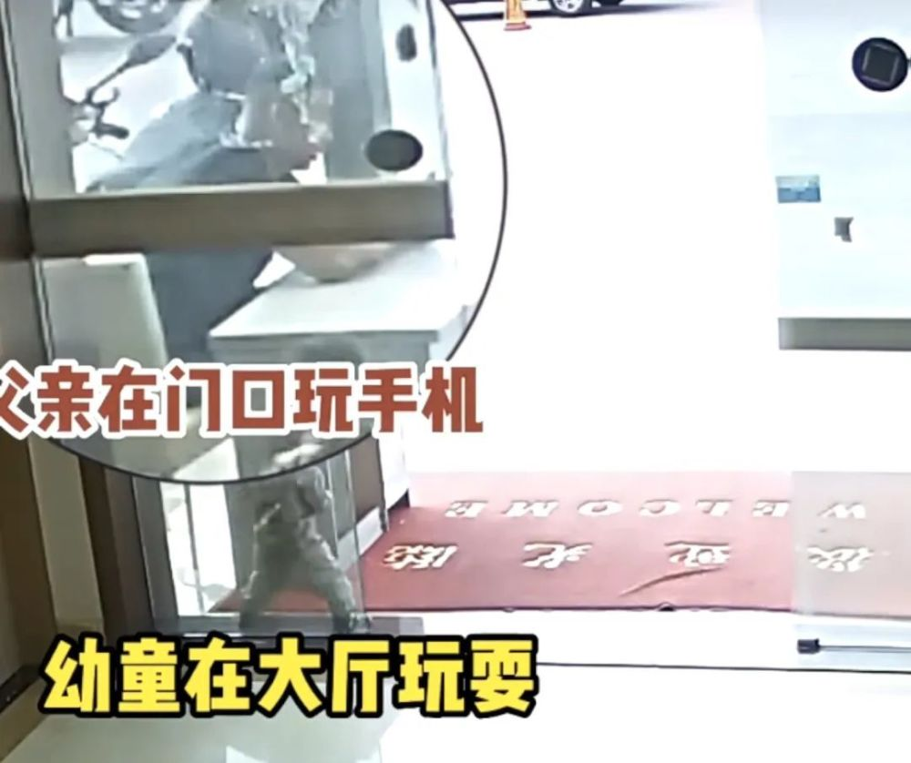
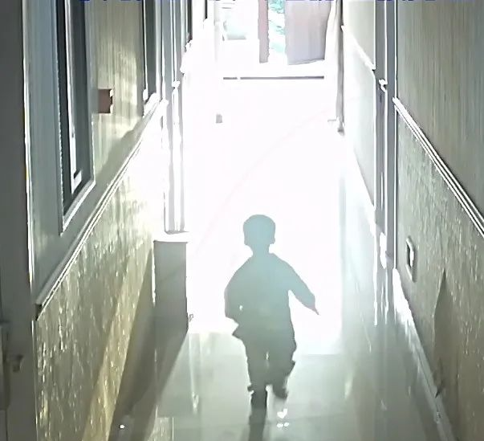

# 索赔145万！父亲低头玩手机2岁男童误入电梯坠亡，监控细节披露

近日，上海一名母亲向法院起诉宝山区某公寓的管理方， **提出索赔145万余元的要求，** 究竟是怎么一回事呢？

2022年9月21日，下午五点左右， **28个月的幼童从宝山区一公寓楼的四楼外消防楼梯坠落，之后不幸离世......**

据了解，幼童的父亲在公寓底层的商铺工作，事发当时带着孩子在公寓大厅玩耍。男孩父亲低头玩手机，没发现孩子被放学的小姐姐吸引，跟着她们走到电梯口。

小姐姐进入电梯后，幼童反复玩电梯按钮，导致电梯门三次打开。小姐姐以为电梯故障，于是走出电梯。而好奇好动的幼童则进入电梯，此时电梯内4楼的按钮已经被按下。

独自上到4楼的幼童发现到了陌生地方，开始大哭，四处奔跑。最后顺着过道向光亮处跑入4楼天台，不幸坠落。

几分钟后，幼童父亲开车将孩子送入医院，抢救后，在医生的建议下回家保守治疗，最终在家乡去世。

2023年，幼童母亲将公寓管理者告上法庭， **要求赔偿145万余元。案件已经开庭，法院将择期宣判。**

来源：案件聚焦（记者 陈敏佳）

编辑：许露露

