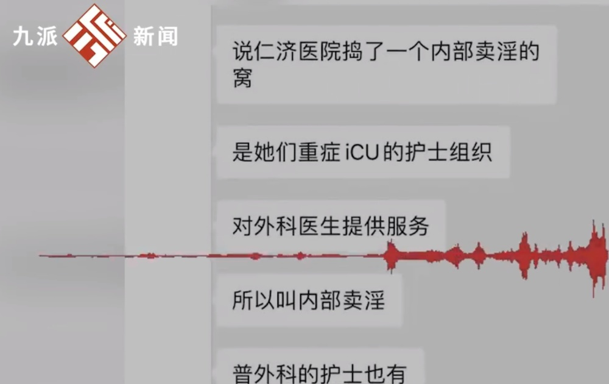
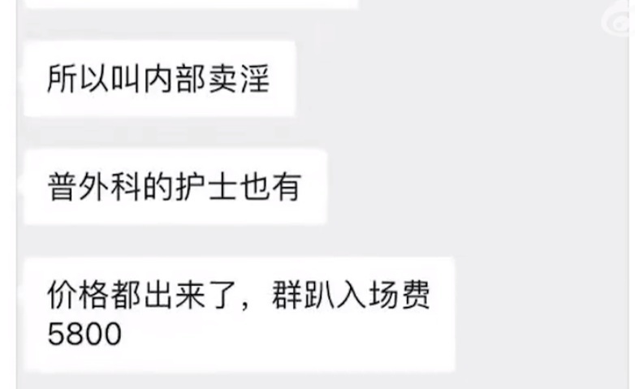

# 网传上海仁济医院医生参与嫖娼、护士组织卖淫，医院回应：不实已报警

据九派新闻视频报道，近日，网传上海交通大学医学院附属仁济医院一名外科医生参与嫖娼、护士组织卖淫活动。29日，该医院宣传部一名工作人员称：网传不实，后续医院会发布通报。

网传聊天记录显示，“仁济医院捣了一个内部卖淫窝”“重症ICU护士组织，对外科医生提供服务，普外科护士也有”“入场费5800”。

对此，该医院宣传部一名工作人员称，网传不实，后续医院会发布通报。

据澎湃新闻报道，目前，医院已向属地派出所报警，网络不实言论已严重影响到仁济医院医护人员身心健康及医院形象。医院坚决抵制网络谣言，对涉及损毁个人名誉的行为进行维权，对谣言制造者、蓄意传播者表示谴责，并将通过法律途径追究相关责任。

**【来源：九派新闻视频、澎湃新闻】**

