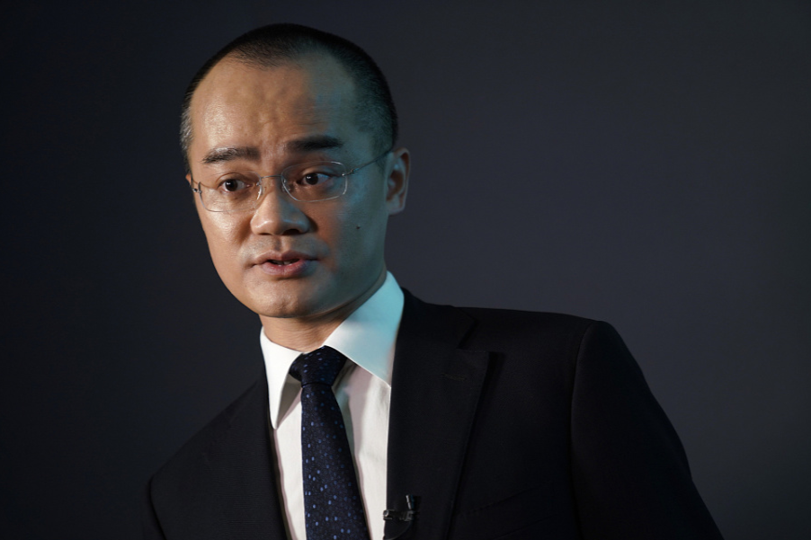

# 美团王兴20亿接盘老朋友AI公司光年之外：大模型创业已死？｜深网

_来源：视觉中国_

作者丨叶蓁

编辑丨康晓

出品丨深网·腾讯新闻小满工作室

6月29日下午，美团发布公告，全资收购前董事王慧文所创办AGI公司光年之外。

互联网老兵王慧文的告别颇为悲情：踌躇满志闯入AI浪潮，刚刚完成A轮融资账上现金2.8亿美金，却因持续高压工作抑郁症病发而不得不退出。

具体来看，这项交易收购价约为20.65亿元。公告显示，具体收购价格包括现金2.34亿美元（约合人民币16.94亿）、债务承担3.67亿元人民币以及给王慧文的现金1元人民币。

光年之外由美团联合创始人王慧文创立及控制，净现金状况总额约为2.8亿美金（约 20.63 亿元人民币）。光年之外境外全部已发行股本的持股比例为：AI
Age占股76.72%，Qimai占股0.43%，红衫中国占股2.44%，其他卖方占20.41%，总计100%。

本次收购交割完成后，原有A轮股东全部平价退出，美团需要向红衫中国支付2800万美元现金，向Qimai支付500万美元现金。由于AI
Age为光年之外创始人王慧文的控股公司，故美团仅需向王慧文本人支付1元人民币，不需要向AI Age支付现金。

在感叹美团和王兴的仗义相助之外，王慧文的退出也对行业里的AGI创业公司提出拷问：大模型是否终将沦为巨头的游戏？

**大佬激辩：创业公司应该放弃幻想？**

近日，大模型创业公司光年之外创始人王慧文病退，投资人朱啸虎和猎豹创始人傅盛围绕“大模型创业到底有没有创业价值”发生了一场隔空辩论，把本来就置于浪潮之巅的大模型创业再一次推向风口浪尖。

朱啸虎声称，ChatGPT对创业公司很不友好，未来两三年内请大家放弃融资幻想，对此，傅盛评论，“硅谷一半的创业企业都围绕ChatGPT开始了，我们的投资人还能这么无知者无畏。”

**“朱啸虎想说的是通用大模型对创业公司不友好，这个观点没问题，我认为通用大模型是巨头的赛道。”迅雷创始人、远望资本程浩对《深网》表示，**
“行业早期大家意见不同很正常，这意味着这个领域有更大的机会，如果说创业者和投资人关于产业的看法都达成共识，那整个行业的混沌期就过了，机会可能也就少了。”

对普通创业者来说，大模型创业是一个伪命题。巨额资金投入，稀缺的AI顶级人才，对于大模型创业而言，钱与技术都重要。

**“通用大模型的训练成本，我们预估的大概10亿美金左右，这仅仅是算力部分，还没算另外两个很花钱的部分，一个是数据，一个是人力成本，现在全球大模型领域的人才，是非常稀缺的。”将门创投创始合伙人、前微软创投大中华区负责人杜枫博士告诉《深网》。**

从2016年开启的人工智能元年，AI产业已经历好几轮洗牌，借着ChatGPT的东风，AI大模型创业再次被置于聚光灯下。

日前，通用大模型初创企业MiniMax完成了新一轮融资，总规模超2.5亿美元，项目估值超过10亿美元，跻身独角兽行列。而MiniMax联合创始人为前商汤科技副总裁、通用智能技术负责人闫俊杰，他也曾担任商汤研究院副院长。

不仅仅是闫俊杰，还有王慧文，王小川等互联网老兵，互联网大厂的中高层，再加上一些学院派的科学家，纷纷加入这波大模型创业浪潮。仅仅半年，据称目前国内有70多家大模型创业公司。

“这个时代跟淘金时代很像。如果你那个时候去加州淘金，一大堆人会死掉，但是卖勺子、卖铲子的人永远可以赚钱。大模型是平台型机会；以模型为先的平台，将比以信息为先的平台体量更大。”奇绩创坛创始人陆奇表示。

“这70家大模型公司，也许90%的公司都会说，我们并没有往AGI的方向走，我理解的是大多数公司也做不了。”中科深智CEO成维忠告诉《深网》。

**对大模型创业公司的创始人来说，真正重要的是持续的融资能力的问题。成维忠认为，现在的这70多个大模型创业团队，大多数公司不具备这样的能力，站在通用人工智能的角度，钱比技术更重要。**

事实也的确如此。国内AI领域的融资，整体来讲，只是看起来很热闹而已。有投资人在一个论坛上公布了去年12月至2023年5月上旬国内AI领域的融资数据，投融资案例只有30起左右，总额估计不到100亿元人民币。

“我们听到的情况是，业内这70多家公司在大模型创业公司，大家用的都是Open
AI的训练方法，因为参数大所以数据也差不多，带来的结果是同质化严重。市面上根本用不了这么多大模型，到2024年应该就会退热，发现谁在岸上谁在裸泳。”小冰公司
CEO 李笛表示。

**大模型，沦为巨头的游戏**

**“中国一定会有自己的ChatGPT。这跟搜索引擎一样，我们有自己的合规要求。但是中国版的ChatGPT只会在5家公司里产生：BAT+字节+华为。”**

远望资本程浩告诉《深网》，“这意味着创业公司或者那些纯为了炒股价的A股上市公司很难有机会。当然我这个说法会得罪很多创业者。包括我的朋友王小川也在相关领域创业，以及很多FOMO的VC朋友，现在也在信誓旦旦一定要投或者已经投了大模型创业团队。”

对创业公司而言，最大的挑战在于要疲于追赶ChatGPT最先进的水平，很可能被拖垮。

“经过几个月的努力，国内通用大模型的水平应该在3.0到3.5之间，而Open AI已经跑到4.0了，这个差距肯定是存在的。”成维忠分析。

在王小川看来，中国需要迎头赶上，现在也不算太晚。“追上ChatGPT
3.5水平，我觉得今年内可能就能够实现，但对于ChatGPT-4或者ChatGPT-5，我认为可能需要3年左右的时间，应该不会低于两年。”王小川对《深网》表示。

**王小川认为，创业公司虽然在人才团队、资金密度跟大厂没有可比性，但是在面对未来方向时候，有可能去做大厂做不到的这种颠覆性的大产品。“**
大厂最明显的优势就是它有足够的资金保障供给，不足之处它需要围绕自己原有的业务，作为优先服务对象，因此在面对这个可能未来的巨大变革时候，新开辟的产品模式和应用方式，可能不是它们优先去努力的方向，会限制它们，就像搜狗当时做搜索，我也会把我的模型更多的优先服务于搜索，可能会丢掉一些未来更大的机会。”

当然，具备王小川条件的创业者屈指可数。

“创业者只有在具有先发优势的情况下，才有可能跑赢大厂。大模型是典型赢家通吃领域。巨头有钱，有技术，更重要是有数据。”程浩坚持认为，大模型是巨头们的战场，尽管目前中文大模型没有世界意义上的真正领先者，但在中国本土市场，肯定会诞生一个领先者。

**创业公司的机会在哪？**

大模型如果沦为巨头的游戏，创业公司的机会在哪？

创新工场创始人李开复认为，未来的AI 2.0时代会有三大生态层：基础模型层、中间层和应用层。“以大模型为代表的AI
2.0市场规模巨大，足以容纳巨头、中小企业和初创公司在里面‘赛马’。”

傅盛说硅谷一半的创业企业都围绕ChatGPT开始了，在远望资本程浩看来，这个是千真万确的。程浩刚在硅谷呆了一个半月，
**“一个硅谷创业者如果讲的项目跟大语言模型没关系，就被会投资人定义为传统项目，VC可能就没兴趣了。”**

“朱啸虎想说的是很多创业公司营养价值链比较薄，99%都是ChatGPT做的，你这公司有什么价值？这个是创业公司要解决的问题，朱啸虎说场景为王，这个我是很同意的。”

**程浩表示，对创业公司而言，选择AI+还是+AI至关重要。**
“大语言模型带来的这波机会，创业和投资必须得有红利，没有红利就属于推石头上山，有红利就属于推石头下山，给点劲它就可以自己滚下山了。”

王小川认为，目前大家都是跟ChatGPT和它的仿制性model学习，未来可能会出现分化。一种是服务于他们的主场景,当然有少数能够超越做颠覆性的产品，这种变化可能还需要在半年或一年后才能展示出来。

关于朱啸虎和傅盛的“大模型到底有没有创业价值”隔空辩论，互联网连续创业者、千橡互动集团CEO陈一舟表示，“别人也问我这个问题，我反问，搜索引擎出来以后有啥大生意也出生了？答案是崭新的生意并不多，但是已经存在的很多生意都可以借力。”

在陈一舟看来，很多领域都可以+AI，“比如B2C电商和游戏，特别是分工很细的B2B生意，导流速度和流量精准度提高。已经存在的SaaS产品有这么多数据和付费客户，根本不需要重启炉灶，是一个巨大的得益群体。现在AIGC这些领域基本不投，以后有泡沫只能怪VC。”

这点上陈一舟和朱啸虎也达成了共识。

**对更多创业公司而言，选择垂直赛道做大模型是更为明智的选择。**

**从美国发展情况来看，通过调用ChatGPT的API无法解决大多数企业对大模型的使用问题，所以基于开源生态的垂直或企业自有模型显示出巨大的潜力。**

“两年前我们已布局了通用大模型，今天我们会重点关注多模态，投向量数据库，继续看芯片和垂直领域。”在将门创投创始合伙人、前微软创投大中华区负责人杜枫博士看来，“开源社区整个生态对中国的大模型创业是有帮助和示范意义的，没有永远的领先，大家都在努力向前，中国相对来说可能需要更多的大模型，最多十几家。”

中科深智CEO成维忠告诉《深网》：“这一波大模型创业潮里，大家头脑其实没那么发热，大家做的都是垂直领域，我自己就是做虚拟人的。”中科深智在5月发布了20亿参数级别的大语言模型“数智姜尚”。这是他们租用了2000张英伟达A100显卡做出来的产品。

对于国内有能力的企业来说，自训大模型是当前阶段的明智选择。中科深智CEO成维忠认为，没有能力自训的，积极跟拥有大模型的企业合作训练，是另一个好选择。不能太理想化，也不能担心浪费钱，很多事没有太多更优选择。

“等国内出现特别优质的开源模型后，现有大多数有大模型的企业，可以选择迁移到开源大模型上重新训练。之前的投入，也不能算白白浪费了，培养了人才，积累了数据，探索了场景，也可能抢到了垂直赛道。搬迁到开源大模型上，可以继续发挥先发优势，这是巨大的价值。
”中科深智CEO成维忠告诉《深网》。

