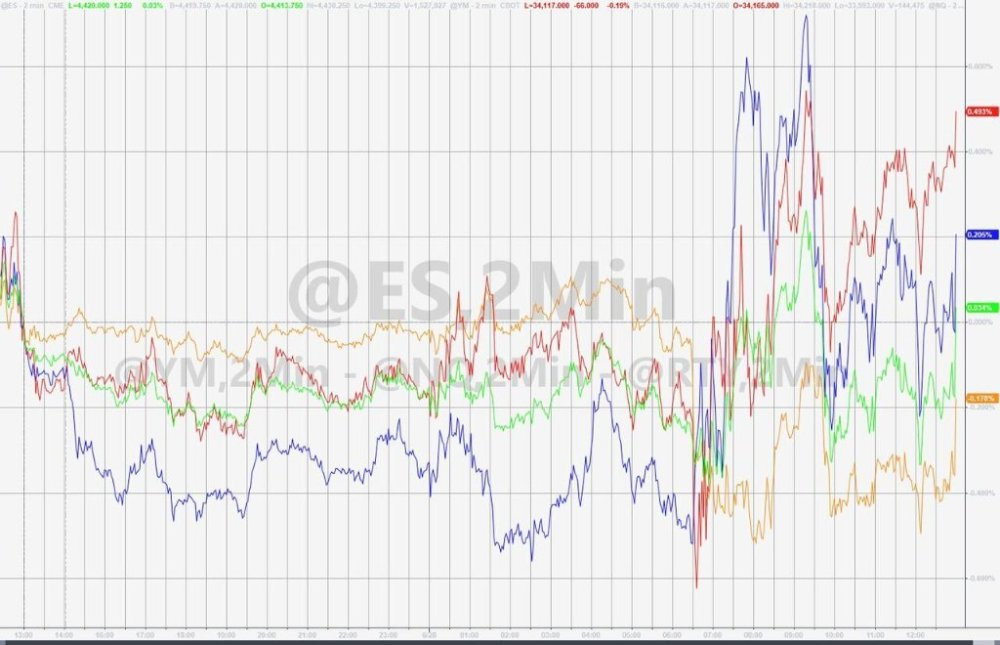
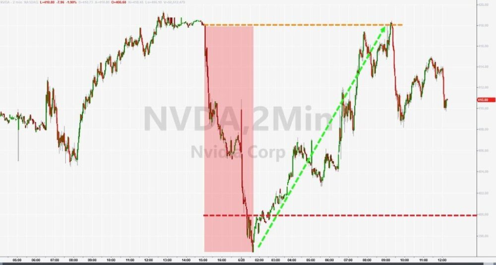
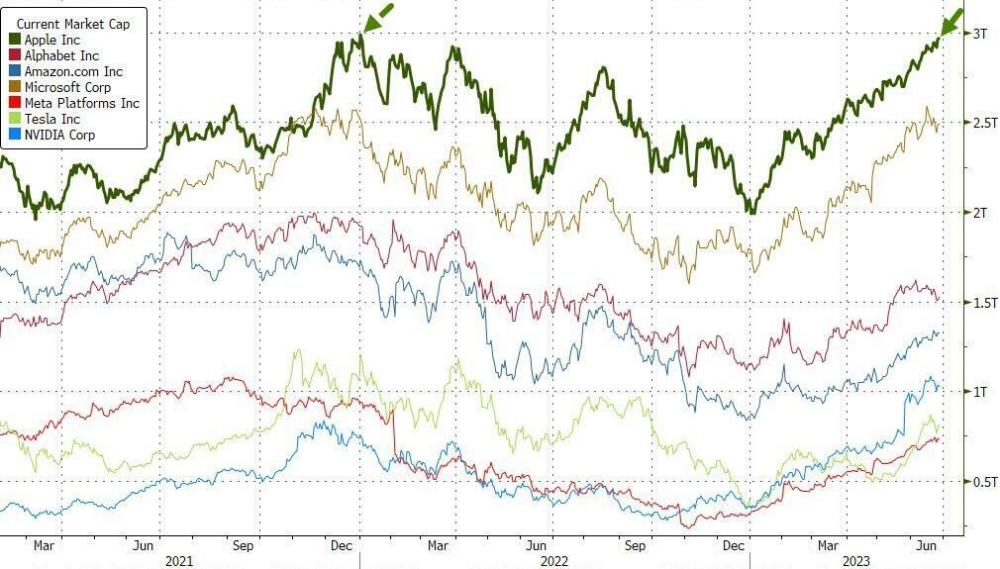
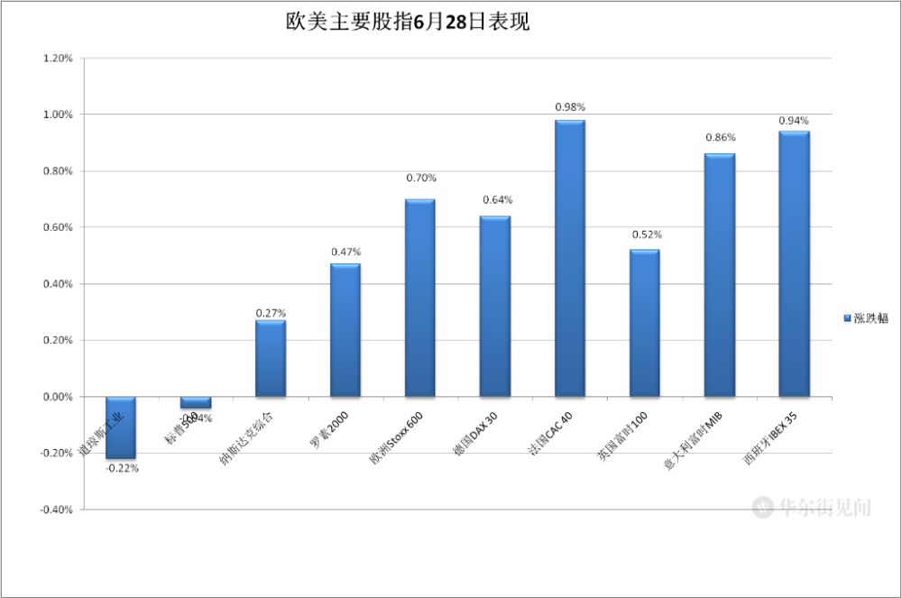
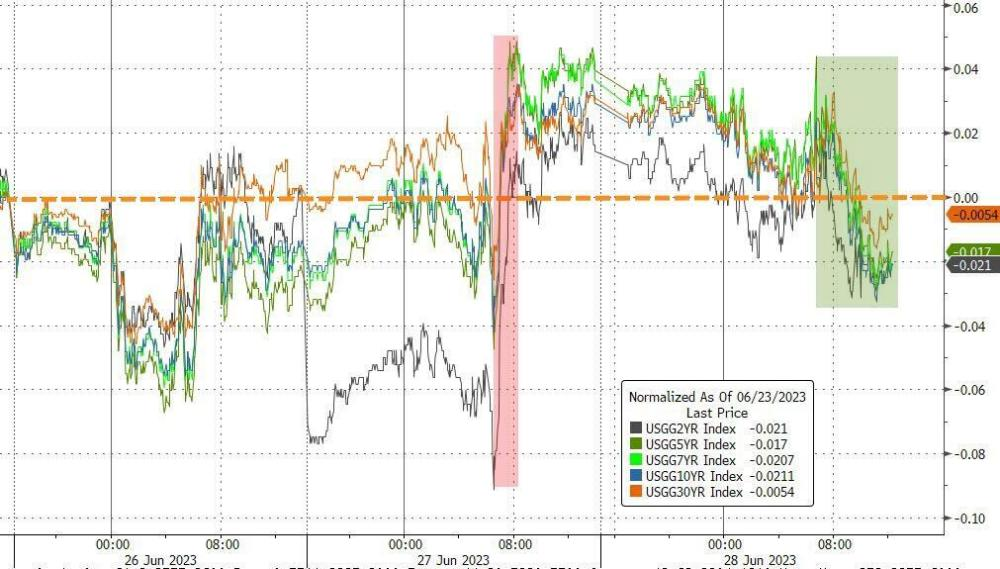
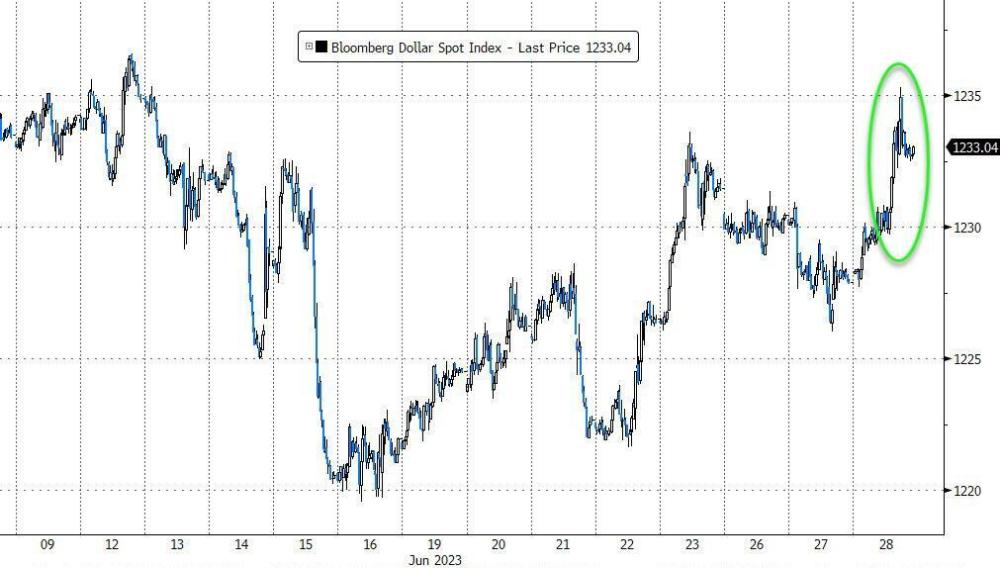
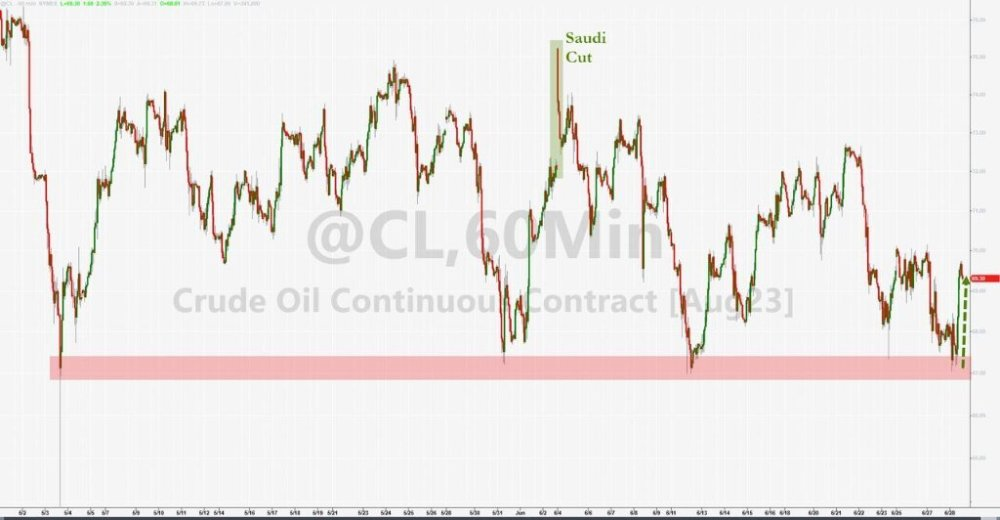

# 美股收盘：鲍威尔放鹰，纳指艰难转涨，苹果市值逼近3万亿美元

鲍威尔暗示7月和9月可能接连加息后，美国国债收益率盘中回升，对利率前景更敏感的两年期美债收益率刷新日高，但升势并未持久，讲话结束后转降，持续回落。欧债收益率也在短线回升后重回降势，两年期英债收益率较此前刷新的2008年来高位回落超过10个基点。意大利6月通胀超预期放缓成为欧债收益率下行的部分推手。评论称，市场定价已体现央行继续加息的预期，投资者做好了应对这一预期的准备。

鲍威尔开始讲话后，主要美股指开盘齐跌，纳指和标普盘初刷新日低。芯片股成为盘初大盘下挫的一大推手。据环球网，美媒称拜登政府考虑对华实施新的AI芯片制裁，英伟达、美光科技、AMD等美国芯片厂商都会受影响。而特斯拉等多只蓝筹科技股继续上涨，遏制了大盘的跌势，其中奈飞表现最佳。Oppenheimer分析师看好奈飞逐步取消无广告订阅服务后的增长前景，将目标价大幅上调11%。

论坛讨论期间，鲍威尔和拉加德都承认有经济衰退的风险，但认为不可能真正会衰退。美股跌幅收窄，纳指和标普转涨。鲍威尔在临近结束讨论时预计，今明两年美国通胀不会达到联储的目标2%，说核心通胀率将在2025年回升到2%，距离降息还长路漫漫。央行行长讨论结束后，美股跌幅扩大，纳指和标普重回跌势。

盘后美股传利好。美光科技公布的第三财季亏损低于预期，预计市场环境改善和AI领域的新需求将推动公司业绩近期内复苏，股价盘后拉升，助推多只芯片股盘后转涨。盘后美联储公布所有大银行都通过了压力测试，摩根大通等多家收跌的大行盘后股价转涨，至少涨超1%。

鲍威尔讲话期间，连日回落的美元加速反弹，非美货币下挫。日元继续刷新七个月低位，美元兑日元逼近去年日本政府干预汇市时的门槛145。出席欧洲央行论坛的日本央行行长植田和男未直接回答日本是否可能干预，说外汇事务由财务省决定。植田称，日元受到包括其他央行行动在内的许多因素影响，日本正“非常仔细地”监控局势。

大宗商品中，美国能源部公布的上周美国EIA原油库存减少逾960万桶，降幅是市场预期的六倍多，国际原油盘中跳涨，脱离两周低位，美油还未能收复70美元关口。美元反弹的打击下，黄金继续下挫，尽管盘中美债收益率转降缓和了金价的跌势，仍刷新三个多月来收盘低位。评论认为，央行持续加息对黄金是利空，美债收益率升得越高，寻求避险金融工具的交易员就越有可能选择计息产品，而不是黄金。

鲍威尔暗示可能连续加息后 纳指标普刷新日低 美光盘后带动英伟达等芯片股转涨 通过压力测试后多家大行转涨

三大美国股指集体低开。盘初刷新日低时，纳斯达克综合指数和标普500指数都跌超0.4%。开盘不到一小时后纳指转涨，早盘标普不止一次转涨，午盘之初刷新日高时，纳指涨逾0.7%，标普涨近0.3%，此后均转跌。纳指转涨后短线转跌，尾盘摆脱跌势。道琼斯工业平均指数早盘刷新日低时跌超170点、跌0.5%，午盘之初跌幅曾收窄到约23点，后跌幅又扩大，尾盘和标普都收窄跌幅。

最终，三大指数中只有纳指收涨，涨幅0.27%，报13491.75点，连涨两日，继续脱离周一所创的6月9日以来收盘低位，涨势较收涨1.65%的周二明显缓和。周二涨近1.2%止住两连跌的标普收跌近0.04%，报4376.86点，在未能继续脱离6月9日以来低位。周二涨超210点的道指收跌74.08点，跌幅0.22%，报33582.66点，开始跌向周一刷新的6月7日以来低位，最近八个交易日内第七日收跌。

科技股为重的纳斯达克100指数收涨0.12%，在连跌两日至6月9日以来低位后连涨两日，涨幅远不及周二涨1.75%所创的5月26日以来最大涨幅。价值股为主的小盘股指罗素2000收涨0.47%，跑赢大盘，连涨三日至一周高位。

_主要美股指周三盘中大多反弹_

标普500各大板块中，周三只有四个收涨，能源涨约1%，奈飞所在的通信服务涨0.8%，特斯拉所在的非必需消费品涨近0.3%，房产涨0.2%。收跌的七个月板块中，公用事业跌近1.5%，跌幅远超其他板块，材料跌近0.7%，材料和芯片股所在的IT微跌。

总体连涨两日的芯片股回落，盘中跌幅收窄。费城半导体指数盘初曾跌约1.7%，午盘曾短线转涨，收跌0.9%，半导体行业ETF
SOXX收跌近0.8%，均跌落一周高位。个股中，盘初跌逾2.2%的美光科技盘中转涨，收涨0.4%。公布财报后美光股价加速上涨，盘后一度涨超5%；周二涨超3%的英伟达盘初跌幅曾接近3.4%，后收窄跌幅，收跌1.8%，盘初跌2.5%的AMD收跌0.2%，盘后和英伟达都小幅转涨。

_英伟达盘初跳水，到收盘时已收窄近半跌幅_

龙头科技股多数收涨。小幅低开的特斯拉盘初迅速转涨，后保持涨势，早盘刷新日高时涨近3.9%，收涨2.4%，连续两日收涨，抹平周一跌超6%所创的两个多月最大日跌幅。

FAANMG六大科技股中，被Oppenheimer分析师将奈飞目标价上调50美元至500美元、意味着预计股价较周二收盘将涨近20%后，奈飞午盘曾涨超4.8%，收涨近3.1%，连涨两日至6月20日以来高位；周二被Bernstein下调评级后盘中跌超1%、大致收平的谷歌母公司Alphabet早盘转涨，收涨近1.6%，走出连续三日刷新的5月15日以来低位；苹果收涨0.6%，连续两日刷新上周四所创的收盘历史高位；微软收涨近0.4%，继续走出6月9日以来低位；而周二涨超3%脱离6月14日以来低位的Facebook母公司Meta收跌0.6%；周二涨1.5%止步两连跌的亚马逊收跌0.1%。

_苹果市值逼近3万亿美元大关_

银行股指数在连涨两日后回落。周二涨超1%的整体银行业指标KBW银行指数（BKX）收跌0.4%，未能继续脱离6月1日以来低位
；周二均涨超1%的地区银行指数KBW Nasdaq Regional Banking Index（KRX）和地区银行股ETF
SPDR标普地区银行ETF（KRE）都收跌0.5%，和各自上周五所创的6月1日和5月31日以来低位仍有距离。

大银行中，摩根大通、花旗、美国银行、富国银行、摩根士丹利都收跌不到1%，高盛收涨不足0.1%。盘后美联储公布所有大银行都通过压力测试后，多家大行转涨。富国银行盘后涨超2%，高盛、摩根大通、摩根士丹利、美国银行盘后都涨超1%，但花旗盘后跌超1%。

部分地区银行继续上涨，被Atlantic
Equities初始覆盖给予超配评级、并给出较周二收盘高近50%的目标价后，第一公民银行（FCNCA）收涨3.5%，西太平洋合众银行（PACW）收涨2.9%，阿莱恩斯西部银行（WAL）涨近0.2%，而Keycorp（KEY）跌1.9%，Zions
Bancorporation（ZION）跌近0.8%。

周二高涨、跑赢大盘的热门中概股大多回落。纳斯达克金龙中国指数（HXC）收跌0.9%。中概ETF
KWEB和CQQQ跌约1.3%。截至收盘，阿里巴巴跌近3%，京东、拼多多跌超2%，百度、腾讯粉单、B站跌超1%，网易跌0.7%，但三家造车新势力均继续走高，小鹏汽车收涨超7%，蔚来汽车涨近2%，理想汽车涨约1%。

波动较大的个股中，宣布得到其首款电动垂直起降飞行器 (eVTOL)的试飞许可后，航空运输公司Joby
Aviation（JOBY）收涨40.2%；被因预计今年将和亚马逊达成合作、看好继续提高用户参与度的富国银行将评级上调至超配后，社交媒体Pinterest
（PINS）收涨6.6%；被Needham首次覆盖给予买入评级、并被摩根士丹利重申超配评级后，软件公司ZoomInfo（ZI）收涨6.1%；周一公布二季度亏损低于预期仍收跌7.6%的嘉年华邮轮（CCL）连续两日收涨8.8%，其同行挪威邮轮（NCLH）和皇家加勒比邮轮（RCL）分别收涨7.6%和1.7%；媒体称私募股权公司Arcline报价每股57美元、高于另一有意收购方KKR后，工业、航空航天和国防领域产品生产商Circor
International（CIR）收涨4.3%；在投资者日重申全年指引后被高盛重申买入评级的云数据分析公司Snowflake（SNOW）收涨3.9%；而第四财季EPS盈利高于预期但营收低于预期的食品公司通用磨坊（GIS）收跌5.2%。

欧股方面，部分受益于周二美国公布的经济数据向好，泛欧股指连续两日反弹，周三加速攀升。欧洲斯托克600指数刷新6月21日上周三以来收盘高位。主要欧洲国家股指继续齐涨，英意西股连涨三日，德股和法股在连跌六日后连涨两日。

各板块中，科技涨逾1.9%领涨，受益于芯片股走高，其中Nordic
Semiconductor涨6.4%，ASML涨2.3%。有分析师指出，很多欧洲科技股和芯片股会因为美国的限制规定受拖累，但还有点回旋余地。此外，房产板块涨近1.8%，汽车涨约1.4%，工程、旅游、化工、金融服务也都涨超1%。

两年期英债收益率刷新2008年来高位后回落逾10个基点 美债收益率冲高回落

欧洲国债价格反弹，收益率回落，周三公布的6月意大利通胀率超预期放缓成为部分推手。

美股盘初欧洲央行行长拉加德重申7月可能加息，未暗示9月行动动向。此后法国央行行长Francois Villeroy de
Galhau称，利率保持高位的时长比利率实际水平更重要，利率已接近让通胀回到2%所需的水平。拉加德开始讲话后欧债收益率曾有所回升，此后回落。

最终，英国10年期基准国债收益率收报4.31%，日内降6个基点，远离上周二逼近4.50%刷新的去年10月以来高位；2年期英债收益率收报5.11%，日内降12个基点，欧股早盘曾上测5.30%，连续两日刷新2008年来高位；基准10年期德国国债收益率收报2.31%，日内降4个基点，接近周一下破2.29%刷新的6月2日以来低位；2年期德债收益率收报3.08%，日内降5个基点，进一步远离上周四逼近3.29%刷新的3月9日以来高位。

周二回升的美国国债收益率周三总体回落，鲍威尔讲话期间的升势未能保持。

美国10年期基准国债收益率在亚市盘中刷新日高时逼近3.77%，欧股盘中有所回落，美股盘前曾下破3.73%，鲍威尔和拉加德讲话期间曾回升到接近3.77%，讲话结束后又回落，美股午盘刷新日低时逼近3.70%，开始靠近周一下破3.68%刷新的6月13日以来低位，到债市尾盘时约为3.71%，日内降逾1个基点。

在鲍威尔讲话开始、重申今年还需加息后，对利率前景更敏感的2年期美债收益率曾接近4.78%刷新日高，向上周四升破4.80%后刷新的三个月来高位靠近，讲话结束后持续回落转降，美股尾盘曾下破4.71%刷新日低，到债市尾盘时约为4.71%，日内降近5个基点。

_各期限美债收益率本周三日走势_

美元指数结束两连跌 盘中逼近逾一周高位 日元连创七个月新低 离岸人民币一度逼近7.27

追踪美元兑欧元等六种主要货币一篮子汇价的ICE美元指数（DXY）在亚市盘初跌破102.50刷新日低，后很快反弹并保持涨势，鲍威尔讲话期间加速上涨，美股早盘重上103.00后一度涨至103.10上方，逼近上周五所创的6月15日以来盘中高位，日内涨超0.6%。

到周三美股收盘时，美元指数略低于103.00，日内涨近0.5%，在连跌两日后反弹；追踪美元兑其他十种货币汇率的彭博美元现货指数涨近0.5%，抹平前两日跌幅，升至6月12日以来高位。

_彭博美元现货指数回升至三周高位_

非美货币盘中齐跌。欧元和英镑都在鲍威尔讲话后加速下跌。欧元兑美元美股早盘跌破1.0900刷新日低，开始靠近上周五跌穿1.0850所创的6月15日以来盘中低位，日内跌近0.6%。英镑兑美元在美股早盘曾跌破1.2610，刷新6月14日以来低位，日内跌超1%。

日元周三持续下行，继续刷新七个月来低位。美元兑日元在周三欧股盘中站稳144.00上方，美股早盘曾涨破144.60，连续两日、最近九个交易日内第八日创去年11月以来新高，日内涨近0.4%，美股收盘时处于144.40一线。

离岸人民币（CNH）兑美元在亚市早盘曾转涨并刷新日高至，转跌后保持跌势，美股盘前失守7.26并一度逼近7.27至7.2692，在连续五日刷新去年11月末以来低位后，又创去年11月10日以来新低。北京时间6月29日4点59分，离岸人民币兑美元报7.2432元，较周二纽约尾盘跌189点，回吐周二扭转三连跌的涨幅。

周二盘中一度涨超1000美元后，比特币（BTC）周三总体回落，美股午盘曾跌穿3.0万美元至2.99万美元下方，较亚市早盘的日内高位回落超过900美元、跌约3%，美股收盘时徘徊3.0万美元一线，最近24小时跌近2%，未能继续靠近上周五涨破3.14万美元所创的去年6月以来高位。

原油涨超2%脱离两周低位 美油未能重上70美元

国际原油期货在欧股盘中不止一次转跌，美股早盘美国能源部公布上周原油库存锐减后跳涨，彻底摆脱跌势。美股午盘刷新日高时，美国WTI原油涨至69.73美元，日内涨约3%，布伦特原油涨至74.2美元，日内涨近2.7%。

最终，原油至少接近抹平周二回落的跌幅。周二收跌2.41%的WTI
8月原油期货收涨1.86美元，涨幅2.75%，报69.56美元/桶，连续五个交易日收于70美元下方；周二收跌2.59%的布伦特8月原油期货收涨1.77美元，涨幅2.45%，报74.03美元/桶，和美油均脱离周二刷新的6月12日以来收盘低位。

_美国WTI原油将近两个月来走势_

周二大反弹止住四连跌的欧洲天然气小幅回落。周二收涨6.8%的英国天然气期货收跌0.68%，报84.58便士/千卡，还未靠近周一跌破79.80便士刷新的6月12日以来收盘低位；周二收涨近8%的欧洲大陆TTF基准荷兰天然气期货收跌1.1%，报34.125欧元/兆瓦时，和周一跌破32美元刷新的6月12日以来低位仍有距离。

伦铜两连跌至逾三周低位 伦镍跌超3% 黄金创逾三周新低

伦敦基本金属期货周三全线下跌，多种金属在周二反弹后回落。伦镍跌超3.5%，继周一跌超5%后本周第二日领跌，刷新周一大跌所创的去年7月以来低位。

周二独跌的伦铜跌超1%，连跌两日至6月初以来低位。周二涨超2%的伦铅和伦锌也跌超1%，开始靠近各自周一所创的去年末以来和三周来低位。周二刚止步三连跌的伦铅跌1%，逼近逾两周来低位。周二涨超2.5%领涨的伦锡跌近0.9%，收盘守住2.6万美元关口，还未逼近周一跌破2.57万美元刷新的三周多来低位。

纽约黄金期货在欧股盘前转跌后保持跌势，美股早盘刷新日低至1911.4美元，日内跌超0.6%，此后逐步抹平多数跌幅。最终，COMEX
8月黄金期货收跌0.08%，报1922.20美元/盎司，刷新3月14日报1910.9美元以来收盘低位，连续两日收跌。

_纽约黄金期货四个月来走势_

