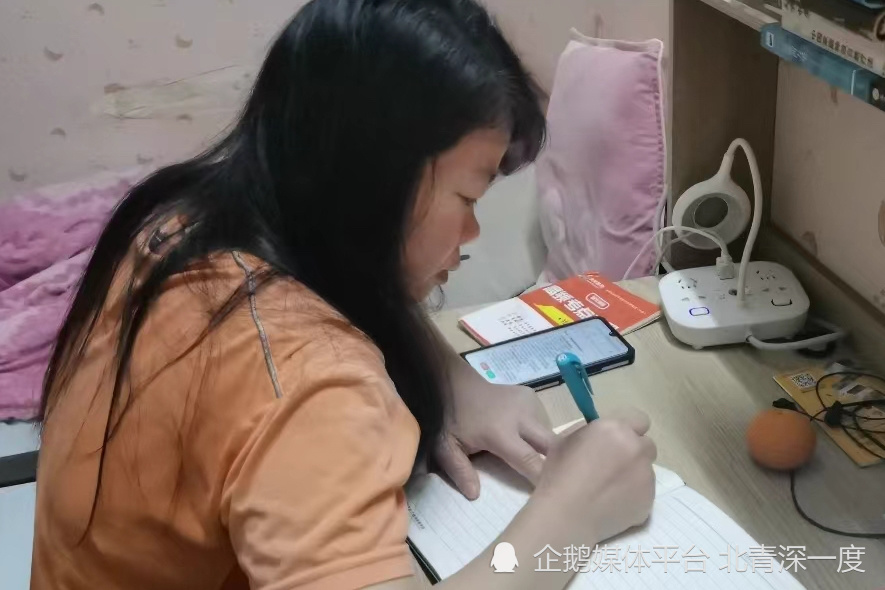
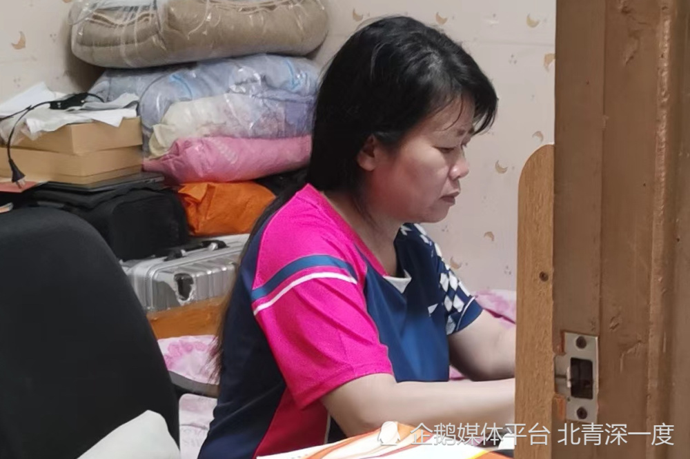
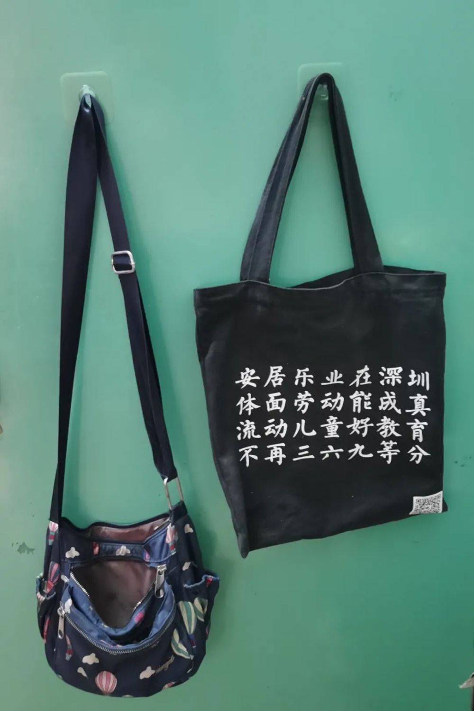

# 一个“非人才”妈妈十年的落户马拉松：凌晨还备考，为孩子能留下上学

**采写/李沁桦**

**编辑/计巍**

_正在书桌前准备考试的黄妹芳_

**想象这样一个场景，在一场马拉松里，你面前是很多条紧绷的绳子，你往前走的每一步，都要经过这张网的过滤，有时，你还会被这张网弹回原地。**

**对于深圳女工黄妹芳来说，落户就是这样一场漫长的马拉松，终点线是拿到深圳户口。那个盘根错杂的网，是学历、技能水平和持续缴纳的社保。**

**“很难？在深圳，非深户要留下来（上学），要么孩子成绩杠杠的，要么父母经济杠杠的。”很多时候，她独自一人挣扎在这张大网中，生活的关键词是工厂、缴纳社保、拿学历和考证，它们合成了落户的可能性。**

**现在，这场马拉松跑到了第十年。她仍在紧追着这些落户的可能性，这是她读初中的儿子继续留在深圳读高中的希望。**

**45岁是深圳人才引进落户的最高年龄限制。黄妹芳需要在今年完成落户前的最后一个赛程，让自己成为一个“人才”。**

_黄妹芳的书桌，为了能继续在深圳上学，她和儿子都要成为“人才”_

“人才”的筹码

黄妹芳今年45岁。她有一头乌黑油亮的长发，沉甸甸地坠在脑后，垂到腰间。她看书的时候会把头发扎起来，再戴上眼镜。

读高中时她也戴眼镜。草草毕业后，她从广西老家到广东打工，当时工厂里戴眼镜的人少，大家看她像看怪物一样，她就取了下来。直到后来又开始读自考，她又重新戴上了它。

这是一个普通的周一，早上六点半，儿子去上学了，家里和周边都很安静——这时候附近的街道上几乎看不见人，孩子们去上学，大人们去上工。

黄妹芳在出租屋的书桌前坐下。桌上有三本厚厚的中级社工教辅，书的边角皱巴巴地黏在一起。她住的屋子是一间握手楼，白天也需要开灯。白炽灯照着四面白墙，独自一人在家的她边看书边做笔记。

但很快她就感觉到累，真的累，眼睛开始发酸，似是而非的概念和定义在脑子里掠过，她却记不住。“像我四十多岁，年纪大了，和年轻人不一样，很多东西实在是记不住了。”学了一个多小时，黄妹芳快要睡着。她摘下眼镜，揉揉眼，从书桌旁站起来，开始洗碗、扫地，把冰箱里的肉拿出来解冻。一个小时后，她又重新坐下来看书。

她把每天的日程设定了闹钟，早上五点起床陪儿子跑步，六点煮早餐，十一点做午饭，下午三点外出发货，然后收货，五点半做晚饭……每天只有早上孩子去上学，晚上孩子睡觉之后，她才有两三个小时可以静下心来好好看书。

为了照顾儿子，黄妹芳两年前从工厂辞了职。

儿子覃武奥今年十四岁，马上读初三。儿子进入青春期，黄妹芳发现自己越来越不懂他。她最近大部分的焦虑都来源于儿子“砰”的关门声和上锁声。有段时间她还害怕孩子得了抑郁症。有一次英语考试，覃武奥只考了30分，脸上带着摆烂的神情，她意识到儿子出了问题。

她决定从工作了六年的工厂辞职。“因为孩子没照顾好，其他都没意义。”黄妹芳的工友们听了她辞职的理由，对她说，“我们把孩子当人养，你是把孩子当‘人才’养。”

不仅是儿子，黄妹芳自己也要成为“人才”。黄妹芳在五月底和六月中分别有两场考试，一个是系统集成项目管理工程师，另一个是中级社工。要想在深圳落户，这是常见的中级资格考试。尽管这二者的通过率都不足20%，但在互联网上搜索，你能看到这种资格的“价值”——“考过就是中级职称人员，考证入户的首选！”

从35岁到45岁这十年，“考试”像是黄妹芳生活中的魔咒。和考试相关的所有群她都聊天置顶，以便第一时间查看每一个关于上课、交作业、报名、考试的消息，手机相册里收藏着各种考试通知的截图。

2018年，她先是通过工厂工会提供的“圆梦计划”通过了自考大专考试，转年，她开始自考本科。英语这一科的成绩不好，她考了五次才通过入学资格，然后接着上课和考试。

或许有人知道以她为主角的纪录片《人生第二次》，有人用一句话概括黄妹芳的故事：为儿子留深上学42岁妈妈自考本科。她对着镜头说，“攒积分难过攒钱。拿到大专文凭，有60分的基础；按时缴纳社保，每年3分，封顶30分，但是四十岁以后，每年扣2分。我做了两手准备，同时冲刺本科文凭和社工资格证。”

三年过去了，她还在冲刺。去年六月，她第一次考社工考试，和她一起去考的有五个工友。丈夫用跑货拉拉的面包车，一车载着六个考生去考场。她在考场上看到了好几个大着肚子的孕妇，“没办法，大家都要考，落户就是要早点为孩子做打算。”三个月后，成绩下来了，她没有通过。

黄妹芳有些时候很后悔，觉得自己开始考虑在深圳落户的时机太晚。她的妹妹黄妹新比她小五岁，在落户前，黄妹新和姐姐有着相似的人生轨迹和目标：进工厂，结婚，生子，小孩上学，尝试获得一个深圳户口。

从某种程度上来说，深圳几乎是国内最容易落户的“超级城市”。根据2020年及之前的深圳市入户办法，拥有全日制专科或本科学历的应届毕业生，只要对应满足35岁和45岁以下的年龄限制，就可以按人才引进直接落户，落户的整个流程可以达到“秒批”。不符合直接落户条件的，也可以通过积分入户。

2019年，黄妹芳帮妹妹向落户窗口递交了材料，两个月后，妹妹收到了落户审核通过的短信。当时的黄妹新35岁，中专学历加上在工厂考取的初级会计师证，凑够了100分的落户积分。所有人都认为妹妹很幸运，因为第二年积分落户窗口就关闭了。

黄妹芳没有交自己的材料。深圳市“在职人才引进”的标准里，那时她只有非全日制大专学历这一个筹码，价值60分。如果想离100分的及格线更近，她需要更多的“筹码”来证明自己是“人才”。

_黄妹芳把自己每天的日程都设置了闹钟_

100分

时间回到十年前，黄妹芳35岁。她和丈夫覃项利带着五岁的儿子覃武奥，从东莞来到深圳。搬来深圳是因为一年后孩子要上小学，黄妹芳发现孩子幼儿园班上的外地人屈指可数。她不愿意孩子受排挤，“大家都说深圳是移民城市，教育资源也更好。”

一家三口在深圳宝安区落了脚，在儿子的幼儿园正对面租了一个一室一厅的小房子。这是黄妹芳的“落户马拉松”故事的起点。

她对深圳的第一印象是快，“赶地铁，所有人都在争分夺秒地跑，好像被人推着往前走。”她也要快。工厂每天中午有一个小时的休息时间，为了回家给孩子做午饭，她把这一个小时精准地分成四段，十五分钟骑电动车回家，十五分钟做饭，十五分钟吃饭，十五分钟回工厂。一秒钟都不能浪费，她甚至摸清了家门口交通信号灯的规律，估算着碰上绿灯的时间出门，可以再节省几十秒钟。

第二印象是排队，人们上公交车在排队，孩子放学回家也在排队，还有一件，正在上幼儿园的孩子报小学也要排队。

根据《深圳市义务教育就近入学管理办法》，无论是民办还是公办学校，家长们都需要达到对应的学位积分才有报名资格。学位积分越高，能选择的学校越多。以宝安区为例，拥有一个深圳市宝安区户籍，学位积分在这一项上就有95分，而非深圳户籍的她只有60分。

系统里的学位积分是电脑自动判定的，黄妹芳把自己所有的“筹码”——非深户户籍+租房合同+缴纳一年的社保——都输入进去，屏幕上马上跳出一个对应的结果：71.2分。而当年小学入学的门槛是68分。学位积分低，她的儿子只能选择民办小学。但她觉得儿子在深圳读书很好，“你觉不觉得，其实小地方很多高中都是那种完全的应试教育？深圳这边的学校，学习抓得再紧也是全面发展的，但是回了老家，教材是陌生的，也比不上那些孩子会考试，成绩肯定是没有优势的。孩子已经回不去了。”

6年后是初中，9年后是高中，12年后是大学，这是一场层层向上的教育台阶，也是不断收紧的过滤系统。儿子能不能留下？黄妹芳心里很忐忑，因为在这个系统里，“户籍”占据了相当大的比重。

深圳是中国流动儿童数量最多的城市，公开数据显示，2022年深圳市义务教育阶段在校生158.85万人，非深户籍的学生超过了六成，比例全国最高。到了中考的节点，非深户之难更凸显出来。2022年，深圳市公办普通高中录取率是53%，非深户考生只占据其中25%的名额。

从儿子小学入学时候起，黄妹芳就想在深圳落户。当时的黄妹芳只有高中学历，她只能在这场积分落户考试中尽力考到100分。这场考试有三个“科目”，名字分别是年龄、社保和学历。她需要像跑马拉松一样，在每一个赛程中，计算艰难而漫长的加法。

年龄不是她的优势。根据落户办法，申请人35周岁内可以加5分，35-39岁不加分不减分，但40岁开始，每增长一岁就扣2分，超过45周岁则没有了申请资格。

社保是相对来说最容易解决的事。来深圳找工作，黄妹芳对工作只有一个要求：交社保。她看见一个电子厂门前在排长队，问清楚了会交社保，她甚至不知道这家工厂叫什么名字就签了合同，她看中的是每个月可以得到0.3分，8年后，她可以拿到社保封顶的30分。

学历则显得棘手。她至少需要一个大专文凭，这也就意味着，她需要像儿子覃武奥一样，回到课堂。2015年，她开始参加工会提供的成人自考项目。得到非全日制大专学历，60分；非全日制本科学历，75分。

但2023年2月起，深圳市开始实行新的积分入户政策，大幅提升入户门槛。新政中，原有的100分落户政策失效，采取积分“由高到低”排序，排名靠前者才可以得到落户指标。落户这场马拉松中，黄妹芳本来已经遥遥看到了终点线，但她发现比赛规则更新了。

刚拿到非全日制大专学历，黄妹芳就听说了这场改革的风声，她毫不犹豫地调整了思路。她头脑中的那一长串加法迅速转变成了另一个等式：非全日制本科+中级专业技术职称+45周岁以下=技术型人才核准入户。她自考班上的一个同学，去年也没考过中级社工，但考过了中级系统集成考试，拿了中级职称，迅速落了深户。她听说这个考试容易通过，马上报了今年的考试。

今年45岁的黄妹芳知道，这或许是自己这十年最后的考试。如果不成功，孩子明年中考，只能是D类非深户考生。“但没有到最后，我为什么不可以再试试？”

_黄妹芳从去年开始就在研究中考填报事项_

“考不上的”

四月底的最后一个周日，黄妹芳的丈夫覃项利回到了家。他初中毕业之后就四处打工，进过工厂，做过物业保安，当过电工，跑过货拉拉，目前在一家物流公司做长途货车司机。

他每个月的工资，是切切实实地用货车的烧油量和公里数衡量的，条线行情好的时候，每个月工资能有一万多块。他每到一个新的地方，会在微信上给妻子发一个定位，厦门、泉州、福州、南昌、苏州、金华，还有更远的西安。他在家里的痕迹只有挂在阳台上的一件大号黄色文化衫，以及洗漱池前的牙刷。

覃项利前一天凌晨一点才从南昌回到东莞，在车上睡了一晚，第二天中午回到深圳的家，手里拎着几个小菜，黄瓜、苦瓜和萝卜。他回来就进厨房，把钝掉的菜刀磨快了，切肉，洗菜，切菜，涮锅，烧油，油烟气和煎炒烹炸的声音从小得只能站一个人的厨房里飘出来。他做了儿子喜欢吃的炸鸡，又去洗碗，擦灶台，扫地拖地。

他每周只回家一天，回来煮饭、炒菜、做家务，做完事就躺在床上刷短视频，累了就睡觉，第二天早上五点起床，开着自己的面包车去东莞发车。

夫妻俩有不言自明的分工。覃项利是这么总结的，做丈夫的在外面负责赚钱，“回到家就得做家务”；做妻子的负责落户的大事，监督儿子学习，“还有她自己也要努力学，别的我也没办法。”儿子从小到大的每一份作业，每一次家长会，每一份成绩单都是黄妹芳的责任，他不懂，也插不上手。

“家庭里面很多女性要承担很多东西，这本来应该是双方的，但是在现实中男性的角色会缺失很多。做爸爸的可能不会也没有能力管孩子。”这是丁当的观察。丁当16岁就辍学南下深圳打工，2015年，她建立了“绿色蔷薇”，深圳市唯一一家为女工及流动儿童服务的草根公益机构，她因此见过许多女工和她们的孩子们。黄妹芳喜欢做公益活动，她去过“绿色蔷薇”，还在那里看过《Y是一个流动坐标》——一部由“绿色蔷薇”创作的戏剧，讲的是深圳流动儿童就学难的问题，黄妹芳觉得那就是自己的现实处境。

“相对于妈妈为了自己的孩子去考学历落户，爸爸考虑的比例会小很多。因为深圳的积分落户细则多且复杂，要去完整地了解所有的信息，对低学历的一方其实是有难度的。落户，是非常奢侈也非常未知的事。”丁当说。

覃项利很怕这份未知。他怕一家子在这里白忙活一通，如果再不回老家读书，儿子在老家就没有初中学籍。如果一年后儿子考不上公办高中，妻子落户也不成功，回不去老家也拿不出民办的学费，那就完全没有退路了。“说实话，我希望儿子初二结束就回老家，这样至少退一万步讲有一个高中读。如果留在深圳，就只能读职业高中，风气很不好的。”

他之前和黄妹芳说过自己的想法，黄妹芳很生气，觉得他太丧气。两人吵架和说家事的时候只用壮语，覃武奥不在老家长大，听不懂——在深圳，他只需要说普通话。当时，覃项利先和儿子用普通话说，“你考这么一点分”，再用儿子听不懂的壮语说，“考不上（公立）高中的”。黄妹芳很生气，和他大吵一架。她觉得这是负能量，不准他再在儿子面前说，他只好咽下去。

与考试带来的未知相比，黄妹芳更相信考试带来的希望。她还记得自己的学生时代，家里一共有八个孩子，她排行老三，九十年代，广西农村的风气是女孩子读完小学就辍学，但是她的爸爸却叮嘱，“你们要努力读书，读书才是你们的出路。”她读书的时候聪明却喜欢犯懒，背文史题不耐烦，背英语课文背得头疼，躲图书馆看一下午的小说，但考试成绩却一直很好。整个村子只有两个人考上了高中，她是其中一个。

高一那年，爸爸因病去世，黄妹芳回家待了一个月，看着家中年幼的弟弟妹妹，心知肚明自己不可能再读下去了。学校的老师同学劝她回去继续上学，但对于这个夏天卖松油、冬天卖木炭来维持生计的家庭来说，供一个大学生读书是一个不可想象的梦。她潦草地读完高中，拿到毕业证，在老家的甘蔗厂待了两年后离开家，顺着打工的潮流，去了东莞的工厂，拿每个月三百块的工资。那时她22岁。

30岁，她和父母安排好的相亲对象见了面。她没想过结婚，也没想过不结婚，但大家都说，对方是一个老实人，又是广西老乡，是再合适不过的结婚对象。

她承认覃项利的确是一个老实人。但结婚15年，她从来没有感到丈夫像现在这样“拖后腿”。儿子初二下学期期中考试成绩单上写的不是分数而是等级：5个A，2个B。覃项利只模模糊糊地知道A代表的是好，B代表的是没那么好。

黄妹芳从去年开始就在研究中考填报事项，计算在一年后的中考里儿子的“赢面”。她的手机里有一个长长的“2023年指标生控制线”学校排名的截图，里面是深圳78所公立高中的中考录取分数线。

“深中当然是最好的，但是全深圳十几万的考生都盯着，我们没什么希望。覃武奥的成绩……”从排名靠前的深圳中学、宝安中学、深大附中等著名的高中往后，她用手指把截图滑到底，指着列表的末尾，“这个最接近他的分数线。”

她和儿子同学的妈妈聊前景，对方说填中考志愿的时候还是会把职业高中考虑进去，选那种未来好找工作的，“这样保险”。黄妹芳摇摇头，她从来没考虑过职高，“我宁愿拼个老命，让他读民办也可以。”

她对职高没有好感。她见过职高学生走后门来厂里面试机械工程师，结果那些孩子什么技能都不会，在学校只学会了抽烟和打架。她没办法想象自己的儿子去那些学校，和那样的孩子混在一起。“真读职高，变成这样就废掉了。”

_黄妹芳家门上挂的帆布袋_

“非人才”

孩子在哪儿读书，全家就搬到哪儿，从幼儿园、小学再到初中，黄妹芳搬了三次家。

从高空俯瞰黄妹芳现在住的社区，周边林立的高楼包裹着城中村和工厂，东莞在一条窄窄的小河对岸。工厂密密麻麻地分布在河的这岸，很多在深圳沙井工厂上班的年轻人为了节省房租，选择在河对岸的东莞租房。白天，做工的人在这头上班，晚上，他们骑着电动车穿过长桥回到蜗居的房子。

黄妹芳和邻居聊天，“我们是谁？我们就是非深户，非人才。”这固然是自我调侃，但从数据上来看，宝安区的确是非深户户籍人口比例最大的区,
非深户户籍人口占总人口的比例超过88%。像黄妹芳这样家里有孩子上学的，为了方便照顾，很多都租住在学校周边。

穿过一条没有路灯的小巷，两边是灰扑扑的员工宿舍楼，所有楼的外观都一模一样。从其中一栋楼往上，黄妹芳租住的这一层有六户人家，六扇相同的刷绿漆的门，只有黄妹芳在自家的门上粘了一排红色的中国结。这是黄妹芳一家三口在深圳的家。搬到这里已经快两年了，多次搬家的经历，让他们舍弃了许多家具，只有两个堆满了书的书桌一直跟着他们走，一个书桌给黄妹芳自己，另一个给儿子。

在她追逐落户的这十年里，丈夫无能为力，儿子还小，她也没和在老家的亲人说。在工厂上班时，她是线长，负责样品抽检。每个样品都不能出错，随时要和工程师沟通，她整天精神都绷得紧紧的。晚上回到家往往已经十点，到凌晨才有时间坐下来看书和准备考试。白天做工，困得站着也要打瞌睡，她就晃晃脑袋，在工厂走来走去。实在困得受不了，她才偷偷地坐下眯一会儿。

去年六月是她压力最大的时候，就像在一场马拉松里，跑到撞墙期，感觉自己无法再前进。她从工厂辞职后，开始打三份零工，卖羊奶、做工厂派发的零件手工活、电商卖橘子。她在深圳漫长的夏天里跑生计，在给客户送羊奶上门的间隙里，翻看着中级社工考试的小册子。她要同时准备三门社工考试，还要准备本科的毕业论文。毕业论文必须要写至少五千字，她看了十几篇参考文献，“头都大了。”

黄妹芳拿本科毕业证的过程也艰难。好不容易写完了毕业论文，合格分是70分，黄妹芳得了75分。老师点评说她的案例写得不够全面，她心里想的是，“运气太好了，总归是过了。”班上200多个同学，有40多个同学的论文成绩都没过关，还需要重写。六月考中级考试，她没通过；十一月考本科结业的最后一门计算机考试，碰上疫情改成线上，结果出租屋的网络不稳定，需要临时请房东来修宽带，她急得满头大汗，考试时间也耗尽了。然而，她还要小心翼翼地在儿子面前隐藏这份焦虑，她从来没有把自己落户的事情告诉儿子，不想让儿子背上压力。

覃武奥有时候觉得自己和老妈都很累。他累，总感觉自己学得还不够，成绩还不够，配不上一个好的高中。他也觉得黄妹芳累，和他一样读这么多年书，“我知道她是为了搞一个深圳户口，她从来没跟我说过，我猜到了，但是我觉得太累了。”

黄妹芳说，你知道覃武奥有些时候叫我什么吗？叫“老干妈”，是“又老又干巴的老妈”的简称。黄妹芳本来有一头厚密的黑发，这几年头发掉了很多。“以前二十多岁出来打工，别人羡慕我的年轻，当时我还不懂得，现在时间一晃眼，在深圳待了十年，我当然也老了。”

对于十年前年轻的黄妹芳来说，“来了就是深圳人”是一句极具诱惑力的口号，但这句口号的背后是一个残酷的事实：没有户口，没有房子，就很难真正留下来。黄妹芳的妹妹黄妹新在2019年就已经有了一个深圳户口，但说起这句话，她苦笑，“在这里没房，即使有一个户口，始终也算不上深圳人。”

黄妹芳从来都没想过买房子的事。在深圳，买一套房子光是首付就是好几百万。丈夫的侄女是深圳一家公立医院的护士，嫁了一个开公司的博士，夫妻俩是深圳市引进的高层次人才，落户、创业和买房都有对应的政府补贴。在黄妹芳看来，这样的“人才”才有能力在深圳买房子。人才也被细分，深圳市的人才引进补贴政策中，后备级人才、领军人才和杰出人才，对应的补贴从160万到300万不等。黄妹芳不知道侄女一家属于哪一类人才，只清楚一件事，“人家是高技能人才，我们这种人想都不要想。”

她从工厂辞职后，现在的收入来源是工厂外派的手工零活。平常下午她会骑着三轮车出去收货，再发给周边的邻居。做活的通常是三四十岁的女人，潮汕人、客家人和江西人，开小店面的，在家带孩子的，她们把细小的零件组装起来，一个零件算几分钱，一个月可以赚一千来块补贴家用。由这群外地女人组装的这些零件，最后会从深圳流向世界各地。

有时候女人们也会聚在一起聊天。大家坐下来，立马开始聊孩子。孩子现在忽上忽下的成绩，青春期有心事憋在心里不说，孩子爸爸除了给钱其他什么都不管，没有深圳户口读普通高中太难。覃武奥有一个同班同学，那个男孩的妈妈早早为儿子落了深户，但儿子的成绩却“吊车尾”，大概率只能读民办高中。她和黄妹芳抱怨，“我累死累活的有个屁用。三年学费就大几十万，我真是造孽。”黄妹芳点点头，说到底，大家都是拼了老命给孩子创造更好的条件。

儿子的中考就在明年，黄妹芳给儿子设想过一个完美的未来：顺利考上公立高中，住校，考上大学后参军，以后当上公务员，有一个稳定的未来。她也想过自己的未来，自己落户成功，儿子住校，她就可以搬去东莞，住在更便宜也更敞亮的屋子里。她也终于可以学有所用，学历和能力不再是阻挡她的门槛，靠自己考来的本科学历和证书，成为一个社工。

黄妹芳期望着这样明亮的未来。但对于刚刚过去的那两场中级资格考试，她却很难抱有同样明亮的希望。五月底的那场考试出乎意料地难，出了考场，她听见了现场哀嚎一片，有人说自己考了三次试，这一次的题最偏最难。六月的考试，她大部分按照自己的想法和语言来答实务题，“不知道会不会给分。”

这两个中级资格考试是45岁的黄妹芳能够到深户的最后机会。她有时会安慰自己，如果不行还可以考高级证书，这样可以延后到50岁，但她也知道，“高级”自己几乎不可能考过。

最近有采访过她的媒体重新来访。她觉得有点不好意思，“其实我身边大多数人都跟我一个样，大家都为了孩子往前拼命，只是我被拍出来，被看到了。”

**【版权声明】本作品的著作权等知识产权归北京青年报【北青深一度】所有，未经授权，不得转载。**

