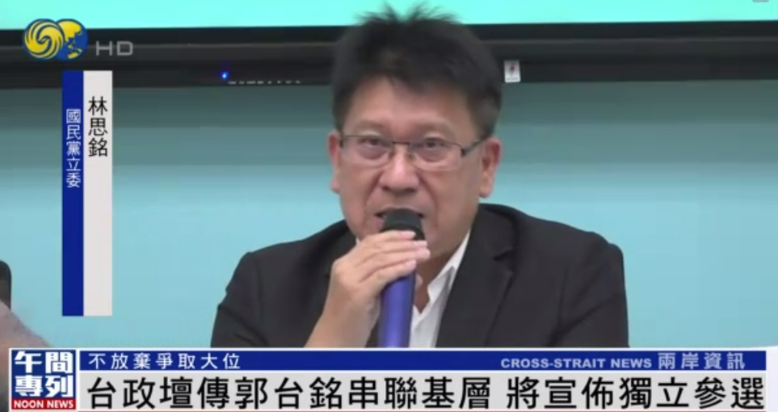

# 不放弃争取2024“大位”，传郭台铭串联基层，将宣布独立参选

鸿海集团创办人郭台铭争取被国民党征召竞逐2024失利，不过他似乎并未放弃竞逐“大位”，政坛传出郭台铭近来频繁和地方派系互动，最快将于7月国民党全代会前宣布独立参选。蓝军呼吁侯友宜尽快和郭台铭沟通，寻求合作的可能。

鸿海集团创办人郭台铭争取国民党征召，参选2024失利后，近来几乎消失在荧幕前， **但外传郭台铭依然没有放弃竞逐“大位”，他正为独立参选做准备。**

**台湾媒体人 王浅秋：**

我也的确在一些我的管道里面，听说郭台铭会跟相关的人，也就是台中中部的地方领导们，他们正在展开联署，要做独立参选。

**郭台铭的动向并非空穴来风，这段时间他持续勤走基层、参与活动，并频繁和地方派系互动。**
据传，有蓝营政坛大佬透露，郭台铭曾私下夸口称，他有信心可以并购柯文哲领军的民众党，并说服柯文哲同意“郭柯配”。若是国民党提名的侯友宜民调持续不振，他最快在7月国民党全代会前，会宣布独立参选。

**国民党“立委” 林思铭：**

大家都知道我是“挺郭”的，现在局势会随着选情变化，跟郭董事长，我们也希望可以积极去寻求合作。

**国民党“立委” 林为洲：**

在联署这部分，第一个没有那么容易，倒是反而有一种传闻，绿营会全力帮忙他（郭台铭）联署。

依照台湾选举“法规”，想要取得“大选”独立参选资格，必须要缴交100万台币的保证金，并在期限内取得近30万份的联署书，考验有意参选者的财力和物力，但这些对郭台铭来说都不是问题。
**而郭台铭若真的取得参选资格，对于2024选情的影响，国民党必定首当其冲。**

**来源：凤凰卫视黄家腾、柯志强 台北报道**

**编辑：秋果**

