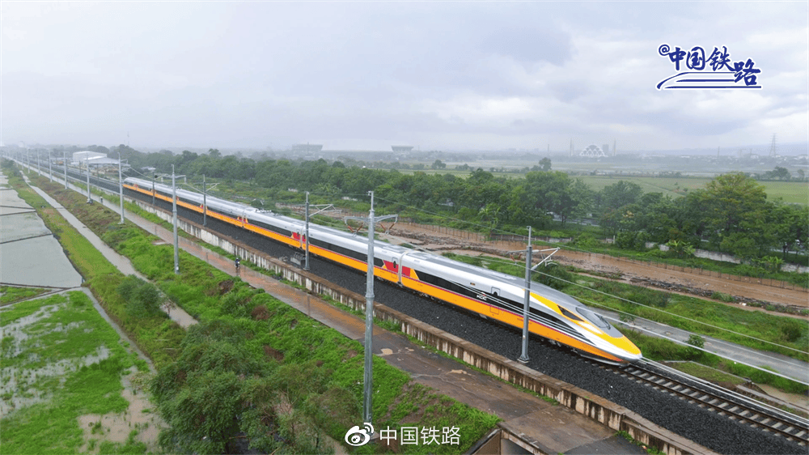
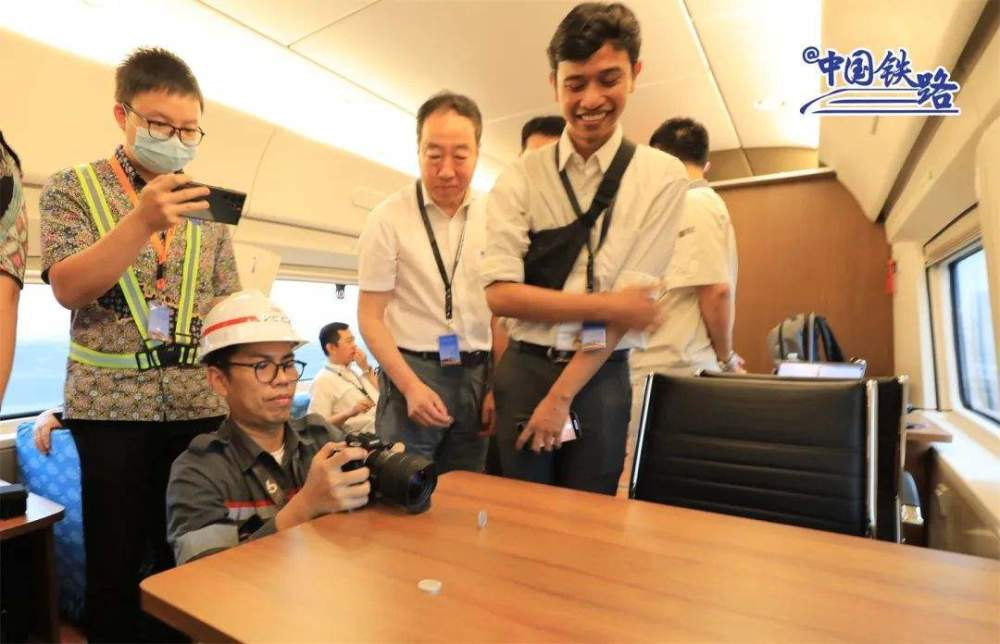
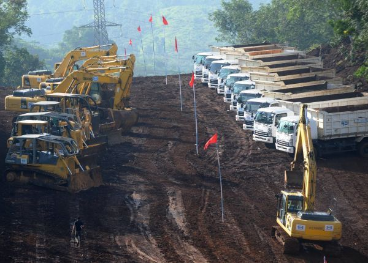

# 中国高铁出海首单，印尼雅万高铁时速达350公里，日媒高度赞扬

（观察者网讯）中国高铁出海“第一单”、印尼乃至东南亚国家的首条高铁——雅万高铁，近日实现时速首次达到350公里。作为中日在海外高铁争夺战中，“中国方案”首次战胜日本拿下的订单，雅万高铁的新突破也引发日本媒体的高度关注。

当地时间6月28日，日本交通运输产业媒体“Merkmal”发文表示，雅万高铁显示出日本与中国在高铁技术上已经形成了“难以逾越的实力差距”。

文章分析称，与中国国企背靠政府，通力合作高效建设不同，日本在承接海外订单时不仅要经过复杂的招标设计过程，各承建企业还会相互侵轧、层层分包外包，大大拖慢整体建设进度，而且日本国内的设备制造商也屈指可数，“与虚假的‘全日本’相反，这是真正的‘全中国’。”

日媒还特别注意到，雅万高铁与其他中企海外承建高铁项目部分采用了与中国国内相同的标准和设备，如此既能在出现故障时迅速从中国国内调用设备，建成后这些设备也可以继续应用到其他海外项目，这一点是“他国无法模仿的”。

雅万高铁是我国与印尼共建“一带一路”的代表性项目，全长142公里，建成通车后两地出行时间将由从3个多小时缩短至40分钟。这是我国初次在国外高铁动车全体系、全要素、全产业链的建设项目，在国际上具有重要的示范性作用。

遥想当初，围绕雅万高铁项目的竞争相当激烈，它不仅是中国高铁的海外“第一单”，更是中国首次在海外铁路项目中打败“世界公认”的“铁路强国”日本。

时任中国驻印尼大使谢锋曾介绍道，日本早在2008年就开始跟踪雅万高铁项目，先后做了3次可行性研究报告，但印尼政府始终没有做决定。在中国和印尼有关方面签署了关于就雅万高铁开展合作的谅解备忘录和框架安排后，日本更是一年4次派特使到印尼陈情游说。

经过几轮“厮杀”，中日竞争趋于白热化，2015年印尼选择将“绣球”抛给了中国。

雅万高铁自2018年6月9日正式开工建设以来，在中印尼两国元首亲自推动下，经过中印尼铁路建设者的共同努力，工程建设进展顺利。

印尼当地时间6月22日，雅万高铁联调联试综合检测列车运行时速首次达到350公里，标志着雅万高铁已达到设计速度标准，实现了联调联试阶段性任务目标。

日媒“Merkmal”注意到，雅万高铁在以最高营运速度行驶时的稳定性和安静性也是一流，竖立在车窗边缘的印尼盾硬币都不会倒下，报道援引印尼交通部长布迪和印尼海洋与投资统筹部长卢胡特的话称，“（乘坐体验）晃动更小，隔音效果更好”。

_图自微信公众号“中国铁路”_

报道称，印尼交通部已经委托多家欧洲铁路顾问机构，就投入运营前的安全性等事项进行最终评估，免费试运行最早可于7月进行，运营许可证或将提前至8月发放，最迟也会在10月1日之前。早些时候，印尼媒体曾报道称雅万高铁将于今年8月18日，也就是庆祝印尼第78个独立日（8月17日）期间如期开通。

Merkmal表示，由于印尼征地工作未及时跟上等原因，雅万高铁的进展一开始并不顺利。中方在2016年1月举行完开工仪式后，一直到2018年中旬才正式投入主体工程建设。

“虽然没能按计划开工，经历了（近）3年的空白期，但中方最终成功挽回了这3年毫无进展的落后局面。”Merkmal指出，中国从政府到承建企业“集中力量办大事”的上下通力合作是力挽狂澜的关键，日本企业在海外订单竞争中面对的并不是某一家具体的企业，而是“全中国”。

文章称，雅万高铁的建设工作集中在中印尼两国的几家大型国企，没有像日本官方发展援助项目（ODA）那样对日企进行复杂的招标，也不会出现早前在地铁项目中发生过的日企互相拖后腿，层层分包外包，造成时间和成本的大量浪费。

“尤其在最后一年的冲刺阶段，所有承建方肩负着中国的威严，团结一致合作推进工作的方式令人瞠目结舌。这是真正的‘全中国’，与虚假的‘全日本’恰恰相反。”Merkmal感慨道。

_资料图 图自新华社_

Merkmal特别注意到，雅万高铁以及中国正在援建的匈牙利-
塞尔维亚铁路，都采用了与中国国内相同的标准和施工设备，譬如DF4型机车、连续铺轨设备、养路设备、轨道检测车等。

如此能够节省成本，交货时间更快；而且一旦施工设备出现故障，中方随时可以从国内调拨相同的设备，保证工期和质量不受影响；更重要的是，建成后这些设备也可以继续应用到其他高铁项目上，日媒评价称这一整套模式是“其他国家绝对无法模仿的”。

报道透露，为了追赶进度，中方在雅万高铁建设中就陆续从国内追加了一些工程设备，在去年年底发生设备受损后也很快在一周内复工，“这是中国作为世界第一铁路大国绝对实力的体现。”

反观日本，Merkmal表示，同样的订单，日本企业要从零开始招标设计，而且国内像中国企业那样的设备制造商也屈指可数，很难说具备承接海外订单的能力。

文章最终批评日本政府连“保护本国铁路业发展的勇气都没有”，指其既不愿为铁路建设投入更多资金，也不愿支持本土企业赴海外争夺订单。

Merkmal特别提到，在雅万高铁试乘后，印尼海洋与投资统筹部长卢胡特宣布该国不再从日本购买二手列车的消息，而前脚日本天皇刚刚到访印尼。它怒其不争地发出连连质疑，“如果雅万高铁的承建方是日本，日本提出的需要大量征地、甚至要贯穿市区的高速铁路，我们真的能在预算内按时在2023年前开通吗？”

“只要中国继续投入巨额国家资金建设铁路，中国铁路基础设施建设的实力就不会动摇。在这种情况下，日本要如何与邻近的铁路大国竞争？”

**本文系观察者网独家稿件，未经授权，不得转载。**

