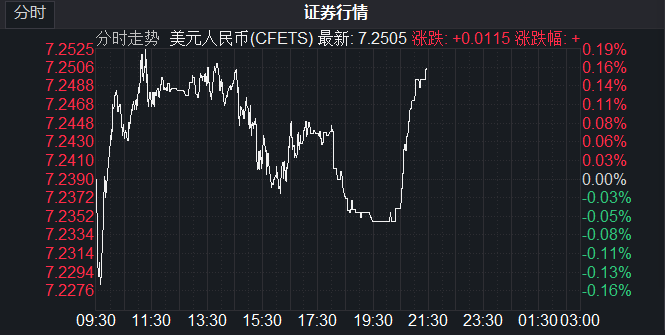
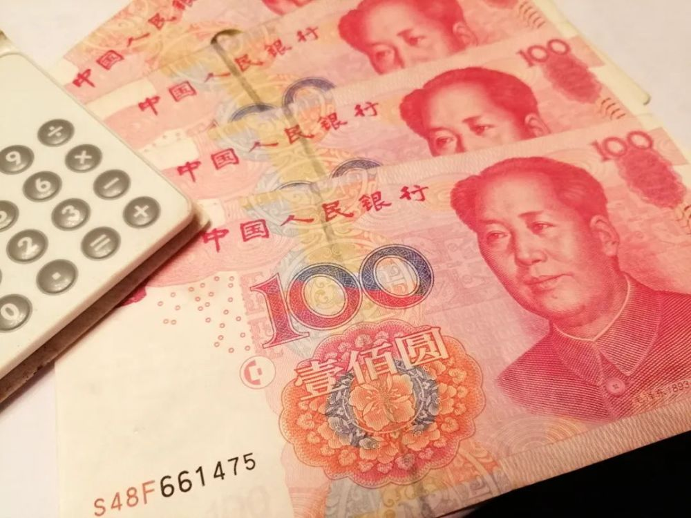
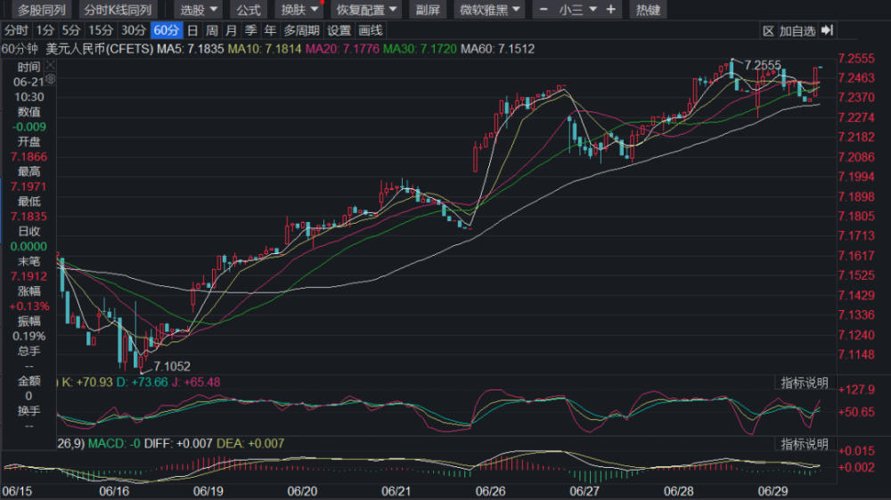
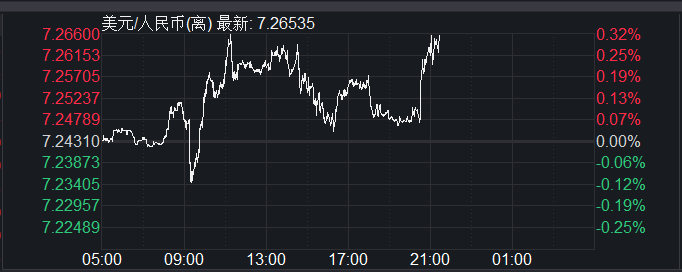
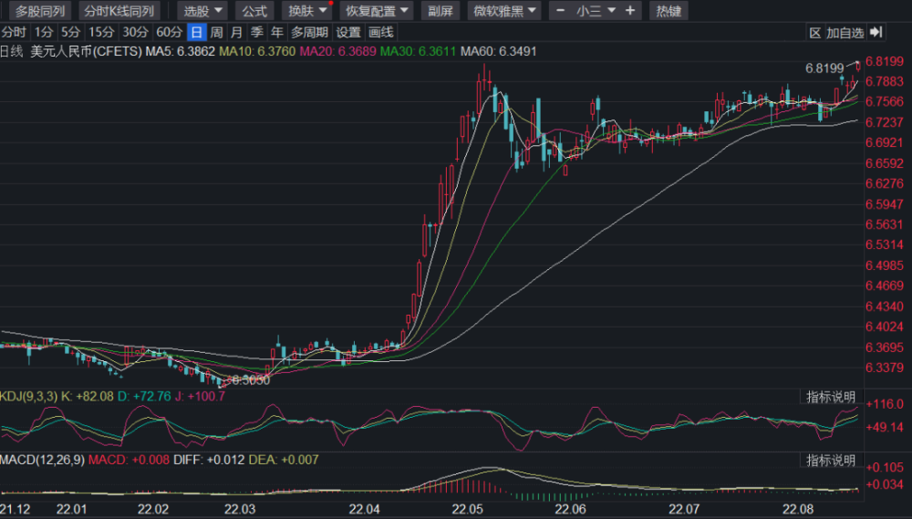
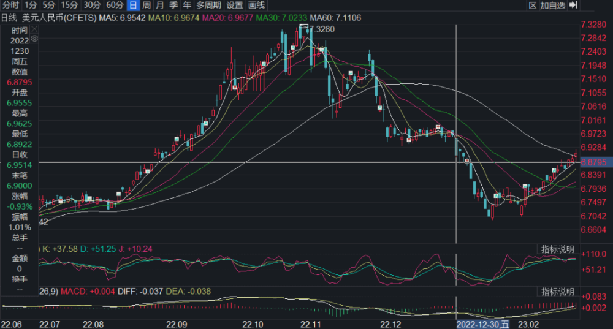
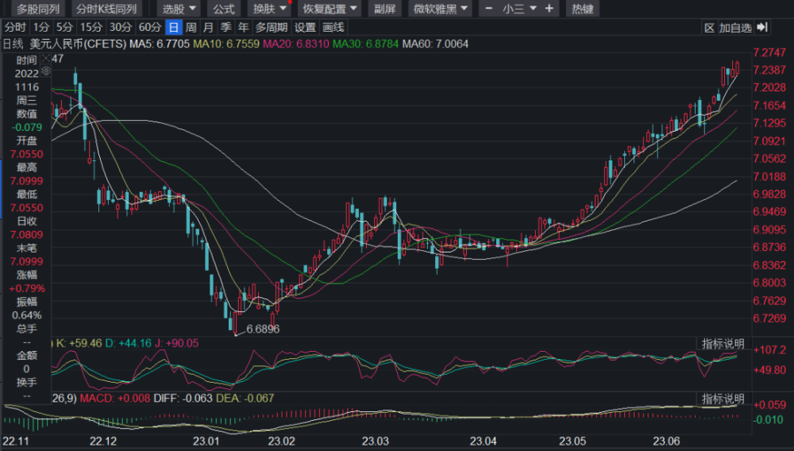

# 人民币汇率跌破7.25，分析师：警惕汇市“羊群效应”，下半年怎么走

近期，人民币对美元汇率持续贬值引发市场广泛关注。6月28日，在岸人民币对美元汇率盘中跌破7.25，离岸人民币一度跌至7.2692，均创下2022年11月以来的新低。6月29日盘中，
**在岸人民币再度跌破7.25关口，同时离岸人民币一度失守7.27关口** 。

_6月29日盘中，在岸人民币再度跌破7.25关口
图片来源：同花顺iFinD_

回顾2022年，人民币对美元汇率曾经历了两波较大幅度的贬值，一次是从去年4月中旬6.37快速调整至5月中旬的6.81，另一次是在去年8月15日MLF降息后从6.75持续调整，直至11月触达7.32的低点。与去年两波贬值相比，本轮人民币贬值存在哪些差异？

另外，面对人民币汇率下跌，市场有猜测认为央行或重新引入“逆周期因子”来稳定汇率。受访专家指出，为防止汇市“羊群效应”，不排除监管层重新引入“逆周期因子”，乃至动用其他汇市调控工具的可能。这并非要守住某一个具体点位，而是旨在控制贬值速度，避免市场情绪一边倒、极端化。

_图片来源：每日经济新闻 刘国梅 摄_

人民币对美元汇率再破7.25

5月以来，人民币对美元汇率持续下跌，接连突破7.00、7.10关口后，又在近日快速跌破了7.20、7.25关口。

6月26日，人民币对美元的在离岸市场双双走低，开盘即跌破7.20，随后继续下探，当日在岸报收7.2219，离岸报收7.2454。而在次日，在岸和离岸人民币汇率有所反弹，盘中陆续收复7.22、7.21关口，最终收盘在岸报7.2101，离岸报7.2239。

_近期在岸人民币报价走势
图片来源：同花顺iFinD_

不过，这一反弹势头并未延续下去。6月28日，在岸和离岸市场双双大跌，在岸人民币对美元汇率盘中跌破7.25，离岸人民币一度逼近7.27，均创下2022年11月以来的新低，日内贬值幅度近400基点。当日在岸人民币对美元汇率报收7.2455，离岸报收7.2431。

6月29日盘中，在岸人民币再度跌破7.25关口，同时离岸人民币也再度失守7.26关口。

_6月29日盘中，离岸人民币再度失守7.26关口
图片来源：同花顺iFinD_

光大银行金融市场部宏观研究员周茂华对《每日经济新闻》记者表示，近期人民币汇率贬值的因素可归结为几方面：

**一是经济复苏节奏不够理想，市场对政策宽松预期；**

**二是美联储鹰派言辞，引发美元走强预期有所抬头；**

**三是市场波动加大，对人民币汇率造成一定影响；**

**四是分红购汇季节性对市场短期供需扰动** 。

短期内美元指数走强

对人民币汇率形成被动贬值压力

此前，央行在2023年第一季度中国货币政策执行报告中指出， **当前外部环境更趋复杂严峻，国内经济内生动力还不强，需求仍然不足** 。

记者注意到，4-5月份，全国居民消费价格指数（CPI）、工业生产者出厂价格指数（PPI）均环比下降，制造业采购经理指数（PMI）低于临界点、非制造业商务活动指数下降。

另据海关统计，今年5月份，我国进出口3.45万亿元，增长0.5%。其中，出口1.95万亿元，下降0.8%；进口1.5万亿元，增长2.3%；贸易顺差4523.3亿元，收窄9.7%。

在此背景下，市场对于政策宽松预期提升。就在6月中旬，7天期逆回购、常备借贷便利（SLF）、中期借贷便利（MLF）的操作利率纷纷下调10个基点。随后，6月LPR报价出炉，1年期和5年期以上LPR均下调10个基点。

_6月，1年期和5年期以上LPR均下调10个基点 图片来源：央行网站_

“
**6月政策性降息落地后，其他稳增长政策尚未全面出台，特别是在5年期以上LPR报价下调后，市场对其他稳楼市措施何时推出还缺乏明确预期。由此产生的稳增长政策预期差是导致近期人民币较快贬值的一个主要因素**
。”东方金诚首席宏观分析师王青对《每日经济新闻》记者表示，在经历了6月16日的大幅反弹后，近几个交易日人民币再度走弱，主要原因在于当前市场贬值预期还未根本扭转。

对于6月政策性降息落地，以及由此造成的中美货币政策背离，王青表示，“可以看到，降息后中美利差倒挂程度并未出现进一步的明显加深；而且回顾去年的人民币汇率走势，也可以看出央行降息的影响不大。”

_6月28日，美元指数接近站上103点
图片来源：同花顺iFinD_

此外，当地时间6月28日，美联储主席鲍威尔在葡萄牙辛特拉举行的欧洲央行研讨会上表示，多数决策者预计今年将再加息两次，且不排除连续加息的可能性。此番鹰派发言使得市场对美联储加息预期抬升，加上美国政府债务上限危机等，短期内美元指数走强，对人民币汇率形成被动贬值压力。

与去年两轮贬值有何差异？

回顾2022年，人民币对美元汇率曾经历了两波较大幅度的贬值，一次是从去年4月中旬的6.37快速调整至5月中旬的6.81，另一次是在去年8月15日MLF降息后从6.75持续调整，直至11月触达7.32的低点。之后开始反弹，当年12月30日收于6.9514。

_去年4月中旬至5月中旬，在岸人民币报价从6.37快速调整至6.81
图片来源：同花顺iFinD_

今年以来，在岸和离岸人民币对美元汇率累计贬值幅度均超过4%，近期再度跌跌不休不断刷新年内新低。与去年两波贬值相比，本轮人民币汇率贬值有哪些差异？

王青对记者表示，从驱动因素上看，本轮人民币贬值与2022年的两轮贬值过程差别不大， **都主要是受经济基本面预期转弱带动**
。不同之处在于，2022年疫情及防控政策演化决定了经济基本面及人民币汇率走向；而今年4月以来，
**在外需趋于放缓、楼市再度转弱影响下，国内经济复苏势头偏弱，则成为推动本轮人民币贬值的主要原因** 。

_去年8月15日MLF降息后，在岸人民币报价从6.75持续调整至11月的低点
图片来源：同花顺iFinD_

另外，从持续时间及贬值幅度上看，与2022年的两轮贬值过程相比，本轮贬值过程相对较为平缓；而且从结售汇、跨境资金流动、市场贬值预期等数据观察，这段时间外汇市场整体运行状况也较为稳定。这或是迄今为止，监管层尚未动用汇市调控工具的一个原因。

记者注意到，由于近期人民币汇率波动幅度较大，市场有猜测认为央行或将重新引入“逆周期因子”来稳定汇率。

_今年以来，在岸人民币对美元汇率累计贬值幅度超过4%
图片来源：同花顺iFinD_

王青表示，考虑到近期人民币贬值势头有所加快， **为防止汇市“羊群效应”，不排除监管层重新引入“逆周期因子”，乃至动用其他汇市调控工具的可能**
。“需要指出的是，这并非要守住某一个具体点位，而是旨在控制贬值速度，避免市场情绪一边倒、极端化。”

周茂华则认为， **近期人民币汇率波动较大，但整体并未偏离合理区间，市场未出现恐慌、非理性行为，人民币汇率弹性显著增强**
。国内坚定推动人民币汇率市场化改革，在市场出现明显偏离基本面、非理性、顺周期或恶意做空等行为之前，央行更多会采取预期引导。

下半年人民币汇率走势如何？

多位受访者表示， **接下来人民币汇率走势将取决于经济基本面的影响** 。

周茂华对记者表示，从内部环境看， **仍看好人民币汇率表现，预计下半年人民币汇率有望继续在合理均衡水平附近双向波动**
，主要是国内经济活动恢复，服务业稳步复苏，宏观政策精准有力，经济稳步复苏。从外部环境看，美联储加息尾声，及海外经济趋缓等，利好人民币走势。另外，从实际利率看，我国利率仍高于欧美。

王青认为，当前人民币汇率正处于贬值压力较大阶段， **但短期内直接冲破去年11月低点的可能性不大**
。这主要有两方面原因：一是在贬值速度偏快阶段，为防止汇市“羊群效应”，监管层有可能动用各类汇市调控工具，遏制过快贬值势头；二是6月降息之后，接下来会有一批稳增长政策措施陆续推出，政策预期差导致的人民币贬值走势有望缓解。

另外，王青认为，“ **在下半年国内物价水平有望持续处于温和状态的前景下，单纯的人民币走弱不会实质性地影响国内货币政策走向**
。作为全球第二大经济体，我国会将货币政策独立性放在头等重要的位置。如果下半年需要进一步加大逆周期调控力度，降息降准都有空间。”

与此同时，当前适度增加人民币汇率弹性，释放贬值压力，也能更好发挥其宏观经济自动稳定器作用。更重要的是，下半年货币政策适度宽松，会有效提振经济复苏动能，而这正是对人民币汇率最有效的支撑。

**记者|** 李玉雯

**编辑|** 段炼 马子卿 盖源源

**校对|** 程鹏

｜每日经济新闻 nbdnews 原创文章｜

未经许可禁止转载、摘编、复制及镜像等使用

