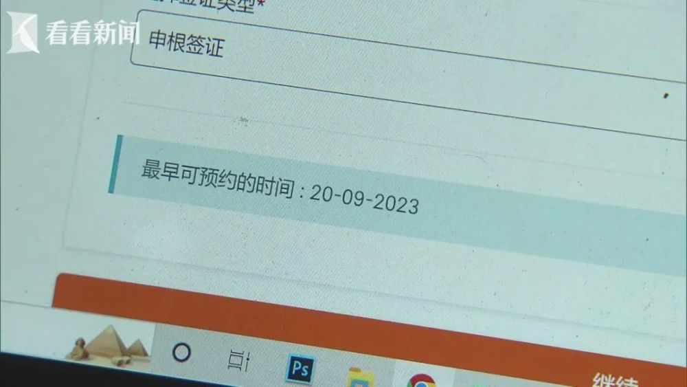

# 出境游大火？上海市民办签证大排长龙，黄牛喊价四千一个号有的是人要

随着暑期的来临，上海市民出境游的热情也高涨起来。前两天，小观报道了上海办签证预约一号难求，甚至还催生了高价黄牛市场，不少网友都分享了自己的经历和感受。

那么，现在实地情况如何呢？

昨天一早，记者来到位于上海四川中路的VFS全球签证申请中心，虽然还未开门，前来等候办理签证的人群，却已经绵延到了街角。

前来签证的市民纷纷表示：“我是三月份预约的，当时几乎就只剩这个时间了。”“四月份就预约的，非常难约，蹲在网站上去抢的。”

记者了解到，其中不少市民是早早预约办理德国的签证。德国申根签证官方预约网站显示，德国上海签证申请中心显示最早可预约时间，已经是近三个月后的9月20号。

而其他申根热门国家的签证，预约情况也并不乐观。意大利的上海签证申请中心已经没有可预约时段，另一暑期热门旅游目的地，美国的B1/B2旅游签证预约等待时间更是长达4个多月。

那么提供签证服务的旅游平台和旅行社是否会好一点呢？

德国旅游签证“最早出发日期”是12月20号，也没有提供任何加急服务的旅行社。意大利旅游签证在上海送签的"最早出发日期"在12月8号，且办理时间长达109个工作日。

线下更有不少旅行社索性关闭了欧美热门国家的签证申请业务。携程签证平台预计，今年暑期出入境签证办理量将有望超越2019年同期。

由于欧美热门国家签证一号难求，要想赶上暑期出行，目前出境游以短线出行为主，日本、韩国、泰国、新加坡都是热门暑期办签城市。

**汪怡明 携程公关总监：**
目前出入境业务迎来了毕业季和暑假季的高峰，长短线的出境需求订单量也是比2019年增长了近一倍左右，部分欧洲国家出现了一证难求的情况，短线像泰国、马来西亚，大家会去的比较多，因为他们签证处理相对简单。

那么，如果市民着急出行怎么办？一方面，市民可以选择在预约网站上多刷刷“捡漏”，不过捡漏存在不确定性。

而想要去申根国家旅行的，也可以选择一些不太热门的申根国家进行曲线申请。根据规定，前往多个申根国家旅行，可以向第一个进入的国家或者主要目的地国家提出签证申请，而这样持申根签证者可以在整个申根区停留不超过90天。

（有网友分享了“曲线”到德国的方法）

不过，由于申根签证申请原则上必须根据提交的行程，向停留时间最久的国家申请；而在无法确定主要停留国家的情况下，可以申请首先入境国家的签证。因此，这样的“曲线”申请也存在一定的风险。如果发签证国不是你的第一入境地，或者是行程主要在其他的热门国家，就存在拒签的可能，或者拿到签证也有可能被拒绝入境。

也正是因为签证的一号难求，也催生了黄牛卖号的市场，一些抢不到号的市民只能花高价买黄牛号，到外地去办理签证。

记者了解到，一些黄牛对于德国8月份的预约名额签证报价要4000多元。

昨天，VFS全球签证申请中心也发布提醒，目前中国游客签证申请需求量较大的目的地包括加拿大、德国、意大利、英国和美国。在签证申请旺季，很多国家地区政府的签证处理时间可能会逾期延长，建议大家尽早规划申请签证。

除了出境游火爆，国内的暑期游市场也同样人气满满。业界预测今年或是五年来最火暑期游。

**这些城市最为热门**

从途牛预订数据来看，上海、南京、北京、广州、天津、杭州、深圳、武汉、成都、苏州等地用户出游热情更为旺盛，出游人次位列“暑期出游热门客源地”榜单前列。

今年暑期旅游预订数据显示，用户出游距离、出游天数增长趋势显著。出游天数方面，选择5-6天行程的用户占假期总出游人次的28%，其次为3-4天和7-8天的行程，占比分别为25%和17%。此外，有超过8%的用户选择了10天以上的出游行程。

**出游距离方面**
，途牛统计显示，国内长线游占据暑期旅游消费主导，出游人次占比为61%。其次为周边游和出境游，占比分别为19%和20%。这一占比随着进入暑期后周边游订单预订高峰的到来，预计还将有较为明显的变化。

**国内长线游目的地方面**
，云南、新疆、北京、甘青连线、海南、内蒙古、广西、四川、江苏、陕西等目的地咨询及预订热度更为靠前。随着部分地区陆续进入“炙烤”模式，用户避暑纳凉需求强烈，云南、新疆、甘肃、青海、内蒙古等避暑目的地出游热度升温显著。

**周边游方面** ，北京、上海、浙江、江苏、广东、河北、安徽、重庆、四川、天津等地用户出游热情更胜一筹。

暑假你计划去哪里旅行？“签证申请大军”中有你的身影吗？

本文综合自：新闻坊、周到上海、第一财经

相关作者：魏克鹏 李刚 汪鑫 乐琰

微信编辑：佳思敏

校对：CP huisong

