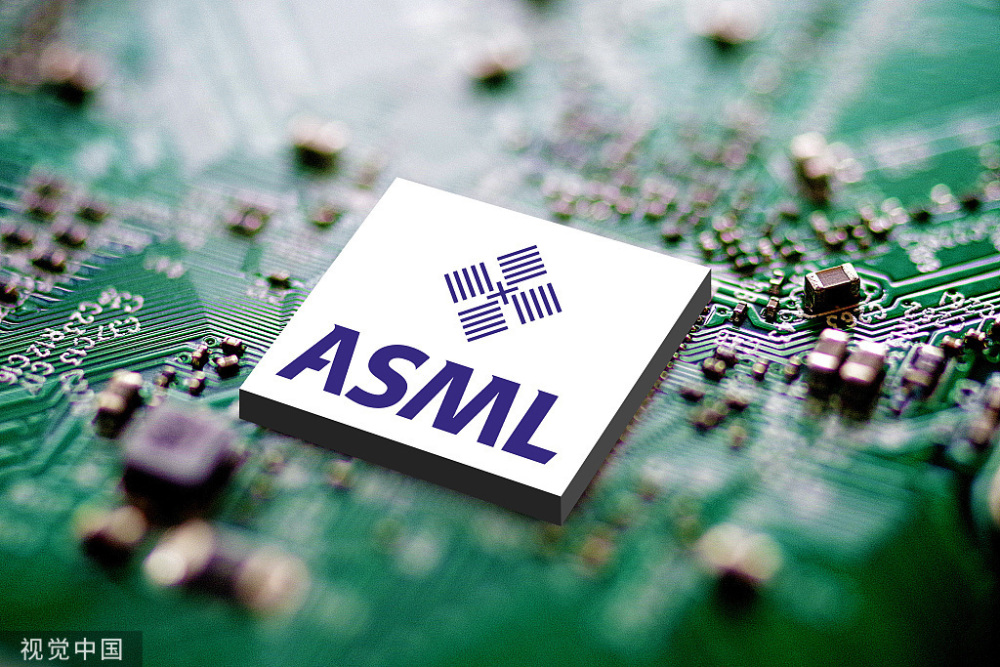

# 外媒又放风：美拟阻止“特定中国厂商”获得更多荷兰芯片制造设备

【环球网报道】据路透社6月30日独家报道，美国和荷兰企图给中国芯片制造商来一套“组合拳”，将进一步限制对华销售芯片制造设备。报道称，虽然荷兰已计划限制荷兰光刻机巨头阿斯麦公司（ASML）及其他公司的某些设备出口，但美国预计将更进一步，利用其广泛影响力阻止“特定中国厂商”获得更多荷兰设备。

_荷兰阿斯麦公司（ASML）
图源：视觉中国_

路透社称，荷兰政府，阿斯麦公司和负责监督出口管制的美国商务部都对此拒绝置评。

报道继而提到，去年10月，美国以国家安全为由在对华半导体出口领域实施新的出口限制，并游说其他有关键供应商的国家采取类似的限制措施。据美媒此前报道，2022年10月，美国政府宣布，除非得到美国商务部的许可，美国企业将不可以向中国供应先进计算机芯片、芯片制造设备和其他产品。

在去年10月8日的外交部例行记者会上，外交部发言人毛宁就针对美国实施新的芯片出口管制措施表示：美方出于维护科技霸权需要，滥用出口管制措施，对中国企业进行恶意封锁和打压，这种做法背离公平竞争原则，违反国际经贸规则，不仅损害中国企业的正当权益，也将影响美国企业的利益。这种做法阻碍国际科技交流和经贸合作，对全球产业链供应链稳定和世界经济恢复都将造成冲击。美方将科技和经贸问题政治化、工具化、武器化，阻挡不了中国发展，只会封锁自己、反噬自身。

另据美国《华尔街日报》27日援引知情人士的消息称，美国商务部可能最快在下月初采取行动，禁止英伟达等芯片制造商在事先未获得许可证的情况下，向中国和其他相关国家的客户出口芯片。在此消息传出后，路透社29日称，英伟达首席财务官科莱特•克雷斯表示，虽然限制对华出口人工智能芯片不会立即产生重大影响，但这“将导致美国产业永久丧失机会”。

