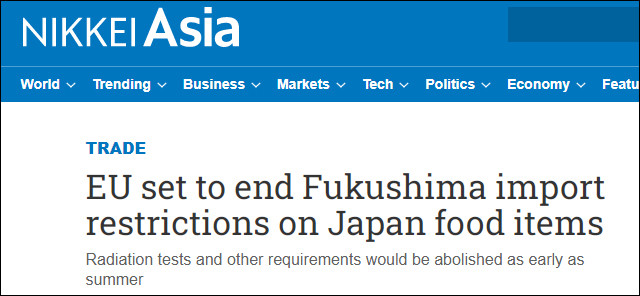

# 多家日媒称欧盟拟撤销对日本福岛等地食品进口限制，欧盟未证实

（观察者网讯）多家日媒6月30日援引消息人士的话说，欧盟委员会计划完全撤销对包括福岛水产品在内的日本食品的进口限制，最快会在今年7月公布相关决定。但欧盟方面尚未证实有关消息。

_日经亚洲报道截图_

2011年福岛核事故发生后，欧盟对来自日本的食品采取进口限制，其后分阶段放宽限制措施。截至目前，欧盟仍要求来自福岛等10县的水产品、菇类等食品提供放射性物质检测证明。如果欧盟撤销进口限制，则不再需要上述检测证明。

日本时事通信社援引的消息人士称，撤销这些限制“有助于平息关于日本食品安全的负面传言”。这名消息人士还表示，欧盟是否撤销限制的最终决定，可能会在7月中旬，即日本首相岸田文雄与欧盟领导人在布鲁塞尔举行首脑峰会期间做出。

欧盟委员会发言人接受共同社采访时表示，食品的安全性是极其重要的优先事项，福岛核事故以来，欧盟对日本食品进口附加条件的做法正是出于这个缘故。

该发言人还指出，欧盟会定期审议有关措施，如有必要，将考虑根据最新的进展和科学数据作出修改。不过，有关欧盟是否撤销限制，这名发言人并未证实。

福岛核事故发生后，全球一度有55个国家和地区对日本农林水产品和食品采取限制进口措施。美国于2021年9月撤销了这些限制，日本也一直在寻求欧盟撤销有关限制。

今年4月，7国集团（G7）农业部长会议召开前，日本农相野村哲郎在与欧盟农业委员沃伊切霍夫斯基的会谈中，要求欧盟尽快撤销福岛核事故后对日本产食品实施的进口限制。

日经中文网称，如果欧盟撤销进口限制，当初与欧盟联动引入限制措施的挪威和瑞士等国也将考虑效仿。届时，对日本进口食品实施限制的国家或地区有望从12个减少至7个，这将有利于日本产食品扩大出口。

共同社称，欧盟27国若决定撤销进口限制，日本政府与维持限制的中韩等国之间的谈判将成为今后的焦点。

_共同社报道截图_

此外，有关福岛核事故后续进展，截至6月26日，福岛核污水排放海底隧道工程已全部完工，日方计划在6月28日对排放设备进行验收检查，合格后即意味着排放设备的准备工作全部就绪。

近日，有韩国媒体曝出日本政府提前获得了国际原子能机构福岛核污染水处置技术工作组最终评估报告草案，并提出实质性修改意见，对最终报告结论施加了不当影响。日本官员还向机构秘书处工作人员行贿100余万欧元。

对此，外交部发言人毛宁在6月28日的外交部例行记者会上表示，中方高度关注有关报道。日本政府有责任对相关报道给出令人信服的解释。国际原子能机构秘书处也应该作出回应。事实上，报道加剧了国际社会对日本核污染水排海的担忧，人们有理由质疑国际原子能机构技术工作组最终评估报告结论是否公正客观。

毛宁表示，中方在此问题上的立场是一贯的。核污染水排海关乎国际社会共同利益，不是日方一家私事。中方敦促日方正视国际社会和国内民众关切，停止强行推动排海计划，切实以科学、安全、透明的方式处置核污染水，并接受严格的国际监督。中方希望国际原子能机构秘书处秉持客观、专业、公正原则，充分尊重和采纳技术工作组各方专家意见，拿出一份经得起科学和历史检验的评估报告，不为日方排海方案背书。国际社会将拭目以待。

**本文系观察者网独家稿件，未经授权，不得转载。**

