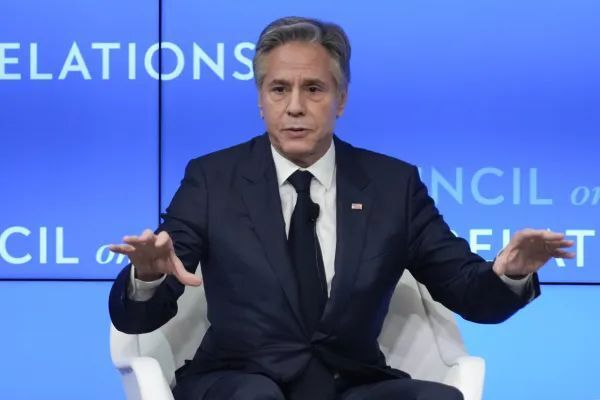
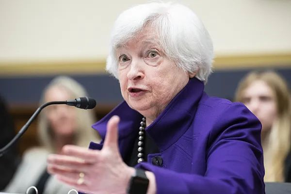

# 布林肯现场几次“变脸”：才说“一中政策”不变，又妄言“保卫台湾”

一边称必须找到和中国“和平共处的方式”，一边又希望“在竞争中处于优势地位”；前脚刚提及“一中政策”不变，后脚就直言“保卫台湾”......

据美国媒体报道，当地时间28日，美国国务卿布林肯在美国智库外交关系委员会主办的一次活动中，接连发表了上述矛盾的言论。

当地时间2023年6月28日，美国国务卿安东尼·布林肯在纽约外交关系委员会主办的活动中发表讲话。

长安街知事（微信ID：Capitalnews）注意到，自上周结束访华行程之后，布林肯连续“变脸”。

当地时间25日，布林肯在接受美国哥伦比亚广播公司（CBS）采访表示，“双方存在分歧不是秘密。美方将一如既往捍卫美国利益和价值观，继续做中方不喜欢的事，说中方不喜欢的话，就像中方毫无疑问将继续做和说美方不喜欢的事情一样。”

“我们对布林肯有关言论表示不满。”28日，中国外交部发言人毛宁在例行记者会上回应称，美方出于错误对华认知，奉行错误对华政策，对中国进行围堵、遏制、打压，无端对中国进行攻击抹黑，肆意干涉中国内政。美方说的这些话，做的这些事违背国际关系基本准则，中方理所当然坚决反对。

**言行相诡**

“美国不想成为世界经济增长的唯一引擎，美国希望看到一个在经济上取得成功的中国。”

据报道，在被问及美国是否正试图减缓中国的经济增长时，布林肯在上述活动中给出了这样的答案。

他同时表示，华盛顿在经济上并没有与北京“脱钩”，“我们与中国的贸易去年达到了历史最高水平，去年我们流向中国的外国直接投资比2014年以来的任何一年都多。”

他辩称，“美国制裁的中国个人和实体大约有一千多个。而在中国注册的企业有4800万家，只影响到了在中国经营的极少数公司，所以这很难被称为‘脱钩’。”

而实际情况是，出于所谓“国家安全”的考量，美国正试图采取措施限制美国资金和技术流向中国。据彭博社此前报道，拜登政府即将批准一项涉华行政命令，旨在监管并有可能切断美国在半导体、人工智能和量子计算等领域的对华投资。

此外，据多家外媒报道，由美国众议院“中国问题特别委员会”牵头，多名美国共和党议员致函布林肯，要求不要续签已经有数十年历史的《中美科技合作协定》。作为中美建交的基础性文件之一，《中美科技合作协定》每5年续签一次，数十年来从未中断过，而最近美国政府内部却传出正在辩论是否续签该协定的风声。

此番一系列掩耳盗铃的操作，美国究竟是想要欺骗谁？还是说，在美方看来，这一切不过是“去风险化”之举？一个在经济上取得成功的中国，真的是美方希望看到的吗？

就在布林肯做出上述表述之际，美国财政部长耶伦表露了访华意愿。

_美国财政部长耶伦 资料图_

“我们需要就彼此分歧进行讨论，以免产生误解，不要误解彼此的意图。”据路透社报道，当地时间28日，耶伦在接受采访时，承认美中之间存在分歧，并称她希望访华与北京重新建立联系。

此前，耶伦曾表示，试图与中国“脱钩”将是灾难性的，压制中国人民的经济进步并不符合美方的利益。

“美国已成功控制包括先进半导体在内的最敏感技术，这些将中国拒之门外的企图肯定会伤害中国，但它们也伤害美国。”今年年初，美国前财政部长亨利·保尔森在美国《外交》杂志上发文称，“华盛顿正面临与经济引力背道而驰的风险。”

**文字游戏**

还是在上述活动中，布林肯又针对台湾问题，玩起了文字游戏。

“拜登四次表示，如果台湾被中国大陆‘袭击’的话，美国会‘保卫台湾’，而白宫官员则四次作出澄清。美国的对台政策到底是什么？”

面对主持人的发问，布林肯先是声称，美方会继续在“一中政策”的指导下行事，这些都没有改变，也不会改变。

布林肯与美国外交关系委员会主席理查德·哈斯就拜登政府的外交政策进行对话。

随后，他话锋一转又称，“根据与‘台湾关系法’，我们的长期政策是采取必要措施，尽可能确保台湾有自卫的能力……美国对台湾的支持需要看实际行动，自拜登政府上任以来，已经九次宣布对台军售。”

一面表现出对既定政策的承认，另一面又在中方的底线边缘反复试探，这难道就是布林肯试图探索的“和平共处的方式”吗？

不过，美方的这种反复拉扯的操作早已不足为奇。

就在布林肯访华前夕，他刚提及“需要探索与北京合作的潜力，以应对打击合成毒品等全球挑战”，美国司法部随后就起诉了其因涉芬太尼问题在第三国以“钓鱼执法”方式诱捕的中国公民，把“毒贩”的帽子强行扣在中国头上。

“我们希望确保在这场竞争中，我们处于优势地位，并能够掌控未来的发展方向。”布林肯称，美国与中国是“长期竞争”的关系，且没有“明确的终点线”。

竞争并不可怕，可怕的是毫无底线的恶性竞争。尽管布林肯当日同时透露，接下来中美高级官员将开始增加互访，直接、清晰、坦诚地处理分歧，了解双方意图，并且在符合双方利益的领域展开合作。

但事实上，探究布林肯的诡辩到底几个意思，已经毫无意义。解决问题的底层逻辑不改变，美国政客嘴里所谓的沟通，也只是徒劳。

（图源：视觉中国）

