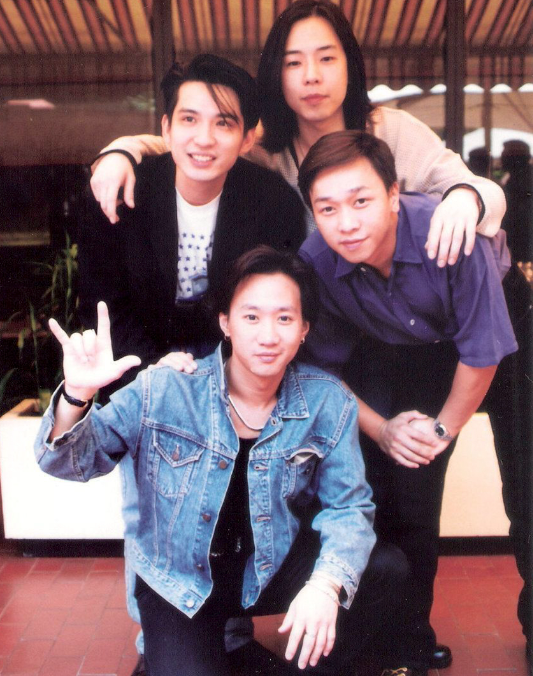

# 有关黄家驹，你不知道的30件事

1983年，黄家驹在录制节目时不慎跌落舞台，短暂的31年就此落幕。黄家驹逝世30年后，人们依然听他的歌，缅怀他，可大众真的了解他吗？今天就跟大家一起聊聊，有关黄家驹，你不知道的30件事。

黄家驹的名字来源于母亲的一个梦，母亲在生他前，梦到一匹健壮的骏马，所以给他取名“驹”。

“家和万事兴，家驹口不停”，黄家驹特别喜欢说话，又因为本身思想成熟，因此被送外号“老伯”。

黄家驹第一把吉他是捡来的，等手法熟练后他给自己买了新的，弟弟家强想要旧吉他，却被黄家驹拒绝，必须得用钱买。他希望，弟弟能学会珍惜。

噪音是黄家驹的灵感来源，每次坐车都特别想写东西，《Amani》就是他坐在车上用十分钟写完的。

成名前的黄家驹，主职是卖保险的，但因为他性格倔强容不下沙子，生意并不好。

Beyond所有歌里，有32首歌出现了“理想”一词，这是黄家驹内心深处的呐喊。

黄家驹第一场演唱会是贷款举办的，看得人屈指可数，演唱会还没结束观众就走完了。从此他开始向商业低头，《再见理想》就此诞生。

《海阔天空》这首歌中，大众最喜欢的一句是“原谅我这一生不羁放纵爱自由，也会怕有一天会跌倒”，这首是Beyond十周年专辑的主打曲，讲述了组合十年来的心路历程，没想到这句话却有一天一语成谶。

黄家驹生前没有私家车，出门要么骑单车，要么公司送，因为他没有驾照。

四人中最黑的黄家驹，最爱用护肤品保养，因为他皮肤不好，必须在脸上涂很多东西。

晚上不睡、白天不起，说的就是黄家驹，这也导致他经常迟到。每到重要活动，司机都会提前到他家把他吵醒，逼着他起床。

黄家驹的音乐启蒙来自姐姐，他很喜欢拿着羽毛球拍模仿大卫·鲍威。

Beyond最初火起来的是黄贯中，因为成名曲《大地》是他唱的，后来人气最高的是黄家驹。

黄家驹生前最大的愿望是给父母买一栋宽敞的房子，可这个愿望还没实现，他就跟我们永别了。

《真的爱你》火了后，他在家苦恼了一个星期，因为这种商业歌曲不是他心中理想的音乐。

黄家驹喜欢一个来自上海的小女孩，还委托邻居小妹替他告白，最后自然是失败了。三年后他才知道，邻居小妹暗恋他，在上海小姑娘面前说了他很多坏话。

《喜欢你》是黄家驹唯一一首讲述自己爱情的情歌，可对方在分手不到半年后就闪婚了。

黄家驹曾被人骂吉他水平差，于是他开始疯狂练习，还拿到了吉他比赛的冠军，就是在这场比赛里，他认识了叶世荣。

《海阔天空》不是在香港写的，因为香港不下雪，黄家驹在日本生活不如意，才有了这首歌。

黄家驹最爱的不是歌，而是音乐。他曾在演唱会上做吉他solo，结果台下观众嫌太吵，他弹了一小节就生气地走了，从此很少吉他solo。

黄家驹没有得过金针奖，也没有得过世界终身金针奖，他的地位，无需用奖项来评判。

《Amani》和《和平与爱》，真的不是同一首歌，前者发表于91年，后者发表于93年。

黄家驹对死亡早有预感，他会在家里练习跳沙发，这在他看来是很有成就感的事情。

Beyond很讨厌上综艺、做游戏，黄家驹干脆带着团队去日本发展，结果才发现这里就是一个大香港。

黄家驹最常用的手势，意思是“爱”，他爱音乐，也爱这个世界。

黄家驹是二哥，并不是因为他在家里排行第二，而是因为他是黄家强的第二个哥哥，他们上面还有一个大哥，黄家驹其实在家里排行老四。

《光辉岁月》是黄家驹写给南非黑人领袖曼德拉的，据说曼德拉出狱后听到这首歌，潸然泪下。

Beyond乐队收养了6个非洲孤儿，黄家驹经常给他们打电话。

作为一个摇滚歌手，黄家驹不爱喝酒，偶尔会抽烟。

黄家驹一生都挣扎在商业和摇滚之间，试图找到一个平衡点，《海阔天空》是他的一声呐喊，也是他的绝唱。

