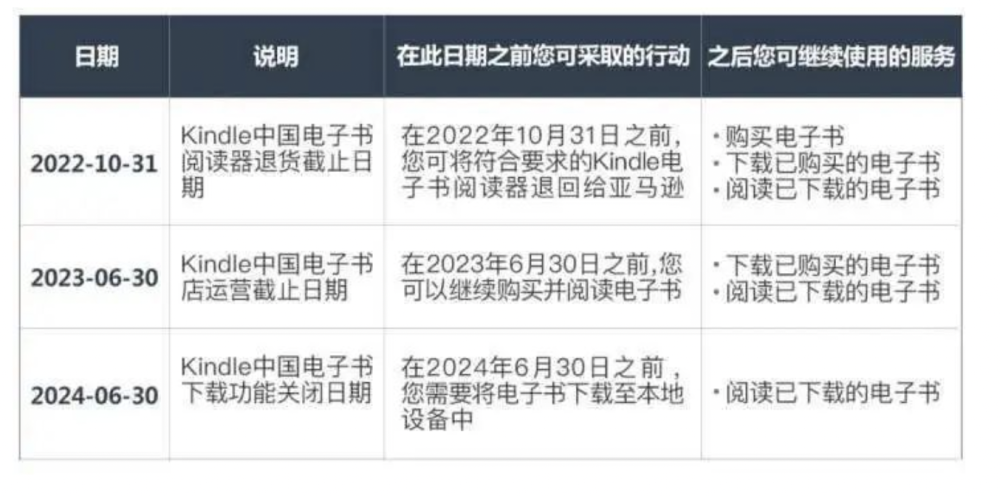
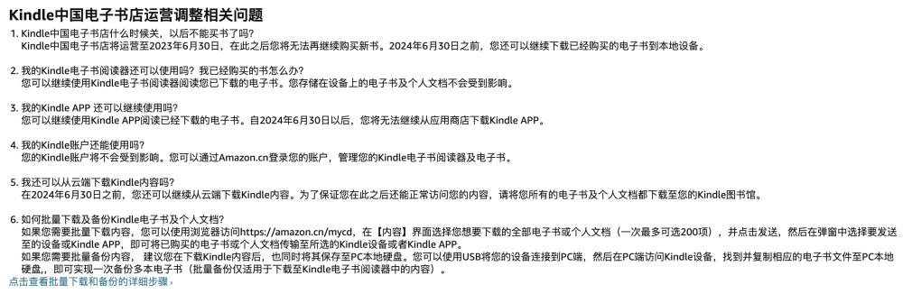
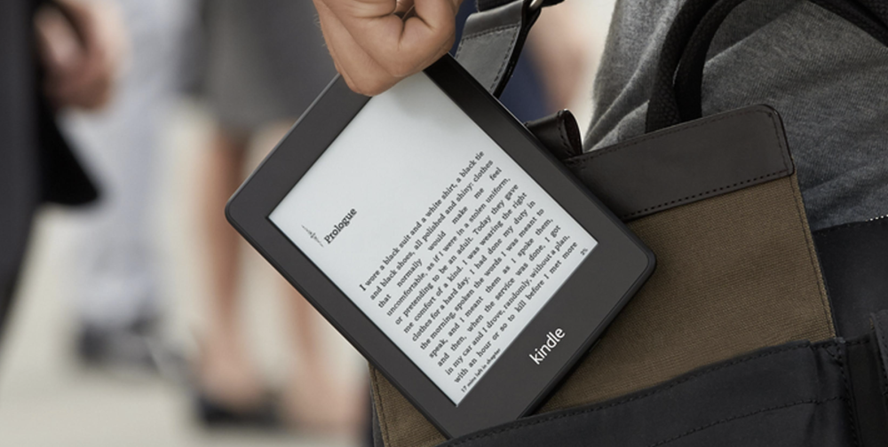
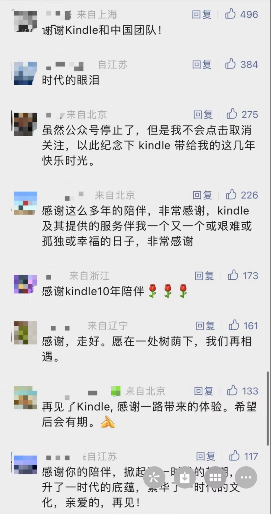

# 正式谢幕！Kindle中国电子书店今起停运

入华十年的Kindle正式谢幕。6月30日，亚马逊公司旗下Kindle中国电子书店停止运营，此后用户无法再购买新的电子书。

记者注意到，早在一个月前，亚马逊Kindle服务号发布了“告别手册”，解答了一系列和停止运营有关的问题，并提醒用户在2024年6月30日前，务必下载已购电子书到本地设备或者Kindle图书馆。同时，对购买了Kindle
Unlimited会员权益的用户，Kindle将退还尚未到期部分的会员费用。退款申请入口将于2023年7月1日开放，并通过短信及邮件通知申请退款的具体方式。

另外，亚马逊还表示，Kindle客户服务将支持至2024年6月30日。用户可以继续使用Kindle电子书阅读器阅读已下载的电子书，存储在设备上的电子书及个人文档不会受到影响。用Kindle
APP阅读已经下载的电子书也不受影响，但自2024年6月30日以后，用户将无法继续从应用商店下载Kindle APP。

Kindle电子阅读器诞生于2007年，被认为是亚马逊最成功的硬件产品之一。由于采用电子纸屏幕，Kindle被认为护眼且阅读方便，兼顾了纸质书籍的体验和电子阅读器的便捷。Kindle电子阅读器诞生后的几年里，电子书成为亚马逊增长最为迅速的品类之一，并掀起全球电子书阅读热潮。

2013年，Kindle正式进入中国，并一度成为电子书的代名词，被众多文艺青年所青睐。2018年，Kindle阅读器在中国发展进入巅峰，年销量突破百万。

如今，Kindle在中国画上句号，也令不少读者恋恋不舍。6月30日，记者看到许多用户主动前往Kindle服务号官方微信下留言怀念。有读者感慨称“时代的眼泪”；有读者表示感谢Kindle的10年陪伴，希望后会有期；还有的读者十分不舍，认为这是“属于我们的青春记忆”。

“阅读神器”Kindle的败退，一方面是自身硬件和软件创新上的缓慢，让国产品牌后起直追；另一方面也源于手机阅读APP和短视频抢夺用户时长。记者注意到，汉王、翰林、掌阅、当当、京东、科大讯飞等厂商均推出了自己的电子阅读器，市场竞争百花齐放。而根据阅文集团财报公布的数字，早在2019年底，微信读书的注册用户数量超过了2亿。

Kindle停止运营当日，记者对购买使用过Kindle的用户进行了一个随机小调查。80%的用户表示，自己出于新鲜感或冲动购买Kindle后一段时间后，使用频率变得极低，大部分时候都在抽屉“吃灰”，平时阅读更是以手机为主，选择APP看书或听书。

还有少部分用户表示，自己仍青睐电子墨水屏，但早已不再使用Kindle，它的屏幕相对较小，功能也很单一，无法实现语音转写或会议记录等办公功能。

近年来，亚马逊在中国市场不断收缩，自7月17日起，亚马逊中国将不再提供应用商店服务。目前，亚马逊中国的业务包括海外购、跨境电商、云科技、智能硬件与服务等。

图片来源：亚马逊、微信

（来源：北京日报客户端）

