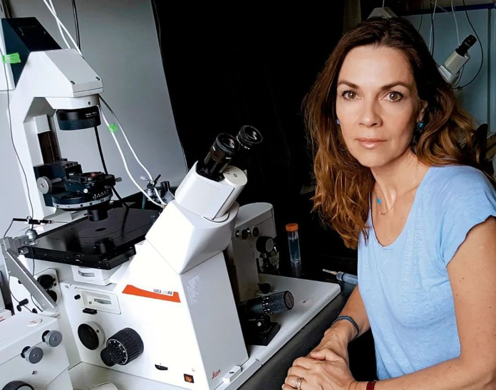
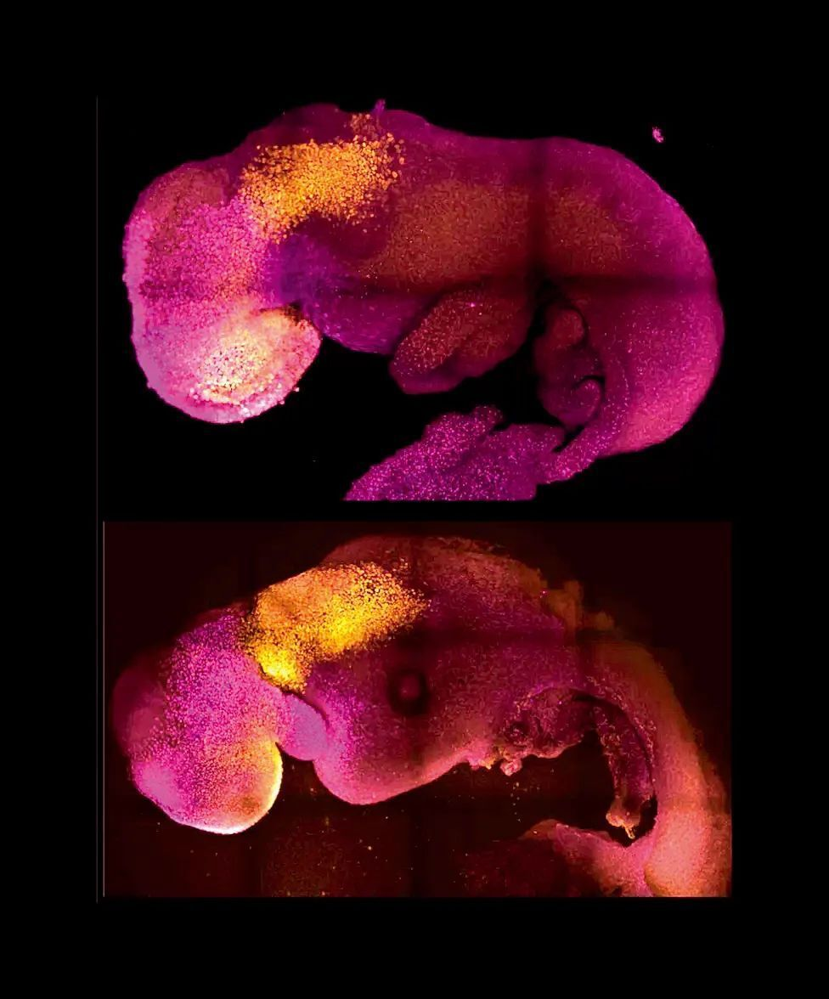

# 流水线“造人”成真？科学家成功培养首个人类胚胎模型

当地时间6月14日，在美国波士顿举行的国际干细胞研究学会年会上，剑桥大学和加州理工学院教授马格达雷娜·泽尼克-
格茨宣布了其团队近期的研究成果。她表示，其团队创建了全世界首个具备羊膜和生殖细胞的人类胚胎模型，并发布了未经同行评议的预印本论文。

几乎同一时期，以色列魏茨曼科学研究所雅各布·汉纳团队、中国昆明理工大学灵长类转化医学研究院李天晴团队、美国匹兹堡大学医学院副教授莫·易卜拉欣卡尼团队，也相继发表预印本文章，公开相似的研究成果。

傅剑平是密歇根大学安娜堡分校生物医学工程系教授。2017年，他和团队共同构建了世界上第一个三维、但不完整的人类胚胎模型，在该领域引发轰动。他还曾担任国际干细胞研究学会（ISSCR）指南工作组成员。傅剑平对《中国新闻周刊》说，6年来，他目睹了类胚胎模型这一前沿领域的飞快进展，
“快到政策监管已跟不上它的发展速度”。但他同时表示，现在的人类胚胎模型，离真正发展为一个鲜活的生命还有很长的距离。

**完整人类胚胎模型首次活到14天**

如果以周计算，一个新生命是这样诞生的：精子和卵子结合后，第一周，受精卵迅速分裂、发育，形成中空的囊胚。大约从第二周起，囊胚开始着床，即进入子宫，以便从母体吸收营养。受精第14天时，囊胚已分化出了滋养层、上胚层和下胚层细胞。第三周起，胚胎进入原肠胚阶段，上述三种胚层细胞会发展为不同的器官，比如，外胚层发育成皮肤、眼睛等，中胚层发育成排泄、循环系统等，内胚层发育为呼吸道、肝脏等。

一直以来，囊胚进入子宫后，受伦理和技术限制，人类该阶段的早期胚胎发育机制都是难以破解的“黑匣子”。人们了解的相关知识，只能来自于对其他哺乳动物胚胎的研究。昆明理工大学灵长类转化医学研究院教授李天晴向《中国新闻周刊》介绍，临床数据显示，约30％的人类胚胎无法成功着床，在胚胎着床后的一两周内，还有约30％的人自然流产，原因无从得知。

近年来，国内外多个研究团队希望借助胚胎干细胞，生成人类早期胚胎的“复制品”，模拟胚胎自然发育，寻找早期流产和胎儿先天性缺陷的成因。此外，胚胎模型也有助于解释细胞分化的机制，促进再生医学发展。

近期，上述四个研究团队都表示在实验室生成了着床后的胚胎模型，主要差别在于实验方式的不同。泽尼克-
格茨团队使用转基因技术，将两个成熟细胞转化为具有胚胎形态的诱导多能干细胞，再与一个胚胎干细胞结合，生成胚胎模型。易卜拉欣卡尼团队则对诱导多能干细胞进行基因改造，形成胚胎和胚外组织，模拟胚胎发育。李天晴向《中国新闻周刊》介绍，该团队通过模拟囊胚的结构，将三种胚层细胞组合，使其在合适实验条件下，生成人类胚胎模型，“在外观和结构上和人类真实的胚胎非常相似”。汉纳团队与李天晴团队的实验方式相似。

但目前，这四项研究均未通过同行评议。当地时间6月16日，多位发育生物学家通过英国非营利机构《科学媒介中心》，表达了对泽尼克-
格茨和汉纳团队预印本论文的看法。德国马斯克·普朗克分子细胞生物学与遗传学研究所博士杰西·维弗利特认为，汉纳团队使用化学混合物将胚胎干细胞带入正确的状态，似乎比使用转基因效果更好。巴塞罗那大学遗传学教授杰玛·马凡尼也认为，从预印本来看，汉纳团队的胚胎模型结构上更像自然胚胎，而泽尼克-
格茨小组胚胎模型的结构较差。

在傅剑平看来，这四个小组的成果，尤其是汉纳团队和李天晴团队构建的模型，能够模拟完整的人类胚胎从着床到原肠胚开始阶段，是这些研究与过去相比最令人振奋的地方。

合成人类胚胎模型已发展多年。2017年3月，泽尼克-
格茨团队在美国《科学》杂志发表研究成果，其团队将小鼠的胚胎干细胞和滋养层干细胞放在同一个培养皿中，让它们“对话”，这些干细胞自主发育，实现了人类第一次在体外构建人造小鼠胚胎。李天晴告诉《中国新闻周刊》，泽尼克-
格茨的实验是该领域极为重要的突破，此后，越来越多团队投身合成胚胎的研究。

2017年，傅剑平研究团队构建了第一个三维的人类胚胎模型，类胚胎发展到第二周，形成了羊膜囊及原肠胚开始发育的一些特征。不过，傅剑平向《中国新闻周刊》介绍，当时，他们团队的成果缺乏构成胎盘的滋养层细胞，生成的是一个不完整的胚胎模型。

此外，科学家也在努力延长胚胎模型在体外的存活时间。2021年，美国得克萨斯西南医学研究中心教授吴军团队和澳大利亚蒙纳士大学教授何塞·波罗团队在《自然》杂志分别发表论文，生成了完整的囊胚模型。李天晴介绍，直到2022年，相关研究还停留在类囊胚阶段，让类囊胚持续发育到着床，效果并不好。

2022年9月，汉纳和泽尼克-格茨团队先后利用小鼠胚胎干细胞生成胚胎模型，与受精第8.5天的真实小鼠胚胎相似。泽尼克-
格茨团队表示，合成小鼠胚胎发育出了大脑和跳动的心脏，相当于进入人类胚胎的原肠胚阶段。这些突破直接推动了人类胚胎模型的发展。汉纳团队在预印本中提到，此次研究，他们重复了合成小鼠胚胎的方法。在傅剑平看来，此次四个团队能几乎同时产出研究成果，正是因为“万事俱备”。该领域的研究者已经可以将自然人类胚胎体外培养时间从7天延长到14天，而且，相关研究在小鼠和非人类灵长类动物胚胎模型的方向上取得了突破进展。如今很多相关技术开始运用到人类胚胎模型上。

但多位专家强调，目前的人类胚胎模型，并不等于真实的人类胚胎。检验人类胚胎模型与自然胚胎是否相似，一个核心标准是，验证合成胚胎模型能否持续发育，成长为胎儿。但因技术和伦理限制，各个实验室只能将合成胚胎模型培养至第14天便销毁。傅剑平介绍，目前，研究者只是观察胚胎模型的形状、细胞数量和组成、细胞的三维结构是否与自然胚胎相似。在此前提下，研究者还会观察模型的蛋白质、基因表征等，进一步判断两者相似度。

李天晴告诉《中国新闻周刊》，他们将合成的人类胚胎模型与自然胚胎发育的照片对比，观察到两者结构高度相似，“但结构相似不代表它们是一样的”。这其中的一大难题是，合成人工胚胎的研究尚处于初步阶段，“我们甚至都不知道，受精后第二周的人类自然胚胎长什么样，没有参考资料，也缺乏研究手段”。李天晴介绍，此次研究中，他们优化了实验条件，显著提升了类胚胎存活到14天的有效率，但对哪些因素会影响胚胎发育，仍需进一步研究。

_马格达雷娜·泽尼克-
格茨。图/剑桥大学_

_受精第8天时，自然的（上）与人工合成的（下）小鼠胚胎看起来相似，两者均可见大脑与心脏结构。图/Amadei
and Handford_

**胚胎模型会长成婴儿吗？**

合成人工胚胎领域的每一次发展，都伴随着激烈的伦理争议。随着人类胚胎模型存活时间的延长，与真实胚胎的形状越来越像，人们担忧，胚胎模型是否有一天会长成真正的婴儿？就像赫胥黎在《美丽新世界》中所描写的反乌托邦世界，人类在名为“繁育中心”的胚胎工厂，以流水线的方式繁殖后代。

2019年~2021年，傅剑平担任ISSCR指南工作组成员。他对《中国新闻周刊》提到，ISSCR并不认同合成人工胚胎的表述，更倾向于称其为“胚胎模型”。这能更准确反映出多数实验者的目的——创建的并非一个“胚胎”，而是一个模型，避免公众恐慌。而且，ISSCR指南明确，禁止将人类研究胚胎模型、人类-
动物嵌合胚胎移植到动物或人类子宫中。

近期发表相关成果的科学家也都强调，他们并不打算将胚胎模型植入人类子宫中。李天晴表示，研究胚胎模型的目的，是为了研究着床发育失败、早期器官发育的机制，未来探索在体外构建类器官，用于研究人类发育和药物毒理学、药物筛选测试等。

此外，过去40多年，“14天规则”是一项被广泛接受的人类胚胎培养的国际伦理原则。早在1984年，英国政府为回应大众对试管婴儿的恐慌，将“14天”规定为体外受精的人类胚胎存活的时间界限，写入《沃诺克报告》。为什么是14天？相关研究者认为，14天后，中枢神经系统开始发育，胚胎可能会感受到疼痛。

目前，已有十多个国家将“14天规则”写进法律或伦理指南。2021年5月，ISSCR发布更新版《干细胞研究和临床转化指南》（以下简称《指南》）。《指南》放宽了14天的限制，允许在特殊情况下，一些研究者可以向所在国家监管部门申请研究发育14天后的人类胚胎，但未明确规定培养天数的上限，这带来了潜在的伦理风险。

新版《指南》提到了对人类胚胎模型的监管，如果模拟的是特定发育阶段或特定的胚胎结构，而非完整胚胎或胎儿的持续发育，经相关监管委员会评估后，可免于专门的科学和伦理监督程序。傅剑平参与更新了新版《指南》。他对《中国新闻周刊》说，彼时，工作组都没想到人类胚胎模型的研究进展如此之快。“新版《指南》增加了对人类胚胎模型的管理条件，但并不全面，只是提出，如果人类胚胎模型包括完整的细胞谱系，科学家在设计实验时要格外小心，并需证明研究的合理性。”

“14天规则”明确限制的是受精后的人类胚胎体外培养。不少国内外相关研究者认为，胚胎模型只是类胚胎，不受其监管。有学者提出，在人类胚胎模型不断发展的当下，业内需要就“什么是胚胎”达成一致。“只能由精子和卵子结合产生，还是只需要有相同的细胞类型或者结构，抑或是发育的潜力？”

_体外培养食蟹猴胚胎双光子三维重构（上）及示意图（下）。
图/昆明理工大学灵长类转化医学研究院_

“如果回到5年前，我对人类胚胎模型的监管看法可能跟很多研究者相同。”傅剑平对《中国新闻周刊》说。但近5年，越来越多实验室投入研究，人类胚胎模型已成为发育生物学和干细胞生物学中最火热的领域，这让他变得更为谨慎。他认为，如果胚胎模型和人类的自然胚胎有一样的细胞及一致的细胞三维结构，尽管目前生成方式上仍有差异，从伦理和管理角度看，胚胎模型和自然胚胎应受到同等看待和管理。但业内并未就此形成共识。

短期内，人类胚胎模型在体外存活的时间超过两周，在技术上仍是难题。汉纳描述说，制作一个人类胚胎模型，不仅让它发展到第14天，还要具备胚胎应有的所有特征，并且羊膜腔、中胚层、下胚层、滋养层都在正确的位置，这是目前该领域的一个挑战。他在预印本中提到，目前胚胎模型存活到第14天的比例很低。

但从长远看来，超过14天的人类胚胎模型研究是一个必然趋势。汉纳在回复《中国新闻周刊》的邮件中明确提到，创建这些胚胎模型的终极目的，是为了在培养皿中生成由干细胞分化的器官，因此他们必须了解人类胚胎如何形成器官，这往往发生在胚胎发育的第7~35天。

受访研究者认为，避免伦理争议的一种办法是，科学家在设计模型时，构建不完整细胞谱系的类胚胎，比如，不加入会发展为胎盘的滋养层细胞，明确实验目的并非是“造人”。在傅剑平看来，这是胚胎模型能继续发展、同时能通过伦理审查的唯一途径。“用工程的手段来控制和调节胚胎模型的发育，做一些更有实际意义又不超越伦理限度的工作。”傅剑平说。

傅剑平认为，ISSCR出台的《指南》只是行业指导规范，更重要的是，各国政府部门和研究资助机构要尽快出台相关管理政策。“研究伦理方面的政策一定要跟上，规划好伦理红线，而且要非常严格地执行，这对人类胚胎模型研究的可持续性非常重要。”傅剑平说。

发于2023.7.3总第1098期《中国新闻周刊》杂志

杂志标题：首个人类胚胎模型意味着什么？

作者：杨智杰

