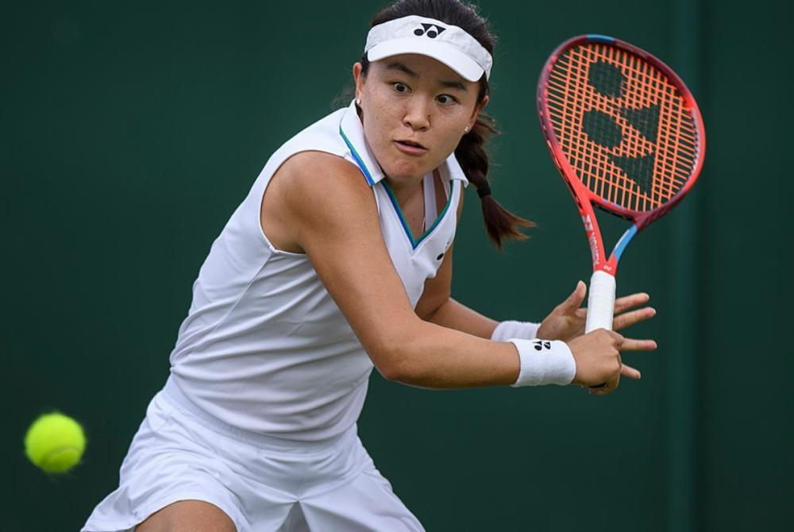

# 温网女单签表出炉：朱琳对决世界第一，郑钦文战大满贯双打7冠王

北京时间6月30日，温网女单正赛签表出炉。今年温网女单正赛总共有7位中国金花的身影，从抽签结果来看，几人可谓是喜忧参半。朱琳在首轮将会面对世界第一斯瓦泰克，王曦雨和王欣瑜两人则抽到了资格赛选手。

温网前差1位没能成为种子选手的朱琳，将会在首轮比赛面对世界第一斯瓦泰克。作为4届大满贯冠军得主，斯瓦泰克拥有着高出一档的实力。首轮比赛朱琳想要突破斯瓦泰克这一关，难度可想而知。

除了朱琳之外，还有2位中国选手被抽到了1/4区。资格赛突围的袁悦，会在首轮比赛面对两届大满贯冠军得主阿扎伦卡。不久前在法网女双夺冠的小花王欣瑜，会在首轮比赛对阵从资格赛突围的亨特。

郑钦文是金花中唯一的种子选手，她在首轮的对手是7届大满贯双打冠军得主西尼亚科娃。如果能够突围的话，郑钦文在第2轮的对手是华裔选手刘婧文和特苏伦卡之间的胜者。第3轮郑钦文对位的种子选手是15号种子萨姆索诺娃，两人此前交手4次各赢2场。

张帅和郑钦文同处2/4区，已经遭遇单打11连败的张帅，会在温网首轮面对20号种子维基奇。如果能够在维基奇身上终止连败的话，张帅在第2轮的对手是美国名将斯蒂芬斯和佩特森之间的胜者，第3轮可能遭遇12号种子库德梅托娃或是万卓索娃。

首次参加大满贯就闯入正赛的白卓璇进入3/4区，会在首轮面对世界排名第90位的邦纳文图尔。如果能够突围成功的话，她在第2轮的对手很可能是赛会6号种子、去年亚军得主贾巴尔。

王曦雨在首轮比赛将会面对的是从资格赛突围的俄罗斯小将安德列娃，如果能够在首轮比赛取胜的话，第2轮她将会面对前法网冠军克雷吉茨科娃和沃特森之间的胜者，第3轮可能遭遇22号种子波塔波娃。

中国金花温网首轮对阵：

【24】郑钦文 VS 西尼亚科娃

朱琳 VS 【1】斯瓦泰克

张帅 VS 【20】维基奇

王欣瑜 VS【Q】亨特

王曦雨 VS 【Q】米拉·安德列娃

【Q】袁悦 VS 【19】阿扎伦卡

【Q】白卓璇 VS 博纳文图尔 ​​​

