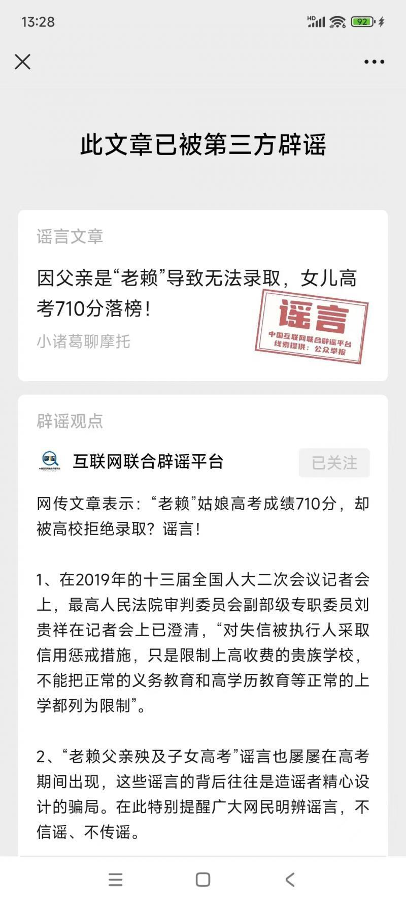

# 父亲是“老赖”导致女儿710分落榜？法官：类似故事纯属谣言

日前，一篇《因父亲是“老赖”导致无法录取，女儿高考710分落榜！》的文章在微信流传，北京青年报记者注意到，类似文章在网络已经流传了数年，互联网联合辟谣平台称，“老赖父亲殃及子女高考”谣言屡屡在高考期间出现，这些谣言的背后往往是造谣者精心设计的骗局。

北京丰台法院执行局副局长郭威告诉北青报记者，“这些纯属谣言。故事版本迥异，但情节惊人雷同。”

**类似故事已经流传多个版本 情节基本相同**

文章称，一个女生高考考了710分，却因父亲贷款失信而被学校拒绝。招生办认为她的父亲不讲信用，女儿也很可能受到影响，高校不能录取品行不端的人。

北京青年报记者查询发现，文章类似的故事已经流传多个版本，情节基本相同，都是因为父亲是“老赖”，女儿考了710分却未被录取，不同的只是考生名字有时候不一样。故事的主人公有时候叫“潇潇”，有时候叫“小霞”，有时候叫“露露”。

除了这个版本，还有一些别的类似故事，如“老赖老爹不还钱，儿子遭名校拒录”、“考上知名大学竟然无法录取，只因父亲是老赖”等。

**最高法曾澄清：不能把正常教育都列为限制**

北京青年报记者注意到，目前该文章的页面打开以后已经无法看到原文，而是互联网联合辟谣平台的辟谣观点。

互联网联合辟谣平台称，在2019年的十三届全国人大二次会议记者会上，最高人民法院在记者会上已澄清，对失信被执行人采取信用惩戒措施，只是限制上高收费的贵族学校，不能把正常的义务教育和高学历教育等正常的上学都列为限制。

“老赖父亲殃及子女高考”谣言也屡屡在高考期间出现，这些谣言的背后往往是造谣者精心设计的骗局。在此特别提醒广大网民明辨谣言，不信谣、不传谣。

北青报记者注意到，长春市绿园区人民法院也曾刊发普法文章，称随着社会信用体系的日益完善，“一处失信、处处受限”的信用惩戒大格局逐步形成，部分高等院校（特别是国防类院校），资格审查相对严格，考生很有可能因为父母的失信行为无法通过学校政审。

6月30日，北京青年报记者以考生家属的身份咨询了一些警察院校，一名警察院校招生工作人员表示，他们招生的时候只看政审合格不合格，考生父母有人被列为失信被执行人是否会影响考生，具体要看考生所在地的公安机关考察结果。

北京青年报记者查询发现，从一些公安院校政治考察的项目和标准上看，被依法列为失信联合惩戒对象的政治考察不合格，但并未明确考生父母是“老赖”的情况下考生是否合格。

**执行局长：纯属对法律错误解读 用耸人听闻网络谣言博人眼球**

北京丰台法院执行局副局长郭威告诉北青报记者，类似这些故事版本迥异，情节却惊人雷同，皆因父母是失信被执行人，也就是俗称的“老赖”，其子女高考高分但却未被录取，用耸人听闻的标题配上追悔莫及的照片以博人眼球。

“这些纯属谣言。”郭威表示，被执行人一般会被采取限制消费措施（以下简称“限消令”）或纳入失信被执行人名单的处罚措施。其中，限消令主要是限制其高消费及非生活或者经营必需的有关消费，根据《最高人民法院关于限制被执行人高消费及有关消费的若干规定》第三条第（七）项规定，子女不得就读高收费私立学校。该规定初衷在于督促被执行人尽快履行给付义务，从而禁止被执行人为其子女入学支付高昂学费，而非限制其子女受教育的权利。
而被纳入失信被执行人名单的，主要用途是法院向社会公布被执行人的信用状态，表示其在有执行案件时，具有以伪造证据、暴力、威胁等方法妨碍、抗拒执行的；以虚假诉讼、虚假仲裁或者以隐匿、转移财产等方法规避执行的；违反财产报告制度的；违反限制高消费令的；被执行人无正当理由拒不履行执行和解协议的；其他有履行能力而拒不履行生效法律文书确定义务的。

郭威表示，而上述两种措施主要是在经济消费方面和信用惩戒方面进行约束的，而非限制孩子们接受正常的义务教育和高学历教育等的正当权利。同时他提醒，作为被执行人的家长应主动履行法定义务，以免因自己的失信行为波及无辜的子女，影响孩子们的学习和生活。

文/北京青年报记者 李铁柱 王浩雄

