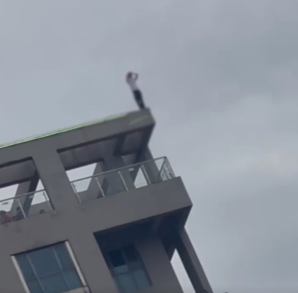
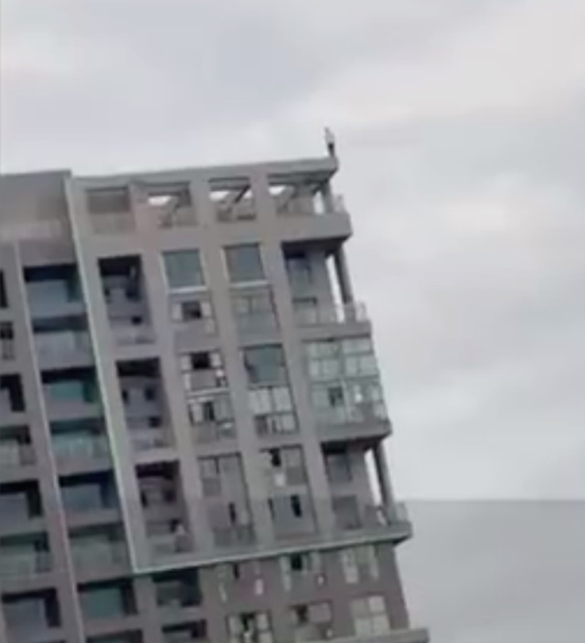

# 男子欲跳楼遭围观者起哄“不跳不是人”，官方：会依法处理起哄者

6月29日，江苏苏州吴中区一高楼上，一名青年男子在边缘徘徊，想要跳楼轻生。有路人不仅未劝阻，还起哄喊“不跳不是人”。爆料称，几小时后男子从高楼跳下不幸身亡。

据时间视频报道，30日，吴中区委宣传部回应，男子是因家庭琐事轻生的。木渎派出所民警称，“会依法处理起哄者，或进行口头教育。”

**> >>此前报道**

6月29日，江苏苏州吴中区一高楼上，一名青年男子在边缘徘徊，想要跳楼轻生。

有画面显示，楼下有人言语刺激他，朝他大喊“不跳不是人”，旁边还有人哄然嬉笑。

据百姓关注报道，目击者张女士称当天下午就看到男孩爬上了高楼，之后还有人目睹他情绪崩溃，哭泣抓头。“在楼顶抹眼泪，抓头。他年纪轻，阅历不够，已经在崩溃边缘了，还这样刺激他，真的很可怜。”

事发后，消防、公安、急救等赶到现场紧急处置。多名目击者向记者证实，21时许，该男子从高楼跳下不幸身亡。

另据澎湃新闻报道，6月30日，辖区派出所称，确有此警情，就围观群众起哄情况，处警民警会控制现场秩序。“当时我们队员处理的时候，会注意控制现场秩序的。”

对此，吴中区回应，跳楼男子非高考生，该名工作人员表示，其他具体情况待公安部门调查。

**【来源：九派新闻综合时间视频、百姓关注、澎湃新闻】**

**相关报道：**

苏州小伙楼顶站数小时后跳下身亡，围观者曾起哄“不跳不是人”，律师：起哄者可治安处罚

