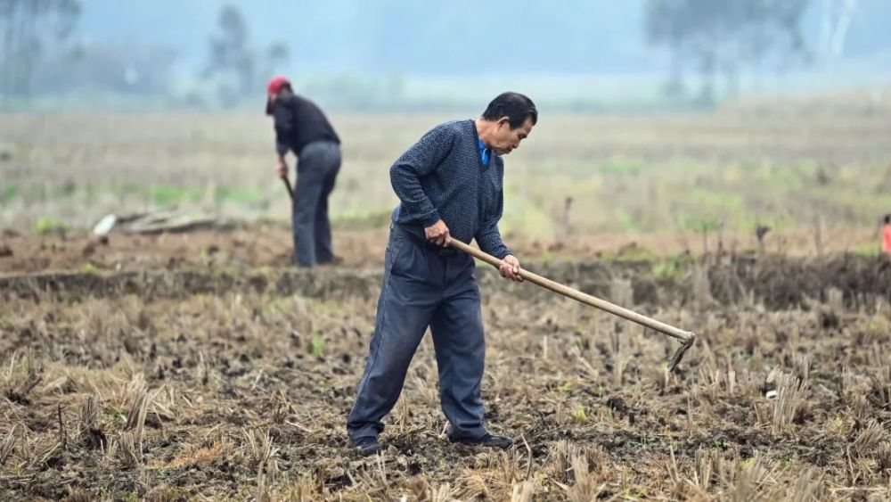

# 秸秆还田十多年，土壤有机质和肥力显著提升，但病虫害也同步增加

*本文为《半月谈》2023年第12期内容

半月谈记者在部分农业大县调研发现，大规模秸秆还田10多年后，耕地土壤有机质含量增加，地力提升，为粮食稳产高产奠定了基础。同时，部分涉农经营主体反映，秸秆还田操作不当，致使一些地方农作物生长中的病害、虫害、草害、冻害加剧，亟待引起重视。

**以前没那么多病虫害**

位于中部粮食主产区的一家专业化农业服务公司，为当地约10万亩耕地提供耕作服务，该公司负责人近年来注意到当地粮食生产中病虫害增加问题。“病虫害发病早了，而且发病频次增加了。”该负责人说，一季小麦要杀虫4次，以前只需要一两次，玉米以前顶多打一次药，现在也得打两三遍药，而且越往南病虫害增加现象越明显。

“病虫害增加与大规模秸秆还田存在直接关系。”该负责人认为，秸秆里边有大量病菌、虫卵，温度、湿度适宜时，秸秆就成了“孵化器”，病虫害加剧。同时，若秸秆粉碎不足、埋藏不深，不均匀分布在耕作层，不利于作物扎根、水肥输送，易加重冻害。

半月谈记者在多个农业大县走访时发现，不少种植户持这一观点，认为秸秆还田不当加重病害、虫害、草害、冻害。

沿黄某地一个农业种植合作社的农户告诉半月谈记者，她家去年种的小麦打了6遍药，玉米打了4遍药，“以前没有那么多病虫害”。相距不远的一家种子公司负责人说，当地小麦现在普遍打药4遍以上，玉米得打药3遍左右，“主要是因为秸秆禁烧还田，刚开始不明显，现在越来越明显，整个地块土壤里都有病菌、虫卵”。

另一位从事农业50余年的种业公司负责人说，3月初，他走访当地几个种粮大户的粮田，多数存在缺苗断垄现象，这与秸秆还田不当相关，“秸秆粉碎不好，没有深翻、耙实，滋生病虫害，还影响作物扎根”。

基层农技人员普遍认为秸秆还田利大于弊，但还田操作不当与冻害、病虫害加剧存在关联。“近年来，茎基腐病等土传病害比较严重，病源就在秸秆上，但影响其发病的因子较多，比如种子抗性、农田气候、温度湿度等，没有做长期专门研究，很难有科学数据支撑。”中部一产粮大县农技推广中心推广研究员说。

_村民在田间清理秸秆备耕水田
张爱林 摄_

**还田不当成因复杂**

“鉴于秸秆禁烧和资源化利用途径较少，秸秆还田是现在主要的利用方式。”小麦育种专家、河南科技学院教授茹振钢说，秸秆还田有相应的操作规范，比如粉碎度、深翻度、适宜的温度和湿度，适量施加氮肥进行催化腐熟等。但受多重因素制约，本应粉碎、深翻、耙实、适时浇水、适量施加氮肥的还田操作，在部分地区简化为粉碎、旋耕（浅翻），导致秸秆还田副作用凸显。

**——一些农户缺乏科学知识。**
当前，不少农户采取旋耕方式掩埋秸秆，与深翻深度30至40厘米相比，旋耕深度仅为15至20厘米，秸秆埋藏浅且分布不均，如果粉碎粗糙，还易露出地表，增加腐熟难度，而秸秆腐熟不好，就易滋生病虫害，且影响作物扎根和土壤水肥输送。

前述从事农业50余年的种业公司负责人对当地约600个种粮大户的农业知识进行摸底，发现1/3的人钻研精通，1/3一知半解，1/3所知甚少。“随着生产经营模式转变，农业已经不是劳动密集型产业，而是知识技术密集型产业，以秸秆还田为例，不少农户耕作模式转变滞后。”该负责人说。

**——深翻土壤增加种植成本。**
沿黄地区一家农业种植专业合作社在当地托管1.3万亩耕地，大部分耕地采取旋耕作业。“我们也注意到旋耕秸秆还田时，小麦扎根不好，与土壤接触不良。”该合作社基地管理负责人说，如果改旋耕为深翻，一亩地的成本将增加50至60元，一亩小麦的利润也就400至500元，农户不愿意出这个钱。

**——小农经营影响耕作方式。**
另外一家种植专业合作社在北方某地流转2000余亩耕地，托管5万亩耕地，合作社负责人曾获全国粮食生产先进个人。“我们自己流转的地，就采取深翻，但小农户更在意成本和收益，不关注耕作方式。”该负责人说，托管耕地70%是旋耕作业，一是一些地块小，大机械进入作业不便，二是深耕成本高，小农户不接受，且深翻也并非立马见效，需长年坚持。同时，农业专业化服务组织不多不强，一些个体经营的农机组织松散无标准，作业水平参差不齐，也影响秸秆还田质量。

**——秸秆数量大增，消化困难。**
半月谈记者了解到，现在作物种植密度已大幅提升，比如玉米已由10多年前的3000株/亩增加至6000株/亩，秸秆数量大幅增加，如果仍旧全部还田，会超过土地消化能力。

_农民驾驶农机运输玉米秸秆
张楠 摄_

**拓宽秸秆利用渠道**

多方认为，治理秸秆还田不当“副作用”，需要综合施策。

半月谈记者调研发现，除畜牧业能消纳部分秸秆外，受技术不成熟、成本较高、量产困难等因素制约，秸秆制生物基材料、制油、制乙醇等利用方式消纳秸秆能力有限，需进一步加大科技攻关力度。

由于影响病虫害发生的因子较多，基层农技中心很难科学摸清病虫害增多与某一因子的关系，需要相关科研机构进行长期跟踪研究，以便为耕作方式优化调整提供参考。

基层受访干部还反映，秸秆禁烧是全年重点工作之一，消耗大量人力物力财力，若有火点出现，干部被追责、奖励被扣减。加之大气污染是“看得见”的污染，而土壤污染、农药残留是“看不见”的污染，容易被忽视。部分基层干部认为，秸秆焚烧在杀灭病菌虫卵、节省成本方面有一定好处，可否权衡利弊，探索在大气扩散条件较好时，有组织、分时段、定区域焚烧部分秸秆。

半月谈记者：韩朝阳 冯大鹏 / 编辑：孙好 赵娅维（实习生）

责编：秦黛新 / 校对：张子晴

