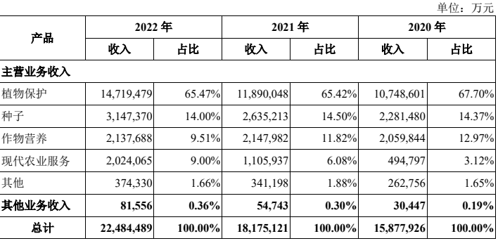
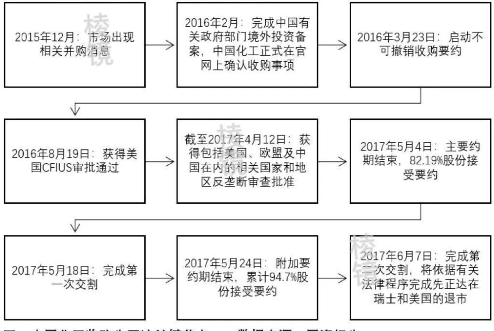
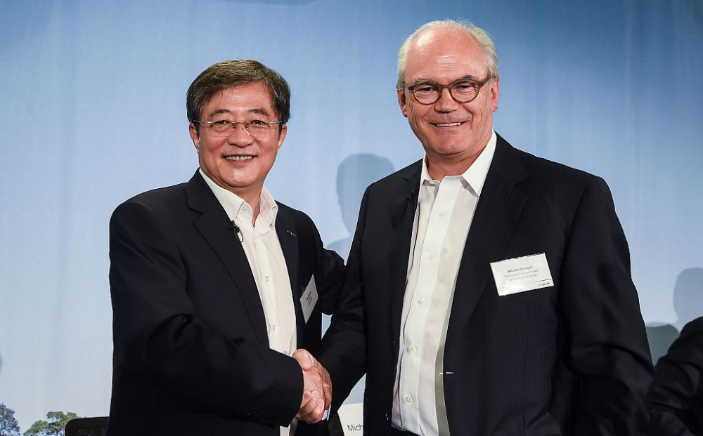
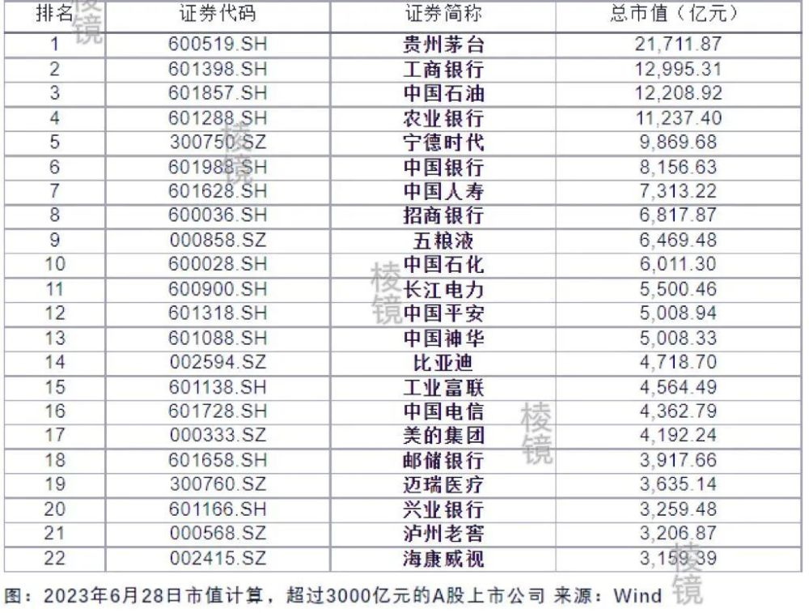

# 继中石油后，A股迎来13年最大IPO，谁在七年前就写好了剧本？

_​来源：视觉中国_

特约作者 | 温世君

编辑 | 郭一非

出品 | 棱镜·腾讯小满工作室

整体低迷的A股，即将迎来近13年来最大规模的一场IPO盛宴。

6月16日，上交所上市审核委员会2023年第53次会议，通过了先正达集团股份有限公司的首次公开募股申请。这家全球植保龙头的IPO，有几个特别之处，备受市场关注：

**“募资高”** ：先正达650亿元首发募资金额，在中国A股IPO历史上排名第四，仅次于农业银行、中国石油、中国神华。

**“募资还债”**
：根据招股书，先正达此次IPO拟发行不超过27.86亿新股，募集的650亿元中，有30%也就是195亿元是用来“偿还长期债务”。从A股募资还债，体量又如此之高，难免引发关注。

**“转场快”**
：2021年6月，先正达先是提交了上交所科创板上市申请。到2023年3月，先正达已经先后配合回答了科创板上市的三轮问询，但并未有IPO审核通过的消息。

但到了2023年5月19日，先正达突然宣布撤回科创板上市申请，转向上交所主板。仅仅28天后获得上交所成功过会，这样的闪电转场，是市场上不多见的。要知道，2023
年主板上市受理至过会的平均节奏约为240天左右。

有风方起浪，无潮水自平。市场上任何事件和现象，都事出有因。

**谁的先正达？**

先正达并非为互联网熟知的名字，但这是一家真正的全球农化巨头。

营收上看，2022年，植物保护（农药为主）业务的营收为1471.95亿元，占其2248.45亿元总营收的65.47%。如果加上种子、作物营养（肥料为主），三大核心业务占到其总营收的88.98%。

_图：2020-2022先正达集团营收分行业占比。来源：招股书_

从全球范围来看，2021年，先正达在全球植保行业排名第一、种子行业排名第三；在中国，植保行业排名第一、种子行业排名第一、作物营养行业排名第一。

先正达是中国公司吗？准确地说，在关乎人类生存问题的农业产业领域，先正达是一家所有权属于中国的国际化企业。

此次IPO的主体先正达集团，于2019年6月27日在上海自贸区注册成立。但这不是一家“新”公司，最早可以追溯到1758年，距今已超过 250 年。

注册于上海的先正达集团，旗下包括4个业务板块，分别为先正达植保（总部在瑞士巴塞尔）、先正达种子（总部在美国芝加哥）、安道麦（总部在以色列），以及先正达集团中国。业务遍布全球，主要分布在欧洲、非洲及中东地区、拉丁美洲、亚太地区。

但这家公司并不是“外企”。中国农化公司与其全资子公司麦道农化，共同持有先正达IPO前100%的股份。中国农化由中国化工集团100%控股，中国化工由中化集团100%控股。穿透而言，先正达实控人是国务院国资委。

_图：先正达（图中发行人）股权结构图。来源：招股书_

听名字是外企，其实是国企，甚至是“央企”。先正达的身世，源自一场世纪并购。简单来说：有实力的央企，寻求全球市场头部资产进行杠杆并购，并将自有资产与之整合，放在A股上市——消化杠杆、引入蓝筹。

实际上，先正达在中国中化官网的一篇文章中，已经将自己定位为农业领域“国家队”，要“端牢中国碗，装好中国粮”。《华尔街日报》亦在先前的一篇文章中，也认为先正达的IPO不仅会提振中国证券市场，也能够为中国粮食安全（security
of food supply）提供支持。

因此，从更高维度来看，这样的海外大并购尝试是值得肯定的。但市场自有运行逻辑，针对这样全球性的、头部企业的收购，资金输血、管理整合以及参与国际竞争，都需要长期而艰辛的努力。

此次IPO募资650亿元中，130亿元用于尖端农业科技研发的费用和储备，39亿元用于生产资产的扩展、升级和维护以及其他资本支出，78亿元用于扩展现代农业技术服务平台（MAP），208亿元用于全球并购项目，195亿元用于偿还长期债务。

本次市场热议的“募资还债”，实际上依然是这场世纪并购的长尾影响。

**195亿还债，始于430亿美元最大海外并购**

一切的前提，皆源自农业领域的周期属性。

由于气候、政策、流通、价格等因素，农业生产会出现产量的起伏波动，进而影响农产品价格。特别是“产量-
价格”的反馈机制是滞后的，价格上涨带来增产，但等到成熟收获的时候往往又导致供应过大而降价。这种波动，不仅仅是粮食价格的波动，更会直接影响上游的农药、化肥、种子的供需和价格。

回到2012-2013年，彼时农产品再出现一次全球性大幅的价格下跌，叠加南美洲一些核心粮食产区国家货币汇率大幅贬值。这直接导致大宗农业利润大幅下滑。一些主产区的农场主不仅不赚钱，甚至出现资金链紧张，上游的农资行业自然始承压。

压力之下，全球行业掀起重组浪潮。2015年12月11日，美国陶氏化学与杜邦合并，交易规模为1300亿美元；2016年9月14日，德国拜耳全现金收购孟山都，交易总额达660亿美元。

相较之下，2017年6月8日，中国化工以430亿美元的价格完成对瑞士先正达的收购，也在这个数量级。这也已经创造中国企业，也是中国央企最大的一笔海外并购。

_图：中国化工收购先正达关键节点
数据来源：国资报告_

_时任中国化工董事长的任建新（左）和先正达董事长Michel Demaré（右）。来源：视觉中国_

2015年5-8月，先正达曾多次拒绝孟山都收购要约。即便孟山都报出450亿美元，先正达公开的拒绝理由除了担心反垄断等“监管障碍”外，依然是“出价过低”。随后先正达与中国化工的谈判，也历经七个月。当然，中国化工也为此支付了溢价。

根据2016年2月3日中国化工发布的信息，双方的收购协议为每股465美元现金，总价值430亿美元，这一出价较先正达2月2日收盘价溢价约20%。同时，协议还允许交易交割时，为原股东支付每股5瑞郎的特别分红。

按照当时的汇率计算，430亿美元约为2816亿元人民币。而根据大公国际2016年6月发布中国化工评级报告，其2016年3月总资产为3779.48亿元。以此计算，仅收购金额而言，就占中国化工总资产的近四分之三。

杠杆并购，也就是“借钱并购”，是必然的。

2017年5月，美国证监会（SEC）披露文件显示：中国化工收购先正达的交易总价接近440亿美元。其中，中国银行是最大的融资方，购买了永续债100亿美元。国资委系统的中国国新控股有限责任公司，购买了70亿美元的永续债，兴业银行也购买了10亿美元。摩根士丹利通过购买可转换优先股，提供了20亿美元资金。此外，由多家银行组成的银行团，提供中国化工自有资金外，所需资金的过桥贷款授信。

溢价收购、杠杆收购，结果有二：

一是商誉。简单说就是并购产生的超出资产的溢价。招股书显示，截至2022年末，因收购产生的商誉账面价值为1781.59亿元，占总资产的31.09%。这部分溢价，只能依靠逐年的利润和资产的增长，逐步消化。

二是债务。招股书显示，截至2019年末，因收购而存续的债务（此次上市主体先正达集团）包括：中国化工内部往来款债务81亿美元，中信银行团债务55亿美元，永续债合计170亿美元。再加上，瑞士先正达于2018年发行47.5亿美元债券并分红，用于偿还收购形成的债务。本金合计为353.5亿美元。

债务的偿还，是先正达整合经营要迈过的关键一步。

2020年，先正达对上述债务进行了重组和部分偿还。截至2020年末，共计减少本金约186
亿美元的债务，剩余债务本金为120亿美元。根据先正达财务数据，在2020、2021、2022
三年，其因偿还债务支付的现金也达到了573.84亿元、685.88亿元、1010.05亿元。

如此来看，此次先正达IPO中，将30%募资金额也就是195亿元用于“偿还长期债务”，似乎也是一个并不是那么“特别”的决策。

_图：先正达IPO募资用途。来源：招股书_

**科创板水位容不下巨轮先正达**

先正达这样的巨轮，更适合航行在主板的资金“海洋”之上。

根据发行计划，先正达拟发行新股27.86亿股，募资额650亿元，即每股发行价格23.33元。按招股书发行后总股本139.31亿股计算，市值3250亿元。

纵观当下整个A股市场，市值超过3000亿的企业也不过20余家。

而先正达此前在科创板的申请并不是那么“顺畅”，经历了三轮问询，并一度传出压缩融资规模。实际上，截止2023年6月末，金山办公作为科创板市值最高的公司，也只有这一家跨过了2000亿元的门槛。

不过，在申请科创板上市过程中，经历了三轮问询之后，交易所方面其实已经对先正达有了充分的“理解”。随后转向主板申请之后的“闪电过会”，也并不让人感到意外。

_图：2012-2023
A股IPO情况（2023年截止6月末）。数据来源：wind_

进一步来看，先正达的上市给中国的股市带来什么？

650亿元的募资，在当下较为冷淡的市场环境下，无疑会带来一定的市场资金面压力，市场也有声音担心出现“失血”效应，加剧资金分流压力，导致其他个股资金紧张。但长期来看，我们要欢迎一些真正有核心技术、有产业实力、有集聚规模的蓝筹企业在公开市场上市交易。这对一个健康的证券市场无疑有着积极意义。

虽然股票发行注册制自2023年2月开始全面实行，时至今日，我们也没有看到“开闸放水”的景象。尤其是在市场并不火热的当下来看。自2013年A股IPO因暂停审核“停摆”以来十年间，2023年已经过去一半，但无论是164家的IPO数量，还是6506亿元的募资规模，今年都并不是一个“大年”。

从交易所或者证券市场的角度而言，一定程度上也会欢迎先正达，期望这样一支新的蓝筹，给市场注入一些新的活力与能量。

当然，对于希望通过IPO募集到低成本资金的先正达而言，上市最好的时间点是股市火热的时候，其次是现在。

（以上分析仅供参考，不构成任何投资建议）

