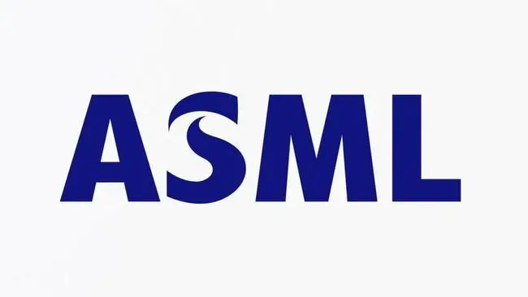

# 荷兰政府颁布半导体设备出口管制的新条例，ASML刚刚回应

6月30
日荷兰政府颁布了有关半导体设备出口管制的新条例。根据新出口管制条例规定，荷兰光刻机巨头阿斯麦（ASML）需要向荷兰政府申请出口许可证才能发运最先进的浸润式DUV系统（即TWINSCAN
NXT：2000i及后续推出的浸润式光刻系统）。荷兰政府将决定是否授予或拒发出口许可证，并将向ASML提供许可证所附条件的细节。

ASML 30
日回应第一财经记者称，正如公司在今年三月发布的消息中所述，这些新的出口管制条例针对对象为先进的芯片制造技术，包括最先进的沉积设备和浸润式光刻系统。

ASML的EUV光刻系统在此前已经受到限制。ASML其他光刻系统的发运未受荷兰政府管控。ASML将继续遵守适用的出口管制条例，其中包括荷兰、欧盟及美国的出口管制条例。

荷兰政府新颁布的出口管制条例将于2023年9月1日生效，在此日期前，ASML可开始提交出口许可证申请。荷兰政府将视具体情况批准或拒绝这些申请。

“基于今日的公告，我们认为这些管制条例不会对已发布的 2023 年财务展望以及于2022年 11 月投资者日宣布的长期展望产生重大影响。”ASML称。

ASML表示，需要重点指出的是，荷兰政府新颁布的出口管制条例只涉及TWINSCAN NXT：2000i及后续推出的浸润式系统。
此外，ASML长期展望的基础是全球的长期需求和技术趋势。

以下为ASML公告全文：

关于荷兰政府颁布最新出口管制条例的声明

荷兰菲尔德霍芬，2023 年 6月 30
日——荷兰政府于今日颁布了有关半导体设备出口管制的新条例。正如其在今年三月发布的消息中所述，这些新的出口管制条例针对对象为先进的芯片制造技术，包括最先进的沉积设备和浸润式光刻系统。

根据新出口管制条例规定，ASML需要向荷兰政府申请出口许可证才能发运最先进的浸润式DUV系统（即TWINSCAN
NXT：2000i及后续推出的浸润式光刻系统）。荷兰政府将决定是否授予或拒发出口许可证，并将向ASML提供许可证所附条件的细节。

ASML的EUV光刻系统在此前已经受到限制。ASML其他光刻系统的发运未受荷兰政府管控。

ASML将继续遵守适用的出口管制条例，其中包括荷兰、欧盟及美国的出口管制条例。

荷兰政府新颁布的出口管制条例将于2023年9月1日生效，在此日期前，ASML可开始提交出口许可证申请。荷兰政府将视具体情况批准或拒绝这些申请。

基于今日的公告，我们认为这些管制条例不会对已发布的 2023 年财务展望以及于2022年 11 月投资者日宣布的长期展望产生重大影响。

需要重点指出的是，荷兰政府新颁布的出口管制条例只涉及TWINSCAN NXT：2000i及后续推出的浸润式系统。
此外，ASML长期展望的基础是全球的长期需求和技术趋势。

