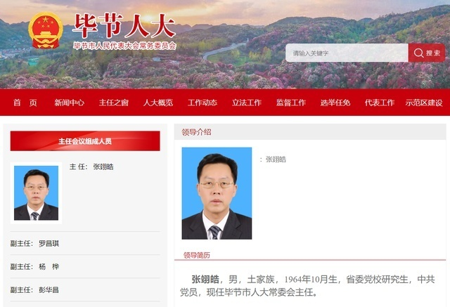

# 毕节市人大常委会主任张翊皓因突发疾病不幸离世，享年59岁

据新毕节：据毕节市张翊皓同志治丧工作小组消息，6月29日，毕节市人大常委会党组书记、主任张翊皓同志因突发疾病，不幸离世，享年59岁。

**简历：** 张翊皓，男，土家族，1964年10月生，省委党校研究生，中共党员，现任毕节市人大常委会主任。

据贵州省毕节市委宣传部官方澎湃号“毕节发布”：《毕节市委召开常委会会议暨推动全市“1+6+1”政策措施落实工作领导小组会议》一文中显示：6月28日，市委召开常委会会议暨推动全市“1+6+1”政策措施落实工作领导小组会议，市委副书记、市长、领导小组组长吴东来，市人大常委会主任张翊皓，市政协主席杨宏远，市委常委，市政府有关领导同志，市法院、市检察院主要负责同志参加会议。

**【来源：九派新闻综合新毕节、毕节市人大常委会网站、毕节发布】**

