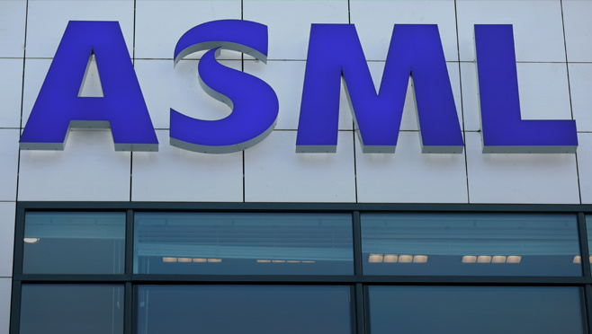

# 阿斯麦解释荷兰最新出口管制：并非所有浸润式DUV设备都受限

**财联社6月30日讯（编辑 夏军雄）** 当地时间周五（6月30日），荷兰政府宣布了限制某些先进半导体设备出口的新规定，这些规定将于9月1日生效。

具体而言，荷兰政府将要求先进芯片制造设备的公司在出口之前须获得许可证。

荷兰外贸与发展合作大臣莉谢·施赖纳马赫尔表示，只有非常有限的公司和产品型号会受到影响。

尽管荷兰政府并未直接点出会受到限制的公司，但外界都明白这是在限制光刻机巨头阿斯麦（ASML）。

荷兰政府的消息传出之后，阿斯麦在其官网发表声明称，该公司未来出口其先进的浸润式DUV光刻系统（即TWINSCAN
NXT:2000i及后续浸润式系统）时，将需要向荷兰政府申请出口许可证。而荷兰政府将决定是否批准或拒绝所需的出口许可证，并就任何适用的条件向阿斯麦提供进一步的细节。

阿斯麦强调，该公司的EUV系统的销售此前已经受到限制。

阿斯麦同时表示，预计上述措施不会对其2023年财务前景或2022年11月投资者日期间传达的长期情景产生重大影响。

**有一款浸润式DUV光刻机并不受限**

近年来，美国在对华政策上实行胁迫外交，多次施压其盟国限制如光刻机等高科技产品等出口。

自2018年以来，在美国的压力之下，荷兰政府一直禁止阿斯麦向中国出口其最先进的极紫外线光刻机（EUV），但仍可以销售上一代的深紫外线光刻机（DUV）。然而，美国近阶段又希望进一步打压中国芯片行业，将DUV也纳入禁售范围。

荷兰政府早在3月就表示，考虑把光刻机的出口管制范围扩大到DUV。

根据阿斯麦官网提供的信息，该公司目前在售的主流浸没式DUV光刻机产品共有三款，分别是：TWINSCAN NXT:1980Di、TWINSCAN
NXT:2000i、TWINSCAN NXT:2050i。

_（来源：官网）_

阿斯麦3月曾表示，预计2000i和2050i这两款产品会受到荷兰政府的出口限制。再对比阿斯麦今天的回应来看，TWINSCAN
NXT:1980Di这款DUV光刻机并不在限制范围内。

根据官网介绍，TWINSCAN NXT:1980Di的分辨率可以达到≤38nm，每小时可以至少生产275片晶圆。

在实际生产和使用中，通过多重曝光，TWINSCAN
NXT:1980Di依然可以支持到7nm左右的工艺生产，当然相比于更先进的光刻机型号，其在生产先进工艺时的步骤将更为复杂，成本将更高，良率可能也会有损失。

全球晶圆厂在使用1980Di光刻机型号时，大多是生产14nm及以上工艺的芯片，很少去生产14nm以下的工艺。但可以肯定的是，用这一台TWINSCAN
NXT：1980Di光刻机，生产28nm、14nm仍能完全满足需要。这预示着目前就已大量采用NXT:1980Di进行成熟制程制造的晶圆厂将不会受到明显影响，但在先进工艺方面，可能难以完全满足需求。

**中国外交部回应**

在6月30日举行的中国外交部例行记者会上，外交部发言人毛宁在回应记者相关提问时表示，中方坚决反对美方泛化国家安全概念，滥用出口管制，以各种借口拉拢胁迫其他国家对华搞科技封锁，以行政手段干预企业之间的正常经贸往来，严重破坏市场规则和国际经贸秩序，冲击全球产供链的稳定，不符合任何一方的利益。

她指出，中方将密切关注有关动向，坚决维护自身的合法权益。

（财联社 夏军雄）

