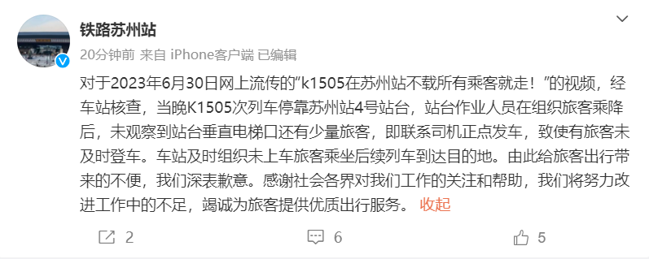

# K1505次列车不等乘客直接发车？苏州站致歉：已安排旅客乘坐后续列车

据@铁路苏州站
7月1日消息，对于2023年6月30日网上流传的“K1505在苏州站不载所有乘客就走！”的视频，经车站核查，当晚K1505次列车停靠苏州站4号站台，站台作业人员在组织旅客乘降后，未观察到站台垂直电梯口还有少量旅客，即联系司机正点发车，致使有旅客未及时登车。车站及时组织未上车旅客乘坐后续列车到达目的地。由此给旅客出行带来的不便，我们深表歉意。感谢社会各界对我们工作的关注和帮助，我们将努力改进工作中的不足，竭诚为旅客提供优质出行服务。

潇湘晨报综合

