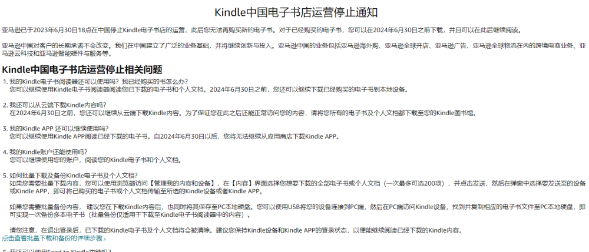
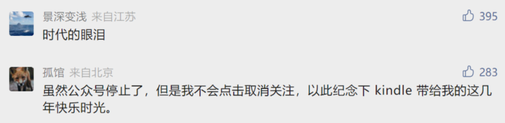
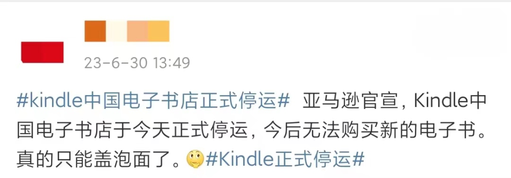

# Kindle中国电子书店正式停运，网友挥别：这下真的只能当泡面盖了

6月30日，话题 **#kindle中国电子书店正式停运** 冲上热搜。

一年前，亚马逊发布《Kindle中国电子书店运营调整》，宣布1年后在中国停止Kindle电子书店的运营，一眨眼，一年之期到了。

据悉，亚马逊Kindle服务号5月31日发布了“告别手册”，解答了一系列和停止运营有关的问题，并提醒用户在2024年6月30日前，务必下载已购电子书到本地设备或者Kindle图书馆。30日，亚马逊公司旗下Kindle中国电子书店正式停止运营，此后用户无法再购买新的电子书。对于用户此前已购买的电子书，可以在2024年6月30日之前下载，并且可以继续阅读。存储在Kindle设备上的电子书及个人文档不会受到影响。

_△Kindle商店官网截图_

**入华10年，难以为继**

Kindle电子阅读器诞生于2007年，被认为是亚马逊最成功的硬件产品之一，其采用电子纸屏幕，被认为易于阅读且护眼，还原了阅读纸质书籍的体验。在Kindle电子阅读器诞生的5年里，电子书成为亚马逊增长最为迅速的品类之一。

2013年，Kindle正式进入中国大陆市场销售，历经多次设备版本迭代，最新的产品系列包括Kindle Paperwhite、Kindle
Voyage、Kindle青春版、Kindle Oasis等，至今已入华满10年。为满足用户阅读要求，亚马逊还引入Kindle
Unlimited包月电子书服务。2018年，Kindle阅读器在中国发展进入巅峰，年销量突破百万。不过，近年来亚马逊已未在财报中披露Kindle的具体销量和销售额。

_△图自视觉中国_

“阅读神器”Kindle的败退，一方面是自身硬件和软件创新上的缓慢，让国产品牌后起直追；另一方面也源于手机阅读APP和短视频抢夺用户时长。记者注意到，汉王、翰林、掌阅、当当、京东、科大讯飞等厂商均推出了自己的电子阅读器，市场竞争百花齐放。而根据阅文集团财报公布的数字，早在2019年底，微信读书的注册用户数量超过了2亿。

不少用户表示，自己出于新鲜感或冲动购买Kindle一段时间后，使用频率变得极低，大部分时候都在抽屉“
吃灰”或者“盖泡面”，平时阅读更是以手机为主，选择App看书或听书。还有少部分用户表示，自己仍青睐电子墨水屏，但早已不再使用Kindle，它的屏幕相对较小，功能也很单一，无法实现语音转写或会议记录等办公功能。

近年来，亚马逊在中国市场不断收缩，自7月17日起，亚马逊中国将不再提供应用商店服务。目前，亚马逊中国的业务包括海外购、跨境电商、云科技、智能硬件与服务等。

**网友挥别：谢谢你，泡面盖**

如今，Kindle在中国画上句号，也令不少读者恋恋不舍。6月30日，Kindle服务号官方微信下有许多用户留言怀念。

有读者感慨称“时代的眼泪”；

有读者感谢Kindle的10年陪伴，希望后会有期；

还有的读者十分不舍，认为这是“属于我们的青春记忆”。

_△亚马逊Kindle服务号评论区截图_

微博话题下，有网友打趣：那我的Kindle以后真的只能盖泡面了？

_△微博截图_

你用过Kindle吗？现在还用吗？

潇湘晨报综合

