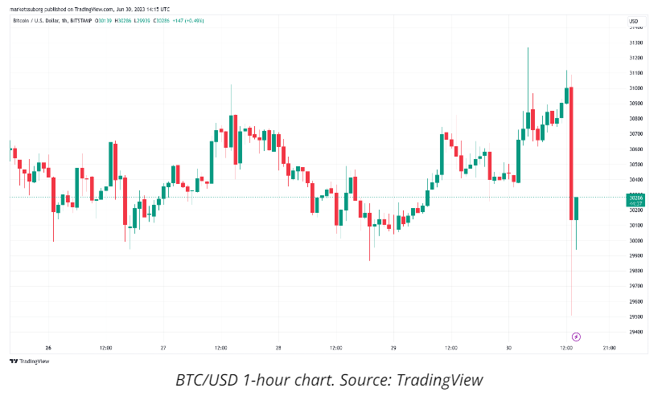

# 一场“乌龙”？SEC退还现货比特币ETF申请文件，比特币一度跳水6％

6月30日周五，据知情人士向媒体透露，美国“证监会”SEC已通知主要交易所并退还了他们代资产管理公司提交的现货比特币ETF申请，理由是现有申请资料“不够明确、清晰和全面”。

该负面消息一度令比特币短线跳水6%并短线失守3万美元整数位心理关口，随后价格反弹并重回3万美元上方，因为报道透露，SEC表示资产管理公司可以更改申请措辞并重新提交。

据悉，SEC就上述担忧通报了代表贝莱德和富达投资提交比特币ETF申请的纳斯达克和CBOE芝加哥期权交易所，两家交易所均表示将解决监管机构反馈的问题并重新提交申请。

美国证券交易委员会认为，这些资管巨头的现货比特币ETF申请没有提供有关“监控共享协议”的足够细节，也没有列明需要履行这一协议的现货比特币交易所究竟有哪几家。

现货比特币ETF将直接持有比特币作为底层资产，自2017年以来，SEC至少拒绝了十多个此类ETF的申请，理由是它们容易受到欺诈和市场操纵，不符合保护投资者和公共利益的标准。但SEC已经批准了至少六只持有比特币期货作为底层资产的ETF上市交易。

为了解决监管机构的担忧，全球最大资管机构贝莱德以及同为ETF巨头的富达投资都表示，最新的现货比特币ETF申请文件提出了旨在防止操纵的“监控共享协议”。

这些资管公司将分别与ETF的上市交易所分享对现货比特币交易平台的“监控”，受联邦机构监管的交易所可以获得有关市场交易活动、清算活动和买卖双方客户身份等机密信息，希望成为SEC批准美国首只以比特币本身作为底层资产ETF的突破口。

继6月15日全球最大资管公司贝莱德提交现货比特币ETF申请之后，众多传统与加密资产的管理公司纷纷修改了同类ETF的备案文件或重新提交申请，包括富达投资、“牛市女皇”木头姐的方舟投资、景顺Invesco、WisdomTree、Bitwise
Asset Management 和Valkyrie等。

周五的最新报道称，SEC当前并没有完全否决批准现货比特币ETF的可能性，重新提交申请可能令资管公司们推出美国首只此类ETF的竞争至少推迟七天。

根据规定，在交易所或资管公司重新提交申请后，SEC有15天的时间将申请文件公示并向公众征求意见，在此期间，SEC可在第七天之前将申请再次退还。15
天公示期结束后，SEC将在最多240天里批准或拒绝该申请。

有分析指出，由于SEC拒绝了Grayscale
Investments将全球最大比特币投资信托基金转成ETF的申请，该公司去年6月将SEC告上法庭，裁决将于今年秋季甚至更早作出。贝莱德和富达等传统资管巨头争相提交同类ETF申请，目的是想借助潜在利好的判决结果加速ETF审批进程。

还有观察人士称，全球交易量最大的加密货币交易所币安在现货和期货交易市场的主导地位，损害了现货比特币ETF获批的机会，因为币安不符合SEC眼中受监管和满足重大要求的交易场所。

同时，“美股加密货币交易所第一股”Coinbase可能受益于现货比特币ETF的申请结果。贝莱德将该公司列为ETF底层资产比特币的托管方，并将使用CME
CF比特币参考价格，而Coinbase恰恰是该参考价格关键信息的主要提供方之一，预计Coinbase很可能是贝莱德的“监控共享平台”。

在得到主流资管机构背书后，比特币价格从6月15日的2.56万美元一路上行，过去一周半基本都站稳3万美元上方，6月23日曾自2022年6月以来首次升破3.1万美元，交投一年新高。今年迄今累涨超85%，但仍较2021年所创6.9万美元的历史新高腰斩。

