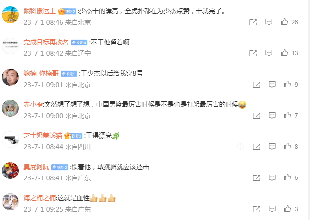

# 北控邀请赛和美国联队发生冲突 CBA状元王少杰被挑衅后暴揍黑人球员

在6月30日的2023年年襄垣县“仙堂山杯”篮球邀请赛，CBA北控队与美国联队的比赛，北控状元王少杰连续被美国联队25号黑人球员挑衅与顶撞，王少杰将对手推翻在地，双方在地上拳打脚踢爆发激烈冲突，最终王少杰被直接驱逐出场。

2023年襄垣县“仙堂山杯”国际篮球邀请赛共有4支球队参赛，分别是来自CBA的北控与福建，外加美国职业联队与欧洲职业联队。

对于“某某职业联队”，实则在休赛期总是能够出现在中国球迷视野，毕竟过往中国男篮就多次与类似球队热身赛被吐槽，而如此性质的对手也屡屡被调侃为“旅游队”，并没有太多高水平的球员，因而比赛的含金量并不高，热身价值也不高。

至于在6月30日晚北控队与美国联队的比赛，美国联队的25号黑人球员，在比赛中与王少杰在内线多次卡位存在身体冲撞推搡行为。美国联队的25号黑人球员更是多次在比赛中挑衅推搡顶撞，如此情况下王少杰的脾气也是没有忍住，他终于爆发拳脚相向。

通过比赛视频可以看到，王少杰一把将25号黑人球员给推翻在地，王少杰也是被对手给拉拽脚踢导致倒下去，两人不断缠斗在地板上鏖战打架。王少杰在起身之后，也是继续扑上去用拳头砸向对方，而两队的其余球员也是冲过来去拉开两人，最终王少杰被驱逐出场。

对于如此斗殴事件，媒体人球圈赵探长点评表示：“网传昨天一场邀请赛里，北控男篮与外国旅游队发生严重冲突。但探长看到了另一视角的视频，觉得有必要也放出来结合起来看：王少杰被对手黑人球员多次挑衅和顶撞，最终才还手，他确实有些不理智，也可能会被惩罚，但这下是有血性的，被欺负了就要还回去。另外，双方队员第一时间拉架、安保第一时间进场，都算处理得相当及时了。”

王少杰事件还在持续引发热议，他后续会遭遇何种追加处罚还是未知数。不过球迷对于本次事件的评论，则是基本在力挺王少杰，也有不少调侃的声音，诸如：

“少杰干的漂亮，全网都在为少杰点赞，干就完了。”

“王少杰以后给我穿8号（朱芳雨就是穿8号，“打架高手”，有过国家队著名打架事件。）”

“突然想了想了想，中国男篮最厉害时候，是不是也是打架最厉害的时候[笑cry]。”

“惯着他，敢挑衅就应该还击。”

“这就是血性。”

“王少杰不对，打这种人怎么能打的这么轻，重拳直接揍他。”

“对于俱乐部是这些商业赛，球员心里本身就是抗拒的。”

……

回归到王少杰本人，他是是2019年的CBA选秀状元，在大学时期是北京大学的绝对核心，率队夺得过CUBAL总冠军。王少杰已经征战北控男篮4个赛季，固然他是球队的主力球员之一，但进步并不明显，上赛季场均只有8分5.7篮板1.6助攻数据。王少杰生涯最好的一个赛季是第二个赛季，他当时场均得到11分6.9篮板1.1助攻。

考虑到王少杰还有两个多月就年满27周岁，基本已经定型难以太大成长空间。如果北控去积极追求周琦，王少杰很可能成为交易筹码之一被送走。

（文/醉卧浮生）

