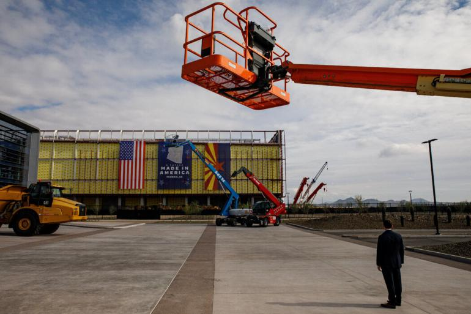

# 台积电美国建厂进展缓慢，分析师：半导体产业不景气，或有意放缓步调

_图源：纽约时报_

由于台积电在美国亚利桑那州的工厂建设进度落后，台积电将派遣更多工人到当地追赶进度。

综合日经亚洲和路透社报道，台积电在美国亚利桑那州设立的新厂计划在2024年投入使用，而在第一厂附近设立的第二座工厂则将于2026年运行。

不过，知情人士说，由于劳动力短缺等因素，造成新厂施工进度落后，成本也超出预期。为此，台积电将派遣员工到当地赶工。

台积电在声明中称，公司已决定派遣经验丰富的专业员工到当地救场，因为目前美国厂正处于“处理所有最先进和专用设备的关键阶段”。台积电说，目前还不确定派遣多少名员工到亚利桑那州，但特别工作组将在有限的时间内赶工，不会影响目前每天在现场工作的1万2000名工人，也不会影响招聘工作。

但日经亚洲引述三名消息人士说，台积电及供应商正与美国政府商谈，协助办理工人的非移民签证，希望最早在7月份派遣超过500人赴美，加快兴建无尘室设施以及安装管线和其他设备。赴美工人将包括合约技术人员和无尘室设置、管线安装、芯片工厂机械和电气系统等专业领域经验丰富的工人。

一名台积电主管说，公司缺乏在建造半导体制造设施方面有第一手经验的美国工人，而且许多人不熟悉芯片制造厂的要求，造成多项安装工程延误。

报道称，台积电直接从台湾地区派工人救场的决定，不仅凸显台积电海外扩张面临的挑战，也凸显华盛顿试图重建科技供应链、落实先进半导体生产本土化所面临的障碍。目前台积电派遣员工的目的是提高工作效率，弥补施工过程中损失的时间。

**台积电员工质疑：得不偿失**

_图源：纽约时报_

台积电于2020年5月宣布在亚利桑那州建厂，最初承诺投入120亿美元。去年12月，该公司将投资增加到400亿美元，并计划用更先进的——虽然不是最先进的——芯片制造技术升级工厂。台积电最初设定该工厂将于2024年开始量产，但近期又将量产时间推迟至2024年底，以便增加更多缓冲时间来处理不确定性因素。

值得一提的是，台积电在美工厂项目，长期以来就受到内部员工的质疑。

纽约时报中文网今年2月采访了11名台积电员工，指出“这个耗资400亿美元的项目是一个糟糕的商业决策”。许多员工表示，该项目可能会分散对研发的关注，而这正是该公司长期以来的竞争力所在。一些人还说，因为可能存在文化冲突，他们对移居美国犹豫不决。

报道指出，台积电的该项目表明，“将人类有史以来最复杂的制造工艺之一移植到地球另一端是极其困难的”。但与此同时该项目又背负着必须成功的巨大压力。失败意味着美国培育先进芯片制造业的努力受挫，这一行业在几十年前就已大部分转移亚洲，而台积电要对一家无法生产足够可用芯片的工厂投入无数资金，得不偿失。

台积电曾在今年的一场财报电话会议上表示，受人力开支、许可证、合规性和通货膨胀的影响，美国的建设成本可能至少是台湾地区的四倍。台积电首席财务官黄仁昭表示，美国建厂投资可能会损害台积电今年的盈利能力。

**半导体行业不景气 台积电有意放慢速度？**

不过，尽管因为劳动力短缺、各种营运和安全许可流程可能延误了施工进度，但也有分析师认为，半导体产业现在不景气，台积电有意放缓扩张步调。

半导体供应链高层表示，美国建筑工人的薪资比台湾地区高几倍，而且效率还不太有保证。目前台积电和供应商已经增派许多监督人员，确保无尘室及电力和水系统的建设进度。

贝恩（Bain）半导体分析师Peter
Hanbury表示，虽然台积电有高效的可重复模式，每年在台湾地区建设几个工厂，但进入新的地域时可能面临新的挑战，如与工作和管理模式不同的新供应商，以及更严格的环境法规和安全法规，而美国劳动力短缺恐使情况恶化。

美国投资银行Needham分析师Charles Shi 则认为，台积电在亚利桑那州芯片厂的进展缓慢与整体市场需求疲软有关，这也影响先进芯片的制造。

来源丨日经亚洲、路透社、新加坡《联合早报》、纽约时报中文网等

编辑丨曾子瑾，深圳卫视直新闻主编

排版丨聂倩玉，深圳卫视直新闻编辑

