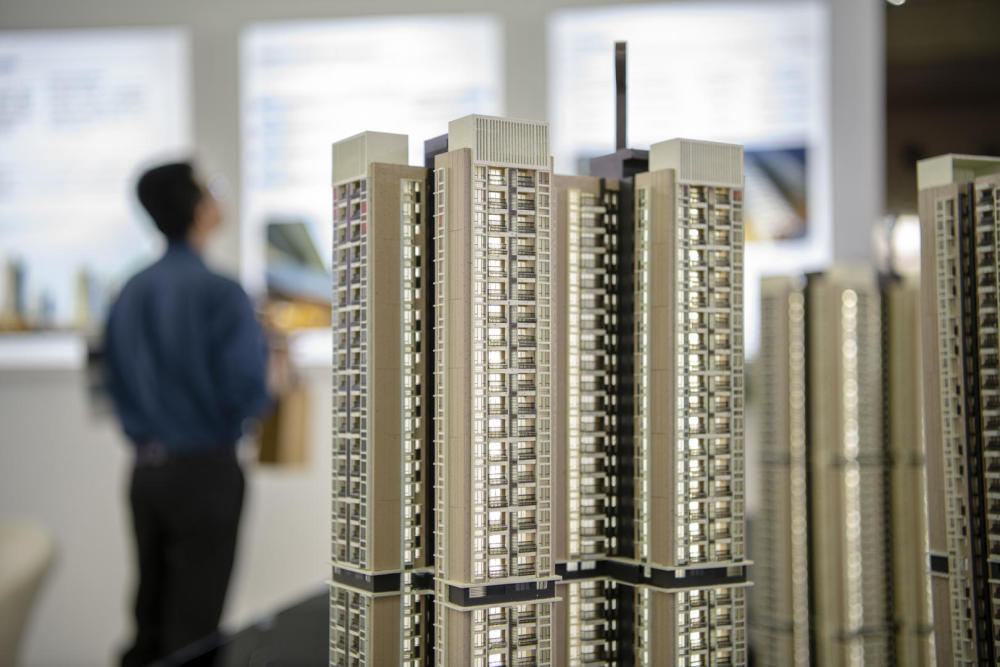
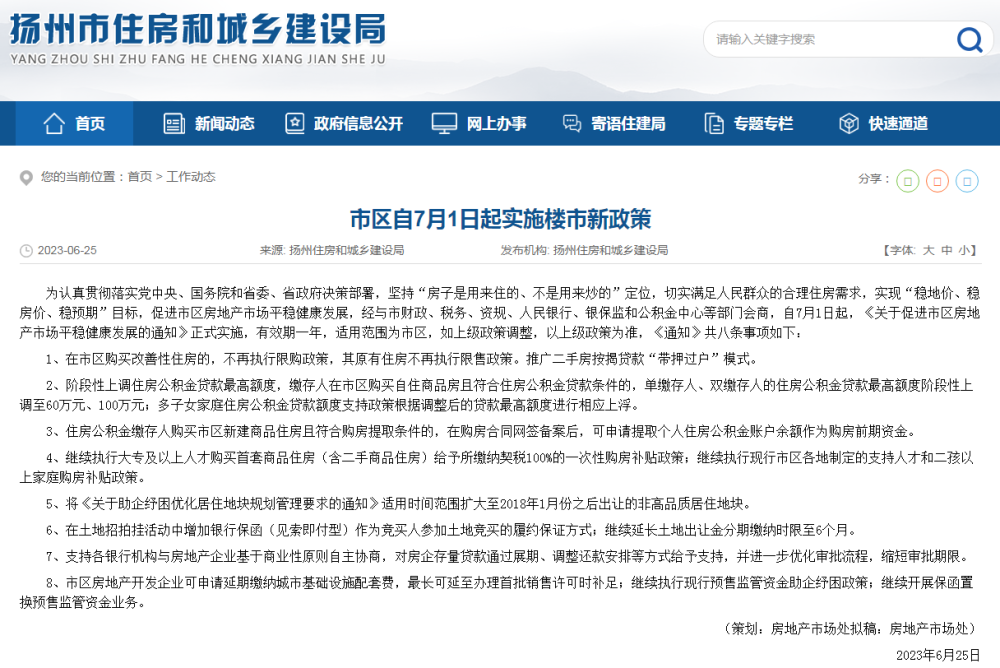
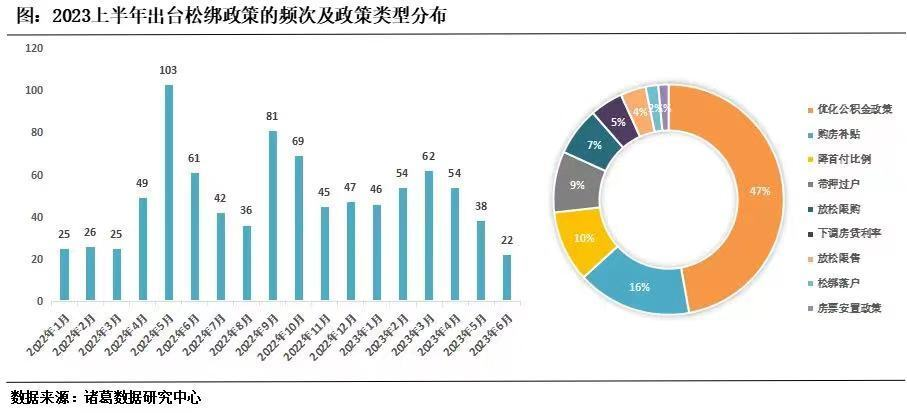

# 杭州、南京、扬州多地放宽限购，柳州、珠海首套房贷款利率降至3.6％

今年以来，房地产政策环境延续宽松态势。据红星资本局不完全统计，2023年上半年已有十余城对限购政策进行了优化，其中扬州基本放开限购限售，热点城市杭州、南京也频频调整楼市政策。

随着LPR（贷款市场报价利率）利率的下调，红星资本局了解到，多地银行近期也对个人住房按揭贷款利率做出了相应调整。其中南宁、珠海、柳州、常德已将首套房贷款利率下调至3.6%，厦门、郑州、沈阳多家银行也从3.8%下调至3.7%。

业内人士指出，优化限购、降利率等政策的出台，有利于提振住房需求，考虑到居民家庭收入出现的新情况，一些地方也可以对特定群体、特定住房、特定阶段、特定城市等开展低首付的创新试点。另外，建议二套房也能享受首套房的购房优惠政策。

资料配图 图据IC Photo

**杭州、南京放宽限购，扬州取消双限**

**专家：多地实际上已变相放松限购**

据红星资本局不完全统计，今年以来，扬州、杭州、南京、合肥、郑州、沈阳、厦门、无锡、武汉、长沙、济南、荥阳、宁德等十余城对限购政策进行了优化，需求端的纾困政策主要在二线、三线城市展开。

扬州楼市新政被普遍认为“信号意义很强”。6月25日，扬州市住建局发布公告，自7月1日起，在市区购买改善性住房的，不再执行限购政策，其原有住房不再执行限售政策，有效期一年。这是自今年2月以来，扬州再度出手调整优化楼市政策。经过两次调整，扬州限购限售政策基本放开。

扬州市住建局公告

厦门是既放松限购也放松限售的城市。今年3月，据多家媒体报道，限购方面，厦门户籍的单身人士可以购买第二套住房，厦门户籍二孩以上家庭可以购买第三套住房；限售方面，从过去的拿到产权证之日起2年限售，调整为网签之日起2年限售。

沈阳不仅优化限购区域，还下调了首套房贷款利率。沈阳市房管局3月28日消息，继续对和平、沈河、铁西、皇姑、大东、于洪等六区（不含二环外）实施限购政策；二季度起调整新发放首套住房个人住房贷款利率下限，由3.9%降至3.8%。

自去年起，杭州、南京等热点城市就频频优化楼市政策，包括放宽限购条件。

据“浙江在线”，今年以来，杭州市钱塘区、余杭区、临平区等部分街道陆续加入限购放宽圈。截至目前，钱塘区、临平区全域限购放宽，外地户籍只需1个月社保即可买房，本地户籍无需社保，购买二套房不再受落户满5年限制等。富阳区除了全域限购放宽外，自6月起再次推出新的购房补贴。

今年5月，南京买房限购再次松绑，主要是针对南京主城区和江北新区部分街道。在主城区，南京户口的买房人不管名下有几套房，在产业聚集区（去年南京限购松绑时提出）都可以再买一套。离婚2年追溯期取消。在江北新区部分区域，外地人买房不受限。

“杭州和南京还是比较值得关注的，经过多次调整，限购政策不断放松，沈阳的政策也有一定亮点。”易居研究院研究总监严跃进向红星资本局介绍，
**今年以来，出台优化限购政策的城市较多，力度较大的以二线城市为主，充分体现了对房屋买卖市场的支持。**

红星资本局梳理发现，自去年6月起，金华、佛山、东莞、苏州、常州等地就调整了限购政策，部分或全面放开限购。

“其实除了京沪广深，目前大部分城市的限购政策比如限制外地户籍、区域限购等，已经比过去宽松了不少。”一位资深地产行业人士向红星资本局介绍，部分城市虽未正式出台楼市政策，但实际上已经通过放宽户籍等方式变相放松了限购。

**多地房贷利率跟随LPR下降**

**南宁、珠海等地首套房贷款利率降至3.6%**

今年以来，多地下调首套房贷款利率。据诸葛数据研究中心此前统计，超40城首套房贷款利率降至4%以下，包括天津、郑州、无锡、厦门、福州等重点二线城市在内，其中最低降至3.7%，还有部分城市取消利率下限。

6月20日，新一期LPR公布，1年期LPR为3.55%，5年期以上LPR为4.2%，相较于上一次均下调10个基点，这意味着购房者的住房贷款利率将会迎来新一轮调降。

严跃进向红星资本局表示，随着LPR利率的下调，近期各大银行也会下调房贷利率，即普遍下降10个基点，这也意味着新一轮宽松的房贷政策也会开启，“同时，降息后首套房贷进一步下调，预计后续各地认定首套房的标准会进一步下调，这对于购房者更好享受首套房贷利率具有积极的作用。”

近日，红星资本局了解到，目前多地银行已经对个人住房按揭贷款利率做出了相应调整。其中南宁、珠海、柳州、常德等地已将首套房贷款利率下调至3.6%，厦门、郑州、沈阳多家银行也从3.8%下调至3.7%。

工商银行南宁某支行的一名工作人员告诉红星资本局，下调后该行在南宁的首套房贷款利率由3.7%降至3.6%，二套房为4.8%。

“LPR调整之后我们立马下调了，目前的政策都是LPR减掉60个BP。”建设银行珠海某支行一位客户经理向红星资本局介绍，20号以后该行首套房贷款利率降至3.6%，二套房为4.8%。

“20号之后，要办贷款的话首套房利率是3.7%，二套房是5.0%。”6月29日，建设银行厦门某支行的一名工作人员告诉红星资本局，该行按揭贷款利率在本月跟进LPR下调了10个基点。

此外，红星资本局了解到，一线城市广州的多家银行，首套房贷款利率从4.3%降至4.2%，二套房贷款利率从4.9%降至4.8%。深圳多家银行首套房贷款利率从4.6%到4.5%，二套房从4.9%降至4.8%。

**多地打出楼市政策组合拳**

**专家：建议二套房也可享受首套房优惠**

红星资本局梳理发现，2023年以来，多地出台房地产调控政策，除了放松限购、降利率外，楼市利好政策还包括放松限售、发放购房补贴、公积金政策等。

进入6月，为提振楼市、带动房地产市场健康发展，青岛、苏州、连云港等地打出政策组合拳。据中国网地产数据，6月楼市成交量整体环比上涨，同比下降。一线成交面积环比上涨8.6%，二线整体环比上涨25.3%，其中青岛涨幅显著，为122.9%。

据诸葛找房数据研究中心不完全统计，截至6月25日，松绑政策超260次，覆盖城市超130个。松绑内容仍主要从需求端出发，出台频率最高的为公积金贷款政策，占比47%，其次为购房补贴类政策，占比16%，出台降低首付比例及公积金做首付款的占比10%，带押过户、放松限购等政策的出台频次紧随其后。

6月29日，中指研究院发布的《2023上半年中国房地产市场总结与下半年趋势展望》显示，上半年房地产市场整体表现先扬后抑，一季度在积压需求集中释放以及前期政策效果显现等因素带动下，市场活跃度提升，特别是2-3月，热点城市出现“小阳春”行情，但随着前期积压需求基本释放完毕，二季度，购房者置业情绪快速下滑，房地产政策力度不及预期，市场未能延续回暖态势。6月，5年期以上LPR下调了10BP，对市场情绪产生了一定积极效果，但对新房销售的实质性带动较为有限，全国房地产市场调整压力依然较大。

严跃进向红星资本局指出，除了降低房贷利率外，购房首付比例是直接影响购房成本的关键变量，甚至比房贷利率本身影响要大，“在当前购房者入市意愿偏弱的情况下，降低购房首付比例或降低购房首付压力更是非常重要的内容。”

严跃进认为，鉴于这两年居民家庭收入状况出现的很多新情况，首付比例政策确实需要纳入到调整的思考之中，比如一些地方是否可以对特定群体、特定住房、特定阶段、特定城市等开展低首付的创新试点，以更好探索新模式的首付政策。另外，对于二套购房建议参照首套房的标准进行，“原因是，二套房既然属于合理的改善型住房需求，而且各地都提振，那么其就应该享受首套房的购房优惠政策。”

“当然改革总体要按谨慎推进的思路进行，尤其是要把激活合理住房消费需求和防范房贷违约风险等工作进行有机结合，兼顾各方诉求，真正推进这项工作开展。”严跃进说。

中指研究院市场研究总监陈文静也在近期接受多家媒体采访时表示，从政策内容上看，中央和监管部门或通过降低交易税费、降低中介费等方式进一步降低购房成本，加大“保交楼”资金支持力度，加大房企资金支持力度等；地方层面，核心一二线城市政策存在较大优化空间，如通过一区一策、与生育政策和人才政策结合等方式进行调整。若更多实质性政策落地，市场预期或进一步好转和修复，从而带动房地产市场逐渐企稳，下半年市场有望温和修复。

红星新闻实习记者 蒋紫雯 记者 俞瑶

编辑 杨程

